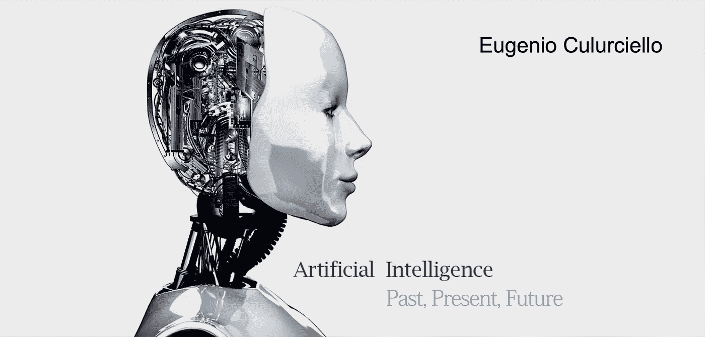

# 人工智能，2018 年及以后的人工智能

> 原文：<https://towardsdatascience.com/artificial-intelligence-ai-in-2018-and-beyond-e06f05167f9c?source=collection_archive---------1----------------------->

> 或者机器学习是如何进化成人工智能的

这些是我对深度神经网络和机器学习在更大的人工智能领域的发展方向的看法，以及我们如何才能获得越来越多的复杂机器来帮助我们的日常生活。

请注意，这些不是预测的预测，而是对这些领域的轨迹、趋势和我们实现有用的人工智能的技术需求的详细分析。

并非所有的机器学习都是针对人工智能的，也有一些唾手可得的成果，我们也将在这里进行研究。

# 目标

该领域的目标是在日常生活中帮助我们的机器中实现人类和超人的能力。自动驾驶汽车、智能家居、人工助手、安全摄像头是首要目标。家庭烹饪和清洁机器人是第二个目标，此外还有无人驾驶飞机和机器人。另一个是移动设备上的助手或永远在线的助手。另一个是全职伴侣助手，可以听到和看到我们在生活中经历的事情。一个最终目标是一个完全自主的合成实体，在日常任务中可以达到或超过人类水平的表现。

在这里查看更多关于这些目标的信息[，在这里](https://medium.com/@culurciello/will-artificial-intelligence-take-over-the-universe-33e214ef29a9)查看[，在这里](/uncertainty-in-deep-learning-and-neural-network-i-do-not-feel-that-way-f11ceca4341a)查看[。](https://aboveintelligent.com/artificial-intelligence-past-present-future-cb954fc7da3b)

# 软件

软件在这里被定义为用优化算法训练来解决特定任务的神经网络架构。

今天，神经网络是学习解决任务的事实上的工具，这些任务涉及在监督下从大型数据集进行分类。

但这不是人工智能，它需要在现实世界中行动，经常在没有监督的情况下学习，从以前从未见过的经验中学习，经常在完全不同的情况下结合以前的知识来解决当前的挑战。

> 我们如何从目前的神经网络转向人工智能？

**神经网络架构** —几年前，当该领域蓬勃发展时，我们经常说它具有从数据中自动学习算法参数的优势，因此优于手工制作的功能。但是我们很方便地忘记提到一个小细节…作为解决特定任务的训练基础的神经网络架构不是从数据中学习的！事实上，它仍然是手工设计的。根据经验手工制作，这是目前该领域的主要限制之一。有这方面的研究:[这里](http://papers.nips.cc/paper/6460-learning-to-learn-by-gradient-descent-by-gradient-descent)和[这里](https://arxiv.org/abs/1707.07012)(例如)，但需要更多。神经网络结构是学习算法的基本核心。即使我们的学习算法能够掌握一项新任务，如果神经网络不正确，它们也将无法掌握。从数据中学习神经网络架构的问题是，目前在大型数据集上试验多种架构需要太长时间。人们必须从头开始尝试训练多种架构，看看哪一种工作得最好。这正是我们今天使用的耗时的试错程序！我们应该克服这个局限，在这个非常重要的问题上多动脑筋。

**无监督学习**——我们不能总是在我们的神经网络旁边，在它们生命的每一站和每一次经历中指导它们。我们不能每次都纠正他们，并对他们的表现提供反馈。我们有自己的生活要过！但这正是我们今天对监督神经网络所做的:我们在每一个实例中提供帮助，使它们正确地执行。相反，人类只从少数几个例子中学习，并且可以不断地自我修正和学习更复杂的数据。我们在这里广泛讨论了无监督学习[。](https://medium.com/intuitionmachine/navigating-the-unsupervised-learning-landscape-951bd5842df9)

**预测神经网络—** 当前神经网络的一个主要限制是，它们不具备人脑最重要的特征之一:预测能力。关于人脑如何工作的一个主要理论是通过不断进行预测:[预测编码](https://en.wikipedia.org/wiki/Predictive_coding)。你想想，我们每天都在经历。当你举起一个你认为很轻但结果很重的物体时。它让你感到惊讶，因为当你走近去捡它的时候，你已经预测到它会如何影响你和你的身体，或者你的整体环境。

预测不仅能让我们了解这个世界，还能让我们知道什么时候不了解，什么时候应该了解。事实上，我们保存了我们不知道的事情的信息，并给我们带来惊喜，所以下次它们不会了！认知能力显然与我们大脑中的注意力机制有关:我们放弃 99.9%感官输入的先天能力，只专注于对我们生存非常重要的数据——哪里有威胁，我们跑到哪里去躲避它。或者，在现代社会，当我们匆忙出门时，我的手机在哪里？

建立预测神经网络是与现实世界互动的核心，也是在复杂环境中行动的核心。因此，这是任何强化学习工作的核心网络。见下文。

我们广泛讨论了预测神经网络的主题，并且是研究和创建预测神经网络的先驱团体之一。有关预测神经网络的更多细节，请参见此处的，此处的，此处的。

**当前神经网络的局限性** —我们之前已经讨论过当前神经网络的局限性。无法预测，无法根据内容进行推理，并且具有时间不稳定性——我们需要一种新型的神经网络*你可以在这里阅读。*

*神经网络胶囊*是解决当前神经网络局限性的一种方法。我们在这里回顾了它们[。我们认为胶囊必须扩展一些额外的特性:](https://medium.com/mlreview/deep-neural-network-capsules-137be2877d44)

*   **对视频帧的操作**:这很简单，因为我们需要做的就是让胶囊路由查看最近的多个数据点。这相当于对最近重要数据点的联想记忆。注意这些*不是最近帧的最近表示*，而是它们是顶部最近的*不同的*表示。具有不同内容的不同表示可以例如通过仅保存差异超过预定值的表示来获得。这个重要的细节允许只保存最近历史的相关信息，而不是一系列无用的相关数据点。
*   预测神经网络能力:这已经是动态路由的一部分，它迫使各层预测下一层的表现。这是一种非常强大的自我学习技术，在我们看来，它击败了我们迄今为止作为一个社区开发的所有其他类型的无监督表示学习。胶囊现在需要能够预测长期的时空关系，而这目前还没有实现。

**持续学习** —这很重要，因为神经网络在其生命周期中需要不断学习新的数据点。当前的神经网络不能够学习新数据，除非在每个实例中从头开始重新训练。神经网络需要能够自我评估新训练的需求以及它们确实知道一些东西的事实。这在现实生活和强化学习任务中也是需要的，我们希望教会机器在不忘记旧任务的情况下完成新任务。

更多细节，请看[Vincenzo lo Monaco](https://medium.com/@vlomonaco/why-continuous-learning-is-the-key-towards-machine-intelligence-1851cb57c308)的这篇优秀博文。

**转移学习**——或者说，我们如何让这些算法通过观看视频自行学习，就像我们想要学习如何烹饪新东西时所做的那样？这是一种需要我们上面列出的所有要素的能力，对于强化学习也很重要。现在你真的可以训练你的机器做你想做的事情，只需给出一个例子，就像我们人类做的一样！

**强化学习—** 这是深度神经网络研究的圣杯:教会机器如何在一个环境中学习行动，真实的世界！这需要自我学习、持续学习、预测能力，以及更多我们不知道的东西。在强化学习领域有很多工作，但对作者来说，这只是触及了问题的表面，离它还有数百万英里远。我们已经在这里讨论过这个。

强化学习通常被称为“蛋糕上的樱桃”，这意味着它只是在塑料合成大脑上的次要训练。但是我们怎样才能得到一个“通用的”大脑，从而轻松解决所有问题呢？这是个先有鸡还是先有蛋的问题！今天，为了一个接一个地解决强化学习问题，我们使用标准的神经网络:

*   一种深度神经网络，它接受大量数据输入，如视频或音频，并将其压缩成表示形式
*   学习任务的序列学习神经网络，如 RNN

这两个组件都是问题的明显解决方案，目前显然是错误的，但这是每个人都在使用的，因为它们是一些可用的[构建模块](https://medium.com/@culurciello/neural-networks-building-blocks-a5c47bcd7c8d)。这样的结果并不令人印象深刻:是的，我们可以从头开始学习玩视频游戏，并掌握完全可观察的游戏，如国际象棋和围棋，但我不需要告诉你，与解决复杂世界中的问题相比，这算不了什么。想象一个能比人类玩得更好的人工智能…我想看看！

但这是我们想要的。能像我们一样操作的机器。

此处详细介绍了我们关于强化学习工作的建议[。它使用一个可以连续运行的预测神经网络和一个关联存储器来存储最近的经验。](/learning-and-performing-in-the-real-world-7e53eb46d9c3)

**不再有递归神经网络** —递归神经网络(RNN)的日子屈指可数。RNN 特别不擅长并行化训练，即使在特殊的定制机器上也很慢，因为它们的内存带宽使用率非常高——因此它们是内存带宽受限的，而不是计算受限的，更多细节请参见[这里的](https://medium.com/@culurciello/computation-and-memory-bandwidth-in-deep-neural-networks-16cbac63ebd5)。[基于注意力的神经网络](/memory-attention-sequences-37456d271992)训练和部署更高效、更快速，并且它们在训练和部署中受可扩展性的影响更小。神经网络中的注意力有可能真正彻底改变许多架构，但它还没有得到应有的认可。联想记忆和注意力的结合是下一波神经网络发展的核心。

注意力已经显示出能够学习序列以及 rnn，并且计算量减少了 100 倍！谁能忽视这一点？

我们认识到，基于注意力的神经网络将慢慢取代基于 RNN 的语音识别，并在强化学习架构和人工智能中找到它们的方法。

**分类神经网络中的信息定位** —我们已经广泛讨论了如何定位和检测图像和视频中的关键点[这里](/segmenting-localizing-and-counting-object-instances-in-an-image-878805fef7fc)。这实际上是一个已解决的问题，将被嵌入[未来的神经网络架构](/a-new-kind-of-deep-neural-networks-749bcde19108)。

# 五金器具

深度学习的硬件是进步的核心。现在让我们忘记深度学习在 2008-2012 年以及最近几年的快速扩张主要是由于硬件:

*   每部手机中的廉价图像传感器都可以收集大量的数据集——是的，社交媒体对此有所帮助，但只是在一定程度上
*   允许 GPU 加速深度神经网络的训练

而[在](/hardware-for-deep-learning-8d9b03df41a)之前我们已经广泛的谈过硬件。但是我们需要给你一个最近的更新！过去 1-2 年见证了机器学习硬件领域的繁荣，特别是针对深度神经网络的机器学习硬件。我们在这方面有显著的经验，我们是[FWD NXT](http://fwdnxt.com/),[雪花](https://arxiv.org/abs/1708.02579)的制作者:深度神经网络加速器。

有几家公司在这个领域工作:英伟达(显然)、英特尔、Nervana、Movidius、比特大陆、Cambricon、Cerebras、DeePhi、谷歌、Graphcore、Groq、华为、ARM、Wave Computing。所有这些公司都在开发定制的高性能微芯片，这些芯片将能够训练和运行深度神经网络。

关键是在计算最近有用的神经网络运算时，提供最低的功耗和最高的测量性能，而不是像许多人声称的那样，每秒进行原始的理论运算。

但该领域很少有人了解硬件如何真正改变机器学习、神经网络和人工智能。很少有人了解微芯片的重要性以及如何开发它们。

以下是我们的列表:

*   **训练还是推断？**——很多公司都在创造可以提供神经网络训练的微芯片。这是为了获得 NVIDIA 的一部分市场，这是迄今为止事实上的训练硬件。但是训练只是故事和深度神经网络应用的一小部分。对于每个训练步骤，实际应用中都有一百万次部署。例如，你现在可以在云上使用的一个对象检测神经网络:它曾经被训练过一次，是的，在许多图像上，但是一旦训练过，它可以被数百万台计算机用于数十亿数据。我们在这里想说的是:与你使用的次数相比，训练硬件和你训练的次数一样无关紧要。而制作用于训练的芯片组需要额外的硬件和额外的技巧。这意味着同样的性能需要更高的功率，因此对于当前的部署来说可能不是最好的。训练硬件是重要的，并且是推理硬件的简单修改，但是它并不像许多人认为的那样重要。
*   **应用** —能够以更快的速度和更低的功耗提供培训的硬件在该领域非常重要，因为它将允许更快地创建和测试新模型和应用。但是真正有意义的进步将会是应用程序的硬件，主要是推理。今天有许多应用是不可能的或不切实际的，因为缺少的是硬件，而不是软件，或者效率低下。例如，我们的手机可以是基于语音的助手，但目前并不理想，因为它们不能一直运行。甚至我们的家庭助理也与电源相连，除非我们在周围撒上多个麦克风或设备，否则无法跟随我们在房子里四处走动。但也许最大的应用是将手机屏幕从我们的生活中移除，并将其嵌入我们的视觉系统。如果没有超高效的硬件，所有这些以及更多的应用(小型机器人)都不可能实现。
*   **赢家和输家** —在硬件方面，赢家将是那些能够以尽可能低的单位性能功耗运行，并快速进入市场的公司。想象一下取代手机中的 SoC。每年都会发生。现在想象将神经网络加速器嵌入到存储器中。这可能会更快地占领大部分市场，并具有显著的渗透力。这就是我们所说的胜利者。

关于神经形态神经网络硬件，请看[这里](/neuromorphic-and-spiking-or-not-894a836dc3b3)。

# 应用程序

我们在上面的目标部分简单地讨论了应用程序，但是我们真的需要在这里深入细节。AI 和神经网络将如何进入我们的日常生活？

以下是我们的列表:

*   **对图像和视频进行分类**——已经在许多云服务中使用。接下来的步骤是在智能摄像机源中做同样的事情——今天也是由许多提供商提供。神经网络硬件将允许移除云，并在本地处理越来越多的数据:隐私和节省互联网带宽的赢家。
*   基于语音的助手正在成为我们生活的一部分，因为它们在我们的“智能”家庭中播放音乐和控制基本设备。但是对话是如此基本的人类活动，我们常常认为它是理所当然的。你可以与之交谈的小设备是一场正在发生的革命。基于语音的助手越来越好地为我们服务。但是它们仍然和电网相连。我们真正想要的助手会和我们一起走。我们的手机呢？硬件再次胜出，因为它将使这成为可能。Alexa 和 Cortana 和 Siri 将永远在线，永远与你同在。你的手机将很快成为你的智能家居。这是智能手机的又一次胜利。但是我们也希望它在我们的车里，当我们在镇上走动时。我们需要本地语音处理，越来越少的云。更多的隐私和更少的带宽成本。同样，硬件将在 1-2 年内为我们提供所有这些。
*   **真正的人工助手** —语音很棒，但我们真正想要的是也能看到我们所看到的东西的东西。当我们四处走动时，分析我们的环境。参见示例[这里](https://medium.com/@culurciello/shopper-artificial-intelligence-to-help-you-shop-d252bd995f78)，最终[这里](http://hyper-reality.co/)。这才是我们能爱上的真正的 AI 助手。神经网络硬件将再次满足你的愿望，因为分析视频馈送在计算上非常昂贵，并且目前处于当前硅硬件的理论极限。换句话说，这比语音助手要难做得多。但这并不是不可能的，许多聪明的初创公司，如 AiPoly 已经有了所有的软件，但缺乏在手机上运行的强大硬件。还要注意的是，用一个**类似眼镜的可穿戴设备**来代替手机屏幕，将真正让我们的助手成为我们的一部分！

> 我们要的是电影[里的](https://en.wikipedia.org/wiki/Her_(film))[她的](https://en.wikipedia.org/wiki/Her_(film))她的！

*   烹饪机器人——下一个最大的电器将是烹饪和清洁机器人。在这方面，我们可能很快就有了硬件，但我们显然缺乏软件。我们需要迁移学习、持续学习和强化学习。一切都运转良好。因为你看:每个食谱都不一样，每个烹饪原料看起来都不一样。我们不能硬编码所有这些选项。我们真的需要一个能够很好地学习和归纳的合成实体来做这件事。我们离它很远，但没有那么远。按照目前的发展速度，只需要几年的时间。我一定会像过去几年一样努力~

> 这篇博文将会发展，就像我们的算法和我们的机器一样。请尽快再次检查。

**PS。:**点击了解更多关于性能、屋顶图和带宽的信息[。](http://www.telesens.co/2018/07/26/understanding-roofline-charts/)

# 关于作者

我在硬件和软件方面都有将近 20 年的神经网络经验(一个罕见的组合)。在这里看关于我:[媒介](https://medium.com/@culurciello/)、[网页](https://e-lab.github.io/html/contact-eugenio-culurciello.html)、[学者](https://scholar.google.com/citations?user=SeGmqkIAAAAJ)、 [LinkedIn](https://www.linkedin.com/in/eugenioculurciello/) 等等…

# 更多参考

关于有趣的附加阅读，请参见:

 [## 建造像人一样学习和思考的机器|行为和脑科学|剑桥核心

### 建造像人一样学习和思考的机器。

www.cambridge.org](https://www.cambridge.org/core/journals/behavioral-and-brain-sciences/article/building-machines-that-learn-and-think-like-people/A9535B1D745A0377E16C590E14B94993)  [## [1612.03969]使用循环实体网络跟踪世界状态

### 文摘:介绍了一种新的模型——递归实体网络。它配备了一个动态的长期…

arxiv.org](https://arxiv.org/abs/1612.03969)  [## 2017 年人工智能和深度学习-回顾的一年

### 一年就要结束了。我写的没有我计划的那么多。但我希望接下来能改变这一点…

www.wildml.com](http://www.wildml.com/2017/12/ai-and-deep-learning-in-2017-a-year-in-review/)  [## 我过时的预测

### 随着所有新技术的出现，人们可以预测它对人类有多好，或者有多坏。一个普通的…

rodneybrooks.com](http://rodneybrooks.com/my-dated-predictions/)