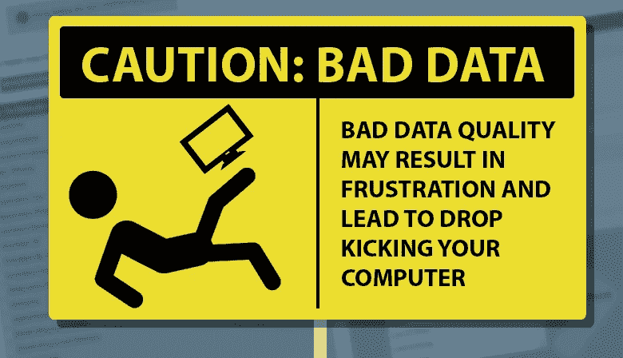
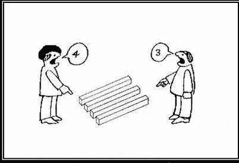
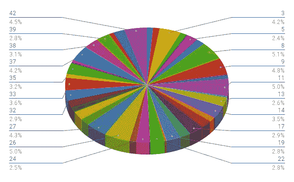
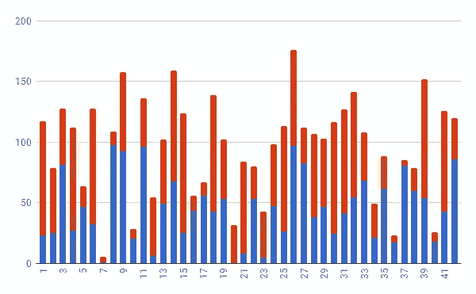
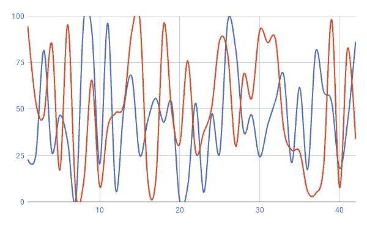
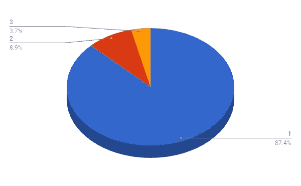

# 人工智能和不良数据

> 原文：<https://towardsdatascience.com/artificial-intelligence-and-bad-data-fbf2564c541a?source=collection_archive---------1----------------------->

脸书、谷歌和推特的律师[向国会](https://www.washingtonpost.com/news/the-switch/wp/2017/10/31/facebook-google-and-twitter-are-set-to-testify-on-capitol-hill-heres-what-to-expect/?utm_term=.14a65ef23eb2)作证，说明他们如何错过了俄罗斯的影响力运动。尽管这些广告是在充斥着分析引擎的平台上用俄罗斯货币购买的，但影响力运动的问题本质并未被发现。[“卢布+美国政治”并没有引发警报](http://fortune.com/2017/10/31/franken-facebook-russia-investigation/)，因为现成的深度学习的本质是，它只寻找它知道要寻找的东西，从更深的层面来说，它是在从真正杂乱(非结构化)或损坏和有偏见的数据中学习。对公共数据(混合私有数据)的[非结构化本质的理解每天都在突飞猛进。这是我工作的主要内容之一。让我们转而关注数据质量问题。](https://en.wikipedia.org/wiki/Open-source_intelligence#Principles)

Data can be wrong. Image taken from [this post](https://www.linkedin.com/pulse/things-you-should-know-predictive-big-data-analysis-damir-olejar/).

以下是一些常见的数据质量问题:

*   **数据稀疏性:**我们对很多事情都有一点了解，但对大多数事情却没有清晰的了解。
*   **数据损坏:**将 PDF 转换为文本并打印。是啊。除了正文之外，还有许多垃圾。
*   **大量不相关的数据:**在一个象棋游戏中，[我们可以剪枝整节的树搜索](https://www.cs.cornell.edu/courses/cs312/2002sp/lectures/rec21.htm)，更普遍的是，在一张猫的图片中，大部分像素并没有告诉我们这只猫有多可爱。在完全随机的数据中，我们人类(和人工智能)可以看到实际上不存在的模式。
*   **从不良标签中学习:**标签系统的偏差，可能是由于人为偏差。
*   **缺失意想不到的模式:**黑天鹅、[政权更迭](https://www.cnbc.com/2015/09/03/threat-of-regime-change-hits-wall-street.html)、[阶层失衡](http://www.chioka.in/class-imbalance-problem/)等。
*   **学习错误的模式:**不是真正因果关系的相关性可以被训练到 AI 中，然后它错误地假设相关性是因果关系。
*   我可以继续。

Bad data is hard to analyze with off-the-shelf systems. Yep. AI is one tough business. Credit: [Robert Taylor](http://www.artesian.co/linkedin-missing-the-point/)

我们知道，基本上任何问题都很难得到有标签的数据，甚至有标签的数据也可能充满偏差。我周五拜访了一个潜在客户，他有一个很棒的数据团队，但由于所有权和知识产权问题，没有能力从现实世界中收集他们需要的数据。这个“卢布+美国政治”的好数据被 AI 遗漏的例子，对专家来说并不奇怪。为什么？嗯，人工智能需要知道要寻找什么，社交媒体巨头正在寻找更具侵略性的攻击类型，如根据他们的 facebook 个人资料监控士兵的行动。事实上，我们错过好数据信号的原因是像 twitter 这样的真实系统中有大量的坏数据。这是一个信噪比问题。如果警报太多，警报系统会被忽略。太少，系统会错过关键警报。不仅仅是像俄罗斯这样的对手试图获得影响力。好人，公司和品牌，做同样的事情。滴运动和游击营销是一种在鞋类销售中传播影响力的策略，就像政治干预选举一样。所以，我们错过好数据信号的真正原因是坏数据。利用简单的谓词逻辑，我们知道[假假设可以隐含任何东西](https://math.stackexchange.com/questions/1583209/false-implies-true-is-a-true-statement) ( [也此](http://mathforum.org/library/drmath/view/55617.html))。因此，从我们知道错误百出的数据中学习会带来一些真正的负担。

Let’s just agree that [the data is wrong](https://en.wikipedia.org/wiki/Proton_radius_puzzle). Credit: ([not original author](https://twitter.com/cpascalar/status/723920130212790272))

坏数据的一个例子是发现你的人工智能模型是在错误类型的数据上训练的。来自聊天对话的文本不像来自报纸的文本。两者都是由文字组成，但内容却大不相同。在[维基百科数据集](https://en.wikipedia.org/wiki/Wikipedia:Database_download)或[谷歌新闻文章](http://mccormickml.com/2016/04/12/googles-pretrained-word2vec-model-in-python/)上训练的人工智能不会正确理解(即“模拟”)我们人类在聊天应用程序中用来交流的自由格式文本。这里有一个[稍微好一点的数据集](http://chatlogs.planetrdf.com/swig/)，也许还有来自[黑客新闻数据集](https://cloud.google.com/bigquery/public-data/hacker-news)的评论。通常，我们需要针对正确的问题使用正确的预训练模型或现成的数据集，然后进行一些迁移学习，以从基线进行改进。然而，这是假设我们可以使用这些数据。许多公共数据集甚至有更大的坏数据问题，导致模型完全失败。有时使用一个字段，有时留空(稀疏)，有时非数字数据悄悄进入数字列(“1”对 1)。我在一个大型私人房地产数据集中发现了一个异常值，一百万个条目中有一个是由人类输入的巨大数字，被称为[粗手指错误](https://en.wikipedia.org/wiki/Fat-finger_error)。

像围棋( [AlphaGo zero](https://techcrunch.com/2017/11/02/deepmind-has-yet-to-find-out-how-smart-its-alphago-zero-ai-could-be/) )这种游戏的问题，没有不好的数据可以分析。相反，人工智能评估更相关和不太相关的数据。游戏是一个很好的约束问题集，但是在大多数真实世界的数据中，[存在偏差](https://www.technologyreview.com/s/608986/forget-killer-robotsbias-is-the-real-ai-danger/)。很多。[助推](https://en.wikipedia.org/wiki/Boosting_(machine_learning))和其他技术也会有帮助。事实是，机器学习的某些方面仍然是开放的问题，令人震惊的改进一直在发生。例子:[胶囊网击败 CNN](https://hackernoon.com/what-is-a-capsnet-or-capsule-network-2bfbe48769cc) 。

重要的是要知道错误何时是由数据中的坏东西引起的，而不是由数据拟合不当引起的。像人类一样，在运行时学习的活系统特别容易从坏数据中学习错误信息。这有点像[辛普森悖论](https://en.wikipedia.org/wiki/Simpson%27s_paradox)，因为数据通常是正确的，所以拟合数据是一件好事，但有时拟合数据会产生悖论，因为方法本身(拟合数据)是基于一个糟糕的假设，即所有数据都是基本事实数据。参见[这段视频，了解更多关于辛普森悖论的乐趣。这是另一个链接，链接到](https://www.youtube.com/watch?v=ebEkn-BiW5k) [Autodesk 的 datasaurus](https://www.autodeskresearch.com/publications/samestats) ，我很喜欢它。它完全值得完整阅读。

These images are all RANDOM data. I want to drive home the point that “trends” can be found in lots of places, and the [law of big numbers](https://en.wikipedia.org/wiki/Law_of_large_numbers) is not always there to come to the rescue. IN the bar graph it looks like something special happens at 7\. It’s just random. In the pie chart with 3 colors it looks like 1 is more prevalent than 2 and 3\. Nope. Random. The pie chart with lots of slices is a case where we start to see the numbers averaging out, but that’s the point. Sometimes your dataset has all sorts of garbage in it that you don’t know about.

我们谈到了这样一个事实，即大多数真实世界的数据充满了腐败和偏见。这有点糟糕，但并不是所有的都失去了。有各种各样的技术可以应对糟糕的数据质量，其中最重要的是收集更多的数据，并清理数据。更高级的技术，如 NLP 集成、知识图表和商业级分析，并不容易得到。在以后的文章中会有更多关于这个的内容。

如果你喜欢这篇关于坏数据和人工智能的文章，那么请尝试一下 **clap 工具**。轻点那个。跟着我们走。在脸书和推特上分享。去吧。我也很高兴在评论中听到你的反馈。你怎么想呢?

编码快乐！

-丹尼尔
[丹尼尔@lemay.ai](mailto:daniel@lemay.ai) ←打个招呼。
[LEMAY . AI](https://lemay.ai)
1(855)LEMAY-AI

您可能喜欢的其他文章:

*   [如何给人工智能项目定价](https://medium.com/towards-data-science/how-to-price-an-ai-project-f7270cb630a4)
*   [如何聘请人工智能顾问](https://medium.com/towards-data-science/why-hire-an-ai-consultant-50e155e17b39)
*   [人工智能:让你的用户给你的数据贴上标签](https://medium.com/towards-data-science/artificial-intelligence-get-your-users-to-label-your-data-b5fa7c0c9e00)