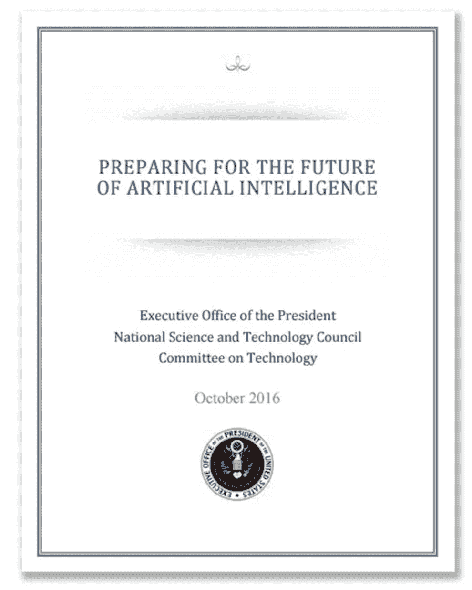

# 人工智能和经济不平等的加剧

> 原文：<https://towardsdatascience.com/artificial-intelligence-and-the-rise-of-economic-inequality-b9d81be58bec?source=collection_archive---------1----------------------->

几个世纪以来，技术在美国劳动力市场中发挥了关键作用，使工人能够以更高效的方式完成日常任务。在技术进步的帮助下，生产率的提高使美国成为世界上最强大的经济体之一，定期创造成千上万的就业机会，并保持该国大量人口的就业。然而，技术进步也导致许多工人失业，因为组织机构试图通过增加使用自动化来取代低技能工作(即需要手工劳动并且可以容易地被机器取代的工作)来降低雇佣成本。

例如，1870 年，农业雇佣了几乎 50%的美国雇员。然而，根据劳工统计局的报告，截至 2015 年，农业行业使用的劳动力不到全国的 2%。尽管这个农业工人的小堡垒现在为更多的美国人甚至全球人口生产食物，但他们在美国劳动力中所占的份额已经显著下降，这说明了“技术转移所能产生的巨大影响。”[【2】](#_ftn2)

农业并不是唯一的行业。许多更先进的技术形式在美国劳动力中发挥了作用，自动化了更多的劳动密集型工作，并打破了低技能工作(如收银员、总机接线员和银行出纳员)的自动化。最近，一种新的技术形式开始在市场上站稳脚跟:人工智能。顾名思义，这些计算机程序能够模仿人类思维，并执行几乎不可能以逐步方式处理的任务。这些任务包括图像识别、趋势分析、检测医疗状况等等。如果给予足够的输入和预期的输出，这种新形式的技术基本上可以做人类可以做的事情(类似于一个人如何学习一种特定的技能，即通过在一定数量的例子中反复试验)。

人工智能(AI)给劳动力中持续受到威胁的部分，即低技能和未受教育的工人带来了更紧迫的问题。目前，关于人工智能对美国劳动力的影响的许多文献在很大程度上仍然是猜测性的，因为公司才刚刚开始在日常运营中推出这种新技术的形式(因此不可能观察人工智能对劳动力的长期影响)。然而，根据历史趋势和人工智能的当前能力，人工智能的崛起完全有可能导致入门级和低技能工作(即不需要大量培训或教育的工作)的取代，在现代社会中造成专业化和非专业化工人之间更大的二分法。为了探索这个问题的所有方面，这篇文章将专注于三个主要部分，即定义什么是人工智能及其当前的能力，回顾技术进步对美国劳动力的先前影响，最后推断人工智能对美国劳动力和社会的潜在未来影响。

## 定义人工智能及其当前能力

在深入研究人工智能之前，重要的是在人工智能开发之前建立对编程和自动化状态的理解。计算机擅长执行一组指令，而程序员是那些经常以程序的形式将这些指令编码的人。这些程序在计算机上运行时，能出色地完成它们被告知要做的事情。例如，许多计算机科学学生编写的标准程序是生成前 n 个斐波那契数(0，1，1，2，3，5，8，13，21 …)，其中每个连续的数是它前面两个数的和(在 0 和 1 之后)。程序员可以编写一个简单的 6 行版本的程序，它可以在 10 秒内产生前 30，662 个斐波那契数。

但是如果有一个更复杂的任务，比如一个涉及物体检测和模式识别的任务，一个简单的顺序程序是不够的。

例如，考虑检测图像是否包含鸟的问题。对人类来说，这很容易；在我们的生活中，我们已经看到了足够多的鸟，所以我们知道，如果一个东西有嘴、有珠子般的眼睛、羽毛和翅膀，它很可能就是一只鸟。

然而，对于计算机来说，这是困难的，因为计算机只能逐个像素地“看到”图像，并且通常不能绘制像素之间的连接来形成一般对象的定义。从程序员的角度来看，用如何识别鸟的知识给计算机编程是一项艰巨的任务。也许这种方法会告诉计算机寻找图像中具有特定颜色的部分，这些部分符合鸟类身体的一般形状，具有另一种颜色的三角形喙，眼睛有两个黑色圆圈。但是这些标准并不包括所有不同类型的鸟类。此外，如果鸟的图像的任何部分被遮挡，计算机将无法完成任务。

这一点就是 AI 的用武之地。人工智能(具体来说是一个称为神经网络的子集)可以通过基于其接收的训练数据的统计分析和优化，以类似于人类的方式“学习”。如果开发人员可以创建一个人工智能(由接受输入并产生训练输出的人工神经元组成)，这个程序就可以使用数以千计包含和不包含鸟类的图像来训练自己。从这一点出发，经过训练的网络可以创建一个模型，该模型可以准确预测一只鸟是否出现在图像中，即使它以前没有见过这张照片。事实上，Flickr 的开发人员做了几乎相同的任务，并取得了惊人的准确率。[【3】](#_ftn3)[【4】](#_ftn4)

但是人工智能可以做的不仅仅是检测照片中是否有鸟。它们还可以从安装在路上汽车上的摄像头中识别物体，并指示汽车相应地移动，以避开障碍物并遵守街道标志，这为自动驾驶汽车奠定了基础。广受欢迎的拼车初创公司优步(Alibaba)等公司更进一步，开始部署自动驾驶汽车，只需要工程师监控车辆，而不是让普通司机驾驶。

此外，人工智能可以在医疗领域的生命关键应用中提供帮助，帮助放射科医生在诊断肿瘤的过程中，在它们明显表现出来之前，有时甚至在医生看到变化之前，通过 MRI 扫描捕捉它们。

被称为长短期记忆循环神经网络的人工智能变体甚至可以完成更多创造性任务，例如以一位或多位艺术家的风格创作音乐。[【5】](#_ftn5)这种相同形式的人工智能也被用来为公司培训 24/7 的虚拟客户服务代表。这些在线助手从不疲倦，并从客户以前面临的数百万次对话、问题和议题的集体经验中学习。

简而言之，人工智能已经开始完成仅被认为仅对人类可行的任务，在某些情况下，如果给定足够的训练数据，人工智能可以在这些任务上击败人。虽然创造一个人工智能的过程是非常资源密集型的，但硬件价格的下降和更好算法的发展使得即使是普通的笔记本电脑所有者也可以在短短半小时内在他们的计算机上创造一个人工智能。很明显，官员们需要在未来解决人工智能在劳动力中的影响。研究人员已经证明了它的能力，这项技术终于赶上来，允许普通消费者以很少甚至没有成本的方式创造和使用人工智能。

## 劳动力中以前的技术进步

从历史上看，新技术在劳动力中的整合最初会取代几种形式的工作，但也会为其他领域的新型工作开辟道路。

这种模式的经典例子是 19 世纪勒德分子对新纺织技术的抗议。1811 年，一群英国织工和纺织工人领导了一场抗议活动，反对纺织厂最近发明和实施自动化织布机和针织机。这些人，现在被称为卢德分子，首先聚集在诺丁汉，摧毁了剥夺他们工匠和专门劳动者工作的机器。卢德运动蔓延到诺丁汉周围的地区，人们继续举行这些打破机器的抗议活动，直到 1816 年，直到英国政府被迫镇压该团体的任何进一步的反抗。

现在，人们用“卢德分子”这个词来描述一个反对工业化、自动化或任何形式的新技术的人。我们知道，卢德分子在抵制一场变革，这场变革将为工业革命和工厂制度的诞生奠定基础，工厂制度将雇佣数百万个人，并避免对体力劳动的极度专业化劳动的需求。但是，随着新技术的进步，如何知道是否会有替代工作来帮助那些被技术本身取代的人呢？要回答这个问题，唯一的方法是先看看以前的趋势，然后从那里进行推断。

19 世纪的技术变革降低了对专业和高技能工人的需求，就像卢德分子的情况一样，导致了偏向低技能的技术变革。这种技术趋势在 20 世纪末随着消费者可以使用的计算能力和互联网的出现而转变。这种变化导致了有技能的个人的生产力和福利，导致了以技能为导向的技术变革。

White House report on AI

白宫关于人工智能、自动化和经济的报告通过几个例子说明了这种变化是如何体现的，指出制造业就业岗位的减少导致对受教育程度较低的工人的劳动力需求疲软。然而，随着技术不断融入工作场所，“从事抽象思维、创造能力和解决问题技能的人”的机会越来越多。[【6】](#_ftn6)

在制造工作的计算自动化的情况下，当公司可以关闭那些工厂并搬迁到更大的集中设施时，它们就越来越没有动力将更偏远地区的小工厂纳入人力员工。在一个特殊的例子中，研究人员确定了几个选择用机器代替体力劳动者的工业设施。在跟踪这些被解雇工人的就业模式十年后，他们发现这些工人的收入相对于他们以前的工资仍然低 11%。[【7】](#_ftn7)这一发现表明，许多失业工人的能力下降，无法将他们现有的技能与新的、受欢迎的工作相匹配，或者接受再培训。然而，即使工人可以在其他工作中保持就业，这些流离失所者是否有工作仍存在很大疑问。

纵观历史，许多发达经济体都曾追随“创造性破坏”的潮流，这一术语是由 20 世纪经济学家约瑟夫·熊彼特提出的，用来描述“新的生产单位取代过时的生产单位”的现象研究人员已经多次证明了这种趋势的存在，最重要的是由 Davis，Haltiwanger 和 Schuh (DHS)发现，在 1972-1988 年的某一年中，10%的工作岗位被取消，但都被新的工作岗位所取代。[【9】](#_ftn9)Foster、Haltiwanger 和 Krizan 在 2001 年进行了这项研究，并有证据表明，这些就业机会的破坏和创造周期最直接地归因于技术(在他们对 DHS 的数据进行了行业细分之后)。 [[10]](#_ftn10) 然而，兰德尔·柯林斯指出，那些倾向于采用熊彼特式的观点来看待新技术对劳动力的影响的经济学家们“仅仅依靠对过去趋势的推断来论证新产品创造的就业机会将会弥补旧市场被破坏而失去的就业机会。”迄今为止，以前的经济数据确实支持熊彼特的理论，但是熊彼特自己提出了“创造性破坏”的概念，而当时还没有计算机这个概念。直到最近，劳动力的大量计算机化才真正威胁到专业人员的完全替代。

柯林斯还详细阐述了他的观点，指出工作场所自动化集成创造的新工作需要更多的专业化和正规教育。这些工作包括 IT 服务、网站开发和咨询服务。柯林斯解释了他之前的观点，即未受过教育的人无法获得新的工作，并指出最近对职业再培训计划的需求增加，以培训非专业工人掌握新技能。然而，有一个绝对的极限，在这个极限上，许多人不再可能专攻某一特定技能。例如，软件工程，一个随着编程语言的发明才出现的工作，需要在正规大学接受至少四年的培训。实际上，在一个变得越来越自动化的社会里，熊彼特的观点不能被认为是真实的，因为以前的趋势与未来将发生的事情没有关系。人工智能可能会创造新的行业，但这些行业是否能为流离失所者提供可行的工作前景还有待观察。

**人工智能在劳动力中的预测**

人工智能对经济的现状构成了很大的威胁；然而，将这种新形式的技术引入市场的大部分后果尚不清楚。争论的主要问题是，在公司选择将人工智能融入劳动力的范围内，以技能为导向的技术变革是否会继续。

牛津大学的卡尔·弗雷和迈克尔·奥斯本认为人工智能技术可以取代近 47%的美国工作。[【12】](#_ftn12)此外，经济合作与发展组织强调了最有可能在短期内得到自动化显著帮助的各类员工的目标领域风险，指出在未来十年中，40%的高中或以下学历的工人将因技术进步而面临某种形式的失业。这种工作岗位的转移可能会给这些人留下很少的专业选择。然而，在试图教育和培训相当一部分美国劳动力使他们在各个领域专业化，以便他们在未来有良好的就业前景方面，存在着多种问题。

虽然在过去，一部分人完全有可能从一份低技能工作转向另一份只接受了最低限度培训的工作(正如大萧条时期的工作教育项目所见)，但让 47%的人口接受进一步的大学教育多少有些不合理。实现这一目标的唯一途径是获得大量政府资金的帮助。柯林斯指出，随着“与计算机工作相比，人类创造的就业机会数量稳步下降”，政府将有必要支持大量失业人口。[【13】](#_ftn13)美国在 20 世纪上半叶通过实施凯恩斯福利国家来解决大量失业问题，以维护资本主义制度，尽管这一制度受到政府的支持和控制。在政策方面，政府可以向公司征税，以雇佣人工智能实施人员，尽管这一措施将是暂时的，因为人工智能的成本会随着时间的推移而下降。

在大规模失业的情况下，实施普遍基本收入可能是缓解社会问题的一个解决办法。然而，根据柯林斯的说法，这种方法甚至让发达国家面临“国家财政危机和富人与依靠政府维持基本生活的人之间的分裂”社会中的这种二分法很可能“比当前资本主义市场中的任何东西都要大”，尤其是当依赖的人口无法维持就业的时候。此外，这一体系剥夺了依赖个人的购买力，“同时削弱了消费者市场，使资本主义不可持续。”[【15】](#_ftn15)

柯林斯非常清楚地表明，如果人工智能的使用导致大量失业，就不可能有今天在美国所知的资本主义经济形式。普遍基本收入虽然是为全社会人民建立生活体系的一种极好的手段，但却无法维持当前的经济体系，甚至进一步扩大了社会两个阶层之间的工资差距，即那些尚未被人工智能取代工作的人和那些已经被人工智能取代工作的人。这种推断的证据可以从美国福利制度的现状中看出。对于长期失业的人来说，他们享受福利的可能性要小得多，这导致这些人的购买力下降，与他们有工作的同龄人相比，他们的经济地位也更低。[【16】](#_ftn16)劳动力中人工智能导致的失业增长可能会成为失业的驱动力，并导致对政府援助计划的依赖。这种依赖可能会加剧失业者和那些工作过于专业化而人工智能无法取代的人之间的经济不平等。

然而，人工智能将导致大规模失业的观点并不是唯一的潜在观点。David Autor 认为，在人工智能集成之后，可能会有两个群体的个人在经济繁荣中增长:拥有公司并从事专业劳动的人，以及每天与人类互动的工人(例如护士)。他的信念是，“即使人工智能能够处理复杂的模式，分析比人类更准确的数据，它也缺乏与其他人交流和解释其决策过程的能力。”对人工智能在工作场所中的角色的这种观点，将允许合理程度的向上流动，并允许维持现有的中产阶级和资本主义社会的可能性。

当然，柯林斯和奥托尔对人工智能在工作场所中的作用的看法将因有关技术在劳动力中的作用的几个因素而异，但要解决的一个关键点是，面对人工智能，如何保持美国当前存在的阶级结构的一些表象。

## 结论

如果你能从这篇论文中总结出什么，那就是:人工智能对当今已知的劳动力结构构成了威胁。然而，许多人只能将这种危险的影响理论化。在柯林斯关于人工智能的观点中，人工智能取代工作的威胁可能导致失业工人和那些工作过于专业化而无法取代的工人之间的灾难性分化，最终导致基本收入的建立和政府在维持福利国家中的更大作用。奥托尔的理论同意人工智能将取代低技能劳动者的工作这一事实，但预测依赖于重要人类互动的工作将反而上升，为那些被人工智能取代的人提供再培训的机会。根据历史趋势，很明显，新的工作行业可以由技术创造，作为新的工作来源来取代被技术本身取代的工作。然而，对于人工智能是工作竞争对手的市场来说，这些工作对失业工人的可获得性是首要关注的问题。过去的历史趋势和人工智能的现状相结合，表明有必要为低技能工人创造新的、可获得的行业，以避免今天看到的经济和社会结构的广泛变化。

总体而言，人工智能在短期内可能会成为一种威胁，但完全有可能的是，人工智能的集成可以通过新的行业创造无数的就业机会。为了遏制人工智能对经济和社会的潜在影响，官员们有必要制定政策，教育那些工作可能受到人工智能威胁的个人，并限制人工智能在易受影响行业的整合。这项技术可以在人类水平上完成惊人的壮举，避免在现代世界进一步探索它的能力是错误的。然而，必须负责任地整合人工智能，以避免在不久的将来出现经济不平等。如果以正确的速度引入，这种新形式的技术可以以独特的方式帮助人类，并从技术、经济和科学的角度引领人类的进一步发展。

## 参考书目:

[【1】](#_ftnref1)主要行业部门就业情况。(未注明)。检索于 2017 年 4 月 26 日，发自 http://www.bls.gov/emp/ep_table_201.htm

柯林斯，R. (2014)。中产阶级工作的终结:不再逃避。在*资本主义有未来吗？*(第 39–51 页)。纽约州纽约市:牛津大学出版社。

[【3】](#_ftnref3)介绍公园或鸟。(2014 年 10 月 20 日)。检索于 2017 年 4 月 26 日，来自[http://code . Flickr . net/2014/10/20/introducing-Flickr-park-or-bird/](http://code.flickr.net/2014/10/20/introducing-flickr-park-or-bird/)

[【4】](#_ftnref4)医学博士泽勒&弗格斯，R. (2014)。可视化和理解卷积网络。*计算机视觉——ECCV 2014 年计算机科学讲座笔记，*818–833。doi:10.1007/978–3–319–10590–1 _ 53

[【5】](#_ftnref5)约翰逊博士(2015 年 08 月 02 日)。用递归神经网络作曲。检索于 2017 年 4 月 26 日，来自[http://www . hehedria . com/2015/08/03/composing-music-with-recurrent-neural-networks/](http://www.hexahedria.com/2015/08/03/composing-music-with-recurrent-neural-networks/)

[【6】](#_ftnref6)*人工智能、自动化和经济*(第 8-26 页，Rep .)。(2016).华盛顿特区:总统行政办公室。

[【7】](#_ftnref7)戴维斯，s . j .&沃希特，T. V. (2011)。衰退和失业成本。*布鲁金斯经济活动论文，2011 年* (2)，1–72 页。doi:10.1353/eca

[【8】](#_ftnref8)什么是创造性破坏和颠覆性创新？(未注明)。创造性破坏和共享经济。doi:10.4337/9781786434335

[【9】](#_ftnref9)戴维斯，S. J .，哈尔蒂旺热，j .，&舒赫，S. (1993)。小企业和创造就业机会:剖析神话和重新评估事实。*美国国家经济研究局工作文件系列，*1–49。

*哈尔滕，C. R .，迪恩，e . r .&哈珀，M. J. (2001)。*生产率分析的新发展*。芝加哥:芝加哥大学出版社。*

*[【11】](#_ftnref11)柯林斯 40*

*[【12】](#_ftnref12)弗雷，c . b .&奥斯本，文学硕士(未注明)。就业的未来:工作对计算机化有多敏感？检索自[http://www . Oxford Martin . ox . AC . uk/downloads/academic/The _ Future _ of _ employment . pdf](http://www.oxfordmartin.ox.ac.uk/downloads/academic/The_Future_of_Employment.pdf)*

*[【科林斯 13】](#_ftnref13)41*

*柯林斯 50*

*[【15】](#_ftnref15)柯林斯 51*

*[【16】](#_ftnref16)梅尔科森，m .&萨雷拉，J. (2004 年)。失业者的福利参与和福利依赖。*人口经济学杂志，17* (3)，409–431 页。从 http://www.jstor.org/stable/20007919[取回](http://www.jstor.org/stable/20007919)*

*[【17】](#_ftnref17)奥特尔博士(2014)。*波兰尼悖论与就业增长的形态*。马萨诸塞州剑桥:美国国家经济研究局。*