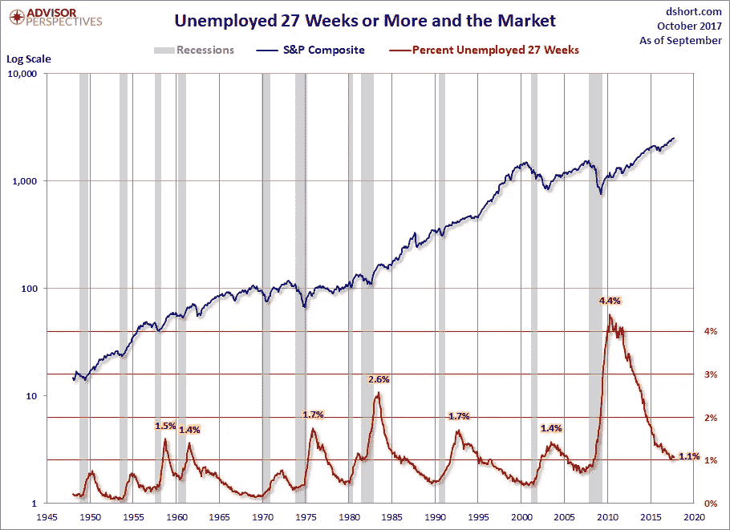
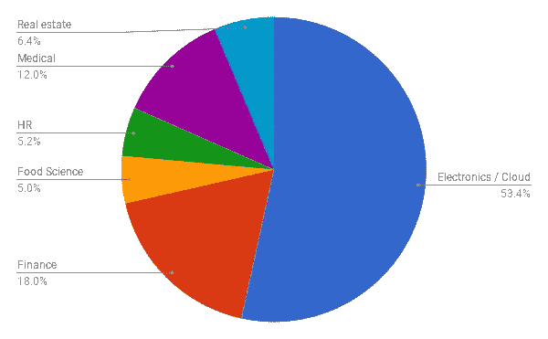

# 人工智能像魔术一样

> 原文：<https://towardsdatascience.com/artificial-intelligence-as-magic-e8ba4b3165ea?source=collection_archive---------4----------------------->

创新或者死亡。成长或枯萎。这就是我今天在人工智能领域的感受。2008 年的衰退性失业在 2010 年达到顶峰，现在已经基本结束。现在这个世界充满了增长。

Source: [advisor perspectives](https://www.advisorperspectives.com/dshort/updates/2017/10/06/september-jobs-report-33k-jobs-lost-likely-affect-of-hurricanes) and inspired by an [article on automation](https://medium.com/basic-income/the-real-story-of-automation-beginning-with-one-simple-chart-8b95f9bad71b)

过去一年，我们的咨询业务一直在从事许多简短的人工智能咨询业务，以帮助公司将最好和最新的东西纳入他们的产品和服务。我们不能永远做同样的表演。与普遍的看法相反，我认为在某个时候，人工智能解决方案架构会变得更容易。在这种情况下，人工智能领域的人才将会增加，这是一件好事。但对我们来说，这意味着我们做的高端咨询利润会更低。由于像 keras 这样的库，创建多模型人工智能的过程也将变得更容易，这将允许从预训练的模型中进行[转移学习](https://medium.com/towards-data-science/transfer-learning-using-keras-d804b2e04ef8)，以及自动部署最常见类型的神经网络模型([见此](https://keras.io/applications/))。作为一家 AI 公司，我们要么创新，要么死亡。

那么我们一直在做什么来赚钱呢？以下是到目前为止我们咨询收入来源的高层次细分，按行业划分。似乎我们主要做电子和云人工智能的东西。没有许可费，没有经常性收入。我们第一年的大多数项目都在 1.5 万到 3 万美元之间。

Our consulting revenue by sector, since 2016–07–13\. I got this from our CRM, not the accounting software, and so there may be some errors in this summary because of small stuff, like taxes in Europe, or whatever. Sue me.

我们转向产品和更大合同的步伐非常缓慢，但我们最终还是做到了。我们对转向的犹豫是合理的。我们对写没有任何进展的 RFP 不感兴趣。相反，我们非常开心，专注于为客户创造价值，飞到凉爽的地方，壮大我们的团队。我们通常对从引进到签订合同之间有很长时间的项目不感兴趣。我们是一群受过高等教育的书呆子，来自医疗设备背景，创新进展缓慢，所以我们想抓住今天。我们创造了一个漏斗，用项目填满它，然后勇往直前。在之前的文章中，我写了更多关于我们如何在[到达这里的内容。](https://medium.com/towards-data-science/our-artificial-intelligence-startup-c7daf4c140a1)

我们在建立这个企业的过程中度过了美好的时光，但每个人都必须成长。

> “成年人只是变老的孩子”
> - [Reddit 用户 thetreece](https://www.reddit.com/r/fatlogic/comments/6uwjho/this_was_a_comment_on_a_picture_of_a_doctors_scale/)

我们不能只是继续在咨询仓鼠轮中奔跑，尽管这可能很有趣。我们决定了我们转向产品和更大规模服务的特点。

**从现在开始我们不会做的事情:**

*   **基础科学:**没有应用的牛逼科技。我们是高级工程师。我们制造东西。我们想赚 100 美元，而不是拿诺贝尔奖.
*   **基础编码:**平凡的技术，却有着令人敬畏的应用。没有竞争壁垒。如果我要做“愚蠢”的代码，为什么我有 ML 的博士学位？我们接受了太多的教育，无法修补前端的东西。即使我们过去做 GUI，我们已经采取了前端工作外包的立场，无论是对我们内部还是对客户，我们不认为我们通过编写 GUI 代码增加了价值。快速推荐:[马可迪鲁卡](https://www.linkedin.com/in/marcosantinodeluca/)。我们不这样标记设计工作。我们只是把它传给我们喜欢的人。我最好的 GUI 没有 Marco 最丑的好。
*   约会超级名模有两个步骤。第一步:找超模。第二步:和超模约会。问题是细节。我们不想花很多时间做一些最终成为证明 P=NP 的特例的事情。所以，我们把自己限制在我们相信自己能够制造的东西的范围内。不是说我们不接受大的挑战。我们只是不冒愚蠢的风险。

**从现在开始我们要做什么:**

*   **简单的用户体验(UX):** 我们正在为令人敬畏的人工智能构建简单的界面。当事情像那样运作时，它看起来就像魔术一样。我觉得所有的 AI 都应该感觉像魔术。你应该把系统设计成以一种用户理解但没想到可能的方式工作。
*   **深度学习神经网络:**我们的利基市场是深度学习神经网络。这就是我们的价值所在。如果我们构建通用软件，我们还不如在软件工厂工作。所以，我们专注于疯狂的高端产品。
*   **经常性 B2B 收入:**企业乐于为深度学习付费，他们持有最有趣的数据集。他们也比消费者有更多的钱可以花。我们正在开发**API**、**基于订阅的服务**，以及产生**许可费**的软件库。这三条新的途径为我们拓展了一些很酷的可能性。
*   **大数据和云:**我们在数据中心的物理机箱和物理硬件组件(电路板、电路、外壳、焊接)上做了太多工作。我们的 digikey 账户比人工智能咨询公司活跃得多。所以，我们专注于我们的云游戏。特别是云端的深度学习。这是我们希望向客户交付许多数据科学团队无法实现的结果的地方。
*   **手机:**我们不做手机应用，但我们与做手机应用的开发者合作。这个功能是一个很好的特性。我们都使用智能手机，因此具备移动功能非常重要。我会不假思索地推荐[under labs . ca](http://underlabs.ca)他们的 CTO 是我大学时的好友，他们的口号说明了一切:**“我们开发酷 sh * t”**

这不是某种宣言。我们实际上正在做这些事情，在我写这些文字的时候，我们正在做这些事情。本周我们将参加多伦多机器学习峰会。除了我们通常的咨询工作之外，下面是我们一直在做的一些事情:

1.  [**SageTea 软件**合伙](http://sageteasoftware.com/lsci/) ( *正文转软件深度学习*)。我们的第一笔软件许可销售已经是囊中之物了。后续的销售兴趣相当大。
2.  另一个**合作伙伴在讨论** ( *【审查】Kit 深度学习？*)正在等待法律签字同意。
3.  Genrush.com 进展顺利。我们这个项目的目标是通过向销售团队提供线索来产生经常性收入。整个方法使用机器学习来解决问题。这仍然是一项正在进行的工作，但它肯定会朝着赚第一个美元的方向发展。

所以，我们越来越不是一家初创企业。我们在成长，在做长远的思考和规划。我们正在创造奇迹。激动人心的时刻！

在我离开之前，本周有几件事引起了我的注意。AWS 中新的 [p3 实例已经发布，树莓 Pi 4 将通过谷歌的](https://aws.amazon.com/ec2/instance-types/p3/)[插件](http://www.itpro.co.uk/desktop-hardware/27763/raspberry-pi-4-google-announces-partnership-with-raspberry-pi-foundation-2)支持更快的深度学习。一切都在移动。

如果你喜欢这篇关于我们如何重新聚焦人工智能咨询的文章，那么请尝试一下 **clap 工具**。轻点那个。跟着我们走。在脸书和推特上分享。去吧。我也很高兴在评论中听到你的反馈。你怎么想呢?

编码快乐！

-丹尼尔
[丹尼尔@lemay.ai](mailto:daniel@lemay.ai) ←打个招呼。
[LEMAY . AI](https://lemay.ai)
1(855)LEMAY-AI

您可能喜欢的其他文章:

*   [如何给人工智能项目定价](https://medium.com/towards-data-science/how-to-price-an-ai-project-f7270cb630a4)
*   [如何聘请 AI 顾问](https://medium.com/towards-data-science/why-hire-an-ai-consultant-50e155e17b39)
*   [人工智能:让你的用户给你的数据贴上标签](https://medium.com/towards-data-science/artificial-intelligence-get-your-users-to-label-your-data-b5fa7c0c9e00)