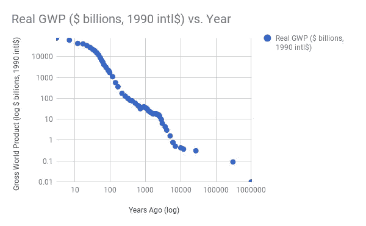
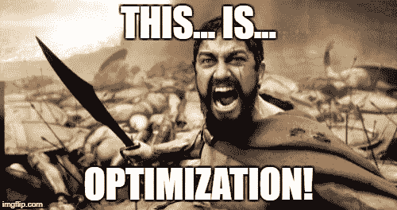
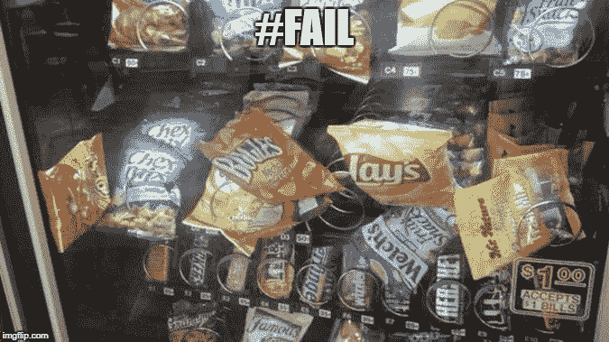

# 人工智能:后果

> 原文：<https://towardsdatascience.com/artificial-intelligence-consequences-bd4dc4d537da?source=collection_archive---------5----------------------->

AI 要[改变世界](https://qz.com/1015698/pwc-ai-could-increase-global-gdp-by-15-7-trillion-by-2030-with-much-of-the-gains-in-china/)。

像自由市场一样，人工智能是一个无情的优化器。然而，就像市场看不见的手一样，AI 也会犯错。市场制造泡沫，泡沫破裂，崩盘修正为理性估值。我们知道自由市场是一个不完美的优化器，但它是迄今为止 T2 最好的优化器。一般来说，当你缩小视野看大图时，市场前进的方向是向上向上。

Global output through human history. Raw data [from here](https://en.m.wikipedia.org/wiki/Gross_world_product). Click for [interactive chart](https://docs.google.com/spreadsheets/d/e/2PACX-1vTl0ft9W3C8vDNRVFa_vjxt5Jk9Z2Z3blkI9fHL21oQuS-D1DkLrkTyhfayAsq-80RGlv5lVqP0c_y7/pubchart?oid=1311842334&format=interactive). Both axes are on a log scale.

AI 和市场经济学是两个优化器。它们在股票和货币交易机器人中相交。如果我们想保持全球指数增长趋势，我们需要像人工智能这样的颠覆性创新。然而，进步不是零和游戏。相反，你知道的事情越多，你不知道的事情的[周长就越大。在](https://www.goodreads.com/quotes/526662-the-larger-the-searchlight-the-bigger-the-circumference-of-the)[之前的文章](https://medium.com/towards-data-science/why-bother-to-bootstrap-your-ai-startup-d94fd62de009)中，我提到了成长型投资和人工智能之间的联系:恐惧。对人工智能能力的恐惧导致了对它的贪婪。但正如自由市场在一些任务上不太擅长，比如创新(政府拨款和军事研究给了我们互联网，甚至是 [AI 本身](http://business.financialpost.com/g00/entrepreneur/0123-biz-dd-intelligence?i10c.encReferrer=aHR0cHM6Ly93d3cuZ29vZ2xlLmNhLw%3D%3D)，所以我们也可以看到，AI 并不擅长所有问题，至少现在不擅长。像自由市场一样，人工智能也有一套可预测的失败模式，包括过度拟合、不良的精度-召回权衡、从错误的数据中学习，例如偏差、针对错误的目标进行优化等。

然而，当处理正确的问题时，人工智能是非常有效的。机器学习回归或分类是一回事。这是那种令人讨厌的计算机东西，就像摩尔定律一样，我们期望变得更好，不管人工智能如何。但是我们能用 AI 做些什么才是真正意想不到的呢？嗯，有很多例子，包括[风格转移](https://deepart.io)，思路对比，从文章正文生成标题(摘要)，机器翻译。我们有时会忘记，简单地识别图像中的对象曾经是[科幻风格的](https://www.goodreads.com/genres/sci-fi-esque)人工智能，现在它只是卷积神经网络，通常经过预先训练，位于 API 后面。一旦你知道某件事情解决了，它似乎会在人类的头脑中很快从魔法变成逻辑。

人工智能揭示了新的可能性，这些可能性没有预料到会这么快出现。这是一场知识和自动化的淘金热。这一切都意味着我们人类将面临很多破坏，而且并不是所有的破坏都是好的。

我们人类在大脑中模拟机器将做什么，这个过程将变得很奇怪。

以一台坏掉的自动售货机为例。想象一下，走向自动售货机，放入你的信用卡，按下苏打水选择按钮，然后意识到自动售货机没有分发饮料。在这种情况下，你的大脑会思考自动售货机是如何工作的，它会对可能出现的问题进行建模。你按按钮的力度够大吗？也许只是机械故障按下了开关。读卡器工作了吗？也许机器和互联网之间的通讯中断了。也许你的信用卡交易被拒绝了。你可以问这些问题，因为你在直观和物理层面上了解了自动售货机的部件是做什么的。

然而，当我们把简单的自动售货机换成聊天机器人自动售货机时，它会把你的订单作为语音命令，并分发饮料——或者在这种情况下，它无法分发饮料，更多的部件开始发挥作用。在这个人工智能自动售货机的场景中，你有一整套可能出错的新东西。机器听到你的请求了吗？它是否正确地将你所有的话语转换成文本( [STT](https://cloud.google.com/speech/) )？文本被转换成你想要的动作了吗( [NLU](https://dialogflow.com) )？人工智能明白你付钱了吗？除了你头脑中的机械和电子模型之外，还有一层全新的可能出错的东西。现在，你的大脑将不得不模拟人工智能内部产品如何“工作”。

AI 会创造更差更烦人的用户体验。然而，它也开启了新的更好的用户体验。很简单，创建一个聊天机器人，在汽车餐厅询问快餐订单。蒂姆·霍顿订单收集系统有人吗？

由于许多工作都需要自动化，人类将需要掌握更多的计算机交互技能。如果我们的新工作是机器人霸主，让我们确保我们能够撼动这一角色，并继续增加我们共享经济的总价值。

我最近在 LinkedIn 的一个帖子上讨论了所有人都需要学习如何进行基础编程。如果我们想对人工智能保持乐观，那么我们需要人类拥有更强的技术技能。我们不能指望永远保持我们的自动化友好型工作。T2 在 1899 年存在的工作现在已经很少了。那么，AI 会来接替你的工作吗？如果你的工作很容易通过人工智能实现自动化，那么**是的，会的。**新技术会带来后果。但是你会，就像我们在整个人类历史上一样，超越自我。

> 学习编程。去[w3schools.com](https://www.w3schools.com)免费上课。或者试试 [udacity](https://www.udacity.com/course/introduction-to-python--ud1110) 。

如果你喜欢这篇关于人工智能的一些含义的文章，那么请尝试一下 **clap 工具**。轻点那个。跟着我们走。去吧。我也很高兴在评论中听到你的反馈。你怎么想呢?

编码快乐！

-丹尼尔
[丹尼尔@lemay.ai](mailto:daniel@lemay.ai) ←打个招呼。
[LEMAY . AI](https://lemay.ai)
1(855)LEMAY-AI

您可能喜欢的其他文章:

*   [如何给人工智能项目定价](https://medium.com/towards-data-science/how-to-price-an-ai-project-f7270cb630a4)
*   [如何聘请人工智能顾问](https://medium.com/towards-data-science/why-hire-an-ai-consultant-50e155e17b39)
*   [人工智能:让你的用户给你的数据贴上标签](https://medium.com/towards-data-science/artificial-intelligence-get-your-users-to-label-your-data-b5fa7c0c9e00)