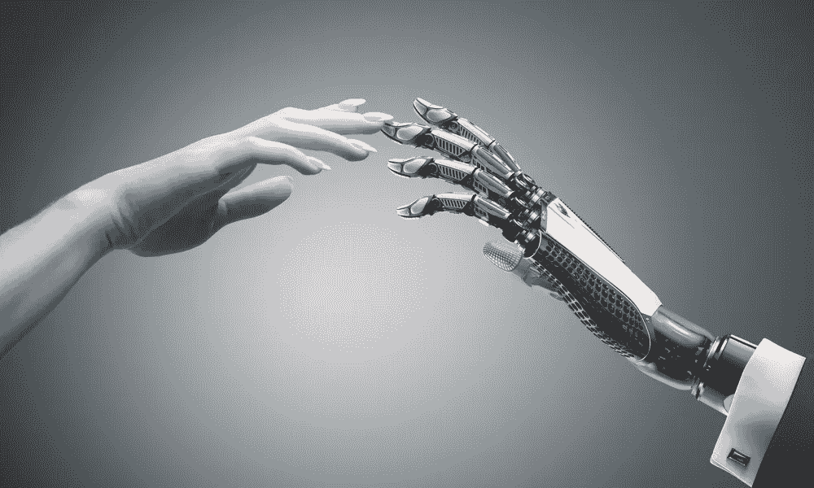
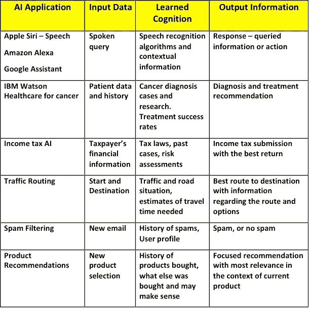
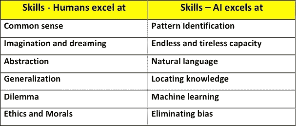
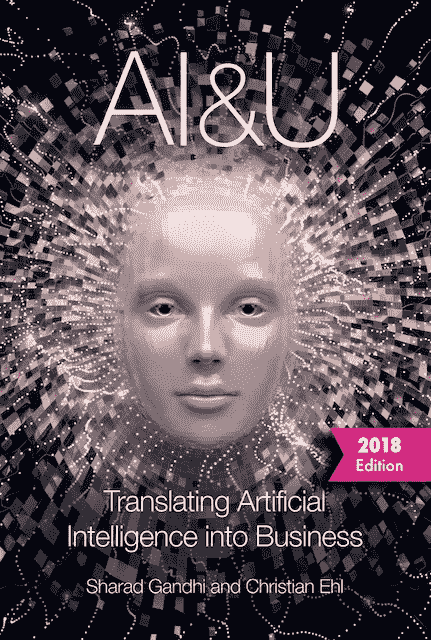

# 人工智能——去神秘化

> 原文：<https://towardsdatascience.com/artificial-intelligence-demystified-a456328e193f?source=collection_archive---------0----------------------->

人工智能(AI)可以说是我们这个时代最热门的技术话题。人工智能的文章、纪录片和讨论充斥着每一种媒体:大众的、技术的、社会的和政治的。它吸引了所有人的想象力、幻想和情感。尽管有如此多的信息，还是有必要澄清人工智能的名称和基本概念。这可能是由于媒体炒作，不同的定义，技术术语和科幻小说中关于人工智能的图像。本文试图为非技术读者澄清围绕人工智能的迷雾。

**什么是人工智能(AI)？**

我喜欢维基百科对人工智能最简单的定义:

***人工智能(AI)是机器展现出来的智能。***

AI 由两个词组成:人工和智能。“智力”一词描述了人类(和动物)的认知功能，即意识到各种情况，从中学习，并运用所学知识做出决策和解决新问题。它包括一个人的逻辑、理解、自我意识、学习、情感知识、计划、创造力和解决问题的能力。一个非常聪明的人能够快速地完成所有这些工作，并应对各种各样的情况和问题。智力通常被认为是人类(和其他生物)的。人工智能通常被称为其他名称，如机器智能、机器认知或增强智能。它们的意思都一样。

术语“人造的”指的是机器——或者非人类和非生物的。通俗地说，“人工智能”一词是指机器模仿人类与其他人类思维相关的“认知”功能，如“学习”和“解决问题”。

我们的大脑有超过 1000 亿个神经元，每个神经元都与数千个其他神经元相连，是已知宇宙中最复杂的物体。认知是它最复杂、最高级的技能之一。认知是通过思想、经验和感觉获得知识和理解的心理活动或过程。它包括决策和解决问题。Linda Gottfredson 教授(德勒威尔大学)说得很好:“*认知是从经验中学习和借鉴、抽象思维、领悟复杂思想、推理、计划和解决问题的能力。*”

你的个人电脑是智能的吗？

许多家用电器，如洗衣机、洗碗机、空调，甚至个人电脑，在自动执行复杂的逻辑任务的意义上，似乎是智能的。他们聪明吗？有些人说不。我们也可以说，是的。然而，这种智能是“编程智能”——因为智能不是源于机器内部，而是人类开发人员将其编程到机器中。人类已经创造了允许这些机器展示智能的算法(逻辑和步骤序列)。许多机器人在工厂执行复杂的任务，如焊接和组装，也是根据人类编程的算法运行的。

**算法——智能的关键**

算法的执行在展示智能方面起着重要的作用。然而，与人类在机器中的编程智能相比，人工智能(AI)能够通过“机器学习”的过程来创建自己的算法。当我们决定购买谷歌股票还是微软股票，或者去马略卡岛度假还是巴哈马群岛度假时，我们人类也会在大脑中执行算法。每个人都通过他们的主观学习和生活经验发展出他们独特的处理生活的算法——这就是为什么我们在面对类似的选择时经常会做出不同的决定。人工智能能够学习和开发自己的算法，并根据自主开发的算法做出决定——就像人类一样。学习和开发自己的算法是人工智能的独特之处。

请看:[人工智能机器如何学习——就像人类一样](https://medium.com/@sharad.gandhi/how-humans-and-machines-learn-c48de5360527)。

**人工智能自动化决策**

从功能上来说，人工智能是一个针对特定专业领域的自动化决策系统，如医疗、税收、投资、翻译、语音识别或人脸检测。人工智能在其专业知识范围内为任何给定的新情况找出最佳答案或决策(成功概率最高)。做出更好的决定是商业和私人生活成功的关键。人工智能正在迅速降低各行各业做出更好决策的成本和时间。

参见:[人工智能促进更好的决策](https://medium.com/@sharad.gandhi/making-better-decisions-f6272f144f01)。

**人工智能和机器人**

人们经常混淆机器人和人工智能。两者截然不同，但又相互关联。机器人是一种有时模仿人类形式进行某些活动的机器，但 AI 本身是机器人内部的算法逻辑。AI 是大脑，机器人是它的身体。机器人面临两个挑战:物理和逻辑。身体:使身体按照预期活动的要求行动和移动。逻辑上:人工智能部分(机器人大脑)必须自动计算并决定做什么，以应对新的输入和情况。

人工智能不需要一个肉体来表达自己。人工智能可以被视为一个信息处理黑匣子，其中包含了学习到的认知(专业化)。输入是表示新情况或查询的数据流。输出是用于决策支持和期望行动的信息。为了说明人工智能本质上是一种不需要身体的信息服务，下面是一些人工智能如何嵌入具体服务的例子:

**Structure of current AI applications**

**AI 的进化**

自上世纪中期艾伦·图灵(Alan Turing)时代以来，我们一直在探索人工智能的话题。他在 1950 年开发了著名的“[图灵测试](https://en.wikipedia.org/wiki/Turing_test)”，以测试机器表现出与人类同等或不可区分的智能行为的能力。自那以后，人工智能的概念没有太大变化，但实现它的方法却变了。由于机器学习和深度神经网络的进步，过去 5-10 年取得了重大进展，导致了我们今天都可以体验的一系列服务(如上所示)。像任何其他技术一样，人工智能将从解决简单的任务，如理解我们的讲话，发展到更加复杂的问题。进化分三个阶段进行描述。我们目前正处于第一阶段的开始。

1 **人工狭义智能(ANI)** :在这个阶段，人工智能专注于一个特定的领域，如翻译、人脸识别、下棋、诊断癌症、解读放射图像、股票投资等。在这里，人工智能已经被训练在一个，而且仅仅是一个领域中发展决策。图像识别人工智能对一盘棋毫无头绪。可以把 ANI 比作雇佣一个顶尖的专家来做一件比其他任何人都好的工作。目前，人工智能的所有应用都处于 ANI 阶段。在未来 3-5 年内，许多新产品和服务将集成 ANI 功能，提供独特的客户价值，这是一个巨大的差异化商机。

2 **人工通用智能(AGI)** :下一阶段是 AGI，这里的系统拥有一般水平的智能。AI 系统在所有方面都像人类一样聪明，可以执行人类可以执行的任何智力任务。一个成年人获得了丰富的知识和各种各样的技能，并且能够以多种方式组合使用这些技能。匹配这一点比在一件事情上获得专业知识要困难得多。还没有人创造出 AGI。人工智能专家对实现 AGI 的平均预测是在本世纪中叶左右。更乐观的预测是到 2030 年。

3 **人工超级智能(ASI)** :人工智能专家尼克·博斯特罗姆(Nick Bostrom)将超级智能定义为“*在几乎每个领域都比最优秀的人类大脑聪明得多的智力，包括科学创造力、普遍智慧和社交技能。”*好得多可能意味着 10 倍、1000 倍或 1000000 倍。人类无法想象这对我们的生活和社会的影响。专家预测实现 ASI 是在本世纪下半叶。当智能机器自己开始设计它们的下一代版本时，进展可能会非常快，呈指数级增长。这是目前科幻小说的素材。

**与艾同居**

在过去的二十年里，互联网和智能手机已经越来越多地融入到我们的生活中——几乎不为人知地悄悄进入，带来了巨大的好处。只有当我们回顾和反思时，我们才意识到他们所带来的巨大变化。同样，人工智能将悄悄进入我们的生活，以我们无法想象的方式改变我们的业务和生活方式。AI 不是人类的替代品，而是一个技能互补的优秀队友。

**Complementing AI and human skills**

**艾是我们的队友**

总之，人工智能本质上是一台能够非常有效地执行理性技能的机器，如学习、决策和解决问题，这些技能传统上只与人类相关联。它们对我们生活中复杂决策的自动化大有裨益。重要的是要记住，人工智能不是人类的替代品，而是一种帮助我们的工具。人类和人工智能将学会作为队友合作——每个人都带来自己独特的技能，创造一个胜利的组合。

关于人工智能的更多信息:[人工智能&将人工智能转化为商业](https://www.amazon.com/AI-Translating-Artificial-Intelligence-Business/dp/1521717206/ref=sr_1_1?)

[https://www.amazon.com/AI-Translating-Artificial-Intelligence-Business/dp/1521717206/](https://www.amazon.com/AI-Translating-Artificial-Intelligence-Business/dp/1521717206/)

*****

**联系人** : [沙拉德·甘地](mailto:gandhi.sharad@gmail.com)，[克里斯蒂安·埃赫尔](mailto:c@ehl.do)，[www.ai-u.org](http://www.ai-u.org)

阅读我们的其他文章:

[人工智能机器如何学习——就像人类一样](https://medium.com/@sharad.gandhi/how-humans-and-machines-learn-c48de5360527)

[马上从人工智能开始！](https://medium.com/@cehl/start-with-artificial-intelligence-right-now-1eef98ea87b0)

[人工智能促进更好的决策](https://medium.com/@sharad.gandhi/making-better-decisions-f6272f144f01)