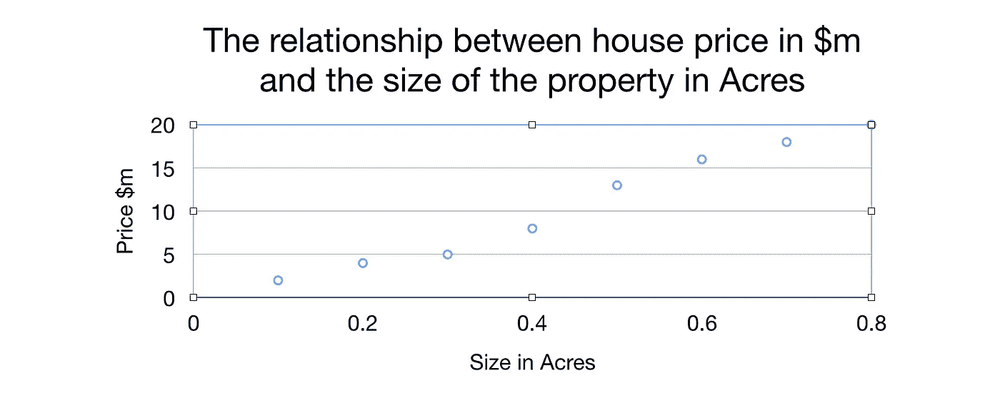
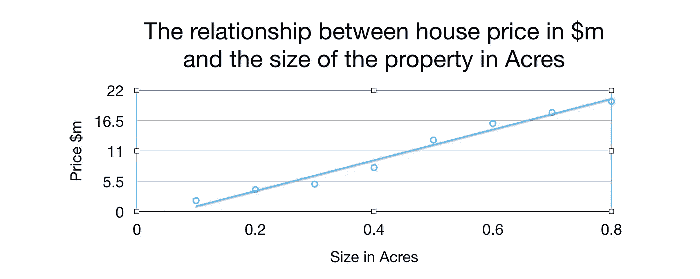
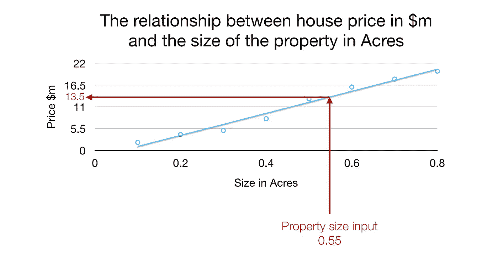
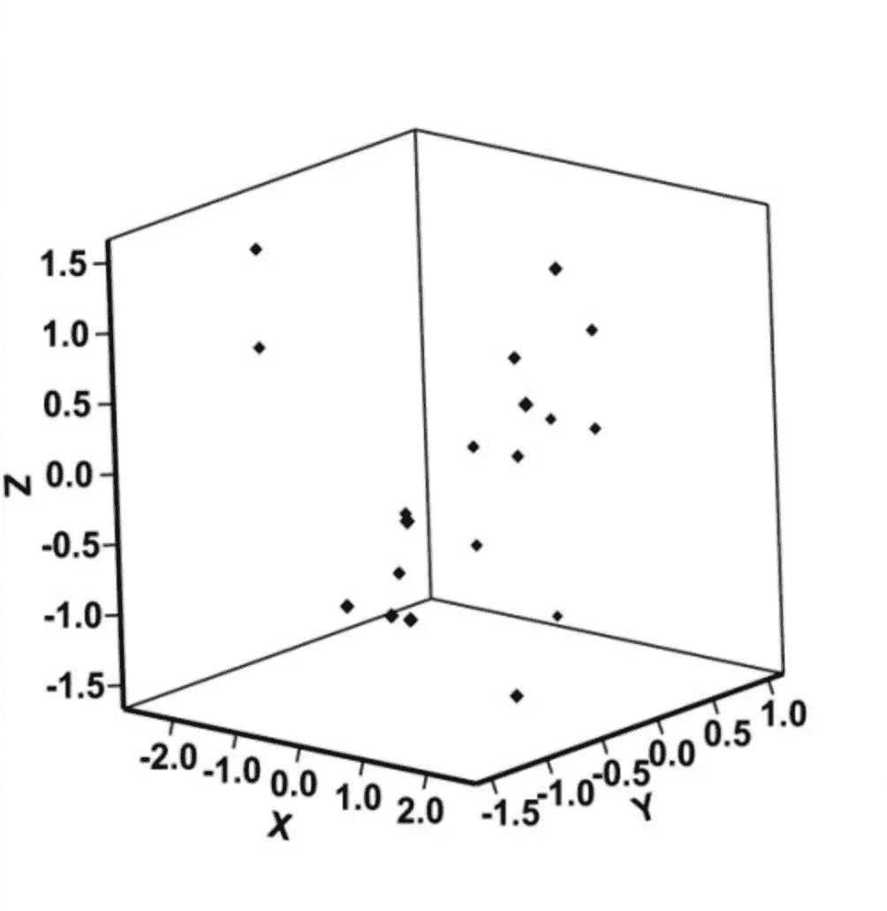
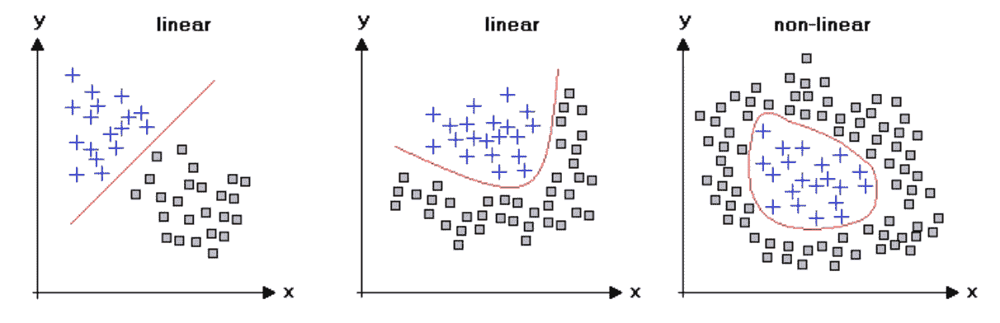
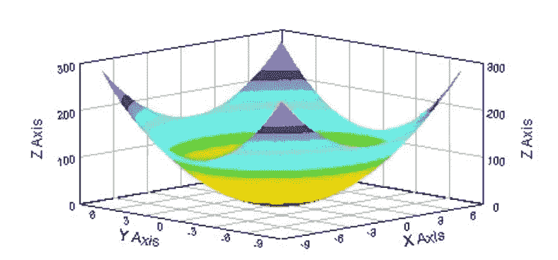

# 人工智能解释第 1 部分

> 原文：<https://towardsdatascience.com/artificial-intelligence-explained-part-1-introduction-45f0b3243553?source=collection_archive---------5----------------------->

我想写一些帖子，为像我一样不是数学或编程天才的人解释人工智能背后的“魔力”。

这是系列文章的第一篇，假设你对人工智能一无所知。

# 什么是人工智能或 A.I？

谷歌对人工智能有一个很好的定义:

> 能够执行通常需要人类智能的任务的计算机系统的理论和发展，例如视觉感知、语音识别、决策和语言之间的翻译。

然而，人们经常有一种误解，认为所有的人工智能都是*人工智能*。

# 人工通用智能

什么是人工通用智能？再说一次，谷歌有一个非常明确的定义:

> *人工通用智能(AGI)是机器的智能，它可以成功地完成人类可以完成的任何智力任务。*

从本质上说，AGI 是你在电影中看到的人工智能，也就是通常对人类怀有敌意的完全有感情的生物🔫 🔪 🔥。

不管是好是坏，AGI 根本不存在😱。从写这篇文章的时候起，就不存在人工智能这种东西，它在与人类相似的意义上是有知觉的。

但近年来有所超越的是*弱 AI* 或*窄 AI* ，顾名思义，弱而窄(到一定程度)。

# 弱 AI /窄 AI

我喜欢将狭义人工智能(相对于弱人工智能，我更喜欢这个术语)定义为能够执行一项单一(或狭义)任务的人工智能，例如识别猫和狗图像之间的差异，或将声音转换为文本。

与 AGI 不同，狭义人工智能是今天的现实。iPhone 上的 Siri 是多个狭义人工智能组合的一个例子，例如语音到文本等，它连接到云中的数据库。然而，Siri 根本不知道她的周围环境，也没有任何感官或感觉。像 Siri 这样狭隘的 AI 往往[容易被骗](https://www.youtube.com/watch?v=ijRPlOF2KQE)。

狭义人工智能的更多示例包括:

*   [谷歌 AlphaGo 击败世界最佳人类围棋手](https://techcrunch.com/2017/05/23/googles-alphago-ai-beats-the-worlds-best-human-go-player/)
*   [深蓝在常规时间控制下击败了一名世界象棋冠军](https://en.wikipedia.org/wiki/Deep_Blue_(chess_computer))
*   [93.9%准确率的谷歌字幕图片](https://www.dpreview.com/news/7658223665/google-algorithm-can-describe-image-contents-with-93-9-accuracy)

许多狭义的人工智能都属于*机器学习*的范畴，我们将在这篇文章的剩余部分探讨这一点。

# 机器学习

机器学习是人工智能的一个子集，可以广义地定义为机器(或计算机)学习分析特定的数据集。解释机器学习做什么的最好方式就是举个例子。

假设一个房屋拍卖数据集包含每次销售的以下信息:

*   房子的售价
*   整个房产的大小

在这种情况下，机器学习可以用于开发一种算法，可以根据房产的大小预测房屋的销售价格。但是直觉上这是如何工作的呢？我们可以通过首先可视化数据集来找出答案。

因为我们的数据集包含每笔房屋销售的两个变量，所以我们可以通过在图上绘制来可视化信息。

在高中，你可能学过线性回归，或者简单地说，*一条最佳拟合线*。仅仅看这个数据，就可以看出它遵循了一个趋势，房价(在一定程度上)与房产面积成正比，或者换句话说，房产面积越大，房子的成本越高。

直观上，机器学习算法所做的是试图在给定的数据集中找到最佳拟合线，然后使用最佳拟合线进行预测。

因此，我们的算法将首先努力找到最佳拟合线:

然后，如果我们给它 0.55 英亩的输入，机器学习算法将从 x 轴上的输入值 0.55 开始绘制一条线，直到它与最佳拟合的线相交，然后它将跟踪一条线，直到它与 y 轴相交，以产生对 0.55 英亩财产大小的**1350 万美元**的预测。：

请注意，一旦算法找到了最佳拟合线，它就可以对任何英亩大小进行预测。

这实质上是机器学习算法如何学习进行预测。直觉上，这似乎很简单，对吗？🎉

除了一些警告…

# 机器学习挑战

虽然前面的例子看起来很简单，但机器学习面临以下挑战:

*   数据集大小
*   维度问题
*   非线性
*   计算能力

让我们逐一剖析它们😎

**数据集大小**

正如我们在前面的例子中看到的，在机器学习算法可以做出预测之前，它需要一条最佳拟合线(或某种关系)。不幸的是，找到最合适的路线可能是一个相当大的挑战。

我们将讨论如何在机器学习中精确地计算最佳拟合线，但一般来说，*要找到可以使用的最佳拟合线需要大量数据。* [谷歌开发的一种算法使用了包含大约 120 万张图像的数据集](https://cacm.acm.org/magazines/2017/6/217745-imagenet-classification-with-deep-convolutional-neural-networks/fulltext)。

当然，并不是每个机器学习算法都需要那么大的数据集，但是，根据情况，如果可用的数据有限，就不可能创建一个像样的模型。

**维度问题**

在我看来，维度问题是机器学习最具挑战性的方面之一。我能想到的最简单的解释是这样的:

每当我们在图表上绘制数据时，想象每个轴是一个维度。回想一下，在我们之前的例子中，我们有一个 x 轴和一个 y 轴，因此，我们之前的例子可以被认为是二维的。

然而，如果我们要在之前的数据集中添加另一个变量，我们就不能再使用二维图表来绘制数据了。

如果您还记得的话，我们的数据集包含每笔房屋销售的以下信息:

*   房子的售价
*   整个房产的大小

现在，如果我们添加另一个变量，在这种情况下，*每栋房子的房间数量*，那么我们的数据集中每栋房子的销售额将有三个变量:

*   房子的售价
*   整个房产的大小
*   房子里房间的数量

因为我们在一个轴上表示每个变量，我们有三个变量，如果我们要在一个图上绘制数据，我们自然会有三个轴(x，y & z)。

我们绘制在图表上的数据集如下所示:

突然，我们的机器学习算法不再处理二维图形，而是处理三维图形。我相信你会同意，仅仅通过看这个图表，数据之间没有清晰、容易看出的关系。

本质上，这是维度问题。通常在机器学习中，我们会处理多个变量，维度的数量不会停留在三个。我们可以很容易地拥有四个、五个、六个甚至二十个变量，这导致了许多难以想象的维度。

所以总的来说，维度越多，就越难在数据中找到关系，也就需要更多的计算能力。机器学习可以变得复杂、快速😳。

**非线性**

在前面的例子中，我展示了数据中的关系是如何成为最佳拟合线的。机器学习的另一个挑战是数据之间的关系并不总是线性的。

这意味着我们数据中的关系将开始像这样:

是啊，到处都是奇怪的线条。

如果我们把非线性关系和多维度结合起来，我们会得到这样的结果:

很疯狂吧？机器学习如此神奇的原因之一是，它可以在海量数据之间发现惊人的关系，而这些关系对我们人类来说不一定显而易见。

**计算能力**

我现在想指出的最后一个挑战是对计算能力的永恒关注。

我将在另一篇文章中讨论机器学习算法如何找到数据中的关系，然而，我想强调的是**机器学习算法很少能找到数据中的完美关系。**

因为我们的数据集可能会变得非常复杂，具有多维度和非线性关系，所以我们的算法在物理上不可能执行蛮力计算来计算每一种可能的关系，以找到数据的最佳拟合。

原因是执行这种计算的时间很容易需要 100 年才能完成，我没有夸大其词。

机器学习算法使用特殊的技术，如*梯度下降*(我们将在另一篇文章中讨论)，由于这些技术，算法通常只能找到数据中关系的粗略版本。

一个算法很少能找到完美的关系，老实说，完美的关系不值得花时间去寻找。

计算机在数据中寻找关系所需的时间取决于机器的计算能力。给你一个想法，计算机通常需要几个小时到几天的时间在给定的数据集中找到一个合适的关系，才能做出准确的预测。

# 结论

机器学习本身是一个巨大的主题，包含许多服务于不同任务的不同模型。计算机视觉机器学习模型看起来与学习下棋的模型不同。

我希望这篇文章能帮助你快速了解人工智能和机器学习背后的基本直觉。

在下一篇文章中，我计划解决不同类型的机器学习模型和人工神经网络。

感谢阅读🙏🏼