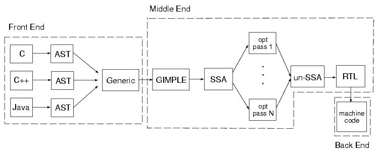

# 阿拉伯语的人工智能

> 原文：<https://towardsdatascience.com/artificial-intelligence-for-arabic-b2dc313f37f5?source=collection_archive---------7----------------------->

谷歌的 [DialogFlow](https://dialogflow.com/docs/reference/language) 没有对构建聊天机器人的阿拉伯语支持，标准的自然语言机器学习框架如 [spaCy](https://spacy.io) 也不包含阿拉伯语支持。[微软的阿拉伯语工具包](https://www.microsoft.com/en-us/research/project/arabic-toolkit-service-atks/)将于本月(2018 年 7 月)停产。此外，直到最近，即使是使用 gloVe 和 word2vec 的研究模型也不容易获得。那不是很有帮助。通常缺乏现成的高质量模型来用人工智能解释阿拉伯语。

谷歌仍然为人工智能功能提供优秀的 API，如[神经机器翻译](https://www.blog.google/products/translate/higher-quality-neural-translations-bunch-more-languages/)，但不是用来做翻译的向量(人工智能的东西)。这些语言模型在执行常见的非翻译文本处理任务时非常重要，例如情感分析、垃圾邮件过滤、剽窃检测等等。此外，这些模型对于将需要自然语言理解的企业任务自动化至关重要，这些任务是工作流的一部分，例如人力资源(HR)中的简历处理、政府报告中的文档聚类以及金融服务中的文档优先级排序。对阿拉伯语人工智能模型的需求相当强烈。

AraVec (2017)是一个非常好的阿拉伯语单词嵌入模型的起点，该模型由埃及吉萨尼罗河大学信息科学中心的 Abu Bakr Soliman 及其同事创建。以下链接指向他们的文章和相关代码。

 [## 巴克里亚诺/阿拉维克

### aravec - AraVec 是一个预先训练的分布式单词表示(单词嵌入)开源项目，旨在…

github.com](https://github.com/bakrianoo/aravec)  [## AraVec:一组用于阿拉伯语自然语言处理的阿拉伯语单词嵌入模型

### 神经网络的进步带动了计算机视觉、语音识别和自然语言处理等领域的发展

www.sciencedirect.com](https://www.sciencedirect.com/science/article/pii/S1877050917321749) 

在过去一年左右的时间里，一些关于这一主题的文章已经在高质量的期刊和会议上发表。以下是一些最相关的例子:

 [## 用于阿拉伯情感分析的单词嵌入- IEEE 会议出版物

### 手动特征提取是一项具有挑战性且耗时的任务，尤其是在形态丰富的语言中(MRL)…

ieeexplore.ieee.org](https://ieeexplore.ieee.org/document/7841054/)  [## 阿拉伯语情感分类的单词嵌入和卷积神经网络

### ACL 资料版权 1963-2018 ACL；其他材料的版权归其各自的版权所有者所有…

ACL 选集. info](https://aclanthology.info/papers/C16-1228/c16-1228) 

中东和北非地区对人工智能解决方案惊人的强劲需求让我们思考为什么市场上存在这种差距。我们的解决方案是填补这一空白。我们成立了一家名为 [Stallion.ai](http://stallion.ai) 的合资公司，为 [MENA 地区](https://en.wikipedia.org/wiki/MENA)的企业客户提供 B2B 人工智能解决方案。

面对这个问题，我们决定从头开始设计一个阿拉伯语单词嵌入模型。我们从公共领域搜集维基百科的页面和书籍。那是 14 GB 的文本。我们一直在用其他大型文本来源扩充这个数据集，以获得额外的语言环境和多样性。与其钻研我们一直在从事的工作的技术细节，不如考虑一下想要一个理解阿拉伯文本的人工智能系统的实际商业原因。

NOOR 编程语言是一个有趣的项目，它强调了对更多阿拉伯语言支持的需求。

有一句古老的法律谚语，“谁起草，谁就赢。”我找不到它的出处，引用它的书也找不到。这句老话的意思是，起草合同让起草者有能力设定合同条款，他们会按照自己的意愿行事。类似地，对一个用阿拉伯语经营的企业来说，将人工智能技术应用于他们的原始文档，而不是这些文档的机器翻译，是至关重要的。在从另一种语言借来的[上下文](https://en.wikipedia.org/wiki/List_of_English_words_of_Arabic_origin_(A-B))上操作，并不像在同一种语言的文本上使用真正的嵌入模型那样有效。

在科幻小说和出版界，人工智能就像一个万能翻译机。甚至在像编译器(例如 GCC)这样的工程系统中，几种高级语言(例如 Java、C、C++)可以在被发射到用于几个处理器目标之一的汇编中之前被编译成一种通用中间语言(GIMPLE)。其结构如下所示:

How GCC understands (compiles) many language frontends into a single common representation and then emits code for a target architecture.

拥有一个像 GIMPLE 这样的语言的通用表示是非常好的，因为我们可以对这种语言的中间(通用)表示应用常见的有用优化。实际上，通用语言让我们能够理解意义，而不是仅仅考虑一种语言的特质。不幸的是，机器学习不像编译器那样表示语言。计算机代码是基于对正式语言理论的严格假设，而我们不会在自然语言如合同和文本信息中假设。自然语言充满了歧义。例如，[同义词](https://www.almaany.com/en/thes/ar-en/)在不同的语言中并不相同。另一方面，代码基本上没有含糊不清的地方。更糟糕的是，阿拉伯语中的模糊性与英语中的不一样。这种思路告诉我们，专用的每种语言模型将优于借用的跨语言模型，这些模型不是在我们关心的语言上训练的。然而，情况更糟，我们很快就会看到。

我们刚刚讨论了为什么我们想专门理解阿拉伯语，而不是跨语言学习**。**现在考虑到阿拉伯文本中的**有一些变化，我们需要单独考虑。**

首先，有方言问题和俚语，包括表情符号，但让我们跳过这一点，进入第二个问题:风格的异质性。众所周知，不同类型的文本日志包含不同的语义信息。例如，来自报纸《生活报》的所有文本的语料库没有给我们足够的信息来理解南希·阿吉莱姆的推文。为什么？因为正式文本和非正式文本不是一回事。机器学习在对与它将评估的文本非常相似的文本进行训练时效果最好。

甚至还有第三个语境问题。像 Aravec 这样的单词嵌入模型是支持阿拉伯语的第一步。下一步必须是将特定于上下文的业务术语和短语编码到这些模型中。这些通常是现成模型没有训练过的字典外术语，或者是意思不同的现有单词。有时这些单词是英语或在阿拉伯语文档中使用的命名实体(例如，“كابل RS232 إلى واجهة RJ45”)。在字典中，单词通常仍然需要调整。例如，单词 collision 对道路工程师来说意味着路上的事故，但对数据库工程师来说却是数据库关键问题。这些上下文需要用来调整人工智能解决方案，并且在调整发生之前，所涉及的单词甚至不在人工智能模型中。在逐个项目的基础上，这些定制的修改是使用我们的 word 嵌入增强技术来实现的。

总结一下我们在 [Stallion.ai](http://Stallion.ai) 上解决的问题:处理阿拉伯语文档的企业需要定制的人工智能解决方案，而市场已经忽视了太长时间。我们已经看到，随着其他项目的关闭，新的项目出现了。我们已经确定了市场中的差距，包括现有模型中的以下缺点:方言支持，理解俚语，理解技术上下文和字典外的单词，以及理解各种类型的文本。我们正在探索研究和应用这项技术的工业和学术机会。

你在中东北非地区寻找人工智能帮助吗？向 [evan@stallion.ai](mailto:evan@stallion.ai) 问好，或通过 [daniel@stallion.ai](mailto:daniel@stallion.ai) 联系我

丹尼尔

[daniel@lemay.ai](mailto:daniel@lemay.ai) ←打个招呼。
[LEMAY . AI](https://lemay.ai)
1(855)LEMAY-AI

您可能喜欢的其他文章:

*   [人工智能和不良数据](/artificial-intelligence-and-bad-data-fbf2564c541a)
*   [人工智能的图像数据集](/image-datasets-for-artificial-intelligence-bbb12615edd7)
*   [人工智能:让你的用户给你的数据贴标签](https://medium.com/towards-data-science/artificial-intelligence-get-your-users-to-label-your-data-b5fa7c0c9e00)