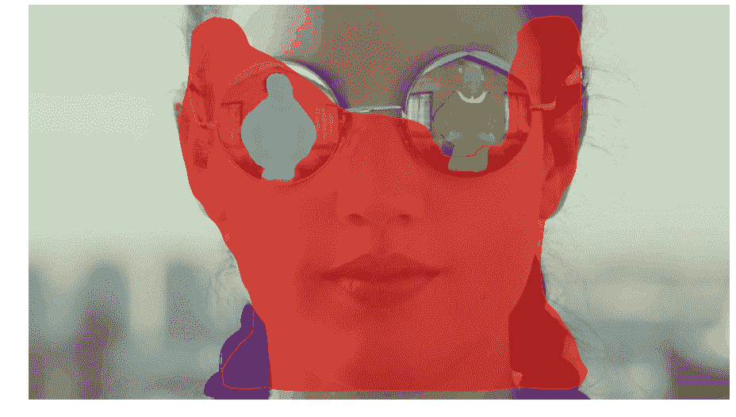
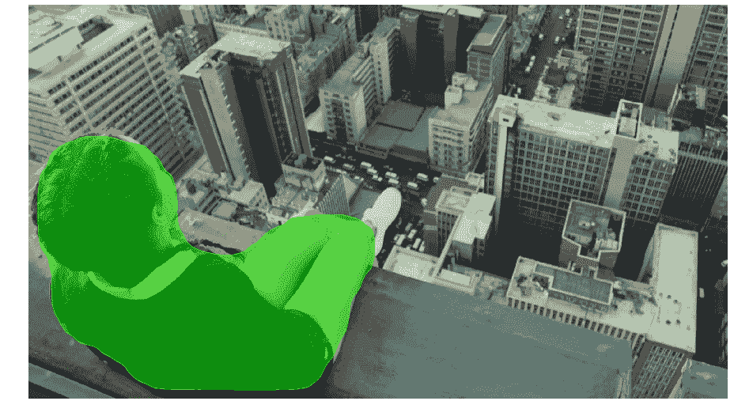
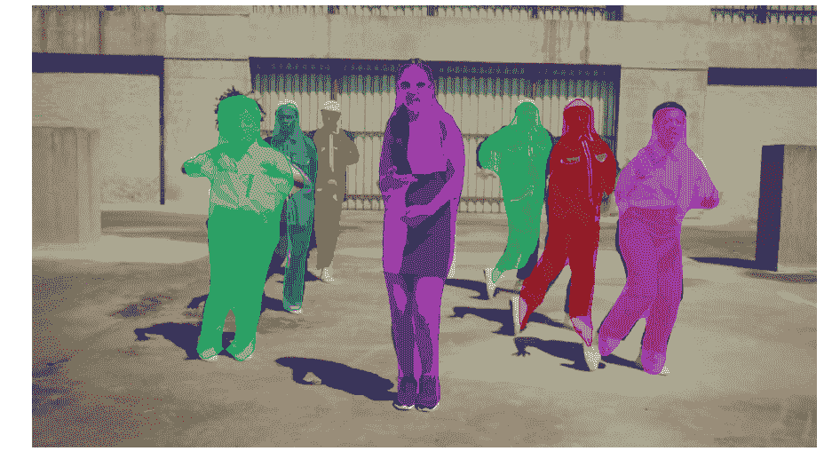

# 音乐视频的人工智能

> 原文：<https://towardsdatascience.com/artificial-intelligence-for-music-videos-c5ad14e643db?source=collection_archive---------2----------------------->

我正在为一个客户做一个视频分析人工智能项目，我想和你分享一个超级有趣的想法，这个想法是我今晚在等待渲染的时候突然想到的。我真的没有时间写这个，但我觉得我必须写。有些想法太棒了，以至于不能熬夜编程。让我们用人工智能系统来勾勒音乐视频中的人物。

已经有一些关于数据科学的[很棒的对象检测文章](/how-to-train-a-tensorflow-face-object-detection-model-3599dcd0c26f)，所以我不想重复那些很酷的东西。让我们用 COCO 和 [Mask_RCNN](https://github.com/matterport/Mask_RCNN) 在对象周围画线，而不是检测对象的位置和标签。在音乐录影带上做这件事真是太酷了。

我们来搞乱 Jain 的 Makeba 视频。我去掉了音轨，只保留了前 2000 个视频帧，只是为了更加清楚地表明，这篇文章是为了教育目的而合理使用艺术家的作品。点击这里[欣赏她在 YouTube 上的音乐视频](https://www.youtube.com/watch?v=59Q_lhgGANc)。

这是我们对视频的人工智能分析结果:

我有点喜欢它如何在广告牌和背景中找到人。真的很微妙。我还喜欢黑人和白人女孩的脸融合得如此平滑，以至于人工智能假装它实际上是一个人。下面是我认为值得注意的一些很酷的视频片段。尽情享受吧！

It sees the finger!

It recognizes people from behind.

Lots of people? rCNN says **no problemo**!

# ***紧急方按钮***

这个帖子我还得再加一个好玩的项目。

数据科学是一项艰苦的工作。当我们都坐在办公室里，我们的模型总是过拟合，或者不编译，我们需要一些方法回到成功的心态。我们的办公室文化相当古怪，所以当数据科学让我们失望时，或者当我们获得意外的胜利时，我们会关闭紧急派对按钮。[类似的产品](https://odditymall.com/big-red-emergency-button)已经上市，但是我们想从头开始制造自己的产品。不是作为一个产品。只是为了好玩。

我们 3D 打印了零件，马特将继电器、树莓派和其他零件组装在一起，并连接起来。

下面是我们的 ***紧急聚会按钮*** 演示:

我们(主要是 T4 的马修·勒梅)已经在业余时间为这个项目工作了两年。就是不会死的副业。马特添加了歌曲随机发生器、继电器、扬声器，以及你能想象到的所有酷酷的铃声和哨声。按下那个按钮，启动灯光和音乐，感觉真的很棒。

所以，总之，人工智能可以用来分析视频，提取大量信息。当一切都太多的时候，**按下紧急聚会按钮！**

如果你喜欢这篇关于人工智能应用于音乐视频的文章，请点击“关注”按钮，看看我过去读过最多的文章，比如“[如何为人工智能项目定价](https://medium.com/towards-data-science/how-to-price-an-ai-project-f7270cb630a4)”和“[如何聘请人工智能顾问](https://medium.com/towards-data-science/why-hire-an-ai-consultant-50e155e17b39)”

编码快乐！

-丹尼尔
[丹尼尔@lemay.ai](mailto:daniel@lemay.ai) ←打个招呼。
[LEMAY . AI](https://lemay.ai)
1(855)LEMAY-AI

您可能喜欢的其他文章:

*   [人工智能和不良数据](/artificial-intelligence-and-bad-data-fbf2564c541a)
*   [人工智能:超参数](/artificial-intelligence-hyperparameters-48fa29daa516)
*   [人工智能:让你的用户给你的数据贴上标签](https://medium.com/towards-data-science/artificial-intelligence-get-your-users-to-label-your-data-b5fa7c0c9e00)