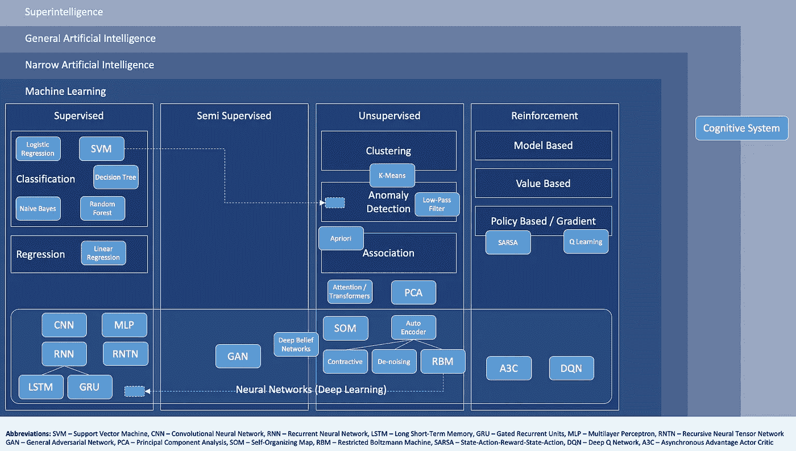
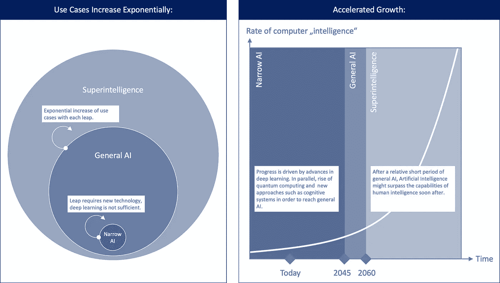
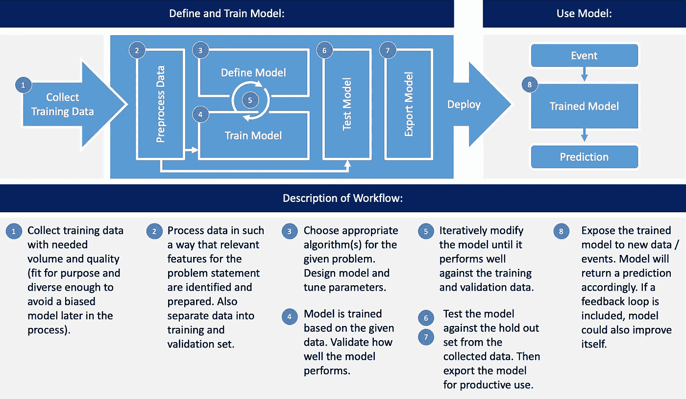
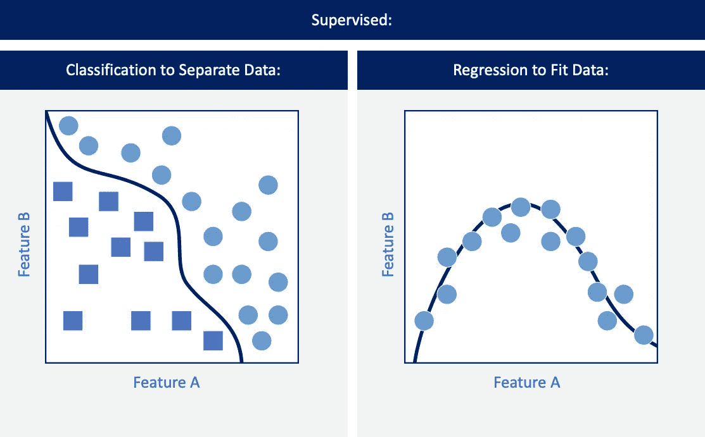
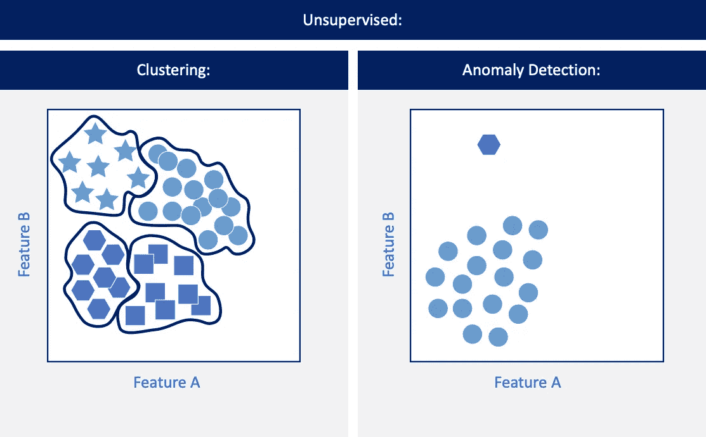
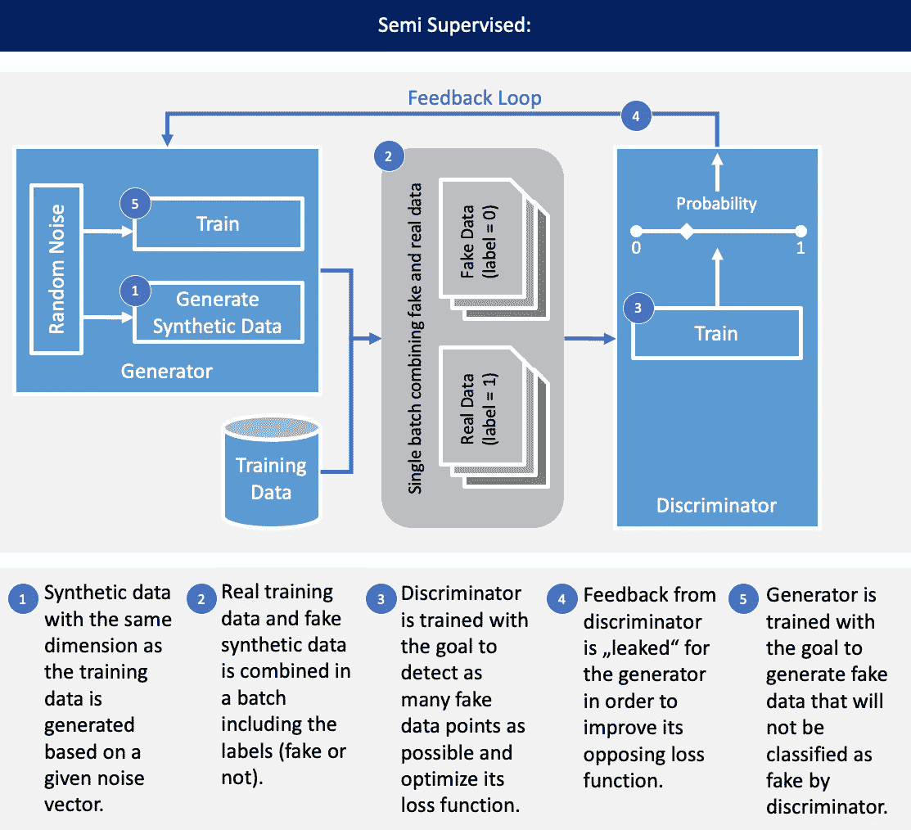
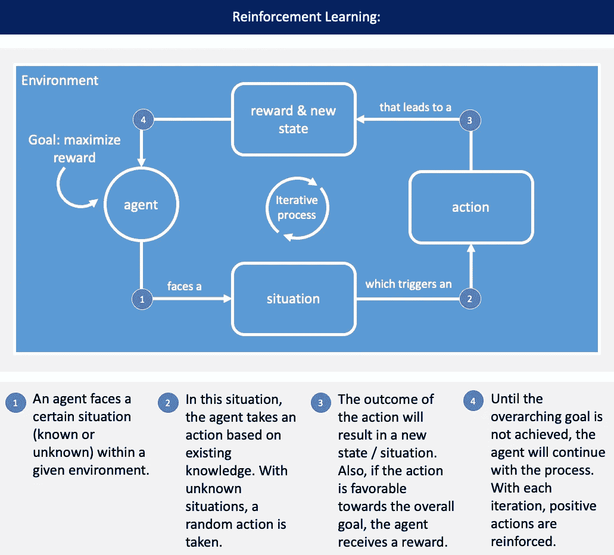

# 人工智能框架:机器学习和人工智能的可视化介绍

> 原文：<https://towardsdatascience.com/artificial-intelligence-framework-a-visual-introduction-to-machine-learning-and-ai-d7e36b304f87?source=collection_archive---------11----------------------->

## 对于你的下一次人工智能或机器学习电梯推介，你需要知道的一切

Photo: a-image/Shutterstock

人工智能在商业和我们社会中的变革性质是显而易见的。像互联网和智能手机一样，人工智能是一种使能技术，将对我们生活的各个领域产生深远的影响。

为了更好地理解底层概念，我想与您分享一张图片，这是我在解释机器学习/深度学习的更广泛背景以及它与人工智能的关系时通常使用的图片。

你会在 medium 或其他地方找到很多很棒的文章，它们对 AI 做了很好的介绍(我在本文末尾链接了一些)。然而，到目前为止我还没有看到一个易于视觉消化的人工智能概述。如果你知道一些我可以用的东西，请在下面的评论区告诉我。但是在那之前，让我分享我现在使用的观想。在本文中，我还将简要介绍该图的关键组件。

“AI and machine learning high level overview” by Nils Ackermann is licensed under Creative Commons [CC BY-ND 4.0](https://creativecommons.org/licenses/by-nd/4.0/)

# **首先什么是人工智能？**

简而言之，人工智能是计算机科学的一个分支，它研究如何创造具有类似人类智能能力的机器。人工智能有不同的成熟水平，我将在接下来的章节中简要介绍:超级智能、通用人工智能和狭义人工智能。

人工智能对于数字化认知能力非常有用，在这种情况下，要遵循的确切规则很难解释。一个很好的人工智能用例是人脸识别。试图使用手工知识来编码人脸识别的所有相关规则，这种方法有时被称为第一波人工智能([来源](https://www.darpa.mil/about-us/darpa-perspective-on-ai))。但是随着机器学习和深度学习等成熟技术的出现，这并不是我们稍后将看到的首选方法。

**人工智能的关键驱动力是什么？**

在我们深入了解细节之前，让我们快速了解一下推动人工智能最新进展的关键因素:

*   **计算能力:**计算能力的性价比按照摩尔定律呈指数增长。指数意味着计算速度翻倍和/或价格同比下降一半。近年来，机器学习作为 AI 进步的关键驱动力之一，极大地受益于 GPU(图形处理单元)。GPU 非常适合进行所有机器学习计算所需的矢量数值运算。谷歌的 TPU(张量处理单元)是(共)处理器针对机器学习问题进行优化的另一个例子。随着量子计算的巨大进步，这一趋势很可能会继续并加速。
*   **数据可用性:**随着移动技术和社交媒体使用的增加，数据的生成和可用性都在加速。仅在过去的两年中，令人印象深刻的是，世界上 90%的数据都是由计算机生成的([来源](https://www.forbes.com/sites/bernardmarr/2018/05/21/how-much-data-do-we-create-every-day-the-mind-blowing-stats-everyone-should-read/#5a3000b460ba))。大量的数据是训练神经网络的关键成功因素(更多信息将在下文详述),从而实现对未知事件的高准确度预测。
*   **算法:**AI 研究社区非常活跃，新的进展频繁发表。最大的关注点是机器学习，或者更具体地说是深度神经网络。此外，谷歌(Google)、脸书(PyTorch)或微软(Microsoft)等公司也开发了各种工具和框架供公众使用。

# **超级智能**

一些研究人员预测并相信，在未来的某一时刻，机器会比人类更聪明。这可能发生在 2050 年到 2100 年之间。很少有研究认为这种状态永远不会达到。但是对于大多数熟悉这一课题的研究人员来说，超级智能是否能达到并不重要，重要的是什么时候能达到。

超智能是机器的认知能力超过人类的状态。正如尼克·博斯特罗姆所说，这是一种“在几乎所有感兴趣的领域，智力大大超过人类认知能力”的生物。

超级智能的出现是基于这样一个假设，即进化学习环境中的进步速率是呈指数级进化的(雷·库兹韦尔的加速回报定律)。这很难理解，因为大多数人的思维都是线性的，并且试图根据我们已经知道的和过去经历过的来预测未来。这当然会导致一个错误的轨迹。蒂姆·厄本(Tim Urban)有一篇很棒也很有趣的文章解释了这段旅程(文末有链接)。它比我更好地解释了超智能及其所有的含义。如果你有心情，我强烈推荐你看他的帖子。

“AI broader context and roadmap” by Nils Ackermann is licensed under Creative Commons [CC BY-ND 4.0](https://creativecommons.org/licenses/by-nd/4.0/)

在最好的情况下，超智能将导致一个富足和公平的未来(奇点)。在最糟糕的情况下，它将导致人类的灭绝，不是因为超级智能是邪恶的，而是因为人类正在实现其目标(这些目标我们可能再也无法理解，因为它们超出了我们的认知能力)。

# **通用人工智能**

在达到超智能之前，通用 AI 意味着机器将拥有和人类一样的认知能力。再次，研究人员争论我们将达到一般人工智能的时间点。可能在 2045 年左右。由于加速回报定律，普通人工智能阶段将很快过渡到超智能时代。

智力与生物体有效适应环境变化的能力密切相关。适应也意味着不仅要改变自己，还要改变环境。以下是一般人工(和人类)智能的关键特征(来源:[这里](https://medium.com/intuitionmachine/from-narrow-to-general-ai-e21b568155b9)和[这里](https://www.britannica.com/science/human-intelligence-psychology)):

*   **学习:**根据过去的经验改变自己行为的能力，例如当遇到新的和未知的情况时。
*   **记忆:**对过去经历的编码、存储和检索。
*   **推理和抽象:**根据样本数据得出逻辑结论，具有归纳/推导规则的能力。
*   **解决问题:**系统地提出可能的解决方案并得出问题最佳答案的能力。
*   **发散思维:**对一个给定的问题产生多种解决方案的能力。
*   **聚合思维:**缩小多个选项的列表，以便得出可能的最佳答案。
*   **情商:**识别并解读人类的情绪。
*   **速度:**上述所有特征必须在合理的时间框架内/接近实时地发生。此外，它们不能依赖大量数据，例如重新训练神经网络。在某些情况下，学习可以只基于一个单一的例子。

通用人工智能将无法通过当前的方法和工具(如神经网络)实现。为了达到真正的智能，[认知系统](http://www.cogsys.org/pdf/paper-1-2.pdf)可能是一个解决方案。

# 狭义人工智能

由于研究在实现一般人工智能方面没有取得很大进展，焦点自然首先转向了狭义人工智能。狭义人工智能专注于非常具体的用例。这意味着人工智能(目前主要使用深度神经网络)是为非常特定的目的而训练的。因此，人工智能只能处理它被训练过的事件。

如果一个聊天机器人被训练成用英语回答公司 A 的客户服务请求，它将不能对它将 A)接收到的不同公司的任何请求或 b)以不同语言陈述的任何请求或 c)被问及不相关的话题，如“我今天需要带伞去工作吗？”。

与一般人工智能相比，狭义人工智能的学习能力非常有限。它可以在特定用例的边界内学习，例如，用于语音识别的狭义人工智能可能能够提高理解同一种语言的新方言的速度。为了学习另一种语言，它需要人类的输入，例如，通过为要学习的新语言提供大量标记数据集。狭义人工智能无法通过提出替代解决方案来动态适应新情况，而替代解决方案是通用人工智能的一个关键特征(见上一章)。

一些典型的狭义人工智能用例:

*   自然语言识别和处理
*   自动驾驶
*   视觉图像识别和解释
*   网络安全中的入侵检测
*   人类活动识别

# **机器学习**

机器学习是一门人工智能学科，也是近年来狭义人工智能进步背后的关键驱动力。它是工具和方法的集合，允许计算机从观察、数据和例子中学习，以提高它们的性能。它不需要明确的一步一步地解释如何执行一项任务，而传统编程则需要这样做。

“Machine learning workflow (supervised)” by Nils Ackermann is licensed under Creative Commons [CC BY-ND 4.0](https://creativecommons.org/licenses/by-nd/4.0/)

本质上，机器学习是基于统计模型来进行预测的。在学习过程中，统计模型的参数根据所提供的训练数据进行优化调整。可以说，系统通过经验学习。基于给定的训练数据，系统然后能够对看不见的事件/数据进行预测。为了使模型能够很好地概括那些看不见的事件，定义一个很好地适合问题陈述的模型，并且具有必要数量和质量的可用训练数据是很重要的。

## **监督机器学习**

有监督的机器学习简单来说就是我们提供一个带有全标签训练数据的算法。带标签的培训数据意味着每个培训记录都有相关的答案。因此，我们已经为算法如何解释数据提供了明确的指导。然后，该算法将构建一个模型，并根据给定的标签进行测试。对于每次迭代，如果模型得出的预测与标签一致，误差函数将验证。然后，该模型将随着每次迭代而略微调整，直到该模型在训练数据上表现良好。

“Supervised machine learning” by Nils Ackermann is licensed under Creative Commons [CC BY-ND 4.0](https://creativecommons.org/licenses/by-nd/4.0/)

有两种不同类型的监督学习。要记住的关键是:分类分离数据，回归拟合数据。

*   **分类:**预测给定观察/输入的分类响应值的算法。它将预测一个离散值。先决条件是我们能够将响应值分成不同的类。一个典型的例子是手写字母和数字的分类，例如由邮局用来解释写在信上的地址。
*   **回归:**预测给定观察/输入的数值连续响应值的算法。它将预测一个连续值。一个典型的例子是根据位置、大小、年龄等预测房价。

## **无监督机器学习**

在获得足够的标记训练数据很困难或太昂贵的情况下，无监督方法变得相关。对于无监督学习，我们不为算法提供带标签的训练数据。相反，我们希望算法自己找到一种方法来分类/分离数据。存在以下主要类别:

*   **聚类:**试图创建相似数据点的聚类的算法。例如，人们可以想象，当算法只接收数百万辆汽车的前视图时，机器肯定能够自己对车辆进行分类。与福特或奥迪相比，宝马看起来不同，因此该算法应该能够轻松地将图片分类(在这种情况下是汽车品牌)。
*   **异常检测:**试图在给定数据集内发现异常值/异常的算法。一个典型的例子是识别银行交易中的欺诈行为。如果一个人在欧洲和美国之间旅行时有很多交易，而且金额相对较小，那么在这两次旅行之间从尼日利亚进行的 10，000 美元的交易可能是可疑的。
*   **关联:**关联规则是一种识别数据集内关系和依赖关系的算法。一个典型的例子是网上商店的推荐引擎，其中相关的产品可以基于相似的特征被分组在一起，然后被推荐给消费者。

“Unsupervised machine learning” by Nils Ackermann is licensed under Creative Commons [CC BY-ND 4.0](https://creativecommons.org/licenses/by-nd/4.0/)

## **半监督机器学习**

在标记大量训练数据过于昂贵的情况下，监督和监督机器学习之间的混合就发挥了作用。该过程从一个人标记少量数据开始(例如:由放射科专家解释和标记的 CT 扫描)。

目前，半监督学习最流行的例子是一种特殊的神经网络，称为 GAN(通用对抗网络)。它使用标记的训练数据来生成新数据(通过生成器网络)，然后将这些数据发送到另一个神经网络(鉴别器)，该神经网络需要识别该数据是假的还是训练数据的一部分。发生器和鉴别器网络在正反馈回路中共同改进。生成器在创建令人信服的假数据方面会变得更好，鉴别器在从训练数据中分离假数据方面会变得更好。

“General adversarial network (GAN) overview” by Nils Ackermann is licensed under Creative Commons [CC BY-ND 4.0](https://creativecommons.org/licenses/by-nd/4.0/)

GAN 的一个很好的用例是创建模拟真实图像的人工图像。一幅甘创作的肖像画最近在佳士得拍出了高得离谱的价格。

## **强化学习**

强化学习是基于这样一个假设，即一个最佳的行为或行动可以通过对一个有利的行动给予积极的奖励来实现。强化学习的基本设置包括一个将与其环境交互的代理。基于代理在给定情况下从其交互中接收到的正面/负面反馈，某种行为会得到奖励，有利的行为会因此得到加强。

“Reinforcement learning overview” by Nils Ackermann is licensed under Creative Commons [CC BY-ND 4.0](https://creativecommons.org/licenses/by-nd/4.0/)

在许多迭代中，代理将被训练，并且其实现总体目标的动作的性能将被提高。对于每一个行动，代理人必须决定他是否想要探索他的环境(探索)，以便寻找与已经被证明是成功的行动(开发)相比潜在的更高的回报(失败的风险也更高)。

## **神经网络和深度学习**

神经网络是一种受生物学和大脑如何运作启发的机器学习方法。它们最适合用于识别非结构化数据中非常复杂的模式，例如:

*   音频和语音(例如语音识别)
*   文本(如情感分析)
*   图像和视频(例如人脸或物体识别)
*   运动/活动(例如传感器数据分析)

深度神经网络只是具有一个以上隐藏层的神经网络。网上有很多很棒的文章和视频解释了神经网络如何在所有不同的细节层中工作，因此我在这里就不解释了。我在本文末尾链接了一些资源。

有许多不同类型的神经网络可用。一些用于监督学习，另一些用于非监督学习。我最初的概观图片将一些比较流行的神经网络划分为一个类别。我最近写了一篇关于(一维)卷积神经网络的[深度文章](https://blog.goodaudience.com/introduction-to-1d-convolutional-neural-networks-in-keras-for-time-sequences-3a7ff801a2cf)，以防你感兴趣。

# **在关闭**

感谢您的阅读，我希望你喜欢这篇文章！虽然你可能已经熟悉了我所涉及的所有主题，但我希望这是一个轻松的阅读，将关键主题放在彼此的角度上——至少这是我的初衷。在你的作品中随意使用总览图，只要你相应地引用它。

# **参考文献**

如果你想进行进一步的阅读，我会推荐你浏览下面的免费文章(或多或少按照我阅读的顺序)。

*   等待，但为什么蒂姆·厄本:[人工智能革命](https://waitbutwhy.com/2015/01/artificial-intelligence-revolution-1.html)
*   奇点大学:[指数入门](https://su.org/concepts/)
*   [从狭义到广义的人工智能](https://medium.com/intuitionmachine/from-narrow-to-general-ai-e21b568155b9)
*   [人工智能领域的弗劳恩霍夫趋势](https://www.fraunhofer.de/content/dam/zv/en/Publications/Trends-in-artificial-intelligence.pdf)
*   [DARPA 对人工智能的看法](https://www.darpa.mil/about-us/darpa-perspective-on-ai)
*   [YouTube 上的 3Blue1Brown 神经网络介绍](https://youtu.be/aircAruvnKk)
*   [YouTube 上的深度学习简化版](https://youtu.be/b99UVkWzYTQ)系列
*   [认知系统范式](http://www.cogsys.org/pdf/paper-1-2.pdf)
*   [甘的精彩介绍](https://skymind.ai/wiki/generative-adversarial-network-gan)
*   [强化学习的好入门](https://medium.freecodecamp.org/a-brief-introduction-to-reinforcement-learning-7799af5840db)
*   [PyTorch](https://pytorch.org/) 深度学习平台
*   [Tensorflow](https://www.tensorflow.org) 深度学习平台
*   [Azure](https://azure.microsoft.com) 深度学习平台
*   [谷歌云 TPU](https://cloud.google.com/tpu/)

# 放弃

*本网站上的帖子是我自己的，不一定代表我的雇主的帖子、策略或观点。*