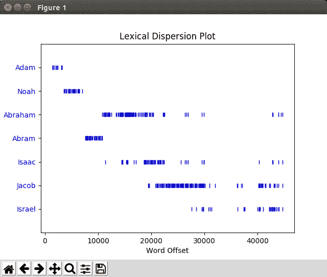
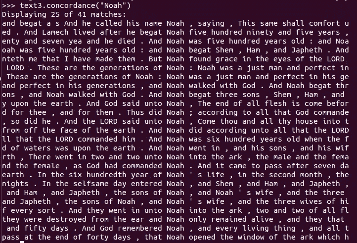

# 人工智能起源:字面意思。

> 原文：<https://towardsdatascience.com/artificial-intelligence-genesis-literally-947c1935752d?source=collection_archive---------3----------------------->

没错。真实的圣经人工智能。让我们看看我们可以用一些自然语言处理(NLP)看到什么，以及《创世纪》的英文版(包含在 nltk 语料库中)。想看英文和希伯来文的在线版本，可以看看这个网站。这篇文章是关于让计算机理解《创世纪》中的名字，而[不是关于圣经代码或隐藏的信息](http://www.chabad.org/library/article_cdo/aid/1633955/jewish/What-Is-the-Jewish-Perspective-on-the-Bible-Codes.htm)。

我是一个宗教人士，在大量的圣经研究和分析中长大。《圣经》的原始文本附有学者的评论，如[拉希](https://en.wikipedia.org/wiki/Rashi)、[昂克勒斯](https://en.wikipedia.org/wiki/Onkelos)、米什那和杰马拉。让我们把文本分析限制在没有注释的《创世纪》的英文版上，因为我们试图理解计算机从父系姓名中收集的一些含义。

# 创世纪:字面意思。

*“本质上，* [*所有模型都是错的*](https://en.wikipedia.org/wiki/All_models_are_wrong) *，但有些是有用的”——乔治 E. P. Box*

带着这句谦卑的话，让我们看看亚当、挪亚、亚伯拉罕、以撒和雅各。它们在文中是如何联系的？我们如何使用 NLP 提取关于他们角色的数据？

请记住，这些人在圣经中有不止一个名字。亚当、诺亚、亚伯拉罕(改名前的亚伯兰)、以撒和雅各(改名后的以色列)。让我们记住雅各和亚伯拉罕这两个名字。我们也不要忽视以色列有时是雅各，有时是以色列的土地，有时是以色列的民族。

首先，我们看一下上下文、被提及的次数以及它们被提及的地方。接下来我们可以看看课文中这些名字的意思。我们在下图中看到，亚当和挪亚在《创世纪》中被一个接一个地提到，然后他们就不再被提到了。大约在第 12，000 字左右，亚伯兰改名为亚伯拉罕，然后我们不再听到亚伯拉罕，只听到亚伯拉罕。圣经经常提到“亚伯拉罕，以撒，雅各”作为我们的祖先，所以我们看到这三个名字一起出现在文本中的相同位置。当雅各改名为以色列，我们看到两个名字在一起，不像亚伯兰/亚伯拉罕，我们只看到一个，然后另一个。



每一个名字被提及的次数都有些令人惊讶:(亚当 18，诺亚 41，亚伯拉罕 129，亚伯兰 58，以撒 77，雅各 179，以色列 40)。诺亚被提到的次数比亚当还多！查看下图中的原始读数。



而雅各的 179+40=219 次被提及，比亚伯拉罕的 129+58=187 次还多。也许以色列这个词的许多用法(人、地方、部落)给了雅各一些我们不应该计算在内的额外提及。

现在，回到任务上。在这篇课文中，这些名字与什么词相似？

> **亚当相似:** 约瑟雅各以撒亚伯兰闪他们他我亚伯拉罕挪亚他拉结你神利亚她该隐撒拉我我们
> 
> **诺亚类似:
> 雅各他约瑟法老亚伯拉罕他以撒他们以扫我你神闪亚伯兰都 th 所多玛亚法撒拉结天堂**
> 
> **亚伯拉罕相似:** 雅各约瑟他们他以撒法老他神以扫亚伯兰拉班她挪亚他们我都你以色列罗得我
> 
> **亚伯兰类似:**
> 约瑟雅各他亚伯拉罕以撒他他们法老他们神以扫拉班你利亚我拉结她罗得我们犹大
> 
> **以撒相似:**雅各约瑟他亚伯拉罕他们她亚伯兰神拉班以扫法老利亚拉结利百加撒拉犹大挪亚我以色列
> 
> **雅各相似:**雅各相似:
> 他约瑟亚伯拉罕他们以撒神法老亚伯拉罕以扫他拉结以色列我挪亚他们你拉班利亚犹大
> 
> **以色列相似:**雅各亚伯拉罕约瑟他们他以撒神以扫撒拉亚伯兰法老一切拉麦他拉结天堂饥荒利百加埃及撒莱

上述结果中的第一个好迹象是，这些名字与其他名字相似，而不是与随机单词相似。另一个好迹象是，以色列和雅各非常相似，亚伯拉罕和亚伯兰也很相似。这让我们知道这些名字之间有某种关系。另一个好迹象是，所有这些名字都与上帝有关，如“上帝与亚伯拉罕说话”，表明这些人与创世纪文本中的上帝有关。

现在让我们对这些名字有更多的了解。到目前为止，它们只是简单的文本标签。这些名字对我们的 AI 意味着什么？嗯，使用 Synset 库，我们可以利用语义相似性在 Isaac 和 Noah 之间设计出以下有意义的关系:

```
noah = wn.synset('noah.n.01')
isaac = wn.synset('isaac.n.01')
print(noah.lowest_common_hypernyms(isaac))
```

我们得到答案**【Synset(' patriarch . n . 03 ')】**，这告诉我们这些词之间的共同关系是它们都指族长。这是一个很酷的数据量，仅仅是摄取圣经文本。

# 结论

这是一个使用 NLP 的超级小功率的演示。该系统能够识别父系姓名之间的关系，并将这些姓名之间的共同想法关联起来。来自机器学习其他领域的附加技术可以使这种方法更加强大。虽然我更喜欢“更新”的单词嵌入神经方法，而不是这里展示的方法，但我继续在这些经过多年文本处理研究构建的手工文本分析工具中找到价值。

编码快乐！

——丹尼尔
[丹尼尔@lemay.ai](mailto:daniel@lemay.ai) ←打个招呼。
[LEMAY . AI](https://lemay.ai)
1(855)LEMAY-AI

您可能喜欢的其他文章:

*   [人工智能和不良数据](/artificial-intelligence-and-bad-data-fbf2564c541a)
*   [人工智能:超参数](/artificial-intelligence-hyperparameters-48fa29daa516)
*   [人工智能:让你的用户给你的数据贴上标签](https://medium.com/towards-data-science/artificial-intelligence-get-your-users-to-label-your-data-b5fa7c0c9e00)