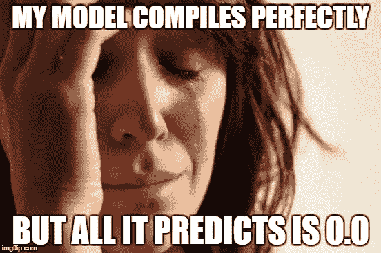

# 人工智能:超参数

> 原文：<https://towardsdatascience.com/artificial-intelligence-hyperparameters-48fa29daa516?source=collection_archive---------4----------------------->

深度学习神经网络**模型**有很多**参数**(如权重和偏差)，也有不少[超参数](https://en.wikipedia.org/wiki/Hyperparameter)。我们从高中就知道什么是**参数**。它们是你插入到函数中的数字。但是什么是[超参数](https://www.youtube.com/watch?v=ttE0F7fghfk)？嗯，它们基本上是用来创建包含参数的模型的选项。

学习哪个超参数设置适合哪个模型行为需要一些时间。谢天谢地，keras 的默认值是一个很好的起点。

首先，让我们从[以前的文章](https://medium.com/towards-data-science/artificial-intelligence-get-your-users-to-label-your-data-b5fa7c0c9e00)中记住，我们的深度学习模型正在试图逼近一个函数 ***f*** ，该函数将输入特征 ***X*** 映射到输出决策 ***Y*** 。或者，换一种说法，我们在试图寻找一个误差很小，但不需要记忆训练数据的函数***Y = f(X)***([过拟合](https://en.wikipedia.org/wiki/Overfitting))。

**我们的模型中的参数**像[权重和偏差](https://ujjwalkarn.me/2016/08/09/quick-intro-neural-networks/)在参数优化过程中被调整(即反向传播)以得到我们的映射函数 ***f*** 的越来越好的版本。基于[超级令人兴奋的最新工作](https://www.youtube.com/watch?v=bLqJHjXihK8&feature=youtu.be)，事实证明，当神经网络学习逼近 ***f*** 时，它们实际上在做一种信息压缩。这将我们的老朋友[信息论](https://en.wikipedia.org/wiki/Information_theory)与我们的新朋友深度神经网络联系起来。

[**超参数**](http://colinraffel.com/wiki/neural_network_hyperparameters) 是元设置，我们可以选择(希望以某种聪明的方式)来调整模型如何形成 ***f*** 。换句话说，我们设置超参数是为了挑选我们想要的模型类型。例如， [t-SNE 有超参数设置](https://distill.pub/2016/misread-tsne/)称为困惑，ε(学习率)，[和其他几个](http://scikit-learn.org/stable/modules/generated/sklearn.manifold.TSNE.html#sklearn.manifold.TSNE)，像迭代次数。

想想配置和构建深度学习模型，比如**点寿司**:寿司是成卷的。有的卷 8 块，有的卷 6、4 块。控制味道的超参数，以及当你从菜单上要一个面包卷时，你会得到多少个面包卷，就是面包卷类型。你可以选择辣味卷、蔬菜卷、油炸卷等等。在任何情况下，你都可以吃到寿司。改变的是寿司师傅用来制作寿司的配置。每卷味道都不一样。回到机器学习领域，当我们选择超参数时，我们需要做出一些非常大的决定(例如回归器或分类器，CNN 或 LSTM 或 DNN 或甘)，以及许多小决定(例如批量大小，测试/训练分割，正则化，辍学，噪声等)。在某些情况下，预训练的神经网络(如 VGG-19)或预定义的神经网络形状(如自动编码器)会比从头开始更接近解决方案。对于完全定制的神经网络配置，我们在 [keras](https://keras.io/regularizers/) 中获得了许多超酷的超参数选项，如 L1 和 L2 的正则化、DNN 层宽度、网络形状(自动编码器、固定宽度、…)、学习速率等等。

As you go through the design space exploration, you find that many of the possible hyperparameter settings are **very useless**.

程序员喜欢使用配置参数，例如生产/开发设置。我们对这个使用 [ConfigParser。然而，深度学习中的超参数更类似于一系列嵌套 for 循环的](https://wiki.python.org/moin/ConfigParserExamples)，在爆发之前搜索“好”的配置。该搜索必须扫描可用的机器学习模型以找到一个具有低误差的模型(或者无论目标函数是什么)。您可以将这些模型超参数视为配置。然而，将超参数选择搜索视为[帕累托优化](https://en.wikipedia.org/wiki/Multi-objective_optimization)更准确，其中约束是 GPU 的大小，目标是损失/准确性、通用性(精度、召回、F 分数)和其他模型性能标准。有很多模型约束是没有问题的。真正糟糕的是，你有多个目标，有些约束是整数。当面对一个优化问题中的多个目标时，你需要或者创建这些目标的线性组合(线性模型)，可能做一些疯狂的数学(参见[混合整数线性规划](http://www.litislab.fr/wp-content/uploads/2015/12/Canu-S.pdf))，或者只是将此作为[元级机器学习](https://en.wikipedia.org/wiki/Meta_learning_(computer_science))问题(研究！).因为多目标 Pareto 东西是如此丑陋和缓慢(读作 ***expen$ive*** )，所以基本上规则是尝试有意义的东西，直到你达到可接受的模型性能水平。我的硕士学位是设计空间探索，所以我直接知道在多重约束下选择一个给定的配置有多困难。

在我结束之前，我今天得到一些非常有趣的消息。 **API。AI** ，已经改名为 **Dialogflow** 。他们重定向了域名和一切。我认为在某个时候，谷歌会把它建成 dialogflow.google.com，就像他们对 AdWords 和 inbox 等其他谷歌产品所做的那样。或者，它可能会被谷歌云平台吞噬，就像亚马逊对其 AWS 云服务所做的那样。

好的。回去工作！如果你喜欢这篇关于人工智能的文章，那么请尝试一下**拍手工具**。轻点那个。跟着我们走。去吧。我也很高兴在评论中听到你的反馈。你怎么想呢?我是不是用了太多的[括号](http://thecopyfox.com/2012/11/writing-tip-do-you-overuse-parentheses/)？我应该写些什么？写了一堆业务端的文章，最近兴趣更多在技术端。不如这样:把你的数据科学用例或问题发给我，我会挑选一个条目来写一篇关于它的文章。去吧:[丹尼尔@lsci.io](mailto:daniel@lsci.io)

编码快乐！

-丹尼尔
[丹尼尔@lemay.ai](mailto:daniel@lemay.ai) ←打个招呼。
[LEMAY . AI](https://lemay.ai)
1(855)LEMAY-AI

您可能喜欢的其他文章:

*   [人工智能和不良数据](/artificial-intelligence-and-bad-data-fbf2564c541a)
*   [人工智能:超参数](/artificial-intelligence-hyperparameters-48fa29daa516)
*   [人工智能:让你的用户给你的数据贴上标签](https://medium.com/towards-data-science/artificial-intelligence-get-your-users-to-label-your-data-b5fa7c0c9e00)