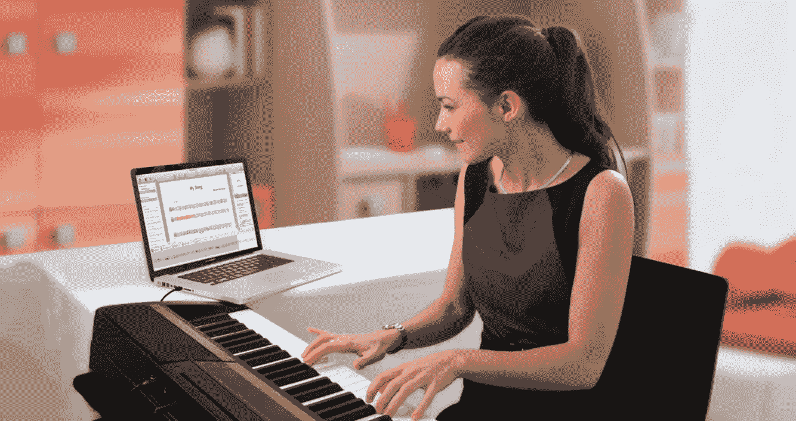
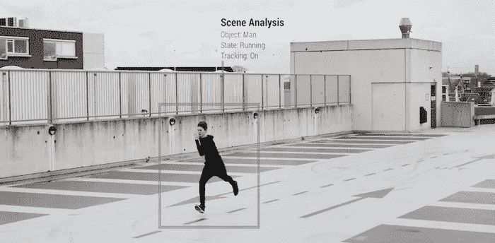
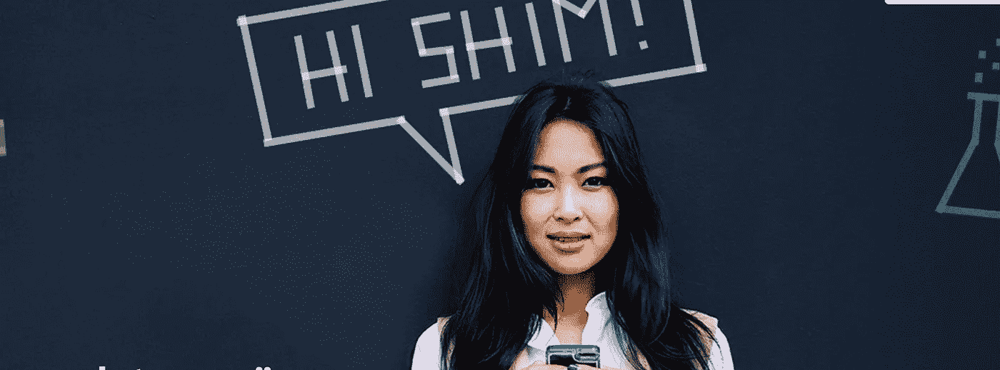
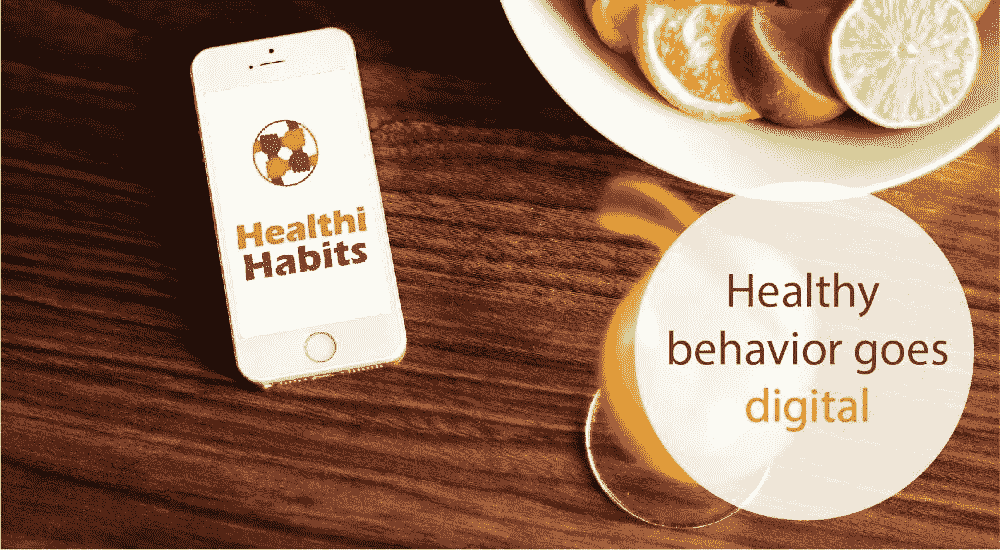
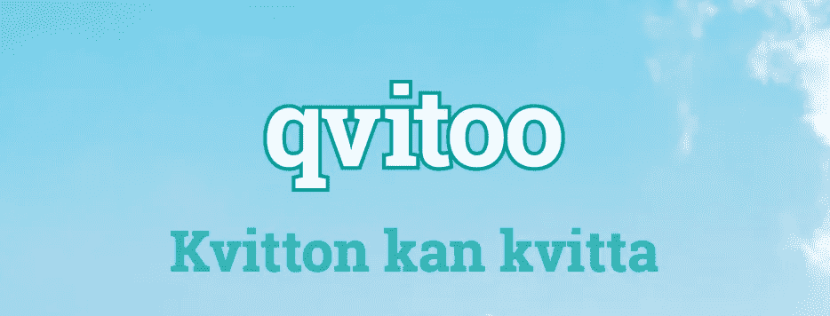
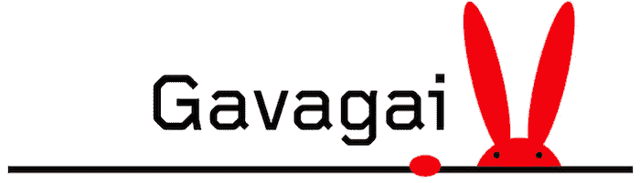
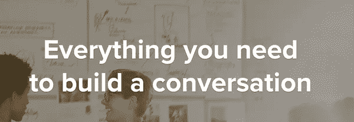

# 斯德哥尔摩的人工智能

> 原文：<https://towardsdatascience.com/artificial-intelligence-in-stockholm-24132cbb35a2?source=collection_archive---------0----------------------->

Photo credit: Online Graphic Design Course

人工智能是世界上最受关注的技术之一，它不再仅仅是科幻小说的一部分，而是用美国总统巴拉克·奥巴马的话说“已经以各种方式渗透到我们的生活中”。Gartner 将[人工智能确定为 2017 年](http://www.forbes.com/sites/peterhigh/2016/10/18/gartner-top-10-strategic-technology-trends-for-2017/#384c1976606b)的顶级技术趋势。

它就在这里，但与《黑客帝国》或《终结者》等科幻片相比，它看起来不像是一个大的威胁。尽管人们仍在质疑它将如何改变我们的社会，但新的智能产品和服务的开发正以前所未有的速度蓬勃发展。

例如，一个[人工智能机器人成为北欧科技巨头 Tieto 的官方董事会成员](http://www.va.se/nyheter/2016/10/18/ai-finland/)，并且拥有投票权！

在斯德哥尔摩，一些独角兽公司，如 Klarna 或 Spotify，将人工和扩展智能作为其产品和业务不可或缺的一部分，有时会被忽视。对其他人来说，人工智能是他们销售产品的核心。最近，Stockholm.ai 社区开始了一系列以人工智能为主题的聚会。它向想知道为什么斯德哥尔摩是经营人工智能公司的好地方的企业家、开发人员、技术人员和投资者开放。

这里是对斯德哥尔摩人工智能社区中一些最有趣的玩家以及人工智能领域中一些非常新的成员的概述。

# 瓦蒂

经过三年多的经营， [Watty](http://watty.io/) 已经是一家经验丰富的人工智能初创公司:

*   Watty 成立于 2013 年，是一个市场领先的机器学习平台，为客户提供即时和在线的能源消耗测量，细分到各个家用电器。
*   Watty 在多个场合获得了资金，最著名的是 2016 年 7 月完成的 300 万€回合。主要投资者包括 Cleantech Invest 和 EQT Ventures。
*   首席执行官 Hjalmar Nilsonne 在绿色技术领域有着丰富的经验，

# 多雷米尔

没有那么夸张，但绝对值得一听的是多雷米尔

*   Doremir 通过将录制的声音和旋律转换成符号，将 Shazam 等应用程序提升到了一个新的水平。
*   由两位 Svens，ahl bck 和 Emtell 在 2008 年成立，他们都是音乐和认知领域的研究人员，他们在 2013 年发布了他们的应用程序 ScoreCloud。
*   首席执行官 Bengt Lidgard 于 2013 年加入，这一年见证了《卫报》、《连线》和《福布斯》等媒体对该产品的报道。
*   瑞典风险投资基金 Almi Invest 与瑞典和外国投资者一起支持该项目。

# 米玛

同样活跃在音乐产业和娱乐领域的还有年轻的初创公司 [Mima](http://mima.ai/)

*   Mima 于 2016 年 3 月正式推出，为实时了解娱乐创造了先进的平台。
*   使用人工智能和深度学习来跟踪趋势，为音乐、电视、电影和游戏的最新发展提供有价值的见解。
*   以瑞典诺贝尔奖获得者哈里·马丁森的科幻诗 [Aniara](https://en.wikipedia.org/wiki/Aniara) 中的全知电脑命名。

# 亨利

像米玛一样，来自 2016 届的同一个班级，来了一个新的孩子[亨利](https://hihenry.co/):

*   Henry 是一个虚拟辅助工具，旨在收集员工的想法和见解。
*   帮助跟踪团队和部门内的工作生活平衡和员工幸福感。
*   由弗雷德·亚伯拉罕森、汤米·恩斯特伦和维德兰·伊斯梅利创立。
*   成立于 2016 年 1 月，位于 SUP46。

专注于人工智能的初创公司正在快速发展，有些仍然处于隐形模式。去年出现了一批有趣的引人注目的公司，比如以下四家初创公司:

# 夹铁

与[垫片](http://www.helloshim.com)交谈。

*   Shim 是聪明又善解人意的朋友，是 100%人工的。
*   该公司网站称，通过与 Shim 交谈，用户可以更好地了解自己，并与所爱的人建立更牢固的关系。
*   Hoa Ly 拥有心理学博士学位，除了在一个由心理学家、研究人员、作家、工程师和设计师组成的团体中担任 Shim 的联合创始人之外，还是一名 DJ。
*   Shim 成立于 2015 年 5 月，目前仍处于测试阶段，但可以在他们的网站上进行测试。

# 健康习惯

*   [Healthi Habits](http://www.healthihabits.co/) 利用人工智能、机器学习和行为经济学的结合，发现健康的习惯，帮助人们进行可持续的行为改变。
*   [H2 健康中心](http://www.h2healthhub.com/)坐落在斯托克霍姆新的电子健康中心，与多家初创公司一起，如虚拟现实公司 [Mimerse](http://mimerse.se) 和获奖公司 [Qinematic](http://qinematic.com/) 。
*   他们成立于 2015 年 12 月，最初专注于糖尿病患者，但正在寻求扩展到其他用户群体

2015 年还出现了两家新公司，Dooer 和 Qvitoo，它们都计划挑战和颠覆成熟且耗时的会计行业。

# 杜尔

*   Dooer 利用人工智能软件解决方案开发现代簿记系统，无需会计人员即可自动处理所有发票信息。
*   由连续创业家 Sam Nurmi 创建，据 breakit.se 报道，他通过出售之前的公司 Pingdom 赚了近 5 亿 SEK。据同一媒体报道，该公司[在 2016 年夏天](http://www.breakit.se/artikel/4963/sam-nurmi-tar-in-40-miljoner-till-sin-bokforingsstartup-dooer)获得了 4000 万 SEK，其中大部分来自萨姆·努尔米本人。
*   临近它的第一个生日，公司已经有 30 多名员工。

# Qvitoo

*   [Qvitoo](https://qvitoo.com/) 只需拍张照片，就能帮助创始人和企业家追踪发票和收据——剩下的事情由软件和人工智能来完成。
*   除了为专业人士提供服务之外，Qvitoo 还专注于那些可以轻松跟踪和记录自己支出的消费者。
*   他们的服务集成了市场上最常见的会计软件。
*   由拥有 10 年软件顾问经验的 Henrik Feldt 和 Mikko Lappalainen 于 2015 年创立。

在先进计算机的扩展智能的帮助下，难怪许多公司都关注大数据和人工智能。这三家公司有非常不同的产品，但都在这两个领域工作。

# 加瓦盖

*   [Gavagai](https://gavagai.se) 由数据科学家马格努斯·萨尔格伦和尤西·高本汉于 2008 年创立，Gavagai 专门从事大型文本样本的实时数据分析。
*   2015 年秋季，该公司在第二轮种子融资中筹集了 1000 万 SEK，估值为 6200 万 SEK。
*   他们的 Explorer 工具经过优化，可用于分析问卷中开放式答案的文本数据，这一过程通常是手动完成的，非常耗时。

# Vionlabs

*   由 Arash Pendari 于 2010 年创立的 [Vionlabs](http://vionlabs.com/) 一直致力于开发一种分析工具，帮助电影制片人、流媒体网站和网络运营商了解他们客户的娱乐习惯。
*   Vionlabs 之前专注于 B2C 解决方案，现在专注于 B2B。
*   投资者中有风投 Northzone、另一家瑞典初创公司的董事会主席、 [Truecaller](https://www.truecaller.com/) 、斯特凡·伦哈默和瑞典著名演员迈克尔·恩奎斯特。
*   同样的投资者在 2015 年第一轮投资中选择了 2500 万 SEK。较小的一轮于 2016 年 1 月结束。

# 哈特兰

*   SaaS 初创公司，提供对公司目标受众更深入的理解和洞察。
*   使用大数据和机器学习作为主要工具，并在 2016 年初与投资者和顾问 Mattias ost mar 一起更加关注人工智能的发展。
*   由 Niklas Lohmann、Sriram Elango 和 Stefan Krafft 于 2014 年创立。
*   Propel Capital 在 2015 年的早期种子轮投资了 30 万美元

# **艾制造**

*   【人工智能制造的 是一家人工智能初创公司，它使用深度学习和生成模型来为物理对象生成独特的设计。
*   顾客可以买到世界上第一条由人工智能设计的项链。
*   人工智能背后的团队对人工智能的创造性应用有着浓厚的兴趣。

随着专注于人工智能的初创公司数量的增长以及行业、政策和投资者的兴趣，斯德哥尔摩的人工智能很可能在未来发挥更大的作用。而且很有可能你已经在用斯德哥尔摩的一个人工智能集成产品了。

在之前一篇关于斯德哥尔摩 VR 的文章中，我写了一篇关于初创公司 [Gleechi](http://www.gleechi.com) 的文章，该公司专门制作手部模拟，供游戏、医疗保健、机器人等领域的开发人员使用。他们获奖的虚拟抓握部分基于深度机器学习和人工智能。

开创性的研究也正在一个看似远离创业现场的世界中进行。在斯德哥尔摩市中心的南郊坐落着一家超过 10 年历史的咨询公司 Peltarion，专注于所有与人工智能相关的事情。一个值得注意的项目是他们与露露艺术集团的合作，其中一项成果是计算机生成舞蹈编排系统。像 Dooer、Thingmap、Norwegian Meltwater 和 Augify 这样的公司都有一个共同点，那就是他们一直在与当地的 [Graph-Technologies](http://www.graph-technologies.com) 合作，这是一家咨询公司，开发机器学习产品和建议，指导和培训企业家和公司关于人工智能的来龙去脉。

最近，数据安全公司 [EyeonID](https://www.eyeonid.com) 上市，初创公司 [Imago](http://imagimob.com/%23) 获得了来自当地商业天使的新投资。人工智能革命已经明确袭击了斯德哥尔摩，未来几年很可能会出现新的深度学习创业公司的增加。

在 [Invest Stockholm](http://www.investstockholm.com/) ，我们安排投资者与被选中的有前途的初创公司会面。如果你想了解更多关于 Stockholms AI 场景的可能性，不要犹豫[联系](mailto:joseph.michael@stockholm.se)。

*关注我的*[*Twitter*](https://twitter.com/josephstockholm)*和*[*Linkedin*](https://www.linkedin.com/in/joseph-michael/)*获取更多关于北欧科技场景的帖子。感谢* [*鲁洛夫·皮特*](https://twitter.com/graphific?ref_src=twsrc%5Egoogle%7Ctwcamp%5Eserp%7Ctwgr%5Eauthor) *对这篇文章的贡献。*