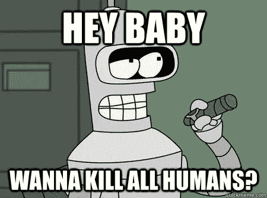
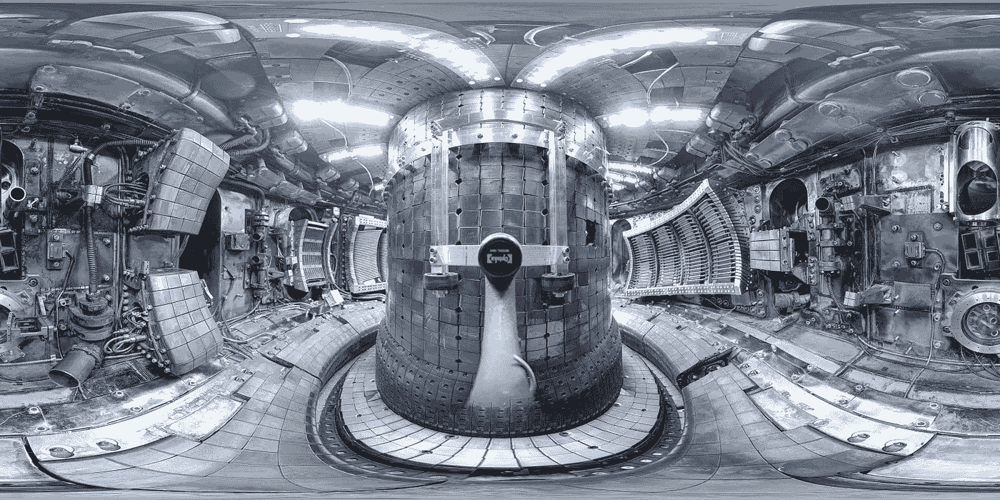
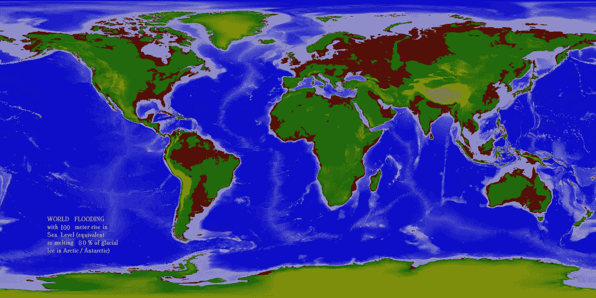

# 人工智能很可能是安全的

> 原文：<https://towardsdatascience.com/artificial-intelligence-is-probably-safe-ce67f0abd759?source=collection_archive---------8----------------------->

尽管我们最终都会被宇宙[[10^100]](https://en.wikipedia.org/wiki/Googol)年后的的[热寂所杀死，但还有更多迫在眉睫的问题需要思考。还有太阳的](https://www.youtube.com/watch?v=4_aOIA-vyBo)[死亡](https://www.space.com/g00/23154-death-of-sun-will-destroy-earth-infographic.html?i10c.encReferrer=aHR0cHM6Ly93d3cuZ29vZ2xlLmNhLw%3D%3D)(从现在起 50 亿年)，以及行星的[加热](https://www.nasa.gov/press-release/nasa-releases-detailed-global-climate-change-projections)(参见模型中的 2100 年)。这是一个好主意[优先考虑将杀死我们所有人的事情](https://nickbostrom.com/papers/future.html)，并避免所说的坏事情。我们不知道人工智能的威胁在时间线中的确切位置，但看起来人工智能更像是在 100 年或更短的时间内杀死我们所有人。肯定不会太快。不要在你的 2018 日历上标注 AI 末日。

让我告诉你为什么我认为我们现在是安全的。

I love [Futurama](http://www.quickmeme.com/meme/3pty0g).

先说[AI 为什么危险](https://books.google.ca/books?id=C-_8AwAAQBAJ&lpg=PP1&ots=UFS-LttOMq&lr&pg=PP1#v=onepage&q&f=false)。超智能 AI 的默认状态是强优化。大多数强优化过程都是“杀死所有人类”的特例(例如[集邮者](https://www.youtube.com/watch?v=tcdVC4e6EV4)、[回形针机](https://en.wikipedia.org/wiki/Instrumental_convergence))。这就是为什么 AI 安全是一个重要的问题，有时被称为[控制问题](https://en.wikipedia.org/wiki/AI_control_problem)。更多[此处](https://www.youtube.com/results?search_query=computerphile+ai+safety)。

超级智能也被称为“强人工智能”和人工通用智能(AGI)等。它开始是一个聪明的过程，变得越来越聪明，直到达到并超过人类水平的机器智能(HLMI)。这个点通常被称为奇点。这种人工智能不是通过已知的过程实现的。这是人类目前还没有实现的东西，我们也不知道如何制造我们给它贴上标签的东西。我们[可以称暗物质和暗能量为“弗雷德和威尔玛”](https://www.youtube.com/watch?v=kfYZqBG1IDg)，因为除了它们的名字，我们所知甚少。同样，除了知道它有多危险和强大，我们对 AGI 知之甚少。人工智能(不是 AGI)的力量在短期内是帮助人类的。当你读到这些文字的时候，这是一股自动化和效率的力量，它正迅速在经济和文化中荡漾。

Fusion is hard. Really hard.

与来源不明的 AGI 相反，聚变是一个已知的过程。[核聚变对人类来说是令人敬畏的](https://www.youtube.com/watch?v=-MaASrJyqYg)，但也可能导致人类的终结(核聚变意味着每个人都拥有核武器，以及发动战争的无限能量)。所以，就大的上升空间和大的风险而言，这听起来类似于人工智能，但至少我们有了融合的蓝图。我们每天都看到太阳在进行核聚变，即使我们知道核聚变是如何在太阳中进行的，我们在地球上也没有运行的核聚变反应堆。是工程问题让核聚变遥不可及。很难在实验室里建造太阳(等离子体密封)。更容易制造太阳能电池板。

如果融合很难，而且我们知道融合是如何工作的，那么[做《AGI:危险的人工智能》就格外困难。我们不知道 AGI 是如何工作的，除了人类如何进化出我们的智慧之外，我们没有其他例子，我们也不知道产生 HLMI 或超级智慧有多难。因此，比起核聚变或全球变暖，不要更担心 AGI。](https://en.wikipedia.org/wiki/Argumentum_a_fortiori)

通过理论上证明[大过滤器](https://youtu.be/sNhhvQGsMEc)在我们身后，费米悖论正在被解答/解决。比如，也许线粒体+细胞=非常稀少。比起另一个选择，我更喜欢那个。我不相信 AGI 需要如此稀有的东西来生产，因为人工智能比生物生命需要更少的进化时间。但是……我们不要自欺欺人了。深度学习任重道远，融合也是如此。杀手机器人是真实的，但由强人工智能建造的机器人还很遥远。我认为这一领域的研究应该作为国家安全的重中之重来资助，就像核聚变一样，但是让我们正视威胁。全球气候变化，在我看来，比想要杀死所有人类的 AI 更有杀伤力，更立竿见影。我们知道气候正在变化。海平面上升=洪水=糟糕。

The world after a 100 meter sea level rise, caused by melting 80% of the ice on the planet. This should bother you if you live bascially anywhere near open water.

对人工智能来说，更直接的担忧应该是失业、假新闻和其他社会弊病。基本上，美国 30 万卡车司机中的 90%将被取代。所有的优步车手也是如此。如果我们现在就为这些影响做准备，这是一个好主意。也许用[通用基本收入(UBI)](https://youtu.be/kl39KHS07Xc) ？一些其他的解决方案？

我在工作中制造人工智能系统，我并不害怕它。你不应该害怕。

人工智能研究的进展速度令人印象深刻。我想说的是，就目前而言，人工智能可能是安全的，但应该继续研究人工智能的安全和控制问题。我怀疑我们能否将人类价值观灌输到超级智能中，但是值得一试去思考这些问题。

在我花了很多精力准备的上一篇文章之后，这是一篇非常有趣的高水平文章。如果你喜欢这篇关于人工智能安全的文章，请告诉我。在收到关于上一篇文章的一些不错的电子邮件反馈后，我确实计划写更多带有代码示例的研究内容。我也很高兴在评论中或通过电子邮件听到你对我的想法的反馈。你怎么想呢?

试用**拍手工具**。轻点那个。跟着我们走。分享这篇文章的链接。去吧。

编码快乐！

——丹尼尔
丹尼尔@lemay.ai ←打个招呼。
[LEMAY . AI](https://lemay.ai)
1(855)LEMAY-AI

您可能喜欢的其他文章:

*   [人工智能和不良数据](/artificial-intelligence-and-bad-data-fbf2564c541a)
*   [人工智能:超参数](/artificial-intelligence-hyperparameters-48fa29daa516)
*   [人工智能:让你的用户给你的数据贴标签](https://medium.com/towards-data-science/artificial-intelligence-get-your-users-to-label-your-data-b5fa7c0c9e00)

附注:尼克·博斯特罗姆很棒:[https://www.fhi.ox.ac.uk/](https://www.fhi.ox.ac.uk/)

花絮:甜甜圈来源于[面结](https://www.youtube.com/watch?v=DePRyZE5sn4)，切一个洞有助于它们煮得更均匀。