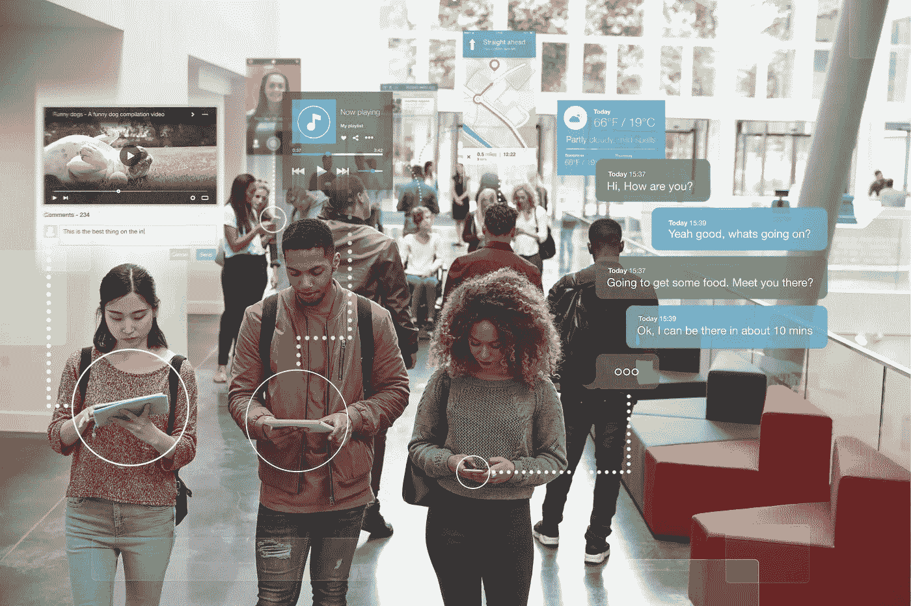
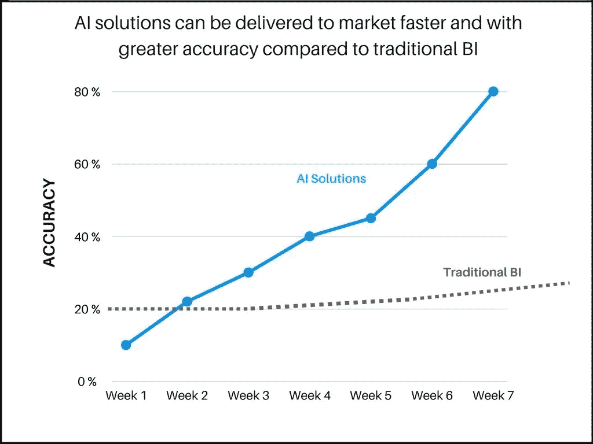
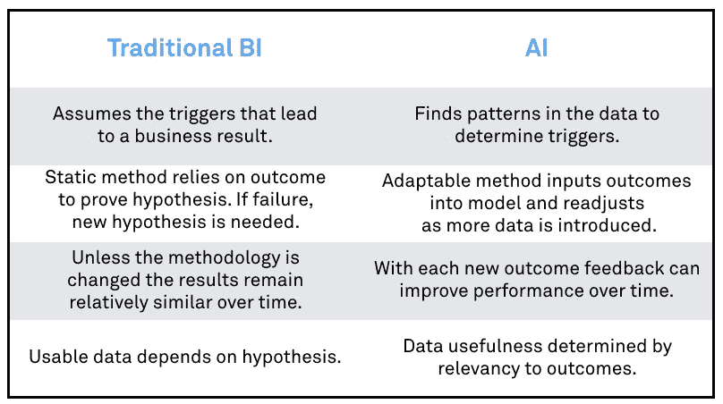

# 人工智能是应对当今营销挑战的灵丹妙药

> 原文：<https://towardsdatascience.com/artificial-intelligence-is-the-panacea-to-todays-marketing-challenges-a5201eae21ca?source=collection_archive---------2----------------------->

我对理解的尝试，更重要的是，将人工智能(AI)应用于当前的商业实践，迫使我将我所知道的一切都扔出窗外。经验、最佳实践、先入为主的观念、屡试不爽的真理——所有这些规则都变得过时和不相关，因为世界已经变了。媒体消费已经改变。企业已经失去了对客户的控制，正在努力获得并保持他们的注意力。

# 展示广告已经风光不再

目前形式的展示广告模式是不可持续的。[全球数字表现的当前统计数据](https://www.smartinsights.com/internet-advertising/internet-advertising-analytics/display-advertising-clickthrough-rates/)显示了以下广告形式:

> 在所有广告形式和位置中，广告点击率仅为 0.05%
> 
> 富媒体广告点击率为 0.1%

# 脸书和谷歌继续占据主导地位……但他们只是讲述了故事的一部分

相比之下，Wordstream 最近的一项研究表明:脸书的广告似乎正在蓬勃发展:

> …各个行业的点击率(CTR)从大约 0.5%到 1.6%不等。

对于截至 2016 年 3 月的谷歌 Adwords，拉里·金[报道:](https://searchenginewatch.com/2016/03/15/google-adwords-average-conversion-rates-by-industry-study/)

> …平均而言，Google AdWords 广告客户在搜索网络上的转化率为 2.70%，在展示网络上的转化率为 0.89%。

很明显，脸书和谷歌从数字广告支出中获得了最大的利益。去年，超过 175 亿美元花在了数字广告上。但 FB 和谷歌获得了超过 65%的估计收入，谷歌获得了 300 亿美元，而脸书的广告收入为 80 亿美元。

尽管如此，这些平台也不是没有障碍。今年 3 月，像联合利华这样的品牌和哈瓦斯这样的机构选择冻结谷歌和 Youtube 的支出，因为除了“不受欢迎或不安全的内容”之外，还有广告投放。这一点，再加上关于可视度的可疑报道，以及不断上升的广告欺诈事件，都使得品牌和代理商对他们的支出变得更加谨慎。

# 消费者对广告越来越免疫:

像 [Ghostery](https://www.ghostery.com/) 这样检测和阻止跟踪技术的应用程序的兴起，让出版商和广告商面临更大的挑战。关于[广告拦截](https://pagefair.com/blog/2017/adblockreport/)的最新报道如下:

*   现在有 6.15 亿台设备使用 adblock
*   11%的全球人口在屏蔽网络广告，这一数字在 2016 年上升了 30%
*   移动广告拦截设备增长至 3.8 亿台，增幅达 250%
*   根据这份报告，广告拦截现在是各年龄组的主流

对出版业的影响是[惊人的](https://digiday.com/uk/uh-oh-ad-blocking-forecast-cost-35-billion-2020/):假设采用率持续下去，到 2020 年，收入损失估计为 350 亿美元。

# 当广告拦截器、不断变化的媒体消费和广告表现阻碍我们达到目标客户时，我们如何有效地达到目标客户？

事情是这样的:顾客之旅从感兴趣的那一刻开始。我们如何与客户接触，在他们最有可能做出回应的时候，将最相关的信息放在他们面前，这是一个圣杯。过去的十年见证了这个年轻的数字领域的从业者测试、实施和成功应用技术以最大化性能。凭借这些在线行为，我们已经发展到真正理解消费者的兴趣和意图:印象、点击、访问、重复访问、内容和格式参与。大多数时候我们都是对的。直到现在。

> *然而，真正大规模实现个性化——并持续这样做——并不容易。除非你完成了从收购到为终身客户提供价值的完整旅程，否则你的努力充其量是支离破碎的。*

# 谷歌知道分数:“谷歌计划如何杀死最后点击归属”

谷歌最近宣布了这一点。这位巨头已经意识到，要知道什么样的广告有效，不能通过衡量整体表现来完成。他们转向转化率指标(CV)的原因是点击率(CTR)是一个误称。它不再是衡量真实意图的标准。你如何衡量意图，并不是通过广告形式的行为聚合(是的，我在简化)。更确切地说，是通过理解购买漏斗中归因于购买行为的事件。这里是我们对人工智能的介绍，以及为什么它将是 CMO 旅程中的下一次进化。

## 如果你想提高绩效，你需要改变你的思维模式，去接受这个领域的新事物:

# 1)商业智能不具备人工智能的速度和能力:

开发适用于业务的正确算法所需的时间可能是一件苦差事。需要多次测试和不断迭代来提高结果的准确性。人类为此付出的努力可能需要数月时间。机器学习所做的是自动化预测分析，并允许模型比传统的商业智能(BI)模型更快地投入生产。随着新数据的吸收，模型会“学习”和调整。这种连续的反馈环路允许在更短的时间内以更高的精度获得更好的性能。

# 2)抵制做出假设的冲动:

我们所知道的有用的东西可以被扔出门外。理解消费者意图意味着消除 KPI 和已知的绩效指标变量。我一次又一次地被告知要放弃我所知道的真理。人工智能没有预先设想的偏见，因此模型将在与预期业务结果相关的事件中找到模式。它要么验证我们已经知道的，要么展现出通过人类分析无法发现的全新结果。

传统的商业智能有其优点。但是在一个竞争日益激烈、速度越来越快、对准确性的要求越来越高的环境中，随着新规范的引入，这种做法的灵活性和可扩展性也受到了限制。更重要的是，我们可能会被自己的盲点所阻碍，让(传统 BI 中)行之有效的东西继续成为首选解决方案。正因为如此，我们倾向于错过在人工智能框架下显而易见的关键见解。

# 3)对客户的整体看法意味着超越孤立的广告行为:

大多数营销人员都知道这一点:点击已经今非昔比。喜欢和追随者的虚荣心指标并不直接表示意图或亲和力。我们已经看到了这些指标是如何容易地被游戏化的。除非你能把这些事件归因于客户转化，否则它们本身不太可能有任何真正的价值。

收购和保留计划也相互冲突。企业不再能够控制当前客户或潜在潜在客户可以看到哪些信息。

然而，通过利用人工智能，在社交渠道上关注一个品牌的数百万客户中，我们可以确定脸书广告或帖子的价值，因为它与单个客户有关，以及这对潜在客户有何不同。但是仅仅这一点可能还不足以让顾客改变信仰。也许，这也是一个朋友通过电子邮件或客服电话的推荐。

当在一个有序的旅程中进行分析时，这些事件在个人旅程中的个人贡献才能得到真正的重视。

# 4)行为是情绪的衍生物:

不开心的顾客不一定会抛弃一个品牌。就忠诚度而言，价格敏感度可能是购买机票的决定性因素，因为积分有好处，不管他/她最近可能经历过的糟糕的客户服务电话。然而，所有这些事件加在一起，将使营销人员对客户流失的风险有一个更清晰的认识。

人工智能能够从人类意图的复杂性中提取模式，并确定可能(在不同程度上)影响数百万客户决策的多种驱动因素。它可能因不同的产品或服务、一年中的不同时间、不同的地理位置和人口统计数据而异。

# 5)数据为王:

在这个新世界中，我们有能力将人类的倾向联系起来，并越来越擅长预测行为的可能性。内容刚刚被取消！人工智能的方法论试图揭示的是，通过轶事般地理解新消费者重视什么或他/她需要什么来提升内容的原则。内容现在是一种功能或事件，它可能有助于业务转换，与成千上万的其他事件结合在一起，在每个单独的客户旅程中。企业现在可以分析其营销工作以及客户的个性化旅程，并不断优化整体活动绩效。

# 人工智能使 1:1 的真正定义完全成为可能

我们兜了一圈。对于我们这些实行一对一营销的人来说，计算能力以及近年来成倍增长的数据财富为我们提供了实现这一圣杯的途径。对于传统的营销人员来说，现在的可能性是无限的。

*原载于 2017 年 5 月 31 日*[*【marketinginsidergroup.com】*](https://marketinginsidergroup.com/strategy/artificial-intelligence-panacea-todays-marketing-challenges/)*。*