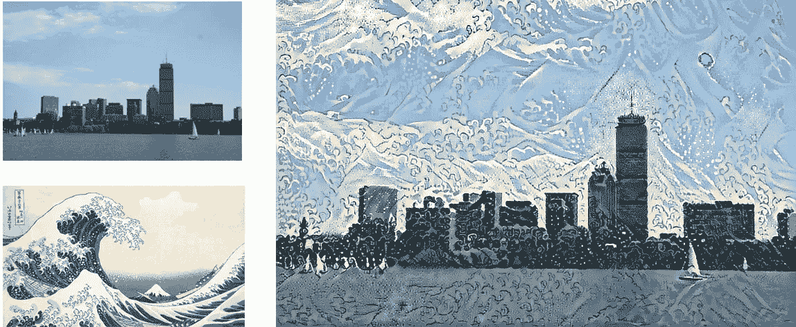
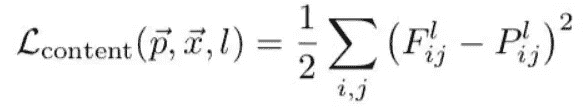
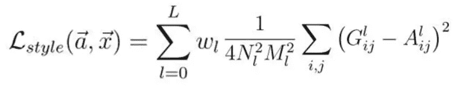
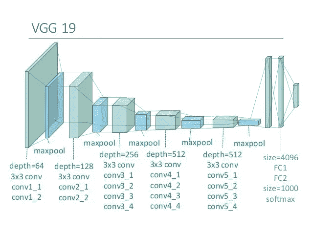
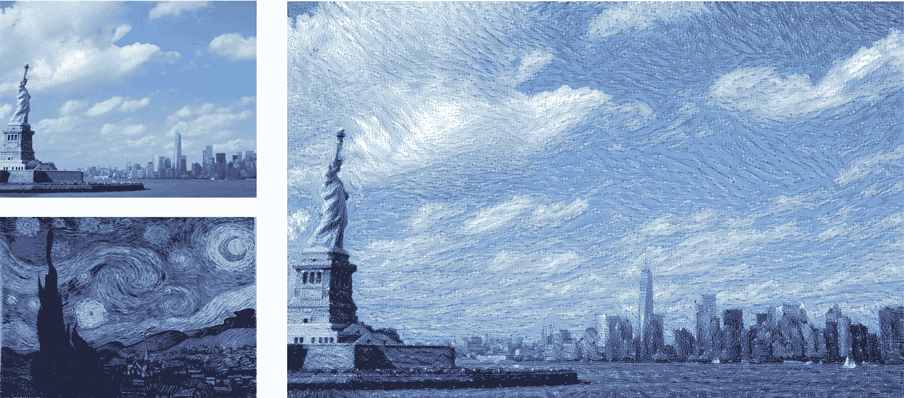
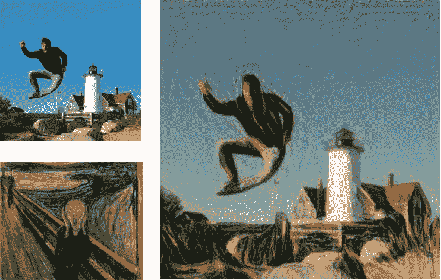

# 人工智能遇见艺术:神经传递风格

> 原文：<https://towardsdatascience.com/artificial-intelligence-meets-art-neural-transfer-style-50e1c07aa7f7?source=collection_archive---------7----------------------->



Hokusai in Boston

# 介绍

神经转移风格是人工智能在创造性背景下最令人惊叹的应用之一。在这个项目中，我们将看到如何将艺术绘画风格转移到选定的图像上，创造出令人惊叹的效果。Leon A. Gatys 等人在 2015 年的论文 [*中构思了**神经传递风格**的概念，一种艺术风格*](https://arxiv.org/abs/1508.06576) 的神经算法。在那之后，许多研究人员应用并改进了这种方法，增加了损失的元素，尝试了不同的优化器，并试验了用于此目的的不同神经网络。
尽管如此，原始论文仍然是理解这一概念的最佳来源，VGG16 和 VGG19 网络是这方面最常用的模型。这种选择是不寻常的，考虑到两者都被最近的网络超越，在风格转移中实现的最高性能证明了这一点。

完整代码可以查看这个 [**GitHub 库**](https://github.com/maurock/neural_transfer_style) 。

# 它是如何工作的？

这种技术的目标是将图像的样式(我们称之为“样式图像”)应用到目标图像，保留后者的内容。让我们定义这两个术语:

*   **风格**是图像中的纹理和视觉模式。一个例子是艺术家的笔触。
*   **内容**是一幅图像的宏观结构。人、建筑物、物体都是图像内容的例子。

令人惊叹的效果如下所示:


> 你想看到更多的效果吗？在文章的最后检查他们！

让我们看看高级步骤:

*   选择要样式化的图像
*   选择样式参考图像。通常，这是一幅风格奇特且易于辨认的画。
*   初始化预训练的深度神经网络，并获得中间层的特征表示。完成该步骤是为了实现内容图像和样式图像的表示。在内容图像中，最好的选择是获得最高层的特征表示，因为它们包含关于图像宏观结构的信息。对于样式参考影像，从不同比例的多个图层中获取要素制图表达。
*   将最小化的损失函数定义为*内容损失*、*风格损失*和*变化损失*之和。每次迭代，优化器都会生成一幅图像。内容损失是生成图像和内容图像之间的差异(l2 归一化)，而样式损失是生成图像和样式之间的差异。我们稍后会看到这些变量是如何被数学定义的。
*   重复最小化损失

# 处理和取消处理图像

首先，我们需要格式化我们的图像以供我们的网络使用。我们要用的 CNN 是预先训练好的 VGG19 convnet。当我们将图像处理成兼容的数组时，我们还需要对生成的图像进行解处理，从 BGR 格式切换到 RGB 格式。让我们构建两个辅助函数来实现这一点:

```
# Preprocessing image to make it compatible with the VGG19 model
**def** **preprocess_image**(image_path):
    img = load_img(image_path, target_size=(resized_width, resized_height))
    img = img_to_array(img)
    img = np.expand_dims(img, axis=**0**)
    img = vgg19.preprocess_input(img)
    **return** img

# Function to convert a tensor into an image
**def** **deprocess_image**(x):
    x = x.reshape((resized_width, resized_height, **3**))

    # Remove zero-center by mean pixel. Necessary when working with VGG model
    x[:, :, **0**] += **103.939**
    x[:, :, **1**] += **116.779**
    x[:, :, **2**] += **123.68**

    # Format BGR->RGB
    x = x[:, :, ::-**1**]
    x = np.clip(x, **0**, **255**).astype('uint8')
    **return** x
```

# 内容损失

内容损失将主输入图像的内容保留到样式中。由于卷积神经网络的较高层包含图像宏观结构的信息，我们将内容损失计算为输入图像的最高层的输出和生成图像的相同层之间的差异(l2 归一化)。
内容损失定义为:



Content loss

在等式中， *F* 是内容图像的特征表示(当我们运行我们的输入图像时，网络输出的内容)，而 *P* 是在特定隐藏层 *l* 生成的图像的特征表示。
实现如下:

```
# The content loss maintains the features of the content image in the generated image.
**def** **content_loss**(layer_features):
    base_image_features = layer_features[**0**, :, :, :]
    combination_features = layer_features[**2**, :, :, :]
    **return** K.sum(K.square(combination_features - base_image_features))
```

# 风格丧失

理解风格损失不像理解内容损失那么简单。目标是在新生成的图像中保留图像的样式(即，作为笔触的视觉图案)。在前一个例子中，我们比较了中间层的原始输出。这里，我们比较样式参考图像和生成图像的特定层的 Gram 矩阵之间的差异。 **Gram 矩阵**被定义为给定层的矢量化特征图之间的内积。矩阵的意义在于捕捉层特征之间的相关性。计算多个层的损失允许在样式图像和生成的图像之间保留不同层中内部相关的相似特征。
单层的风格损失计算如下:



Style loss per layer

在等式中， *A* 是样式图像的 Gram 矩阵， *G* 是生成的图像的 Gram 矩阵，两者都与给定的层有关。 *N* 和 *M* 为样式图像的宽度和高度。
在等式中， *A* 是风格图像的克矩阵， *G* 是生成的图像的克矩阵，两者都与给定的层有关。 *N* 和 *M* 为样式图像的宽度和高度。
首先为每个单独的层计算样式损失，然后将其应用于被认为是对样式建模的每个层。让我们来实现它:

```
# The gram matrix of an image tensor is the inner product between the vectorized feature map in a layer.
# It is used to compute the style loss, minimizing the mean squared distance between the feature correlation map of the style image
# and the input image
**def** **gram_matrix**(x):
    features = K.batch_flatten(K.permute_dimensions(x, (**2**, **0**, **1**)))
    gram = K.dot(features, K.transpose(features))
    **return** gram

# The style_loss_per_layer represents the loss between the style of the style reference image and the generated image.
# It depends on the gram matrices of feature maps from the style reference image and from the generated image.
**def** **style_loss_per_layer**(style, combination):
    S = gram_matrix(style)
    C = gram_matrix(combination)
    channels = **3**
    size = resized_width * resized_height
    **return** K.sum(K.square(S - C)) / (**4.** * (channels ** **2**) * (size ** **2**))

# The total_style_loss represents the total loss between the style of the style reference image and the generated image,
# taking into account all the layers considered for the style transfer, related to the style reference image.
**def** **total_style_loss**(feature_layers):
    loss = K.variable(**0.**)
    **for** layer_name **in** feature_layers:
        layer_features = outputs_dict[layer_name]
        style_reference_features = layer_features[**1**, :, :, :]
        combination_features = layer_features[**2**, :, :, :]
        sl = style_loss_per_layer(style_reference_features, combination_features)
        loss += (style_weight / len(feature_layers)) * sl
    **return** loss
```

# 变异损失

最后，损失的最后一部分是变异损失。原始论文中没有包括这一要素，严格来说，它对于项目的成功并不是必要的。尽管如此，经验证明，添加该元素会产生更好的结果，因为它平滑了相邻像素之间的颜色变化。让我们把这个包括进去:

```
# The total variation loss mantains the generated image loclaly coherent,
# smoothing the pixel variations among neighbour pixels.
**def** **total_variation_loss**(x):
    a = K.square(x[:, :resized_width - **1**, :resized_height - **1**, :] - x[:, **1**:, :resized_height - **1**, :])
    b = K.square(x[:, :resized_width - **1**, :resized_height - **1**, :] - x[:, :resized_width - **1**, **1**:, :])
    **return** K.sum(K.pow(a + b, **1.25**))
```

# 全损

最后，将所有这些因素考虑在内，计算总损失。首先，我们需要提取我们选择的特定层的输出。为此，我们定义一个字典为<*层名，层输出* >:

```
# Get the outputs of each key layer, through unique names.
outputs_dict = dict([(layer.name, layer.output) **for** layer **in** model.layers])
```

然后，我们通过调用先前编码的函数来计算损失。每个分量都乘以特定的权重，我们可以调整权重以产生强烈或较轻的效果:

```
**def** **total_loss**():
    loss = K.variable(**0.**)

    # contribution of content_loss
    feature_layers_content = outputs_dict['block5_conv2']
    loss += content_weight * content_loss(feature_layers_content)

    # contribution of style_loss
    feature_layers_style = ['block1_conv1', 'block2_conv1',
                            'block3_conv1', 'block4_conv1',
                            'block5_conv1']
    loss += total_style_loss(feature_layers_style) * style_weight

    # contribution of variation_loss
    loss += total_variation_weight * total_variation_loss(combination_image)
    **return** loss
```

# 设置神经网络

VGG19 网络将一批三个图像作为输入:输入内容图像、样式参考图像和包含生成图像的符号张量。前两个是常量变量，使用 keras.backend 包定义为*变量*。第三个变量定义为*占位符*，因为它会随着优化器更新结果的时间而变化。



一旦变量被初始化，我们就把它们加入一个张量，这个张量将在以后提供给网络。

```
# Get tensor representations of our images
base_image = K.variable(preprocess_image(base_image_path))
style_reference_image = K.variable(preprocess_image(style_reference_image_path))

# Placeholder for generated image
combination_image = K.placeholder((**1**, resized_width, resized_height, **3**))

# Combine the 3 images into a single Keras tensor
input_tensor = K.concatenate([base_image,
                              style_reference_image,
                              combination_image], axis=**0**)
```

完成后，我们需要定义损耗、梯度和输出。原始论文使用算法 L-BFGS 作为优化器。这种算法的一个限制是它要求损失和梯度分别通过。因为单独计算它们效率极低，所以我们将实现一个赋值器类，它可以同时计算损失和梯度值，但分别返回它们。让我们这样做:

```
loss = total_loss()

# Get the gradients of the generated image
grads = K.gradients(loss, combination_image)
outputs = [loss]
outputs += grads

f_outputs = K.function([combination_image], outputs)

# Evaluate the loss and the gradients respect to the generated image. It is called in the Evaluator, necessary to
# compute the gradients and the loss as two different functions (limitation of the L-BFGS algorithm) without
# excessive losses in performance
**def** **eval_loss_and_grads**(x):
    x = x.reshape((**1**, resized_width, resized_height, **3**))
    outs = f_outputs([x])
    loss_value = outs[**0**]
    **if** len(outs[**1**:]) == **1**:
        grad_values = outs[**1**].flatten().astype('float64')
    **else**:
        grad_values = np.array(outs[**1**:]).flatten().astype('float64')
    **return** loss_value, grad_values

# Evaluator returns the loss and the gradient in two separate functions, but the calculation of the two variables
# are dependent. This reduces the computation time, since otherwise it would be calculated separately.
**class** **Evaluator**(object):

    **def** **__init__**(self):
        self.loss_value = **None**
        self.grads_values = **None**

    **def** **loss**(self, x):
        **assert** self.loss_value **is** **None**
        loss_value, grad_values = eval_loss_and_grads(x)
        self.loss_value = loss_value
        self.grad_values = grad_values
        **return** self.loss_value

    **def** **grads**(self, x):
        **assert** self.loss_value **is** **not** **None**
        grad_values = np.copy(self.grad_values)
        self.loss_value = **None**
        self.grad_values = **None**
        **return** grad_values

evaluator = Evaluator()
```

# 最后一档

终于万事俱备了！最后一步是多次迭代优化器，直到我们达到期望的损失或期望的结果。我们将保存迭代的结果，以检查算法是否按预期工作。如果结果不令人满意，我们可以调整权重以改善生成的图像。

```
# The oprimizer is fmin_l_bfgs
**for** i **in** range(iterations):
    print('Iteration: ', i)
    x, min_val, info = fmin_l_bfgs_b(evaluator.loss,
                                     x.flatten(),
                                     fprime=evaluator.grads,
                                     maxfun=**15**)

    print('Current loss value:', min_val)

    # Save current generated image
    img = deprocess_image(x.copy())
    fname = 'img/new' + np.str(i) + '.png'
    save(fname, img)
```

要查看完整代码，请参考页面开头提供的 GitHub 链接。

# 惊人的结果



> 如果你想尝试特定的效果，绘画，或者你有任何建议，请留下评论！

*如果你喜欢这篇文章，我希望你能点击鼓掌按钮*👏因此其他人可能会偶然发现它。对于任何意见或建议，不要犹豫留下评论！

## 我是一名数据科学专业的学生，热爱机器学习及其无尽的应用。你可以在 maurocomi.com[找到更多关于我和我的项目的信息。你也可以在](http://www.maurocomi.com) [Linkedin](https://www.linkedin.com/in/mauro-comi/) 上找到我，或者直接给我发邮件。我总是乐于聊天，或者合作新的令人惊奇的项目。