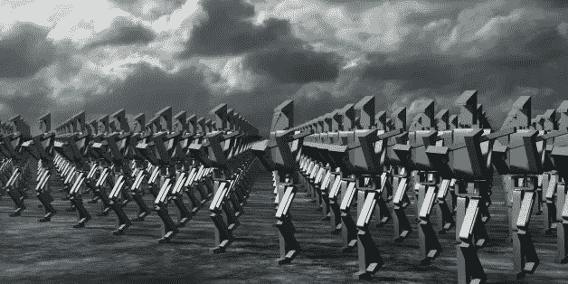

# 要订阅的人工智能时事通讯

> 原文：<https://towardsdatascience.com/artificial-intelligence-newsletters-to-subscribe-to-2fea0843d19c?source=collection_archive---------8----------------------->

SOURCE: HIROSHI WATANABE VIA GETTY IMAGES

*这里是* [*Josh.ai*](http://josh.ai) *我们正在为家庭开发一个相当令人兴奋的人工智能代理。这是一个令人兴奋的领域，我们试图跟踪该领域的一些时事通讯。我们没有跟上所有这些，但这里有一个精选的列表，列出了我们在那里发现的一些最好的*

[**AI Weekly**](http://aiweekly.co/) —订阅人工智能和机器学习方面的最佳新闻和资源的每周集合。免费的。

[**Deep Hunt**](https://deephunt.in/) —由 Avinash Hindupur 精心策划的人工智能最热门事物的每周简讯！

[**热门机器人**](http://www.topbots.com/) —我们在网上搜寻关于机器人&人工智能的最新内容。

[**奥莱利人工智能简讯**](http://www.oreilly.com/ai/newsletter.html) —接收每周人工智能新闻、业内人士的见解以及独家交易和优惠。

[**机器学习周刊**](http://mlweekly.com/) —机器学习与深度学习博客(7.1k 订阅用户)。

[**数据科学每周简讯**](https://www.datascienceweekly.org/) —免费的每周简讯，提供与数据科学相关的新闻、文章和工作。

[**机器学习**](http://subscribe.machinelearnings.co/)**—ML&AI 新闻每周综述。机器学习和人工智能正在对我们的生活产生巨大影响。**

**[**人工智能新闻**](http://aiweekly.co/)**——**AI&深度学习快讯。******

******[**当树倒了……**](https://meetnucleus.com/p/GVBR82UWhWb9)**—机器学习与人工智能博客。********

******[**WildML**](https://meetnucleus.com/p/PoZVx95N9RGV)**——**AI、深度学习、NLP Bl *og*******

******C** [**olah 的博客**](https://meetnucleus.com/p/QyOfvn7aP9tj) —神经网络聚焦博客。****

****[**我是特拉斯克**](https://meetnucleus.com/p/xiCS7oE9me3V)**——**一个机器学习的手艺博客作者@iamtrask********

******[**人工智能内部**](https://inside.com/technically-sentient)——带给你人工智能、机器人和神经技术的最新进展******

****[**阿齐姆·阿兹哈尔:指数观点**](https://www.getrevue.co/profile/azeem) —指数变化:技术、商业模式、政治经济&社会。****

****[**库兹韦尔人工智能**](http://www.kurzweilai.net/create-account)——库兹韦尔加速智能简讯通过电子邮件简明扼要地报道相关的重大科技突破(每日或每周)。****

****[**导入 AI**](https://jack-clark.net/import-ai/) —导入 AI 是一份关于人工智能的每周简讯，有成千上万的专家阅读。****

****[**AI 中的野周**](https://www.getrevue.co/profile/wildml)—AI 中的野周是由@ [dennybritz](https://twitter.com/dennybritz) 策划的每周一期 AI &深度学习简讯。****

********——**通过阅读每个工作日直接发送到你收件箱的顶级文章，了解人工智能&数据科学的最新动态。******

****订阅获取智能家居、语音控制和人工智能的最新信息。****

****查看我们的 [*脸书*](http://facebook.com/joshdotai) *或者关注我们的* [*推特*](http://twitter.com/joshdotai) *！*****