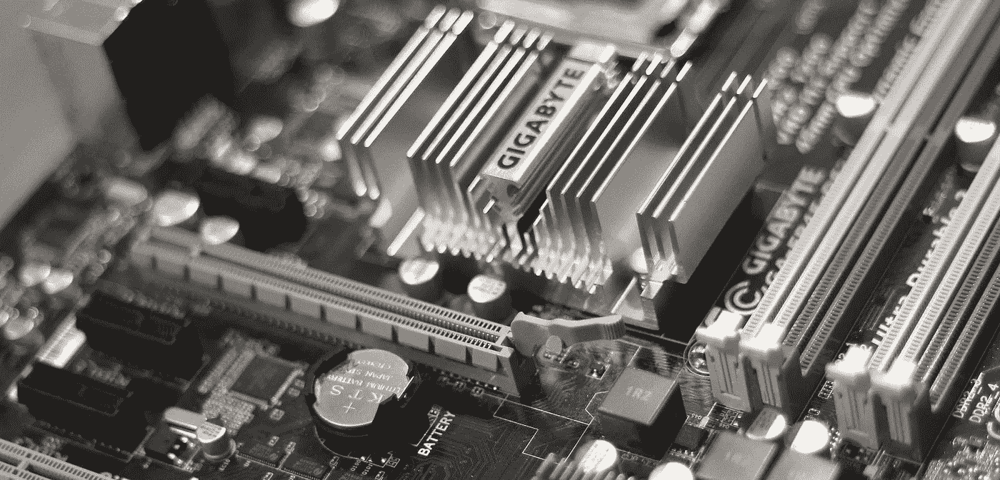
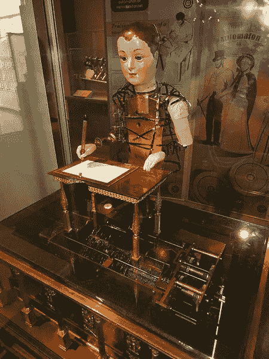
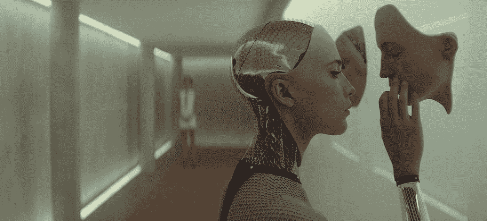
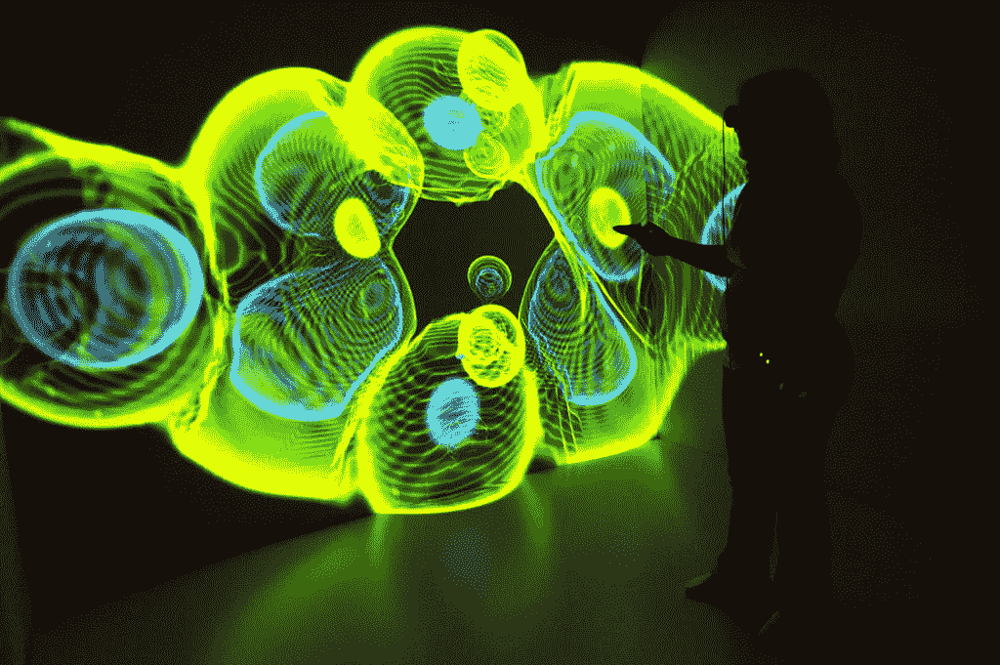

# 为大家揭秘人工智能

> 原文：<https://towardsdatascience.com/artificial-intelligence-the-present-7ffeb0ff1ae6?source=collection_archive---------5----------------------->

## 有意识的机器人真的来了吗？外行人的指南

What does an AI brain look like? Image credit: [JÉSHOOTS](https://www.pexels.com/photo/technology-computer-chips-gigabyte-4316/)

> “智力的概念就像舞台魔术师的戏法。比如“非洲未开发地区”的概念。我们一发现它就消失了。”
> —马文·明斯基(1927–2016)，数学家，人工智能先驱。

T 上面引用的一位计算机科学泰斗的话，恰如其分地营造了一种氛围，让我们得以一窥当今最热门、最具争议的技术之一的背后。对于围绕它的所有神秘，如果我们简单地说，“人工智能只不过是涡轮增压的统计推断”，我们不会离真相太远。让我们仔细看看。

每个计算机程序的核心都有一个数学函数在起作用。这可能像计算未偿还贷款的利息一样简单，也可能像自动驾驶飞机一样复杂。*人工智能*，或 *AI* ，是一个计算机程序的通称，其核心数学功能已经(几乎)自动创建；而*机器学习*，或 *ML* ，指的是提供创造人工智能方式的一系列技术。

一个 ML 技术需要两件事:第一，一个函数看起来像什么的粗略草图，第二，一组训练例子'在情况 A 中函数应该执行动作 B，在情况 X 中函数应该执行动作 Y，等等'。对于每一个例子，ML 技术都细化了草图，使得结果函数更好地符合到目前为止所看到的一切。

Our painter AI might look like a muscular version of this writer automaton by Henri Maillardet, ca. 1810\. Image credit: [Wikipedia](https://commons.wikimedia.org/wiki/File:Henri_Maillardet_automaton,_London,_England,_c._1810_-_Franklin_Institute_-_DSC06656.jpg)

假设我们有一种 ML 技术，它知道如何将肌肉粘在骨头上，了解关节如何工作，并知道关于健康生物体肌肉平衡的限制。我们可以从一个人体骨骼(功能草图)和一大套笔触(例子集)开始，通过*试错*，创造一个知道如何绘画的人工智能。虽然创造一个简单地在墙上泼洒颜料的人工智能可能很容易，但创造一个具有梵高或莫奈技能的人工智能却困难得多；这是科学家的薪水支票。

# 从错误中学习。想象一下！

在创建画家 AI 时，ML 技术通常从创建随意的笔触开始，而不考虑训练示例。随着观察到的例子越来越多，它的目标是更好地模仿它们。如果这项技术非常适合这项任务，那么它会通过猜测给骨骼的哪个部分添加多少肌肉以及微调运动来改善，以便最好地补偿绘画错误。

尽管存在数学限制，但总的来说，更多的训练示例有助于创建更好的人工智能。这当然假设开发了适当的机器学习技术。在“训练”完成后，人工智能被释放到现实世界中，它可能会通过其核心功能处理每一个新的情况，以产生它认为最好的反应，或者就画家而言，最佳的笔触。

人工智能的每一项著名成就——从深蓝战胜加里·卡斯帕罗夫(Gary Kasparov)到自动驾驶汽车——都是科学家磨练机器学习技术并将其与正确的基本规范和训练样本结合起来的结果。但是人工智能比这些例子所暗示的更普遍。

Machine Learning is everywhere. Image credit: [Giphy](https://giphy.com/gifs/machine-learning-BdrSy2gqURFEk)

我在亚马逊和猫途鹰上的搜索触发了我的谷歌搜索中的广告。脸书认出了我和我朋友的照片。LinkedIn 可以知道我什么时候在找工作。一个经常被引用的例子是，一家超市发现一个十几岁的女孩怀孕了，甚至在她的家人知道之前，因为她突然从普通化妆品转向无香水化妆品。

# 等等，那电影呢？

今天，当你使用网络浏览器或手机应用程序时，是人工智能决定你观看什么广告。欧洲粒子物理研究所的 T2 正在帮助科学家从噪音中辨别基本粒子的信号；这就是他们如何发现[希格斯玻色子](https://home.cern/about/updates/2014/05/higgs-boson-machine-learning-challenge)。它把一种语言的文本翻译成另一种语言。从苹果的 Siri 到亚马逊的 Alexa，语音助手都是由人工智能驱动的。它保护信用卡和借记卡免受欺诈。它预测天气，甚至[写新闻文章](https://www.wired.com/2017/02/robots-wrote-this-story/)。去年，人工智能在空战模拟中击败了王牌飞行员，在围棋比赛中击败了世界特级大师。以这样或那样的形式，人工智能正在落后于所有形式的技术。

然而，所有这些都是非常具体、非常专业的应用。如果我们的期望是由科幻小说设定的，它们可能仍然显得平淡无奇。我们应该准备好迎接一个有自我意识、有能力并倾向于统治世界的流氓人工智能吗？

In *Ex Machina, the AI learns to deceive and kill in order to preserve itself. Or out of malice. Who knows!? Image credit:* [*BagoGames*](https://www.flickr.com/photos/bagogames/16153704398)

就人工智能的现代化身而言，这个领域在出生时就设定了这样的期望。现代计算机的创造者艾伦·图灵在 1950 年问道:“机器能思考吗？他提出了所谓的图灵测试，作为对机器思考能力的终极测试。测试表明，如果通过对话，一台机器可以让法官相信它是人类，那么必须假定这台机器具有与人类无法区分的思维能力。

他推测，只要有足够的内存，这样的机器是可以制造出来的，而且将会在 20 世纪初制造出来。在他 1951 年的一次演讲中，他说，“他们将能够彼此交谈，以提高他们的智慧。因此，在某个阶段，我们应该预料到机器会控制局面。”事实证明，这比想象的要难得多。

事实是，不仅一个*有自我意识的*计算机程序——它毕竟是一个计算机程序——很难设计，甚至不清楚这样的程序是否存在。正如图灵测试所评估的那样，创造一个与人类没有区别的人工智能是一个更小的挑战。

我们已经看到实验室里出现了许多令人瞠目结舌的技术。有人甚至可以说计算机和技术已经控制了我们生活的大部分。但是有自我意识的机器，更不用说失控的杀手机器人，还没有出现。

# 艺术的状态

一台机器能否通过图灵测试取决于它理解自然语言的能力，比如英语、汉语或梵语。这就是所谓的*自然语言处理*或者 *NLP* 的问题。由于历史原因，20 世纪下半叶的主要努力集中在使用数理逻辑规则设计 NLP 程序上。

这些程序发展成为 20 世纪末 21 世纪初的专家系统，旨在帮助组织基于事实和纯逻辑推理做出决策。专家系统因无法处理大量数据和复杂问题而失宠。出于类似的原因，依赖于基于规则的逻辑推理的方法被完全抛弃了。另一种思维方式流行开来:一种基于概率和统计的思维方式。

例如，像国际象棋这样的游戏的专业知识被图灵和许多后来的人工智能研究人员认为是战略思维的有力证据。然而，IBM 在 1996 年击败加里·卡斯帕罗夫的名为“深蓝”的计算机程序并非基于逻辑。这个程序根据什么最大化胜利的概率来选择它的行动— *概率*是关键词。这种游戏方式与早期对机器智能的理解背道而驰。但也许它重新定义了机器智能。

事实上，在众多其他问题中，即使是图灵最初的 NLP 问题也从将统计学和概率论应用于该任务中获益匪浅。

随着时间的推移，机器学习科学家也将有线和无线通信领域的一些经典思想改编为自己使用。通信工程师非常担心在介质中传输的珍贵比特中能容纳多少“信息”,以及如何恢复传输中丢失的信息。同样，ML 的科学家们担心从他们能得到的零碎数据中收集尽可能多的“信息”。相反，如果他们不会丢失太多信息，他们会很乐意为了效率而忽略一些数据。

Using concepts from communication and information theory, data can be represented in alternative forms to make them better suited for specific applications. Image credit: [Wikimedia Commons](https://commons.wikimedia.org/wiki/File:Data_Represented_in_an_Interactive_3-D_Form.jpg)

这种概率和统计技术与人类在大脑中组织信息和知识的方式相去甚远。从这个意义上说，它们补充了人类的智力。最接近模仿人脑的东西被称为*人工神经网络*或*安*。这是一种在过去十年里变得特别流行的技术。人工神经网络是“功能草图”——我们之前描述过的一个术语——它们可以被训练来执行各种任务:从手写识别，到预测销售，到识别医学图像中的异常对象，到自然语言处理和语言翻译。

人工神经网络令人着迷，最近理所当然地受到了很多关注。但是，我们是否会很快见证一个类似人类的、有自我意识的计算机程序的到来，还没有定论。

# 那么接下来会发生什么呢？

可以肯定地说，人工智能的最新发展在很大程度上归功于计算机硬件的最新发展。如果没有密集封装的内存芯片和快如闪电的处理器，我们就不会产生海量的数据，也没有能力处理所有这些数据。这也解释了机器学习统计技术的兴起:一个人提供的数据越多，统计推断就越好。

Statistical inferences work because we are, after all, not much different from one another.

只要有数据，就一定会有人最终应用机器学习并获得推论，这些推论往往令人惊讶，甚至无法通过其他方式获得。然而，无论怎么强调都不为过的是，找到数据和学习技巧的正确组合绝非易事。很多事情都可能出错，也确实出错了。通常很难获得高质量的数据，这些数据公平统一地反映了手头问题的所有方面。此外，ML 技术很容易因缺乏经验或工程师的偏见而受阻。

2015 年，谷歌因其图像分类器 AI [将非裔美国人标记为大猩猩](https://bits.blogs.nytimes.com/2015/07/01/google-photos-mistakenly-labels-black-people-gorillas/)而受到批评。美国法院[越来越依赖](https://mobile.nytimes.com/2017/05/01/us/politics/sent-to-prison-by-a-software-programs-secret-algorithms.html)由 ML 驱动的算法来决定一名囚犯在出狱后是否有可能再次犯罪；如果是的话，那么判决会更严厉。但是这些算法中的一些被证明对某些种族的人有不公平的偏见。这是因为与学习技巧一起使用的一组例子没有统一地代表所有种族的人。在某种意义上，人工智能无意中学会了仅仅根据人的种族来预测重返犯罪生活的可能性。

我们意识到，画家艾的水平取决于用来训练他的例子和技巧。这样的例子不胜枚举，它们提醒我们，就像所有人造的东西一样，人工智能也受到天生愚蠢的束缚。

## 如果你喜欢这篇文章，你可能也想知道更多关于人工智能的[历史。从希腊神话，到中世纪的人形机器人，再到计算机的发明。](https://medium.com/@chaturv3di/artificial-intelligence-a-history-8fba63ade3ae)