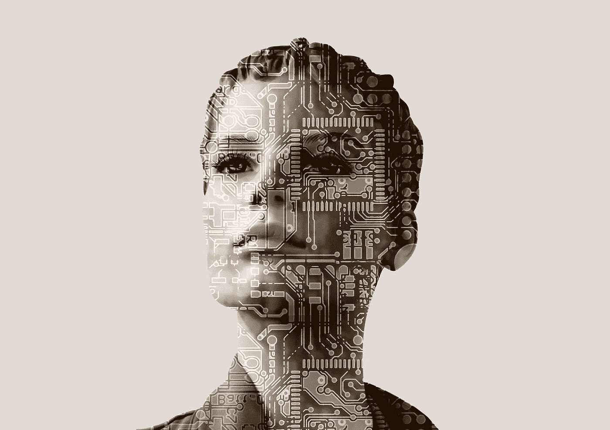
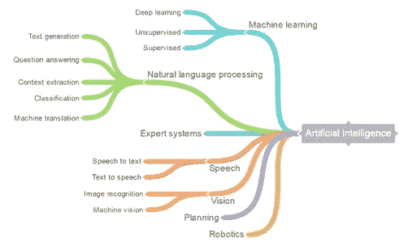

# 人工智能:理解炒作

> 原文：<https://towardsdatascience.com/artificial-intelligence-understanding-the-hype-daee0df04695?source=collection_archive---------4----------------------->

> “迄今为止，人工智能最大的危险在于，人们过早地断定自己理解它。”—埃利泽·尤德科夫斯基

# **解决炒作问题**

人工智能到处都是头条新闻。如果你没有生活在岩石下，你肯定会遇到人工智能、机器学习、自然语言处理等术语。任何对科技行业略知一二的人都知道，它对流行语、时尚、流行语和炒作并不陌生。

AI、ML 等成了流行语。围绕人工智能的炒作在世界其他地方已经减少，但印度仍然是炒作周期的一部分。学生们甚至在拥有计算机科学基础之前就想学习人工智能。求职者希望找到允许他们使用人工智能的工作，公司希望在他们的产品中实现人工智能。创业公司正在将人工智能作为其平台的核心技术，因为他们充分意识到投资者对人工智能感兴趣。球场甲板上充满了人工智能参考和空洞的承诺。公司在计划如何在产品中使用人工智能之前，会聘请人工智能专家。任何以如此迅猛的速度发展的技术都很难被任何人忽视。谷歌首席执行官桑德尔·皮帅表示，世界正在从移动第一世界过渡到 T2 人工智能第一世界。

每个人都想搭上人工智能的顺风车。但是人们了解 AI 吗？你会惊讶地发现有多少人不知道人工智能究竟是什么。我打算用这篇文章来帮助解释人工智能。

# 理解人工智能

简单地说，**人工智能是计算机科学的一个分支，目标是让机器或程序思考和学习。**

**机器学习:**当你在谷歌上搜索某个东西时，它使用一种叫做 RankBrain 的机器学习算法，根据各种参数过滤结果。它是人工智能的一个子集。它允许机器获取数据并自我学习。

**深度学习:** Google Now 也称为 Android 智能手机上的 Google Assistant，使用深度学习来执行使用大量数据的任务。当你提出一个问题时，谷歌助手会在大量数据中搜索，给你一个答案。它是机器学习的一个子集。它通过使用神经网络模拟人类决策来解决现实世界的问题。机器知道如何通过在大量数据上训练自己来模仿人类的决策。

**自然语言处理:**你安卓智能手机上的谷歌助手也使用 NLP。当你提问时，它会翻译人类语言，然后执行动作给你答复。也是 AI 的子集。它允许机器理解人类语言。NLP 可以使用基于 ML 的模型来帮助它解释语言。

Photo: [Neota Logic](http://neotalogic.com)

人工智能的其他领域如上图所示。希望以上信息能让你对 AI 有一个基本的了解。我建议你在读完这篇文章后深入挖掘。我个人喜欢 Udacity 上的这个课程，如果你想了解更多关于 AI 的知识: [**人工智能简介**](https://in.udacity.com/course/intro-to-artificial-intelligence--cs271/) **。**如果你想学习机器学习，吴恩达 Coursera 上的 [**这个课程**](https://www.coursera.org/learn/machine-learning) 是一个很好的开始。

# 当今人工智能的一些流行应用:

*   苹果设备上的 Siri。使用 NLP 和 ML。
*   Amazon.com 使用 ML 向用户推荐产品。
*   网飞通过分析大量数据，使用 ML 和深度学习向用户推荐电影和电视节目。
*   谷歌搜索使用 ML 对搜索结果进行排名。Google 还使用 ML 根据用户的浏览器历史和其他参数向用户显示有针对性的广告。

# 做出明智的决定

跟上技术的发展是很重要的，但是在我们了解技术将如何帮助我们之前学习或实现某些东西是一个坏主意。人工智能在正确使用的情况下是非常强大的。不要因为别人在用就用 AI，当你觉得它会比其他技术更快更好的帮助你解决一个问题的时候就用它。做出明智的决定很重要。在没有想法的情况下使用引人注目的技术只不过是一种实验。

# 如果你喜欢这篇文章，请点击底部的♥按钮。另外，请订阅我下面的时事通讯: