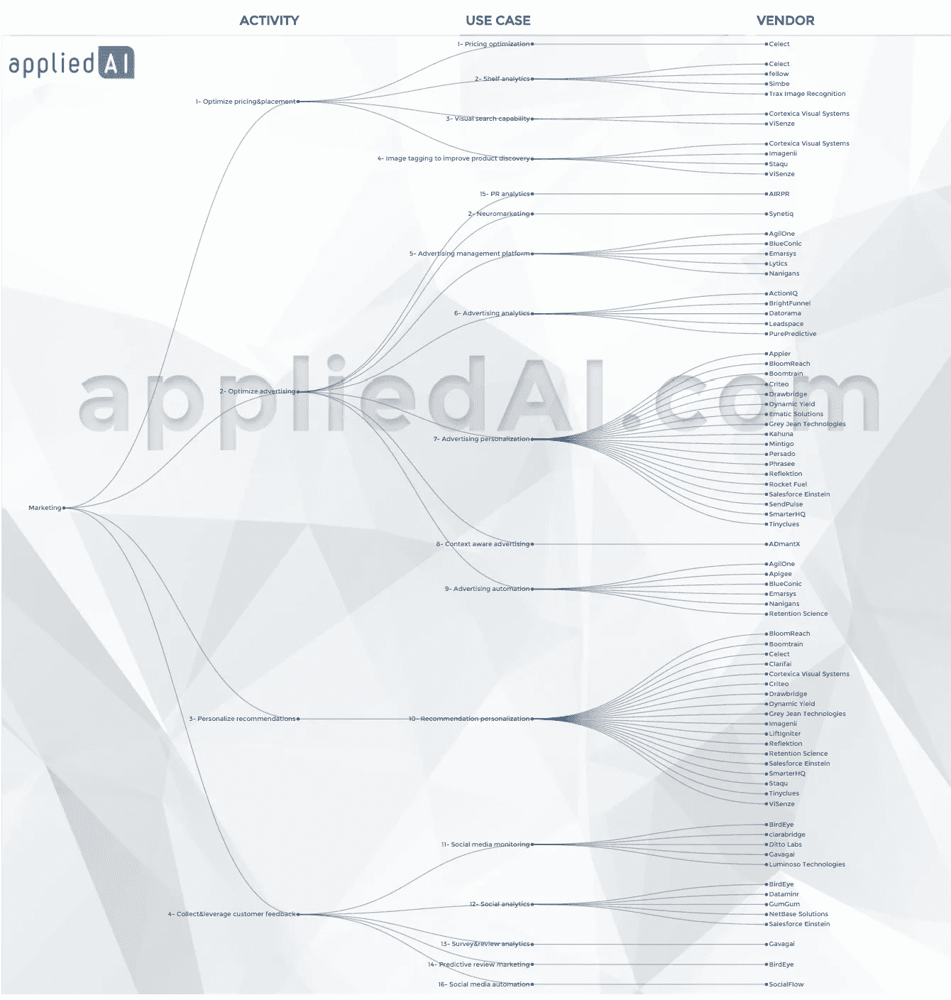

# 线下/数字营销中的人工智能用例/应用领域

> 原文：<https://towardsdatascience.com/artificial-intelligence-use-cases-application-areas-in-offline-digital-marketing-ff64f7438b51?source=collection_archive---------5----------------------->

在推出 appliedAI.com 时，我们采访了企业领导人和各种规模的人工智能供应商，搜索了新闻文章、专利、风险投资融资等，以确定现有和新兴的人工智能用例。我们已经确定了大约十几个营销中的基本人工智能用例。我们专注于核心营销活动，例如优化定价和投放、优化广告/营销、个性化推荐、收集和利用客户反馈。我们一直在改进我们的结构，希望听到您的意见和建议。

下面列出了主要的营销活动和这些活动中的人工智能用例。要了解更多信息，请访问相关页面，查看参考资料、视频和详细解释:

**1-优化定价&投放**

**定价优化:**优化降价以最小化自相残杀，同时最大化收益。

**商品销售优化:**利用机器学习和大数据来优化您的在线或离线商品销售

**货架审计/分析:**在零售区使用视频、图像或机器人来审计和分析您对货架空间的使用。识别和管理缺货或货架空间的次优使用。

**视觉搜索功能:**利用机器视觉，让您的客户能够通过图像或视频搜索您的产品，从而立即找到他们想要的产品。

**图像标记以改进产品发现:**利用机器视觉来标记图像，同时考虑用户的偏好和产品的相关背景。

**2-优化广告**

**神经营销:**利用神经科学和生物传感器来了解你的内容如何影响你的观众的情绪和记忆。私下测试你的内容，直到达到预期效果。

**分析:**自动连接你所有的营销数据和 KPI。根据您的数据管理营销活动、触发警报并提高您的营销效率

个性化营销:在正确的时间，通过正确的设备和渠道，将正确的信息传达给正确的客户。用您的个性化营销提高客户满意度，让您的客户大吃一惊。

**情境感知广告:**利用机器视觉和自然语言处理来理解广告投放的情境。通过确保您的信息与共享信息的网页或应用程序的上下文一致，保护您的品牌并提高营销效率

**3-个性化推荐**

**个性化推荐:**利用客户数据，通过电子邮件、网站搜索或其他渠道向客户提供个性化推荐。

**4-联系&利用客户反馈**

**社交媒体监控:**利用机器学习优化你的社交媒体帖子的渠道、目标受众、信息和时机。

**社交分析&自动化:**利用自然语言处理和机器视觉来分析和处理你的实际或潜在客户在社交媒体、调查和评论上生成的所有内容。

**社交媒体优化:**利用机器学习来优化你的社交媒体帖子的渠道、目标受众、信息和时机

**公关分析:**学习、分析和衡量你的公关工作。这些解决方案跟踪媒体活动，并提供对公关工作的见解，以突出推动参与度、流量和收入的因素。

你可以在下面这张相当复杂的图表中看到所有这些用例。

**要获得更多关于这些用例的信息，包括参考资料、案例研究、客户视频和关于在该领域运营的供应商的信息，请访问我们的**[**https://appliedai.com**](https://appliedai.com/)或查看我们关于人工智能在营销中的用例的扩展[博客文章](http://blog.appliedai.com/2017/04/18/artificial-intelligence-use-casesapplication-areas-in-offlinedigital-marketing/)。

保持乐观！

杰姆·迪尔梅加尼