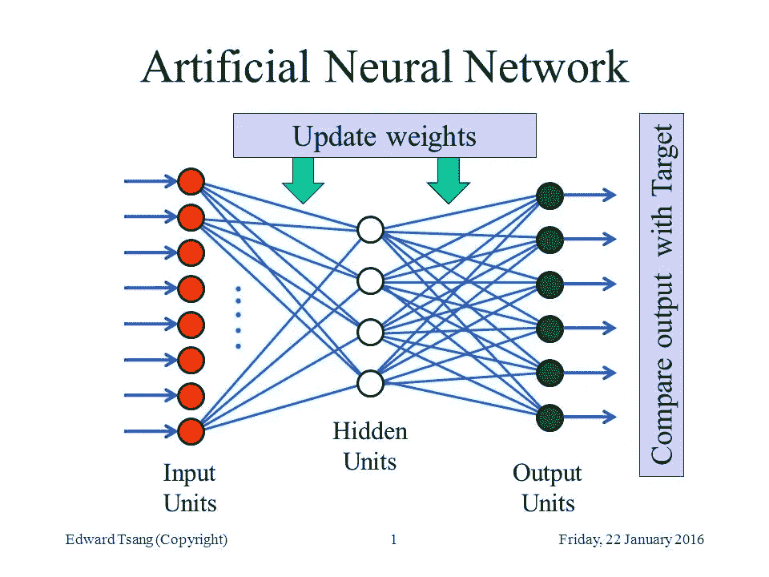
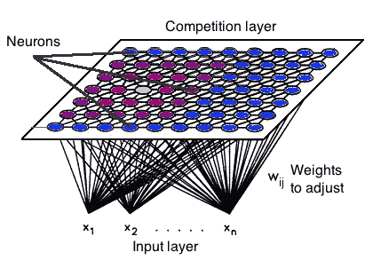

# 人工神经网络:人对机器？

> 原文：<https://towardsdatascience.com/artificial-neural-networks-man-vs-machine-194860bed5c2?source=collection_archive---------15----------------------->

*Photo Credits — Äkta människor SVT1*

*本文是探索 10 种基本机器学习算法的 BAI 系列文章的一部分**

这些机器人是人类还是某种机器？如果人类智能能够快速区分这两者，那么机器学习就必须依靠像人工神经网络这样的算法来做出预测。人工神经网络模仿人类大脑的结构，允许机器像人类一样思考吗？到底什么是 ann，它们是如何工作的，它们与其他机器学习算法有什么不同，它们在数据科学中的使用场景是什么？

计算机最初是围绕由预定步骤组成的算法设计的，以计算给定情况下的正确答案。这种对“绝对确定性”的信念使组织能够优化业务流程，加快会计程序，并改善他们的供应链。然而，图像分类、对象检测和语音转文本的挑战超出了传统算法的能力范围，因为它们需要能够基于不完全信息预测概率的算法。

1943 年，麦卡洛克和皮茨利用基于概率论的计算模型，结合阈值逻辑，创建了第一个人工神经网络。人工神经网络由三层相连的神经元组成:输入层将数据输入系统进行处理，隐藏层依靠一组加权输入通过激活函数产生结果，输出层产生程序的结果。*因此，人工神经网络是基于概率的算法，它们不像人脑那样“思考”，而是采用数学函数来应对随机学习环境的挑战*。

神经元或节点是一个数学函数，它接收输入并给出代表输入计算结果的单一输出。人工神经网络是通过例子和经验逐步学习的，而不是通过一系列命令。深度神经网络由数千个这样的神经元组成。*深度神经网络为数据科学家提供了一种处理模糊性和复杂性的方法，因为它们将问题分解为微小的子问题，从而允许构建输入如何呈现的精确表示。*

人工神经网络的每一层都以特定的权重处理其输入，从而产生操作值。然后，该值乘以生成的阈值，并发送至激活函数以计算输出。给定一组输入，二元、线性和非线性激活函数[用于定义每个神经元的输出。然后，该函数的输出作为另一层的输入发送，或者如果该层是最后一层，则作为网络的最终响应发送。](https://en.wikipedia.org/wiki/Activation_function)[【1】](#_ftn1)

通过使用被称为前向传播和反向传播的技术来标准化“权重”,进行人工神经网络的训练。人工神经网络的一个关键特征是这些迭代学习过程，其中数据一次一个地呈现给网络，并且与输入值相关联的权重以同样的方式进行调整。因此，训练人工神经网络在计算上是昂贵的，并且经常会导致过度拟合。

在前向传播中，样本权重通过输入被输入到人工神经网络，相应的样本输出被记录。更准确地说，前向传播是这样一个过程:向人工神经网络输入一组输入，以获得它们的分量乘积(即它们的点积)与它们的权重之和，然后将后者输入到激活函数，并将其数值与实际输出(地面真实值)进行比较。

[反向传播](https://en.wikipedia.org/wiki/Backpropagation)是一种用于计算梯度的方法，该方法需要校准网络中使用的权重。在反向传播数据中，科学家从输出单元通过隐藏单元到输入单元，考虑每层输出的误差范围。然后调整输入，使误差幅度最小。

最后，人工神经网络有几种形式。最初，感知器被设计为用于二元预测的线性分类器。这种模型的主要限制是数据必须是线性可分的，这导致了多层人工神经网络能够解决复杂的分类和回归任务。目前使用的神经网络有六种基本形式，它们集成了不同的数学运算和不同的参数集。前馈主要用于语音和声音识别，径向基函数已用于预测电网短缺，Kohonen 自组织是模式识别的逻辑选择，递归神经网络已用于语音到文本，卷积用于信号处理，模块化神经网络作为多模块决策策略的一部分。[【2】](#_ftn2)

*Kohonen Neural Networks*

回到我们从瑞典电视连续剧《真实人类》中拍摄的 hubots 照片，让我们假设我们的神经网络中有三个神经元(A、B、C)。[【3】](#_ftn3)在对数据进行训练并将神经元 A、B 和 C 分配给区分人和机器的重要特征之后，可以训练算法，当激活 A & C 时，图像属于人类，但如果 A & B 被激活，则图像属于机器。可以开发神经网络来破译与人类相关的一系列特征:同理心、自然智力、想象力、信仰、情感等。这些特征的定义本身就是人类的构造，超出了当前人工智能应用的范围。尽管如此，由数千个，甚至数百万个神经元组成的深度神经网络可以帮助我们更精确地描述这些特征，从而建立更好的预测模型来探索这种复杂性和模糊性。

李施伦克博士，[商业分析研究所](http://baieurope.com./)，2018 年 10 月 5 日

**之前在白系列中发表的关于基本机器学习算法的文章包括 k-NN —了解最近的邻居、* [*贝叶斯定理—熟能生巧*](https://medium.com/p/1ec7d4bcdb1d?source=your_stories_page---------------------------) *和* [*鲨鱼攻击—解释泊松回归的使用*](https://medium.com/p/449739bf96da?source=your_stories_page---------------------------)

Lee Schlenker 是商业分析和社区管理教授，也是 http://baieurope.com 商业分析研究所的负责人。在[可以看到他的 LinkedIn 个人资料](http://www.linkedin.com/in/leeschlenker.)在[可以在](https://twitter.com/DSign4Analytics)的 Twitter 上关注白

*************

[【1】](#_ftnref1)Gnanasegaram，t .(2018)，[人工神经网络——简介](https://medium.com/@tharanignanasegaram/artificial-neural-network-a-brief-introduction-572d462666f1)

[【2】](#_ftnref2)(2018)马拉德哈尔，k .，[目前在机器学习中使用的 6 种人工神经网络](https://www.analyticsindiamag.com/6-types-of-artificial-neural-networks-currently-being-used-in-todays-technology/)，印度分析

[【3】](#_ftnref3)这个例子的灵感来自约翰·奥拉芬瓦(John Olafenwa)，(2018)，[神经网络简介](https://medium.com/@johnolafenwa/introduction-to-neural-networks-ca7eab1d27d7)