# Matplotlib 中的“艺术家”——这是我在花大量时间在谷歌上搜索如何做之前想知道的。

> 原文：<https://towardsdatascience.com/artist-in-matplotlib-something-i-wanted-to-know-before-spending-tremendous-hours-on-googling-ca3ab05ab08d?source=collection_archive---------14----------------------->


*Cover Photo by* [*Caleb Salomons on Unsplash*](https://unsplash.com/photos/zpeA42RVIQg)

*最初发表于* [*dev.to*](https://dev.to/skotaro/artist-in-matplotlib---something-i-wanted-to-know-before-spending-tremendous-hours-on-googling-how-tos--31oo) *并稍作修改以适应 Medium 的编辑系统。*

matplotlib 确实是 Python 中一个非常棒的可视化工具。但是在 matplotlib 中调整细节确实是一件痛苦的事情。你可能很容易失去几个小时来找出如何改变你的一小部分情节。有时你甚至不知道零件的名称，这使得谷歌搜索变得更加困难。即使您发现了关于堆栈溢出的提示，您可能还需要花费几个小时来使它适合您的情况。通过了解 matplotlib 中的图形由什么组成以及可以用它们做什么，可以避免这些没有回报的任务。我想，和你们大多数人一样，我已经通过阅读 matplotlib 大师关于堆栈溢出的大量回答克服了我的绘图问题。最近，我注意到[一个关于](https://matplotlib.org/tutorials/index.html) `[Artist](https://matplotlib.org/tutorials/index.html)` [对象](https://matplotlib.org/tutorials/index.html)的官方教程非常有用，有助于理解我们使用 matplotlib 绘图时发生的事情，并减少调整所花费的大量时间。在这篇文章中，我想分享一些关于 matplotlib 中的`Artist`对象的基本知识，这将避免你花费数小时进行调整。

# 这个职位的目的

我不打算写像“当你想这样做时就这样做”这样的操作方法，而是 matplotlib 中`Artist`的一个基本概念，它可以帮助你选择合适的搜索查询，并为类似的问题安排一个解决方案。读完这篇文章后，你可能会更清楚地理解网上那些海量的食谱。这也适用于那些使用 seaborn 和熊猫绘图特性的人，这些特性是 matplotlib 的包装。

# 内容

这个帖子基本上是我用日语写的[原文的英文版，大部分基于](https://qiita.com/skotaro/items/08dc0b8c5704c94eafb9)[艺术家教程](https://matplotlib.org/tutorials/intermediate/artists.html)和[使用指南](https://matplotlib.org/tutorials/introductory/usage.html)(原文发表时为 2.1.1)

# 这是给谁的？

Matplotlib 用户

*   如果需要的话，他们能够制作情节，但通常很难使其适合出版或展示(并且对“最后一英里”是你真正想要的感到恼火)。
*   已经成功地找到了堆栈溢出的精确解决方案，但仍然不清楚它是如何工作的，也不能将其应用于其他问题。
*   找到了一个问题的多个提示，但不确定应该遵循哪一个。

# 环境

*   Python 3.6
*   matplotlib 2.2

```
%matplotlib inline
import matplotlib.pyplot as plt
import numpy as np 
```

`plt.show()`在本文中省略，因为我用的是 Jupyter notebook 的内联情节。

# 你应该知道的两种绘图风格

在研究`Artist`对象之前，我想提一下`plt.plot`和`ax.plot`的区别，或者 Pyplot 和面向对象的 API。虽然官方推荐使用面向对象的 API 风格，但是仍然有很多例子和代码片段使用 Pyplot 风格，包括官方文档。有些人甚至毫无意义地混合了两种风格，这给初学者造成了不必要的困惑。由于官方文档对它们有很好的注释，如[关于面向对象 API vs Pyplot 的注释](https://matplotlib.org/tutorials/introductory/lifecycle.html#a-note-on-the-object-oriented-api-vs-pyplot)和[编码风格](https://matplotlib.org/tutorials/introductory/usage.html#coding-styles)，这里我只对它们做一些评论。如果你要找他们的介绍，我推荐官方教程。

# 面向对象的 API 接口

这是推荐的风格，通常以`fig, ax = plt.subplots()`或其他类似的开头，后面是`ax.plot`、`ax.imshow`等。`fig`和`ax`其实就是`Artist` s，下面是一些最简单的例子。

```
# example 1
fig, ax = plt.subplots()
ax.plot(x,y) # example 2
fig = plt.figure()
ax = fig.add_subplot(1,1,1)
ax.plot(x, y)
```

有些教程使用`fig = plt.gcf()`和`ax = plt.gca()`。当你从 Pyplot 接口切换到 OO 接口时应该使用这些，但是一些基于 Pyplot 的代码包括，例如，无意义的`ax = plt.gca()`，它显然是在没有理解的情况下从基于 OO 的代码中复制的。如果有人有意切换界面，使用`plt.gcf()`或`plt.gca()`并不是一件坏事。考虑到隐式切换可能会给初学者带来困惑，如果`plt.subplots`或`fig.add_subplot`是公开可用的，那么从一开始就使用它们将是大多数情况下的最佳实践。

# Pyplot 界面

这是一种 MATLAB 用户友好的风格，所有的事情都用`plt.***`来完成。

```
# [https://matplotlib.org/tutorials/introductory/pyplot.html](https://matplotlib.org/tutorials/introductory/pyplot.html)def f(t):
    return np.exp(-t) * np.cos(2*np.pi*t)t1 = np.arange(0.0, 5.0, 0.1)
t2 = np.arange(0.0, 5.0, 0.02)
plt.figure(1)
plt.subplot(211)
plt.plot(t1, f(t1), 'bo', t2, f(t2), 'k')
plt.subplot(212)
plt.plot(t2, np.cos(2*np.pi*t2), 'r--')
plt.show() 
```

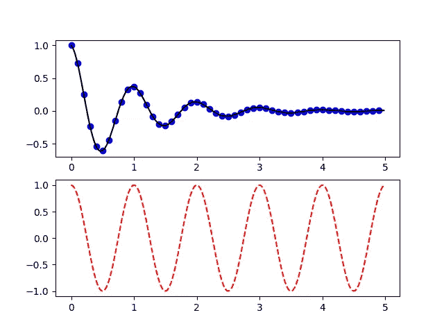

起初，它看起来非常简单，因为不需要考虑您正在处理哪些对象。你只需要知道你处于哪种“状态”，这也是为什么这种风格也被称为“有状态接口”。这里的“状态”指的是你当前所处的人物和支线剧情。正如你在 [Pyplot 教程](https://matplotlib.org/tutorials/introductory/pyplot.html)中看到的，如果你的情节不是那么复杂，它会给出一个不错的数字。虽然 Pyplot 界面提供了很多改变绘图设置的功能，但你可能会在几个小时、几天、几个月内达到它的极限(如果你足够幸运的话，可能永远也不会),这取决于你想做什么。这个阶段需要切换到 OO 界面。这也是我一开始就推荐使用 OO 接口的原因。但 Pyplot 对于快速检查或任何需要粗略绘图的场合仍然有用。

# matplotlib 中的层次结构

谷歌几次后，你会注意到 matplotlib 有一个层次结构，由通常被称为`fig`和`ax`的东西组成。matplotlib 1.5 的旧文档有一个很好的图像来解释这一点。

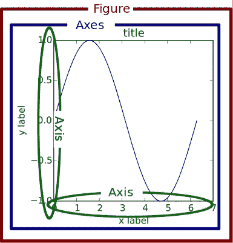

实际上，这三个组件是被称为“容器”的特殊`Artist`(还有第四个容器`Tick`，我们稍后会看到。这种层次结构使得上面的简单例子更加清晰。

```
# example 1
fig, ax = plt.subplots()
# make Figure and Axes which belongs to 'fig'# example 2
fig = plt.figure()
# make Figure
ax = fig.add_subplot(1,1,1)
# make Axes belonging to fig 
```

进一步查看`fig`和`ax`的属性有助于您更好地理解层次结构。

```
fig = plt.figure()
ax = fig.add_subplot(1,1,1) # make a blank plotting area
print('fig.axes:', fig.axes)
print('ax.figure:', ax.figure)
print('ax.xaxis:', ax.xaxis)
print('ax.yaxis:', ax.yaxis)
print('ax.xaxis.axes:', ax.xaxis.axes)
print('ax.yaxis.axes:', ax.yaxis.axes)
print('ax.xaxis.figure:', ax.xaxis.figure)
print('ax.yaxis.figure:', ax.yaxis.figure)
print('fig.xaxis:', fig.xaxis)
```

输出:

```
fig.axes: [<matplotlib.axes._subplots.AxesSubplot object at 0x1167b0630>]
ax.figure: Figure(432x288)
ax.xaxis: XAxis(54.000000,36.000000)
ax.yaxis: YAxis(54.000000,36.000000)
ax.xaxis.axes: AxesSubplot(0.125,0.125;0.775x0.755)
ax.yaxis.axes: AxesSubplot(0.125,0.125;0.775x0.755)
ax.xaxis.figure: Figure(432x288)
ax.yaxis.figure: Figure(432x288)
---------------------------------------------------------------------------
AttributeError                            Traceback (most recent call last)
<ipython-input-21-b9f2d5d9fe09> in <module>()
      9 print('ax.xaxis.figure:', ax.xaxis.figure)
     10 print('ax.yaxis.figure:', ax.yaxis.figure)
---> 11 print('fig.xaxis:', fig.xaxis)

AttributeError: 'Figure' object has no attribute 'xaxis'
```

从这些结果中，我们可以预期关于`Figure`、`Axes`和`Axis`的层级的以下规则。

*   `Figure`知道`Axes`但不知道`Axis`。
*   `Axes`知道`Figure`和`Axis`两者。
*   `Axis`知道`Axes`和`Figure`两者。
*   `Figure`可以包含多个`Axes`，因为`fig.axes`是`Axes`的列表。
*   `Axes`可以只属于单个`Figure`因为`ax.figure`不是列表。
*   出于类似的原因，`Axes`可以分别有一个`XAxis`和`YAxis`。
*   `XAxis`和`YAxis`可以属于单个`Axes`，相应地也可以属于单个`Figure`。

# 你情节中的一切都是一个`Artist`

当前文档中的[使用指南](https://matplotlib.org/tutorials/introductory/usage.html)没有使用图来解释层次结构，而是使用“图的剖析”来解释图中的所有组件，这也是一种信息。

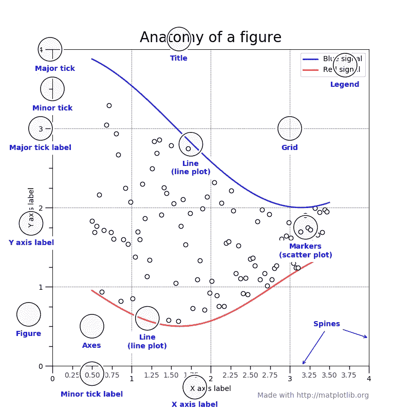

从代表数据的线和点，到 x 轴上的小记号和文本标签，图形中的每一个组件都是一个`Artist` object⁴.`Artist`有两种类型，容器和原语。正如我在上一节中所写的，matplotlib 的层次结构中的三个组件，`Figure`、`Axes`和`Axis`是容器，它们可以包含更低的容器和多个原语，例如由`ax.plot`生成的`Line2D`、`ax.scatter`生成的`PathCollection`或由`ax.annotate`生成的`Text`。甚至刻度线和标签实际上都是属于第四个容器`Tick`的`Line2D`和`Text`。

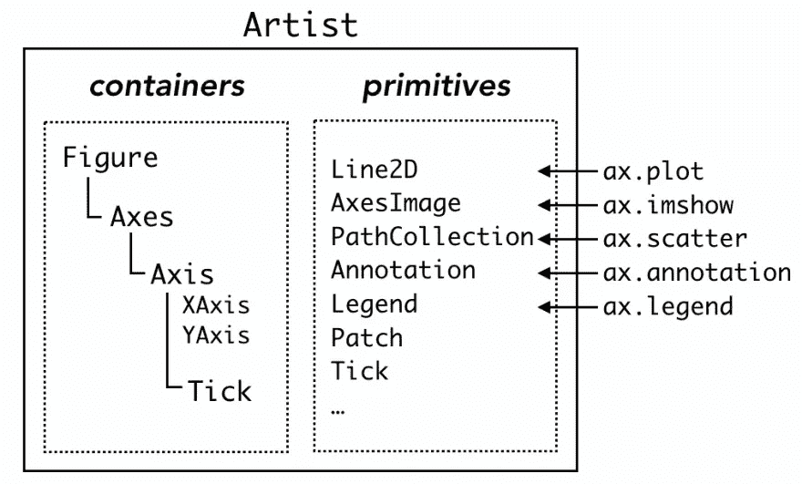

对于每种类型的原语，容器都有许多“盒子”(Python 列表，技术上来说)。例如，一个`Axes`对象`ax`，在实例化之后有一个空列表`ax.lines`。常用命令`ax.plot`在列表中添加一个`Line2D`对象，并静默进行其他伴随设置。

```
x = np.linspace(0, 2*np.pi, 100)

fig = plt.figure()
ax = fig.add_subplot(1,1,1)
print('ax.lines before plot:\n', ax.lines) # empty list# add Line2D in ax.lines
line1, = ax.plot(x, np.sin(x), label='1st plot') 
print('ax.lines after 1st plot:\n', ax.lines)# add another Line2D
line2, = ax.plot(x, np.sin(x+np.pi/8), label='2nd plot') 
print('ax.lines after 2nd plot:\n', ax.lines)ax.legend()
print('line1:', line1)
print('line2:', line2)
```

输出:

```
ax.lines before plot:
 []
ax.lines after 1st plot:
 [<matplotlib.lines.Line2D object at 0x1171ca748>]
ax.lines after 2nd plot:
 [<matplotlib.lines.Line2D object at 0x1171ca748>, <matplotlib.lines.Line2D object at 0x117430550>]
line1: Line2D(1st plot)
line2: Line2D(2nd plot) 
```

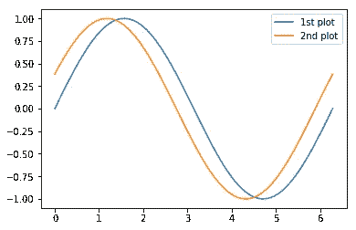

w

以下部分总结了四种容器。表格复制自[艺人教程](https://matplotlib.org/tutorials/intermediate/artists.html)。

# `Figure`

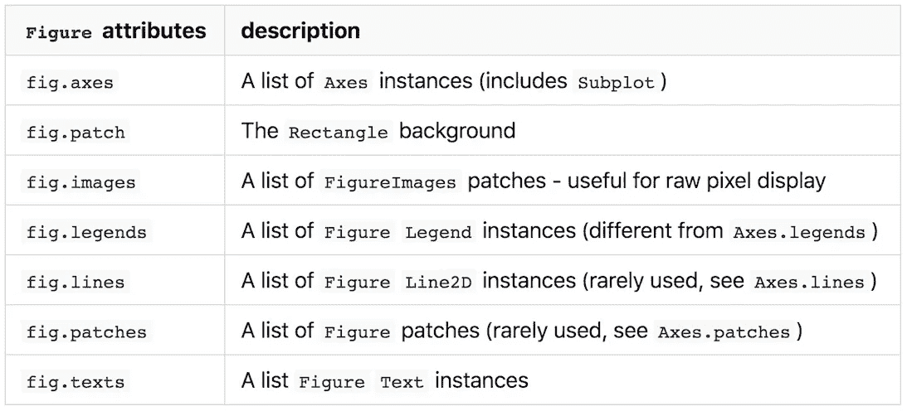

具有复数名称的属性是列表，具有单数名称的属性表示单个对象。值得注意的是，属于`Figure`的`Artist`默认使用`Figure`坐标。这可以用 `[Transforms](https://matplotlib.org/users/transforms_tutorial.html)`转换成`Axes`或者数据坐标[，不在本帖讨论范围内。](https://matplotlib.org/users/transforms_tutorial.html)

# `fig.legend`和`ax.legend`

`fig.legends`是通过`[fig.lenged](https://matplotlib.org/api/_as_gen/matplotlib.figure.Figure.html#matplotlib.figure.Figure.legend)` [方法](https://matplotlib.org/api/_as_gen/matplotlib.figure.Figure.html#matplotlib.figure.Figure.legend)添加的图例的“框”。你可能会想“那是干什么的？我们有`ax.legend`。”不同之处在于每种方法的范围。`ax.legend`只收集属于`ax`的`Artist`的标签，`fig.legend`收集`fig`下所有`Axes`的标签。这很有用，例如，当你使用`ax.twinx`绘图时。简单的用两次`ax.legend`就做了两个图例，一般不可取。

```
x = np.linspace(0, 2*np.pi, 100)

fig = plt.figure()
ax = fig.add_subplot(111)
ax.plot(x, np.sin(x), label='sin(x)')
ax1 = ax.twinx()
ax1.plot(x, 2*np.cos(x), c='C1', label='2*cos(x)') 
# cf. 'CN' notation
# https://matplotlib.org/tutorials/colors/colors.html#cn-color-selection

ax.legend()
ax1.legend()
```

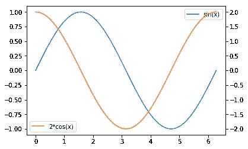

将它们放在一起的一个著名方法是将两者的图例处理程序和标签结合起来。

```
# Executing this part in a different notebook cell shows an updated figure.
handler, label = ax.get_legend_handles_labels()
handler1, label1 = ax1.get_legend_handles_labels()
ax.legend(handler+handler1, label+label1, loc='upper center', title='ax.legend')
# Legend made by ax1.legend remains
fig
```

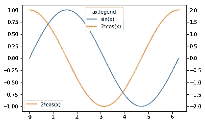

这可以通过`fig.legend`轻松完成，而无需在[版本 2.1](https://matplotlib.org/users/whats_new.html#figure-legend-can-be-called-without-arguments) ⁵.中引入的参数默认情况下，位置由`Figure`坐标指定，当您想将其放在绘图框中时，该坐标没有用。你可以用`bbox_transform`关键字把它改成`Axes`坐标。

```
fig.legend(loc='upper right', bbox_to_anchor=(1,1), bbox_transform=ax.transAxes, title='fig.legend\nax.transAxes')
fig
```

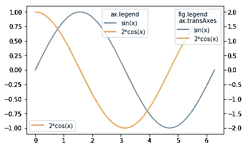

# `Axes`

> *matplotlib . axes . axes 是 matplotlib 宇宙的中心*

这是引用自[艺人教程](https://matplotlib.org/tutorials/intermediate/artists.html#axes-container)的话。这是非常正确的，因为 matplotlib 中数据可视化的重要部分都来自于`Axes`方法。

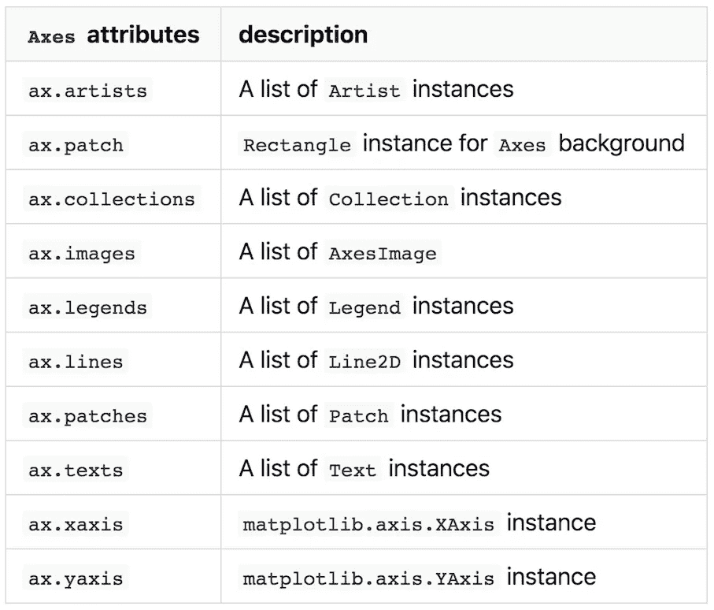

经常使用的命令如`ax.plot`和`ax.scatter`被称为“助手方法”,它们在适当的容器中添加相应的`Artist`,并做其他杂七杂八的工作。

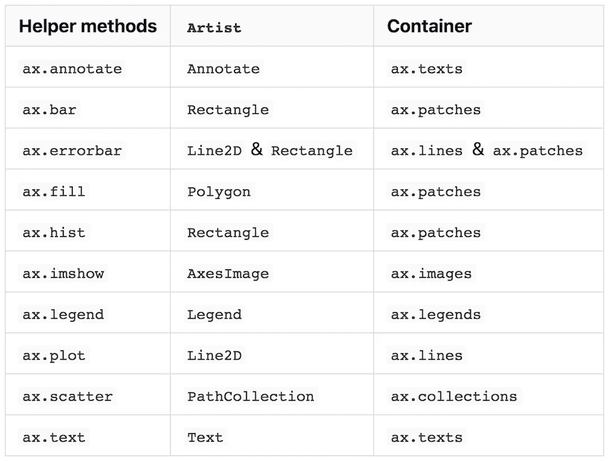

这个例子显示了`ax.plot`和`ax.scatter`在相应的列表中添加`Line2D`和`PathCollection`对象。

```
x = np.linspace(0, 2*np.pi, 100)

fig = plt.figure()
ax = fig.add_subplot(1,1,1)
# empty Axes.lines
print('ax.lines before plot:\n', ax.lines) # add Line2D in Axes.lines
line1, = ax.plot(x, np.sin(x), label='1st plot') 
print('ax.lines after 1st plot:\n', ax.lines)# add another Line2D
line2, = ax.plot(x, np.sin(x+np.pi/8), label='2nd plot') 
print('ax.lines after 2nd plot:\n', ax.lines)

print('ax.collections before scatter:\n', ax.collections)
scat = ax.scatter(x, np.random.rand(len(x)), label='scatter') # add PathCollection in Axes.collections
print('ax.collections after scatter:\n', ax.collections)
ax.legend()
print('line1:', line1)
print('line2:', line2)
print('scat:', scat)
ax.set_xlabel('x value')
ax.set_ylabel('y value')
```

输出:

```
ax.lines before plot:
 []
ax.lines after 1st plot:
 [<matplotlib.lines.Line2D object at 0x1181d16d8>]
ax.lines after 2nd plot:
 [<matplotlib.lines.Line2D object at 0x1181d16d8>, <matplotlib.lines.Line2D object at 0x1181d1e10>]
ax.collections before scatter:
 []
ax.collections after scatter:
 [<matplotlib.collections.PathCollection object at 0x1181d74a8>]
line1: Line2D(1st plot)
line2: Line2D(2nd plot)
scat: <matplotlib.collections.PathCollection object at 0x1181d74a8>
```

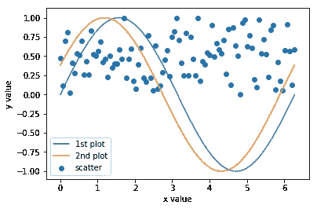

# 不建议重复使用打印对象

在知道列表中包含绘制的对象后，您可能会想到通过将这些对象附加到另一个`Axes.lines`列表中来重用这些对象，以加快绘制速度。[艺术家教程](https://matplotlib.org/tutorials/intermediate/artists.html#axes-container)明确指出不推荐这样做，因为助手方法除了创建`Artist`还能做很多事情。一个快速测试告诉我们这不是一个好主意。

```
x = np.linspace(0, 2*np.pi, 100)

fig = plt.figure()
# upper subplot
ax1 = fig.add_subplot(2,1,1) 
# create a Line2D object
line, = ax1.plot(x, np.sin(x), label='ax1 line') 
ax1.legend()

# lower subplot
ax2 = fig.add_subplot(2,1,2) 
# try to reuse same `Line2D` object in another `Axes`
ax2.lines.append(line)
```

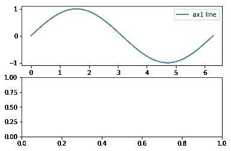

甚至`add_line`方法也不管用。

```
ax2.add_line(line)
```

输出:

```
ValueError: Can not reset the axes. You are probably trying to re-use an artist in more than one Axes which is not supported
```

这个错误消息表明一个`Artist`，容器或者原语，不能包含在多个容器中，这与每个`Artist`将父容器作为一个空对象而不是在一个列表中的事实是一致的

```
print('fig:', id(fig)) 
print('ax1:', id(ax1))
print('line.fig:', id(line.figure))
print('line.axes:', id(line.axes))
```

输出:

```
fig: 4707121584
ax1: 4707121136
line.fig: 4707121584
line.axes: 4707121136
```

如果你以适当的方式做了所有必要的事情，这也许是可能的，但是这远不是仅仅把一个对象附加到一个列表中的第一想法，并且是不这样做的足够的理由。

# `Axis`

虽然`Axis`以`XAxis`或`YAxis`出现，只包含与记号和标签相关的`Artist`，但它经常需要一些谷歌搜索进行细微调整，偶尔需要一个小时。我希望这一部分能帮助你快速完成工作。

由于[美工教程](https://matplotlib.org/tutorials/intermediate/artists.html#axis-containers)不像其他容器一样有表，所以我做了一个类似的表。

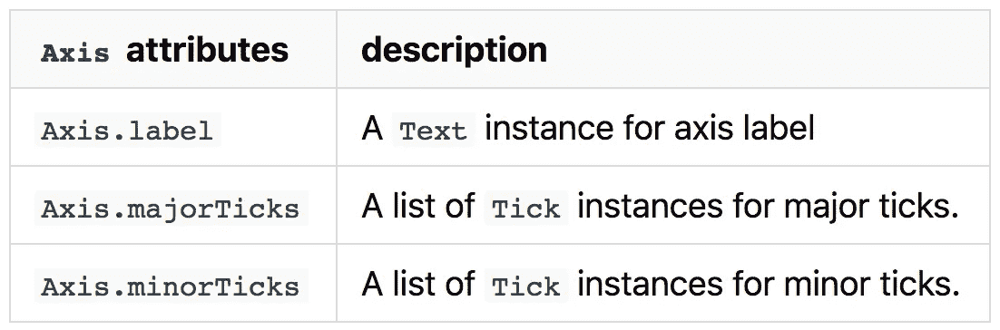

我们在示例中使用`ax.set_xlabel`和`ax.set_ylabel`来表示`Axes`容器。你可能认为这些方法改变了`Axes`实例(`ax`)的 X 和 Y 标签，但实际上它们分别改变了`XAxis`和`YAxis`、`ax.xaxis.label`和`ax.yaxis.label`的`label`属性。

```
xax = ax.xaxis
print('xax.label:', xax.label)# seven major ticks (from 0 to 6) and
# two invisible ticks locating outside of the figure
print('xax.majorTicks:\n', xax.majorTicks) # two ticks outside the figure
print('xax.minorTicks:\n', xax.minorTicks) 
```

输出:

```
xax.label: Text(0.5,17.2,'x value')
xax.majorTicks:
 [<matplotlib.axis.XTick object at 0x117ae4400>, <matplotlib.axis.XTick object at 0x117941128>, <matplotlib.axis.XTick object at 0x11732c940>, <matplotlib.axis.XTick object at 0x1177d0470>, <matplotlib.axis.XTick object at 0x1177d0390>, <matplotlib.axis.XTick object at 0x1175058d0>, <matplotlib.axis.XTick object at 0x1175050b8>, <matplotlib.axis.XTick object at 0x117bf65c0>, <matplotlib.axis.XTick object at 0x117bf6b00>]
xax.minorTicks:
 [<matplotlib.axis.XTick object at 0x117ab5940>, <matplotlib.axis.XTick object at 0x117b540f0>]
```

# `ax.set_***`方法是临时的

`Axes`有许多“set_***”辅助方法来修改`Axis`和`Tick`实例的属性和值。它们非常方便，matplotlib 初学者遇到的大部分问题都可以用它们来解决。值得注意的是，这些“set_***”方法是静态的。当某些内容发生变化时，对它们所做的更改不会更新。例如，如果您使用`ax.set_xticks`更改 X 刻度以使它们在第一个图中看起来更好，而第二个图超出了第一个图的 X 范围，结果看起来不像它应该的样子。

```
x = np.linspace(0, 2*np.pi, 100)

fig = plt.figure()
ax = fig.add_subplot(1,1,1)# X range: 0 to 2pi
line1, = ax.plot(x, np.sin(x), label='') 
ax.set_xticks([0, 0.5*np.pi, np.pi, 1.5*np.pi, 2*np.pi])# X range: 0 to 3p
iline2, = ax.plot(1.5*x, np.sin(x), label='')
```

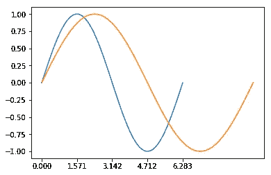

# `Ticker`那你呢

如果不使用“set_***”方法更改与记号相关的设置，则记号和记号标签会相应地为每个新绘图自动更新。这是由`Ticker`完成的，更具体地说，是由格式化程序和定位器完成的。尽管它们对于与 tick 相关的设置非常重要，但是如果您已经通过复制和粘贴堆栈溢出 answers⁶.解决了问题，那么您可能对它们知之甚少让我们看看前面的例子中发生了什么。

```
xax = ax.xaxis
yax = ax.yaxis
print('xax.get_major_formatter()', xax.get_major_formatter())
print('yax.get_major_formatter()', yax.get_major_formatter())
print('xax.get_major_locator():',  xax.get_major_locator())
print('yax.get_major_locator():',  yax.get_major_locator())
```

输出:

```
xax.get_major_formatter() <matplotlib.ticker.ScalarFormatter object at 0x118af4d68>
yax.get_major_formatter() <matplotlib.ticker.ScalarFormatter object at 0x118862be0>
xax.get_major_locator(): <matplotlib.ticker.FixedLocator object at 0x1188d5908>
yax.get_major_locator(): <matplotlib.ticker.AutoLocator object at 0x118aed1d0>
```

`ScalarFormatter`是为 X 轴和 Y 轴设置的，因为它是默认的格式化程序，我们没有改变它。另一方面，当默认`AutoLocator`被设置为 Y 轴时，`FixedLocator`被设置为 X 轴，我们使用`ax.set_xticks`方法改变了刻度位置。从它的名字可以想象，`FixedLocator`固定刻度位置，即使绘图范围改变也不更新。

让我们把前面例子中的`Ticker`换成`ax.set_xticks`。

```
# this is required to used `Ticker`
import matplotlib.ticker as ticker # locate ticks at every 0.5*piax.xaxis.set_major_locator(ticker.MultipleLocator(0.5*np.pi))# display the figure again with new locator.
fig
```

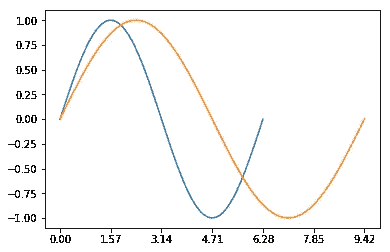

格式化程序怎么样？

```
# FuncFormatter can be used as a decorator
@ticker.FuncFormatter 
def major_formatter_radian(x, pos):
    # probably not the best way to show radian tick labels
    return '{}$\pi$'.format(x/np.pi) 

ax.xaxis.set_major_formatter(major_formatter_radian)
fig
```

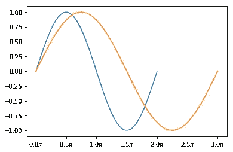

好吧，也许你还想做些调整，但我想这已经足够清楚了。

可以在 matplotlib 图库了解更多。
[图库>记号格式化器](https://matplotlib.org/gallery/ticks_and_spines/tick-formatters.html)
[图库>记号定位器](https://matplotlib.org/gallery/ticks_and_spines/tick-locators.html)

# `xunits`关键字为`ax.plot`

供您参考，`ax.plot`有`xunits`关键词，是文档中暂时没有描述的[。我从未尝试过使用这个选项，但是你可以在](https://matplotlib.org/api/_as_gen/matplotlib.axes.Axes.plot.html#matplotlib.axes.Axes.plot)[图库>弧度刻度](https://matplotlib.org/gallery/units/radian_demo.html)中看到一个例子，并在这里了解更多关于`matplotlib.units.ConversionInterface`的信息。

```
import numpy as np
from basic_units import radians, degrees, cos
from matplotlib.pyplot import figure, show

x = [val*radians for val in np.arange(0, 15, 0.01)]

fig = figure()
fig.subplots_adjust(hspace=0.3)

ax = fig.add_subplot(211)
line1, = ax.plot(x, cos(x), xunits=radians)

ax = fig.add_subplot(212)
line2, = ax.plot(x, cos(x), xunits=degrees)
```

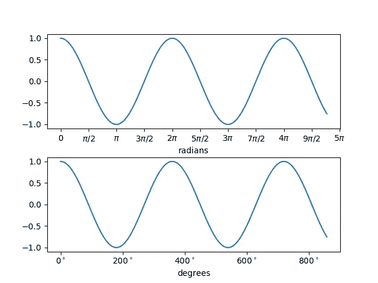

# `Tick`

最后，我们到达了 matplotlib 层次结构的底部。`Tick`是一个小容器，主要存放刻度本身的短线和刻度标签的文本。

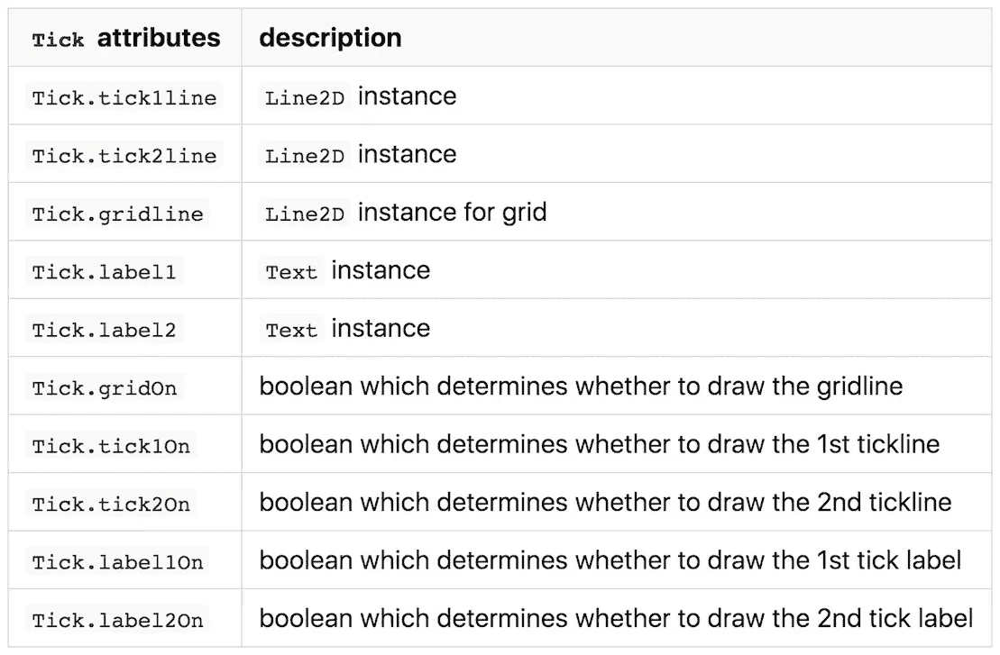

正如我们在`Axis`中看到的，`Tick`也作为`XTick`或`YTick`出现。第一个和第二个表示`XTick`上下两侧的刻度，而第二个表示`YTick`左右两侧的刻度。默认情况下，后面的记号不可见。

```
# tick at 0.5 pi in the previous figure
xmajortick = ax.xaxis.get_major_ticks()[2] 
print('xmajortick', xmajortick)
print('xmajortick.tick1line', xmajortick.tick1line)
print('xmajortick.tick2line', xmajortick.tick2line)
print('xmajortick.gridline', xmajortick.gridline)
print('xmajortick.label1', xmajortick.label1)
print('xmajortick.label2', xmajortick.label2)
print('xmajortick.gridOn', xmajortick.gridOn)
print('xmajortick.tick1On', xmajortick.tick1On)
print('xmajortick.tick2On', xmajortick.tick2On)
print('xmajortick.label1On', xmajortick.label1On)
print('xmajortick.label2On', xmajortick.label2On)
```

输出:

```
xmajortick <matplotlib.axis.XTick object at 0x11eec0710>
xmajortick.tick1line Line2D((1.5708,0))
xmajortick.tick2line Line2D()
xmajortick.gridline Line2D((0,0),(0,1))
xmajortick.label1 Text(1.5708,0,'0.5$\\pi$')
xmajortick.label2 Text(0,1,'0.5$\\pi$')
xmajortick.gridOn False
xmajortick.tick1On True
xmajortick.tick2On False
xmajortick.label1On True
xmajortick.label2On False
```

由于有许多助手方法、`Ticker`和`[Axes.tick_params](https://matplotlib.org/api/_as_gen/matplotlib.axes.Axes.tick_params.html)`，我们几乎不需要直接处理`Tick`。

# 是时候定制你的默认风格了

看一下默认样式的参数列表。
[教程>定制 matplotlib >一个示例 matplotlibrc 文件](https://matplotlib.org/tutorials/introductory/customizing.html#a-sample-matplotlibrc-file)
我想现在你不仅能弄清楚一个参数是干什么的，还能弄清楚一个参数实际上对哪个`Artist`有影响，这让你为 googling⁷.节省时间您还可以自定义默认样式，而不需要生成 matplotlibrc 文件，只需在代码的开头键入如下内容。

```
plt.rcParams['lines.linewidth'] = 2
```

# (再次)去看医生

你们中的一些人可能对 matplotlib 的文档有负面的印象。我同意很难从一长串列表中找到适合你的问题的例子。但是自从 2.1⁸.版本以来，它已经有了很大改进如果您比较改进前后的相应页面，这一点很明显。

*   2 . 1 . 0(2017 年 10 月)[画廊](https://matplotlib.org/2.1.0/gallery/index.html)、[教程](https://matplotlib.org/2.1.0/tutorials/index.html)、[概述](https://matplotlib.org/2.1.0/contents.html)
*   2 . 0 . 2(2017 年 5 月)[实例](https://matplotlib.org/2.0.2/examples/index.html)、[图库](https://matplotlib.org/2.0.2/gallery.html)、[概述](https://matplotlib.org/2.0.2/contents.html)

我推荐看一看[最新图库](https://matplotlib.org/gallery/index.html)和[教程](https://matplotlib.org/tutorials/index.html#)，现在已经很整洁了。

***感谢阅读。享受用 matplotlib 绘图(和谷歌搜索)*** 📈🤗📊

脚注:

1.  是的，如果你没有懒到在使用之前阅读教程的话，教程总是有帮助的。事实上，当我几年前开始用 matplotlib 绘图时，我可能曾经试图阅读过一次关于 Artist 的文档，但我很确定当时我认为“好吧，这不适合我”。(可能不是现在的教程。)
2.  下面是这个图的示例代码[https://matplotlib.org/gallery/showcase/anatomy.html](https://matplotlib.org/gallery/showcase/anatomy.html)
3.  当然还有其他的`Artist`[这一页](https://matplotlib.org/api/artist_api.html)对于那些想要大图的人来说是一个很好的入口。您可以点击`Artist`名称获得进一步解释。
4.  从技术上来说，`Artist`让我们在 matplotlib 的画布上绘制你漂亮的数据。多么可爱的说辞。
5.  `fig.legend`没有当前版本有用，因为根据[版本的文档，它需要图例手柄和标签。2.0.2](https://matplotlib.org/2.0.2/api/figure_api.html?highlight=figure%20legend#matplotlib.figure.Figure.legend)
6.  当你从“set_***”方法进一步谷歌 tick 相关设置，并放弃为你自己的问题安排它们时，你会经常遇到使用它们的食谱。(没错，就是几个月前的我。)
7.  或者你可以像我一样，利用节省下来的时间深入挖掘。
8.  这里是一个很好的阅读，以了解如何困难，以改善文件。 [Matplotlib 引导 Dev 解释为什么他不能修复 Docs | NumFOCUS](https://www.numfocus.org/blog/matplotlib-lead-developer-explains-why-he-cant-fix-the-docs-but-you-can/)

*原载于* [*dev.to*](https://dev.to/skotaro/artist-in-matplotlib---something-i-wanted-to-know-before-spending-tremendous-hours-on-googling-how-tos--31oo) *。*