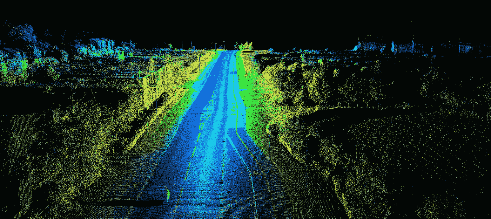

# 作为 2019 年的管理者，你将真正需要了解 AI 的哪些方面？

> 原文：<https://towardsdatascience.com/as-a-manager-in-2019-what-will-you-really-need-to-know-about-ai-afb3cb356fd3?source=collection_archive---------26----------------------->

Photo Credits — Tech Crunch

试图预测未来就像试图在没有灯的夜晚开车行驶在乡间小路上，同时从后窗往外看一样——彼得·德鲁克

彼得·德鲁克的漫长职业生涯早于人工智能。在他的一生中，领导力都与人有关，而数据科学则局限于编码机器。他关于管理的开创性论文本质上是关于应用过去的经验来开发当前的市场机会。人工智能可能改变了一切:模糊了人类和机械流程之间的界限，并将管理重点从研究最佳实践转移到影响消费者行为。作为 2019 年的管理者，你真正需要了解的人工智能知识有哪些？

人工智能的商业价值与其降低组织变化成本和/或市场预测成本的潜力相关。今天，“狭义”人工智能应用程序可以比经理更快、更准确地执行计划、组织和预算任务。明天，“广泛的”人工智能应用将提供多任务、多领域的服务，这些服务将动摇公司和市场的基础。在可预见的未来，“通用”人工智能将整合感知和推理的认知能力，这可能会有效地改变我们思考工作的方式。

试图忽视这些简单事实的经理们正有效地行驶在黑暗的道路上，他们的眼睛紧紧盯着过去。普华永道预测，人工智能的实施将消除目前 20%至 40%的就业机会。[【1】](http://file///C:/Users/Lee/Dropbox/Business%20Analytics%20Insitute/aim2.docx#_ftn1)通过将强化学习、机器人、计算机视觉和自然语言处理交给独立承包商和跨国公司，人工智能应用已经在平整管理领域。*无论你是否敢于展望未来，管理都不会是一成不变的。*

一个事实仍然可以掩盖另一个事实。客户和股东不是根据事实思考、决定或行动，而是根据对数据的感知。建立愿景、建设社区和激励员工的基本管理活动是人类固有的活动。未来的竞争优势不会来自人工智能的数据或算法，而是来自经理们获得和培养他们商业社区的信任。

管理人员需要发展哪些技能才能利用人工智能？管理人员将不会编写代码，而是定义和评估人工智能在其业务中的方向和采用率。他们需要思考可能会发生什么，并问自己如何用实验来检验这是不是真的。管理人才将越来越多地被定义为与判断相关的技能:指导、激励和采取道德立场。管理层将专注于开发运营流程，以优化专注于判断的员工团队和专注于预测的人工智能代理。

当我们抓住机会在数据科学平台上投入时间和金钱时，我们很可能错过了更大的图景。数据只不过是一组等待管理者提出正确问题的答案。算法可以发现数据中的模式，但无法解释它们的意义。归纳、演绎和绑架仍将是管理决策的核心。如果机器学习旨在寻找数据集中的相似性，有才华的经理将继续关注运营流程中例外(异常值)的重要性。

最后，管理者和数据科学家都不是在真空中运作，而是与他们的同事和客户协同工作。为了让人工智能产生巨大影响，管理者必须创建人工智能数据就绪生态系统。招募具有分析思维的合作者是必须的——正如野田友男教授最近建议的那样，“只有好人才能创造出好的人工智能”[【2】](http://file///C:/Users/Lee/Dropbox/Business%20Analytics%20Insitute/aim2.docx#_ftn2)一个经理的面包和黄油将来自于创造一个工作环境，在这个环境中，他的同事、商业伙伴和员工使用数据来应对他们的商业挑战。由于最有价值的数据往往在自己组织的边界之外，鼓励负责任地使用客户数据将是他们的首要任务。在可预见的未来，和过去一样，管理人员的表现将不会根据他或她在电脑前做了什么来评估，而是根据他们在同事和客户面前能做出什么来评估。

在我们关于“[人工智能管理](http://lp.baieurope.com/)”的免费网络研讨会上，我们将探讨这些论点，并提供每个论点的真实例子商业分析实践是商业分析学院的核心和灵魂。在我们在巴约纳和波士顿的暑期学校，以及我们在欧洲各地的硕士班中，商业分析研究所专注于数字经济学、管理决策、机器学习和数据故事，将使分析为您和您的组织工作。

Lee Schlenker 是商业分析和社区管理教授，也是 http://baieurope.com 商业分析学院的负责人。他的 LinkedIn 个人资料可以在 www.linkedin.com/in/leeschlenker 的[查看。你可以在 https://twitter.com/DSign4Analytics](http://file///C:/Users/Lee/Downloads/www.linkedin.com/in/leeschlenker)[的推特上关注我们](https://twitter.com/DSign4Analytics)

****

[【1】](http://file///C:/Users/Lee/Dropbox/Business%20Analytics%20Insitute/aim2.docx#_ftnref1)普华永道，(2018)，[人工智能和相关技术对工作岗位的净影响会是什么](https://www.pwc.co.uk/economic-services/ukeo/ukeo-july18-full-report.pdf) …

[【2】](http://file///C:/Users/Lee/Dropbox/Business%20Analytics%20Insitute/aim2.docx#_ftnref2)IESE，[人工智能改变管理的 10 种方式](https://www.iese.edu/en/about-iese/news-media/news/2018/april/10-ways-artificial-intelligence-is-transforming-management)