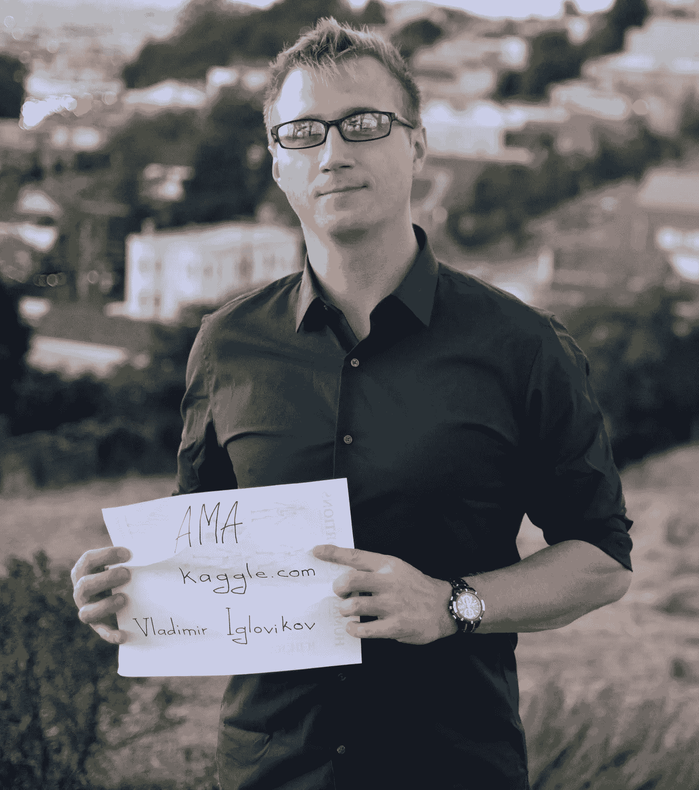
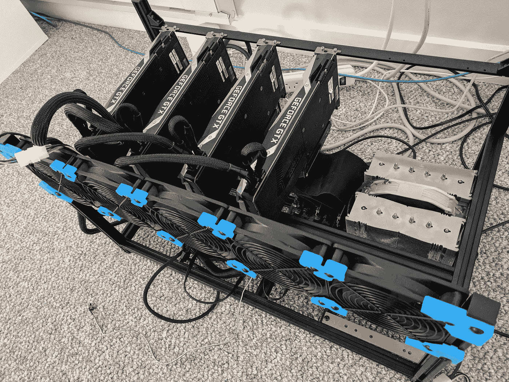
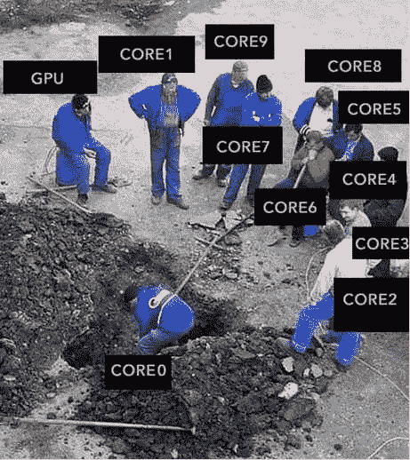
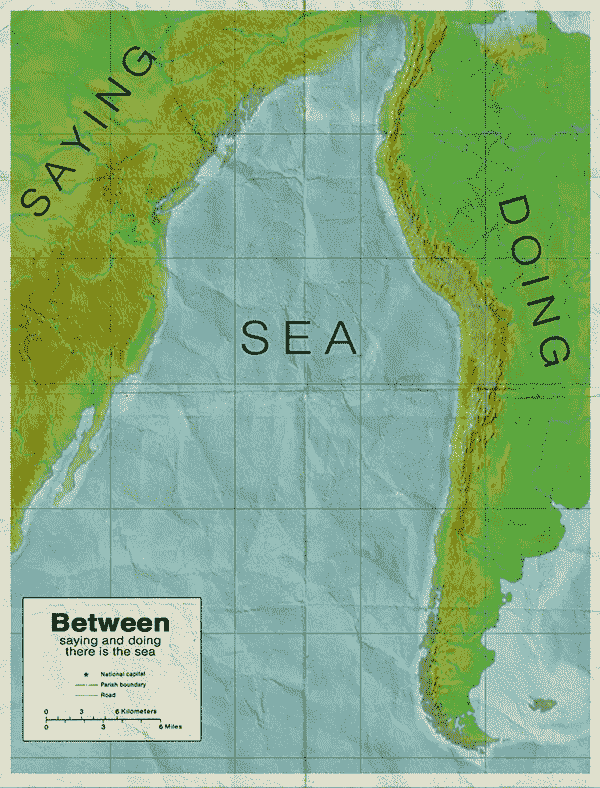

# 问我任何事——与卡格勒大师弗拉基米尔·伊格洛维科夫的对话

> 原文：<https://towardsdatascience.com/ask-me-anything-session-with-a-kaggle-grandmaster-vladimir-i-iglovikov-942ad6a06acd?source=collection_archive---------0----------------------->

你好，我叫弗拉基米尔。

从大学毕业并获得理论物理学位后，我搬到了硅谷，在行业中寻找数据科学的角色。这让我在 Lyft 的自动驾驶汽车部门找到了目前的职位，从事计算机视觉相关应用的工作。

在过去的几年里，我在机器学习竞赛上投入了大量的时间。一方面，这很有趣，但另一方面，这也是提高数据科学技能的非常有效的方式。我不会说所有的比赛都很容易，我也不会说我在所有的比赛中都取得了好成绩。但时不时我还是能接近巅峰，最终有了 [Kaggle 特级大师](https://www.kaggle.com/iglovikov)的称号。

感谢 [@Lasteg](https://medium.com/@lasteg) 提出了这个 AMA(向我提问环节)的想法，并在 [Reddit](https://www.reddit.com/r/MachineLearning/comments/9mreca/d_ama_with_vladimir_kaggle_grand_master/) 、 [Kaggle](https://www.kaggle.com/general/68121) 和 [science.d3.ru(俄语)](https://science.d3.ru/ama-s-computer-vision-engineer-rabotaiushchim-nad-zadachami-kompiuternogo-zreniia-dlia-self-driving-cars-vladimirom-iglovikovym-1672338/?sorting=rating)上收集问题。有很多问题。我会尽我所能回答这个问题，但是我不可能在这篇博文中回答所有的问题。如果有你问的问题，但在下面的文字中没有提到，就写在评论中，我会尽力回答。

以下是我(或我的团队)有幸在排行榜上名列前茅的深度学习挑战列表。：

*   第十名:[超声波神经分割](https://www.kaggle.com/c/ultrasound-nerve-segmentation)
*   第三名: [Dstl 卫星影像特征检测](https://www.kaggle.com/c/dstl-satellite-imagery-feature-detection)
*   第二名:[安全通道:对航拍图像中的车辆进行检测和分类](https://www.datasciencechallenge.org/challenges/1/safe-passage)
*   第 7 名: [Kaggle:星球:从太空了解亚马逊](https://www.kaggle.com/c/planet-understanding-the-amazon-from-space)
*   第 1 名: [MICCAI 2017:胃肠图像分析(GIANA)](http://endovissub2017-giana.grand-challenge.org/)
*   第一名: [MICCAI 2017:机器人器械分割](https://endovissub2017-roboticinstrumentsegmentation.grand-challenge.org/)
*   第一名:[卡格尔:卡瓦纳图像掩蔽挑战](https://www.kaggle.com/c/carvana-image-masking-challenge)
*   第 9 名: [Kaggle: IEEE 的信号处理学会——相机型号识别](https://www.kaggle.com/c/sp-society-camera-model-identification)
*   第二名:CVPR 2018 深度地球。道路提取。
*   第二名:CVPR 2018 深度地球。建筑检测。
*   第三名:CVPR 2018 深度地球。土地覆盖分类。
*   第 3 名:MICCAI 2018:胃肠图像分析(GIANA)

**问:你有数据之外的生活吗？**

是的，我愿意:)

我喜欢背包旅行和攀岩。如果你早上在[使命悬崖攀岩馆](https://touchstoneclimbing.com/mission-cliffs/)攀岩，下次见到我的时候，你可以打个招呼。

我也喜欢伙伴舞蹈，尤其是蓝调融合。[旧金山的使命融合](http://www.missionfusion.com/)和[南湾融合](http://southbayfusion.com/)舞蹈场馆是我通常去的地方。

旅行对我来说也很重要。今年春天，我去了白俄罗斯、摩洛哥和约旦。九月，我在芬兰、德国和奥地利呆了三周。当然，燃烧的人 2018 是今年最好的体验:)

**问:身高/体重？**

6 英尺，185 磅

我想这个问题可能与锻炼有关，所以让我在《力量举重》中展示一些我在研究生院时的结果:)

*   最大钳工 **225** lb ( **102** kg)
*   最大下蹲 **315** lb ( **142** kg)
*   最大硬拉 **405** lb ( **183** kg)

问:怎样才能既有事业又全职做 kaggle？

为 Kaggle 比赛工作是第二份无薪全职工作。你应该有一个很好的理由这样做。对于积极的 Kaggle 参与者来说，寻求改变领域是很常见的。我也不例外。当我从学术界过渡到工业界时，我开始从事竞赛工作。我需要一种有效的方式来适应 ML 可能解决的问题，掌握工具，并将我的思维方式扩展到机器学习的新世界。

后来，我在[biggely](http://corpsitedev.bidgely.com/)找到第一份工作后，我更加沉迷于 Kaggle。白天我从事信号处理工作，几乎所有晚上都在与表格数据的竞赛中度过。我的工作与生活的平衡不是很好，但我在单位时间内获得的知识量是值得的。

在某个时候，我准备好了，换了工作，加入了 TrueAccord，在那里我做了很多传统的 ML 工作。但是停止我的工作是不明智的。所以白天是传统的机器学习，晚上和周末是深度学习。工作与生活的平衡甚至更糟，但我学到了很多东西，并且作为获得的技能的一个很好的补充，成为了 [Kaggle Master](https://www.kaggle.com/progression#master) 。当我能够在 Lyft 获得一份 [Level5 的工作时，所有这些努力都得到了回报，这是一份将深度学习技术应用于自动驾驶问题的工作。](https://www.lyft.com/self-driving-vehicles)

最后，我没有全职在 Kaggle 上工作。但我还是在积极学习。工作中有很多令人兴奋的计算机视觉问题，我正试图在 Kaggle 没有涉及的领域获得更多的知识。我仍然不时地向各种比赛提交材料，但这主要是为了更好地了解参与者面临的问题和挑战，这反过来有助于从论坛上分享的信息中获得最多的信息。

问:帮助你提高效率的日常惯例是什么？你如何安排你的一天？

首先，我不确定我是否很有效率。:)我一直在寻找新的方法来优化我的日常工作。

总是有更多的问题需要解决，有更多的活动需要去做。并不是所有的都同样有用和令人愉快。这意味着我总是需要为每一个行动设定优先级。有几本书对这个话题进行了精彩的讨论。我推荐每个想变得更有效率的人去阅读它们:

[**好到他们无法忽视你:为什么在寻找你热爱的工作时，技能胜过激情**](https://amzn.to/2Zx233q)**[**深度工作:在纷乱的世界中专注成功的法则。**](https://amzn.to/2O1LAyF)**

**在工作日，我早上 6 点起床，去攀岩馆。这有助于我保持身材，让我在接下来的一天里保持清醒。在这之后，我开车去上班。我们的自动驾驶工程中心位于帕洛阿尔托，这让我有点难过。我更喜欢住在城市。开车很有趣，但通勤就不是了。为了更有效率地度过通勤时间，我在车里听有声读物。我不会说我可以在通勤时非常专注于这本书，但有大量的文学作品，大多是软技能或商业导向的，这对开车很好。**

**我想说我有一个很好的工作生活平衡，但这不是真的。当然，相当多的时间是和朋友一起度过的，而且是在不同的场合。幸运的是，旧金山一直在发生一些事情。同时，我还需要学习；关于机器学习，我仍然需要保持身材。不仅仅是我在办公室的问题，而是更广泛的问题。这意味着晚上要花一些时间阅读技术文献，为竞赛、兼职项目或开源项目编写代码。**

**说到开源项目，我将借此机会推广一个图像增强库，它是由 [Alexander Buslaev](https://www.linkedin.com/in/al-buslaev/) 、 [Alex Parinov](https://www.linkedin.com/in/alex-parinov/) 、 [Eugene Khvedchenia](https://www.linkedin.com/in/cvtalks/) 和 [I](https://www.linkedin.com/in/iglovikov/) 基于我们在计算机视觉挑战工作中获得的见解而创建的。**

**如果不提供具体的技巧，我想我无法完成这个问题:)**

*   **比起 MacBook 我更喜欢 Ubuntu + [i3](https://i3wm.org/) ，主观上对我的性能+ 10%。**
*   **我很少使用 Jupyter 笔记本。仅用于 EDA 和可视化。我写的几乎所有代码都是用 PyCharm 写的，用 flake8 检查，然后提交给 GitHub。很多 ML 的问题都很相似。投资于更好的代码库，尽量不重复自己，思考如何最好地重构可能会在开始时减慢进度，但在后来会加快速度。**
*   **我尽可能地编写单元测试。每个人都在谈论单元测试在数据科学中的重要性，但是并不是每个人都花时间去写它们。Alex Parinov 写了一篇很好的文档，指导你如何从简单到复杂。你可以试着跟随它，给你的学术界或 Kaggle ML 管道增加更多的测试。我想你已经在工作中这样做了。**
*   **目前，我正在试验模型版本控制工具 [DVC](https://dvc.org/) ，我希望它能让我的 ML 管道生成的结果更具可复制性，代码更具可重用性。**
*   **我尽量少用鼠标。有时候这意味着我需要把热键写在纸上，放在我面前，尽可能多地使用它们。**
*   **我不使用社交网络。**
*   **我一天只检查几次电子邮件。**
*   **每天早上我都会列出今天要完成的任务，并努力完成这些任务。我用特雷罗来做这个。**
*   **我试着不把我的一天分割得太多。许多任务需要集中注意力，一直转换焦点是没有帮助的。**

**所有这些想法都很标准，但我想不起口袋里有什么魔术。:)**

****问:你如何跟上该领域的最新研究？****

**我不会说我知道。如今的 ML 领域是如此的活跃，论文、竞赛、博客文章和书籍的数量是如此的巨大，以至于浏览它们都是不可能的。在实践中，当我面临一些问题时，我会专注于浏览最近的结果，并深入挖掘。做完这个问题后，我会切换到下一个问题。因此，我只对自己没有实践经验的领域有高水平的了解，而且我对此没有意见。与此同时，我所处理过的问题清单，也就是我所精通的问题清单，相对来说是很大的，而且这个清单还在继续增长。这个事实让我确信，我已经编写并保存在私有存储库中的经验和代码的组合将帮助我快速开始任何新的 ML 相关任务。**

**此外，这意味着对于许多问题，我已经实现了非常强大的管道，这给了我一个温暖的开始，当我下次面临类似的问题时。**

**我也参加像 NIPS，CVPR 和其他会议。那里展示的结果很好地代表了在目前的研究阶段我们能做什么和不能做什么。**

****问:回到过去(比如 4-5 年前),在非 ML 特定领域(物理、力学等)拥有博士学位。)对雇主非常有利。目前，我觉得情况发生了变化，如果比较非 ML 领域的博士和 ML 领域的硕士，IT/ML 行业似乎更喜欢 ML 工程/开发人员的角色，但我不确定研究角色。既然你也是物理学博士，然后转到 ML，我想以你现在的经历你可能知道问题的答案。****

**如果一个人想在获得非 ML 博士学位后转入 ML 行业，你对此有什么看法？在公司获得研究职位会有帮助吗？与相关的理学硕士相比，在传销行业找工作有帮助吗？**

**这是一个很难回答的问题，我不知道答案，所以我只能自言自语。**

**物理是一个很棒的专业。即使我可以回到过去，在物理和计算机科学之间做出选择，即使我知道最终我会转到计算机科学，我还是会选择物理。**

**当然，主要原因是我对物理学和一般的自然科学感到兴奋。ML 教你我们周围这个巨大的、丰富多彩的、令人兴奋的宇宙是如何工作的吗？不完全是。但是物理有。而且不仅仅是这个。从物理学转到 ML 相对顺利的原因之一是，作为一个专业，物理学不仅给了我量子力学、相对论、量子场论和其他高度专业化主题的知识，还给了我数学、统计、编码方面的关键技能，所有这些都可以很容易地转移到其他领域。**

**物理学教你如何以结构化的方式在严格的理论和实验之间周旋；任何 ML 从业者的必备技能。而且不上大学，靠自学，学物理或高等数学几乎是不可能的。在这方面，我坚信，当我们找到如何将为物理、化学和其他高级领域开发的高级数学应用于机器学习时，深度学习的下一个重大突破将会发生。现在，在大学一年级的水平上了解数学就足以解决计算机视觉中的问题。**

**所有这一切意味着，目前数学不是一个阻碍因素，这就是为什么一个人在数学/物理/化学和其他 STEM 部门获得的额外知识对于解决大多数商业问题几乎毫无用处，这就是为什么这些部门的许多毕业生感到被背叛了。他们有很多专业知识；他们有博士学位，他们在学术界呆了很多年。他们不能得到一份有趣的高薪工作。互联网上充斥着这种类型的博客帖子。**

**另一方面，能够编写代码在任何地方都是必不可少的，这就是为什么当潜在雇主在一个精通数学的人和一个擅长编写代码的人之间进行选择时，后者几乎总是会胜出。**

**但我相信会改变的。不是现在，而是将来的某个时候。**

**值得注意的是，你在大学里阅读的论文和参加的课程可能与你在这个行业需要的技能没有直接关系。这是真的，但我不认为这有什么大不了的。**

**通常情况下，作为一名数据科学家或软件开发人员，你需要知道的事情，你可以自学，或者你无论如何都无法在大学里学习。人们在这个行业学到的大部分东西只有在你在某个公司的全职工作中才能获得。**

**与此同时，在研究数据科学的同时，我一边写理论物理论文，一边试图在行业中找到一份工作，这让我感到压力很大。**

**我不具备所有必需的知识；我不明白硅谷是怎么做事的，也不知道对我有什么期望。我有接近零的网络，我唯一尝试做的事情就是向不同的公司发送我的简历，一次又一次，一次又一次地面试失败，从每一次失败中学习，并重复它，直到它以某种方式工作。**

**我记得有一次有人问我在做什么论文？我在做量子蒙特卡罗，我告诉面试官这个。之后，我试图解释这意味着什么，为什么我们需要它。面试官看着我问道:“这项技术如何帮助我们提高顾客的参与度？”**

**我认为对于那些非计算机科学专业的学生来说，最有希望的方法是参加计算机科学系的 DS 相关课程。空闲时间学习 DS / ML。幸运的是，这方面有很多很好的资源。我会说，在你的系里找一个对应用 ML 解决他或她的问题感兴趣的教授是个好主意。在科技公司申请与 ML 相关的实习，并以研究生身份获得实习机会比获得全职工作更容易。**

**实习结束后找一份全职工作非常简单。例如，我的朋友胡(T1)就是这样做的，他也在我们的研究小组学习物理，他在人工智能研究所获得了一个研究科学家的职位。**

**一般来说，过高估计你的专业、大学等的影响力是不明智的。为了在行业内找工作。当一家公司雇佣你时，他们打算付给你钱来解决他们面临的问题。你的学位和专业只是评估你能力的一个代理。当然，如果简历中没有他们希望看到的内容，通过简历筛选阶段是很难的，你的人际关系网(这对于求职来说是必不可少的)也会变弱，但同样，这不应该影响你选择专业的决定。**

**我可能听起来很天真，但一个人应该选择专业，不是因为他/她相信它会带来好的薪水，而是因为你对它充满热情。**

****问:你认为目前数据科学/ML 中有趣的问题在哪里？我已经完成了大约 50%的硕士课程，但不确定我想在 ML 的哪个部门工作。我和一个人谈过，他断言两个最好的领域是算法创建和扩展(与 DS/ML 应用相反，后者可能更多的是库插入和突突)。你对此有什么想法？/职业弹性方面有什么推荐。****

**我要说的是，DS/ML 中有趣的问题与当今的主流相去甚远。主流问题拥挤。将 ML 应用于信用评分、推荐系统、零售和其他我们知道如何将数据转化为金钱的学科是很无聊的。但是，如果你将 DS/ML 应用于数学、物理、生物、化学、历史、考古、地质或任何其他人们没有那么尝试应用 ML 的领域中未解决的问题，你可能会找到你的下一个[紫牛](https://amzn.to/2NYaHCy)。**

**关于职业选择。与生物学或物理学不同，你在 DS/ML 中学到的技能更容易从一个领域转移到另一个领域。当然，在一些银行或对冲基金开发交易算法与在无人驾驶汽车上工作是不同的，但区别并不是那么大，只要你的基本面良好，你就能很快掌握必要的技能。**

****问:30 岁加入有背景的 ML 社区，而不是数学/CS，是不是太晚了？或者有可能赶上末班车？如果是，你认为最低要求是什么？****

**当然，现在还不算太晚。90%的 ML 需要理工大学大一水平的数学知识，所以不需要超深的数学知识。而且 DS 中使用最广泛的语言是 a python 和 R，级别很高，可以开始使用，不会死在技术细节上。**

**我建议参加一些 DS 的在线课程，并开始在 Kaggle 上解决问题。当然，许多概念听起来会很新，但你只需要有一些纪律和奉献精神，一切都会到来。**

**还有两个与年龄有关的例子:**

*   **Kaggle 大师 [Evgeny Patekha](https://www.kaggle.com/johnpateha) 在四十岁时开始了他的数据科学之旅。**
*   **Kaggle 特级大师亚历山大·拉科在 55 岁时加入了 Kaggle。**

**问:**您认为技术领域的正规基础教育对于在数据科学和 Kaggle 竞赛中取得成功至关重要吗？在你的工作经历中有相反的例子吗？****

**有帮助是的。基本没有。在 Kaggle，有很多取得巨大成就的人没有接受过技术领域的基础教育。最典型的例子是米克尔·波贝尔-伊里扎尔，他是卡格尔特级大师，但仍在高中学习。**

**另一件事是，你需要记住，你在 Kaggle 学到的技能只是你在工业界或学术界从事 ML 工作时所需技能的一小部分。对于那些卡格尔没有开发的技能，技术领域的基础教育可能是至关重要的。**

**但是还是那句话。没有高中文凭也能擅长 Kaggle。**

**问:你花了多长时间学习数据科学/ML，以达到在 Kaggle 中有竞争力的水平？**

**2015 年 1 月决定转行数据科学。在这之后，我开始在 Coursera 上在线课程。2 月底，我了解了 Kaggle，并在那里注册了。两个月后，我获得了我的第一枚银牌。**

****问:在没有云的情况下，用一台简单的家用电脑能获得很高的 kaggle 结果吗？****

**我不在比赛中使用云。但是我家里有两台比较强大的电脑。一个有四个 GPU，另一个有两个。在 kaggle 上，没有一台非常强大的机器，你也可以得到很好的结果，但是缺乏计算能力会限制你在单位时间内可以检查多少个想法。你检查的这些想法的数量与你的结果密切相关。所以，如果你正在全天候训练模特，你应该投资一台好的台式机。**

**经过几次迭代，我最终得到了下面的 dev box，它有四个 GPU 用于繁重的工作，一个桌面有两个 GPU 用于原型开发。**

****

**同时，拥有强大的机器是不够的。您需要能够编写能够利用它的代码。**

*   **我从 Keras 转到 Pytorch 的原因之一是因为当时 PyTorch 中的 DataLoader 要优越得多。**
*   **我们写[*albuminations*](https://github.com/albu/albumentations)是因为 imgaug 太慢了，我们得到了 100%的 CPU 利用率，而 GPU 没有得到充分利用。**
*   **为了加速来自磁盘的 jpeg 图像 I/O，不应该使用 *PIL* 、 *skimage、*甚至 *OpenCV* ，而应该寻找 *libjpeg-turbo* 或 *PyVips* 。**

**等等。**

****

****问:他能就从哪里开始与 Kaggle 合作向刚起步的数据科学家志向者提供一些建议吗？给第一次参加比赛的新手的最好建议？****

**有很多方法可以进入 Kaggle，但根据我的观察，获得所需知识的最有效方法之一是使用黑客的方法。**

1.  **观看一些涵盖 python 编程和机器学习基础的在线课程。**
2.  **在卡格尔选一场比赛。如果您可以编写一个 end2end 管道，将数据映射到提交，那就太好了。如果你是新人，可能会比较难。在这种情况下，去论坛复制粘贴别人分享的内核。**
3.  **在您的电脑上运行，生成提交内容，并出现在排行榜上。在这一步，你很可能会感受到操作系统、驱动程序、库版本、I/O 问题等带来的痛苦。尽早开始习惯它是很重要的。如果您不知道内核中发生了什么，那也没关系。**
4.  **调整一些参数，盲目地做是可以的，重新训练你的模型，提交你的预测。希望你的一些修改能让你在排行榜上有所上升。不要担心，你周围成百上千的人也在做同样的事情。他们正在调整不同的旋钮，这些旋钮是他们在没有深入的知识或直觉的情况下也能触及的。**
5.  **为了超越那些盲目调整参数的人，你需要开始发展直觉，获得关于什么可行什么不可行的基本知识，这样你就可以更智能、更有效地探索可能方法的相空间。在这一步，你需要在你的实验中加入学习。你需要从两个方向学习。第一—基础，像 [mlcourse.ai](https://mlcourse.ai/) 、 [CS231n](http://cs231n.stanford.edu/) 这样的课，看书，学习数学，统计，如何写出更好的代码等等。通常，很难让自己做到这一点，但从长远来看，这是至关重要的。其次，你会在论坛上看到大量与你试图解决的问题相关的新术语。关注他们。试着把你在排行榜上变得更好的渴望作为学习新事物的额外动力。但是不要在研究和试验管道之间选择——两者同时进行。机器学习是一门应用学科，你不希望你的知识变成纯粹的书本知识。没有实践的理论是愚蠢的。没有理论的实践是盲目的。**
6.  **比赛结束后，尽管你尽了最大努力，你很可能会发现自己在排行榜上排名很低。这是意料之中的。仔细阅读论坛，阅读获胜者分享的解决方案，尝试了解您可以做得更好的地方。下次你再看到类似问题的时候，你的起点会高很多。**
7.  **在许多比赛中重复这个过程，你就会到达顶峰。更重要的是，你将拥有处理许多问题的良好渠道，以及如何处理你在竞争、工作或学术界面临的机器学习挑战的良好直觉。**

****问:作为一个物理学出身的人，当竞赛更多地是一种过度适应的练习，而不是特定任务的实际概括时，你是否有时会感到沮丧？假设如此，你如何应对？****

**通常，您需要对数据和指标进行过度拟合，以获得良好的结果。这很好，这是意料之中的。人们在 ImageNet 数据集上过度适应了这么多年，新的知识仍在这个过程中产生。但是要做到这一点，你需要理解指标和数据的细微差别。这就是知识的来源。只要新知识是在挑战期间创造出来的，我就不介意过度适应。正如你可能注意到的，在一个问题上擅长的管道和想法成为下一个问题的可靠基线，这说明了一些普遍性。**

**问:你对 Kaggle，例如桑坦德银行、飞艇预测和谷歌分析的数据泄露有什么看法？在 Kaggle 比赛中使用数据泄露是否道德？**

**我承认组织比赛是非常困难的，所以当漏洞被发现时，我不会责怪组织者。当人们利用漏洞时，我也没事。我必须承认，泄密使我不愿意参加挑战，但这主要是因为我不能那么容易地将获得的知识推广给其他被挑战的人。我仍然认为 Kaggle 管理员需要创建一个可能的数据泄漏清单，并在挑战前检查数据，以防止同样的问题一再发生，但我相信他们正在努力。**

****问:作为一名设计工程师，Kaggle 竞赛对商业/工作有多大用处？？****

**很难说。Kaggle 在一些关键但非常狭窄的领域提升你的技能。这是一项重要的技能，对一些职位来说，它可能非常有益，而对另一些职位来说则不然。对于我从事的所有工作，尤其是现在我从事自动驾驶工作时，Kaggle 技能是我从学术界和其他知识来源获得的一套技能的强大补充。**

**但同样，拥有 Kaggle 技能，即使他们是坚实的也是不够的。很多东西只有在行业里才能学到。**

**成为一名 Kaggle 大师并不必要，也不足以胜任你的工作，但同时，我相信，如果一个人是 Kaggle 大师，那么通过 HR 的简历筛选阶段并邀请一个人到技术屏幕上就足够了。**

****问:成为特级大师后，参加卡格尔比赛有多大用处？当你已经是一名有成就的数据科学家时，你做 Kaggle 的动机是什么？****

**正如我提到的，我已经不怎么参加 Kaggle 比赛了，但我开始关注与不同会议相关的比赛。我的团队在 2017 年 MICCAI、2018 年 CVPR 和 2018 年 MICCAI 取得了好成绩。竞争通常包括漂亮、干净的数据集，只需要最少的数据清理，并允许您更少地关注数据，而更多地关注数字技术。这是您在工作中通常没有的奢侈，在工作中，数据选择过程通常是创建有用管道的最重要的组成部分。**

**问:从你的学习和竞争经历中，你对本科生和研究生有什么建议？要掌握数据科学，必须树立哪些里程碑？**

**我甚至不知道数据科学中的精通是什么。有很多方法可以回答这个问题。但是在这次 AMA 中，我是以一个卡格大师的身份说的，所以让我们说你的第一个里程碑应该是成为[卡格大师](https://www.kaggle.com/progression#master)。这相对来说比较简单，但是当你在做的时候，你会对你在这个领域想要什么有一个更好的认识。**

****问:如果没有数学/计算机科学或其他一些高度计算学科的教育背景，你能在 Kaggle(以及更广泛的数据科学领域)上走多远？相反，激情和学习的欲望能让你走多远？****

**如果你有目标并且愿意学习，你可以在 Kaggle 或任何其他数据科学领域达到顶峰。最难的一步是第一步。去做吧。最好的时间就是现在，今天，因为明天，通常意味着永远不会。**

**没有人问我，你如何找到能帮助你在特定比赛中取得更好成绩的人？我认为这是一个我没有在博客文章中看到过的重要话题。**

**最常见的方法是:一些朋友或同事对比赛感到兴奋，他们谈论比赛，开会，讨论问题，组成一个团队。有些人试图做某事；其他人忙于其他活动。这个团队取得了一些进展，但通常不会那么远。**

**对我和其他参与者都有效的更好的方法是:**

1.  **你写你的管道或者重构在论坛上分享的管道。**
2.  **这个管道应该以适当的格式将输入数据映射到提交，并生成交叉验证分数。**
3.  **您验证了您的交叉验证分数的提高与排行榜上的提高相关。**
4.  **你进行探索性的数据分析，你通过论坛仔细阅读，你阅读与你所做的类似的论文、书籍、以前比赛的解决方案。你完全靠自己工作。**
5.  **在某个时候，比如说在结束前的 2-4 周，你会被卡住。这些想法都不会提高你的地位。你什么都试过了。你需要一个新的想法来源。**
6.  **此时，你看着你周围的排行榜，并与具有类似地位的积极参与者交流。**
7.  **首先，你的预测的纯平均值会给你一个很小但很重要的推动。第二，很有可能你的方法有点不同，分享一系列尝试过或没尝试过的想法是有益的。第三，因为比赛最初是为每个人单独进行的，所以你们所有人都查看了数据，所有人都写了管道，所有人都将比赛置于其他活动之上，所有人都被实时排行榜创造的游戏化效果所激励。**

****

**但更重要的是，人们往往会高估他们愿意花在挑战上的空闲时间，并低估他们在拥有稳定的端到端管道之前将面临的问题数量。通过排行榜创建团队可以作为一个过滤器，确保你的潜在队友和你在同一页上。**

**在一些比赛中，领域知识对于取得好成绩非常重要。例如，表格数据和相应的特征工程或医学成像，在这种情况下，您可以考虑与具有深厚领域知识的人组成一个团队，即使他/她没有强大的 DS 背景，但这种情况相当罕见。**

**同时，行业内团队组建的方式也完全不同。使用 Kaggle 的方法在工业环境中组建团队是不明智的。**

**我要感谢我有幸成为队友的所有人，他们在我参加的所有比赛中教会了我很多东西:**

**[阿尔特姆·萨纳克乌](https://www.kaggle.com/asanakoev)，[亚历山大·布斯拉耶夫](https://www.kaggle.com/albuslaev)，[谢尔盖·穆辛斯基](https://www.kaggle.com/ceperaang)，[叶夫根尼·日比茨基](https://www.kaggle.com/nizhibitsky)，[康斯坦丁·洛普欣](https://www.kaggle.com/lopuhin)，[阿列克谢·诺斯科夫](https://www.kaggle.com/alexeynoskov)，[阿图尔·库津](https://www.kaggle.com/drn01z3)，[鲁斯兰·拜库洛夫](https://www.kaggle.com/romul0212)，[帕维尔·内斯特罗夫](https://www.kaggle.com/nesterov)，[阿尔谢尼·克拉夫琴科](https://www.kaggle.com/arsenyinfo)**

**这些人我大多是通过 [ODS 认识的。AI](http://ods.ai/) 。混乱办。AI 是一个精英管理的俄语数据科学社区。如果你会说俄语，并且想在 Kaggle 做得更好，加入它是一个好主意。**

**全球 Kaggle 评级前 100 名中的 20+已经在那里了！**

**如果你的问题没有得到答案:请随意写在评论里，我保证你会得到答案的。**

**下次 Kaggle 比赛再见！**

*   **[卡格尔](https://www.kaggle.com/iglovikov)**
*   **[谷歌学术](https://scholar.google.com/citations?user=vkjh9X0AAAAJ&hl=en)**
*   **[领英](https://www.linkedin.com/in/iglovikov/)**
*   **[推特](https://twitter.com/viglovikov)**