# 在家里组装一台惊人的深度学习机器，价格不到 1500 美元

> 原文：<https://towardsdatascience.com/assemble-an-amazing-deep-learning-machine-at-home-for-less-than-1-500-ef046d21b179?source=collection_archive---------1----------------------->

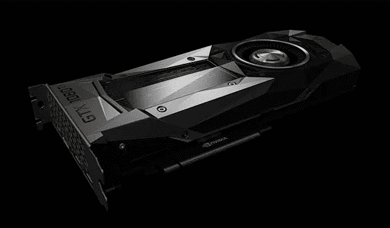

在过去的一年半时间里，我一直在为各种客户探索深度学习和机器学习的应用。当我们使用云计算资源建立这些解决方案时，我觉得有必要在企业环境之外实践我的技能。当然，只要我想学习，我可以继续使用亚马逊来构建一些 GPU 驱动的 EC2 实例……但要真正深入到深度学习的世界中，我觉得我必须做两件事 1)给自己一条探索的道路，以自己的速度和自己的设备。2)通过投资一些迫使我使其工作的设备或失去我对自己的大投资，在游戏中加入一些皮肤。

简而言之，我渴望建造自己的高性能机器，我可以在任何需要的时候使用它，此外，它还可以作为一台非常好的家用电脑，用于偶尔的家庭计算任务。(至少，这是我的辩解。)

这篇博文证明了你也可以建造一台深度学习机器，它非常能够处理各种深度学习任务。我将介绍从组件到组装和设置的所有内容。

让我们开始吧。

**挑选组件**

我不得不承认，我被所有的选择吓到了。令人欣慰的是，对于为深度学习计算机选择正确的组件，有一些非常有用的资源。PC Part Picker 帮助我了解需要什么，以及是否有任何兼容性问题。

*注意:如果你不喜欢修改，请不要选择我的版本。我不得不对散热器做一些特殊的修改，以适应它的位置。这包括在我的圆锯上用金属切割刀片切割散热片。谢天谢地，我准备了工具来进行调整。*

这是我完整的零件清单:【https://pcpartpicker.com/list/ZKPxqk 

主板——125 美元

对于主板，我需要的只是支持一个 GPU，并确保它可以支持英特尔的最新芯片(Kaby Lake-i5–7600k。)Gigabyte-GA-B250N-Phoenix WIFI 迷你 ITX LGA1151 主板符合要求，它内置了 WIFI 和一个非常酷的 LED 功能——所以你仍然可以给你的游戏朋友留下深刻印象。

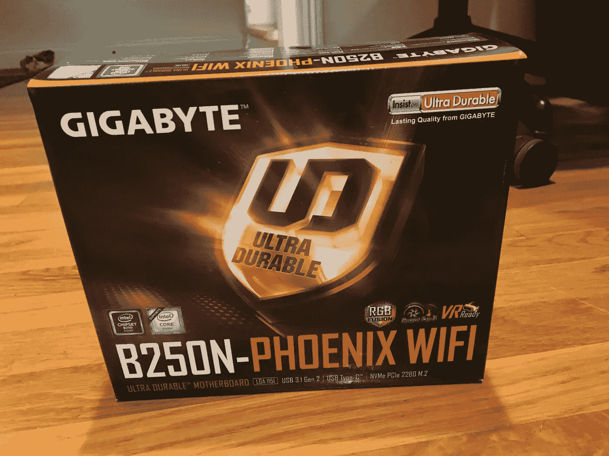

案例——90 美元

机箱不贵，但大小很重要，因为我们要添加一些非常大的组件。请确保您选择的机箱能够适合您的所有组件，并且能够容纳迷你 ITX 外形。我去的案例，**Corsair-Air 240 MicroATX Mid Tower Case**，有很多粉丝，布局对我的身材来说相当不错。

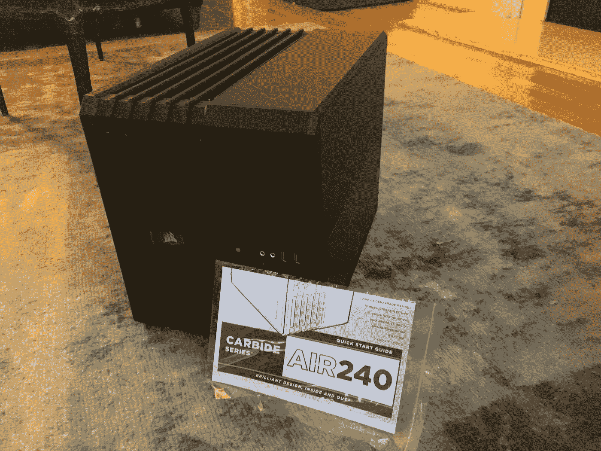

中央处理器——230 美元

我们的神经网络将使用 GPU 来完成大部分繁重的计算。事实上，CPU 可能是事后才想到的。不幸的是，我是一个非常“保守”的人，想要一个非常重要的处理器。英特尔酷睿 i5 7600k 3.8 GHz 四核处理器符合我的要求。首先，它超频了，所以我觉得自己像个坏蛋。你可以随意降级，但是如果你降级的话…确保你的主板支持你选择的任何处理器。到目前为止，这款处理器的表现符合预期。令人惊讶的是。

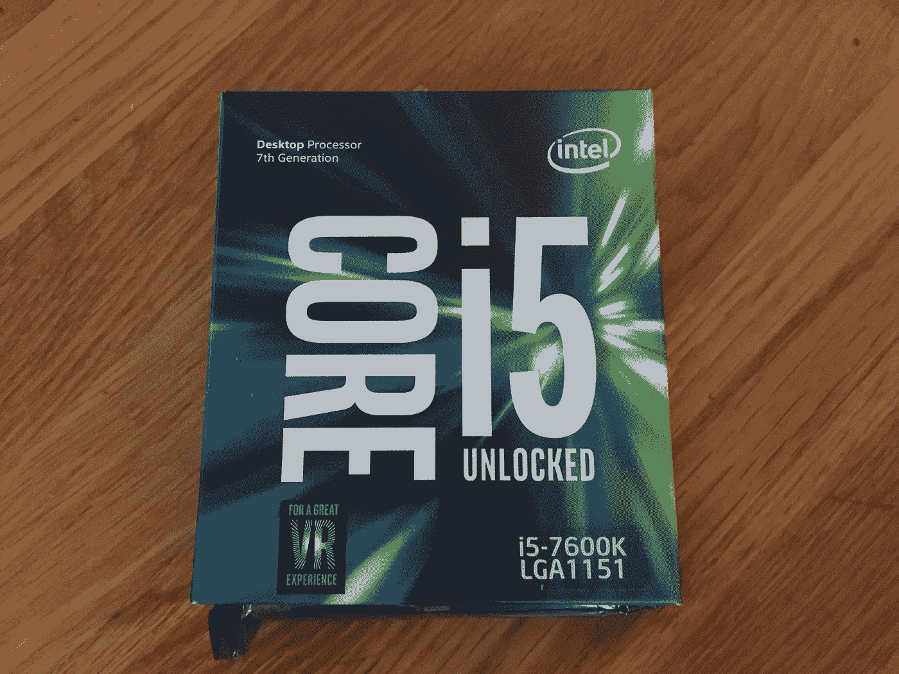

拉姆——155 美元

RAM 很便宜。得到很多。尽可能多的获取。我从未对我为电脑购买的任何 RAM 升级失望过。在我的例子中，我购买了一个巨大的 16GB 内存**。**我的选择，**海盗船—复仇 LED 16GB(2 x 8GB)DDR 4–3200 内存**还附带了额外的 LED……因为你永远无法获得足够的灯光表演！

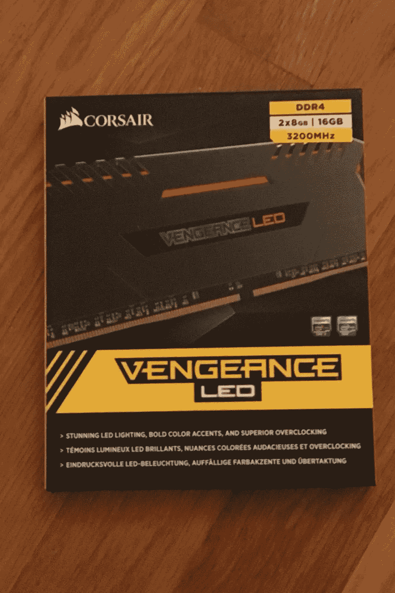

散热器——45 美元

这是我最大的遗憾。我买的散热片，**冷却器大师——双子座 M4 58.4 CFM 套筒轴承 CPU 冷却器**棒极了。就是不合适。我不得不切掉边缘的鱼鳍，为我巨大的公羊腾出空间。如果我必须再做一次，我可能会找到一个更好的散热器，完全适合我的身材。我所做的修改是最新的，风扇非常安静。所以我不会抱怨太多。

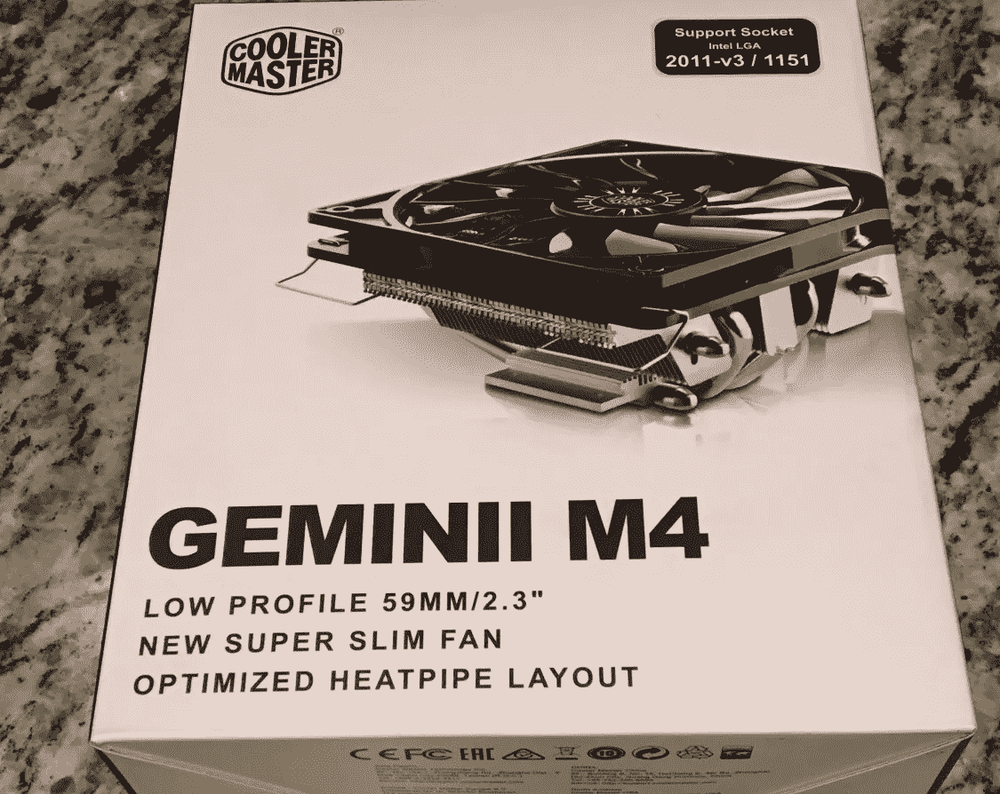

存储——50 美元

好吧，说实话，1TB 太大了。但是 Imagenet 也很庞大。如果你能负担得起更多的存储空间，那就去吧，因为当你开始下载数据集时，你就会开始耗尽空间。我选择了**西部数据——蓝色 1TB 3.5”5400 rpm 内置硬盘**。它在 SATA 接口中提供了 1TB 的存储空间——这对于深度学习来说很好。如果你想升级，考虑更大的 SATA 硬盘或更快的固态硬盘。事后看来，我可能会添加第二个 SATA 硬盘。我建议您从一开始就升级存储空间。我在考虑最终得到 2-3 TB。

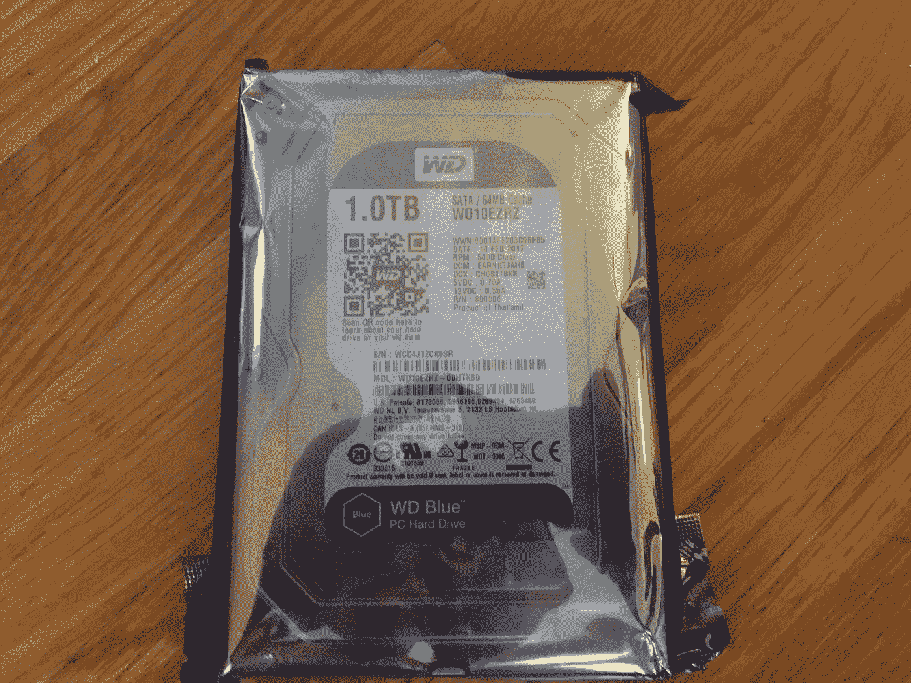

电源——85 美元

我用我的电源走了极端，但它相对便宜，我真的不希望它成为一个问题。我的**Cooler Master——650 w 80+青铜认证的半模块化 ATX 电源**可以为一艘小型潜艇供电，我的 PC 不会有任何问题。

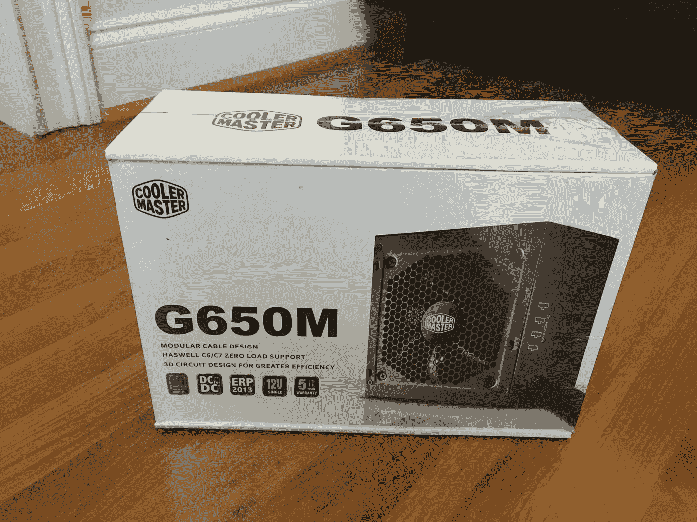

GPU——700 美元

这是你系统中最大的投资，所以为什么要节省。GPU 将为你所有的深度学习处理提供动力。在选择 GPU 时，有许多事情需要考虑，我们一会儿就会谈到这些，但你需要做的一件事是购买 Nvidia 卡。英伟达在支持深度学习加速计算上投入了大量的时间和投资。他们的并行计算平台 CUDA 几乎得到了包括 Tensorflow、Pytorch、Caffe 等所有深度学习框架的支持。

我们知道我们正在选择 Nvidia 卡，我们还应该考虑什么…

预算:我卡上的预算不到 1000 美元。有许多符合要求的卡片，包括 GTX 1080 Ti，GTX 1080，GTX 1070 等等。所以我有很多潜在的卡片可以选择。唯一的牌是泰坦 X 和即将发布的 Volta。

**一个与多个 GPU:**由于我选择的 PC 的外形因素，我只使用了一个 GPU。我还打算用这台机器在表面层面探索深度学习。对于我的大多数用例，我实际上不需要一个以上的 GPU。另外，围绕两张卡片设计一个模型似乎是一件痛苦的事情。我现在就保持简单。

**内存:** Tim Dettmers 建议 8GB 的 RAM 对于大多数家庭深度学习项目来说已经足够了。我听起来也很合理。由于大多数 10 系列卡将工作。对我来说，11GB 的 GTX 1080 Ti 已经足够了。

总而言之，我选择了亚马逊上售价 699 美元的 Nvidia 1080 Ti。有点贵，但值得在单个 GPU 设置中获得我想要的功能。

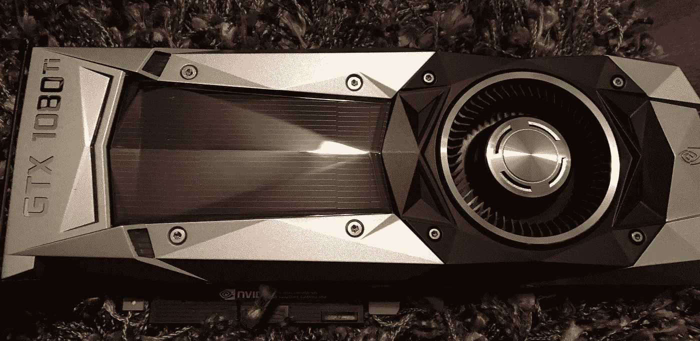

**电脑总成本为 1，475 美元。**

当然，你需要一台显示器、键盘和鼠标来使用这台机器。

**电脑版本**

如果你真的对计算机构建感到不舒服，把这个部分外包给专业人士！我觉得自己很勤奋，所以我去了。除了一个修改(见上面零件列表的散热器部分)，构建非常简单。我花了几个小时，按照主板和其他组件附带的手册进行操作。我还咨询了各种各样的留言板，以解决我在这个过程中犯的一些人为错误。

根据我的经验，最好的办法是把机器放在机箱外面，然后测试各个部件。一旦经过测试，一切正常，就可以安装到机箱中了。

**软件设置**

现在我们的电脑已经准备好了，是时候设置我们的软件了，这样我们就可以深入学习了。对于我们的系统，我选择了 Ubuntu 16.04——它有很好的文档记录；我们使用的许多库都在 Linux 环境下工作。

**1。安装 Ubuntu 16.04 —桌面**

我选择的 Linux 版本是 Ubuntu，16.04 版本是迄今为止最新的稳定版本。你可以在这里下载 Ubuntu 16.04 桌面:[https://www.ubuntu.com/download/desktop](https://www.ubuntu.com/download/desktop)

我从 USB 驱动器安装了操作系统。我把它设置成直接引导到 GUI 中；但是启动到终端来安装 CUDA 和 GPU 驱动程序可能会更好。安装完成后，继续使用 apt-get 更新您的操作系统。

> sudo add-apt-repository PPA:graphics-drivers/PPA #安装图形存储库以启用 nvidia-381
> 
> sudo apt-get 更新 
> sudo apt-get-assume-yes 升级 
> sudo apt-get-assume-yes 安装 tmux build-essential gcc g++ make binutils 
> sudo apt-get-assume-yes 安装软件-properties-common 【T36

**2。安装 CUDA(不带驱动程序)**

现在是时候安装一些技术来帮助利用我们的 GPU 进行深度学习了。我们的第一步是安装 CUDA。你可以用驱动程序安装它，但我遇到了与 1080Ti 兼容的问题——因为 CUDA 没有配备最新的驱动程序。就我而言，我是从*安装的。通过直接从 Nvidia 下载来运行文件。

[https://developer.nvidia.com/cuda-downloads](https://developer.nvidia.com/cuda-downloads)

> 运行 sudo 服务灯 dm 停止

关闭 lightdm 并运行 CUDA *。在终端中运行文件。记住，不要安装 CUDA 自带的 Nvidia 驱动。

安装之后，您需要将下面几行代码添加到 PATH 中。您可以简单地运行以下代码:

> 猫> > ~ ~/。tmp << ‘EOF’
> 导出路径=/usr/local/cuda-8.0/bin $ { PATH:+:$ { PATH } }
> 导出 LD _ LIBRARY _ PATH =/usr/local/cuda-8.0/lib 64 \
> $ { LD _ LIBRARY _ PATH:+:$ { LD _ LIBRARY _ PATH } }
> EOF
> source ~/。bashrc

**3。安装支持您的 GPU 的 Nvidia 驱动程序。**

在我的例子中，它是 Nvidia 381.22 驱动程序——发布时 1080Ti 的最新驱动程序。

> wget[http://us . download . NVIDIA . com/XFree86/Linux-x86 _ 64/381.22/NVIDIA-Linux-x86 _ 64-381.22 . run](http://us.download.nvidia.com/XFree86/Linux-x86_64/381.22/NVIDIA-Linux-x86_64-381.22.run)
> sudo sh NVIDIA-Linux-x86 _ 64–381.22 . run
> sudo 重新启动

或者，你可以通过 apt-get 下载并安装 nvidia-381(见下文。)

> sudo apt-get 安装 nvidia-381

**4。可选:登录循环**

如果您遇到可怕的登录循环，您可以通过运行以下代码清除 nvidia 驱动程序并重新安装。我不得不这样做了几次，安装最终坚持。

> sudo apt-get remove-purge NVIDIA *
> sudo apt-get auto remove
> sudo reboot

**5。检查 CUDA 和 Nvidia 驱动程序安装**

运行下面几行代码来检查您当前的安装。

> nvcc 版本# CUDA 检查
> nvidia-smi #驱动程序检查

6。一切都好吗？很好，该安装 CuDNN 了。

要安装 CuDNN，你需要是一个搭载 Nvidia 开发者的卡。别担心，报名很容易，而且是免费的。对我来说，转机是瞬间的；但是您的帐户可能需要 48 小时才能得到确认。YMMV。一旦你有了一个帐号，下载并安装 CuDNN 到你的 CUDA 目录中。我的例子如下:

> tar tar-xzf cud nn-8.0-Linux-x64-v 5.1 . tgz
> CD cuda
> sudo CP lib 64/*/usr/local/cuda/lib 64/
> sudo CP include/*/usr/local/cuda/include/

**7。你的深度学习环境和工具。**

安装的其余部分涉及 Tensorflow、Pytorch、Keras、Python、Conda 以及您想要用于深度学习实验的任何其他工具。我将把这个设置留给你，但只要记住如果你使用 Tensorflow 下载该软件的 GPU 版本。我的机器运行以下程序:

> python 2.7(Ubuntu 自带)
> 
> 面向 Python 2.7 和 GPU 的 tensor flow—[https://www.tensorflow.org/install/install_linux](https://www.tensorflow.org/install/install_linux)
> 
> py torch—[http://pytorch.org/](http://pytorch.org/)
> 
> OpenCV—[http://opencv.org/](http://opencv.org/)

**让我们看看它的实际效果吧！**

好吧，我花了 1500 美元在一台 PC 上做深度学习问题的实验。这台机器能做什么？这里有一些有趣的例子，我可以在我的新电脑上演示。

MNIST 解决方案在几秒钟内。

我想通过培训 PyTorch 的一个已知的 MNIST 解决方案来尝试一下。[https://github.com/pytorch/examples/tree/master/mnist](https://github.com/pytorch/examples/tree/master/mnist)这里有一个在我的个人电脑上训练的视频，大约 45 秒，准确率 98%。

IMAGENET 培训。

我想尝试另一个 CNN 来解决 Tensorflow 上的 Imagenet 问题。我训练了来自[https://github . com/tensor flow/models/tree/master/tutorials/image/Imagenet](https://github.com/tensorflow/models/tree/master/tutorials/image/imagenet)的 Imagenet 分类器，训练结束后，我对我的好友乔纳森(Jonathan)在佛罗里达群岛的一个沉船地点潜水的图像进行了分类。

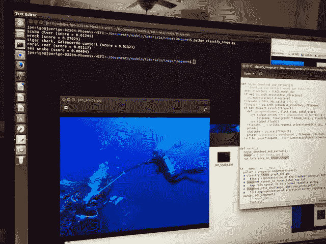

最后一个例子:YOLO 实时物体识别

最后，我想通过让 GPU 从我的网络摄像头实时识别对象来真正测试 GPU 的能力。这是我对我的机器的能力感到非常兴奋的视频。

**接下来是什么？**

现在我家里有了相当惊人的深度学习能力，我计划了很多实验。我的下一个项目涉及更多的计算机视觉应用。我甚至会为我妈妈的生日做一个分类器。她正在寻找一个应用程序来帮助她对院子里的植物进行分类。没问题，妈妈。我掩护你。

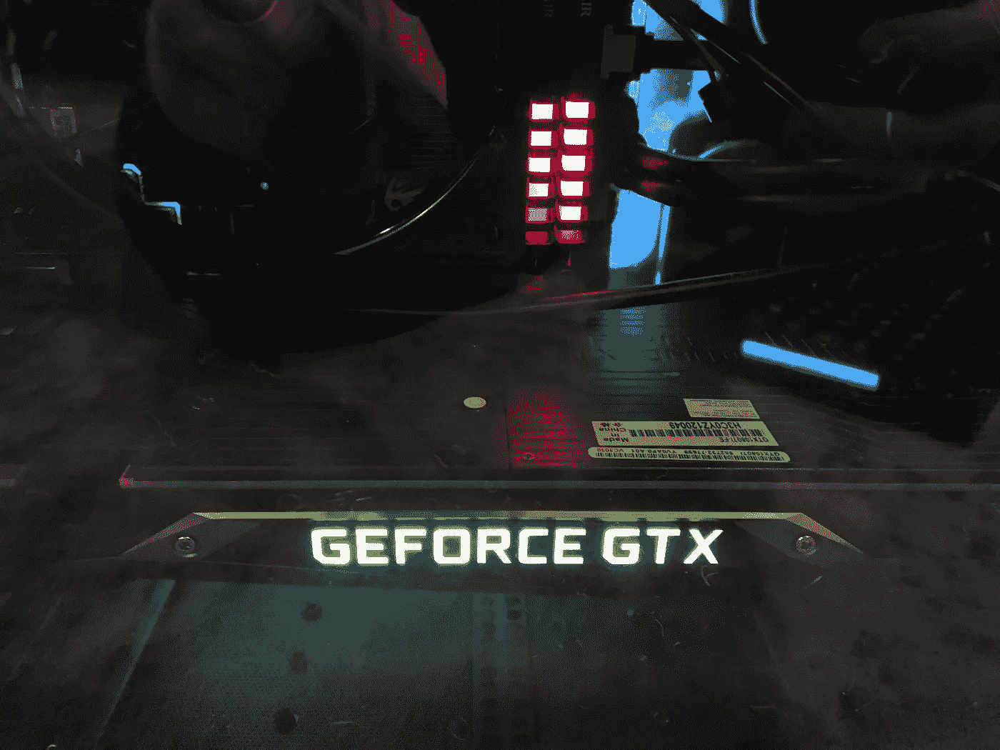