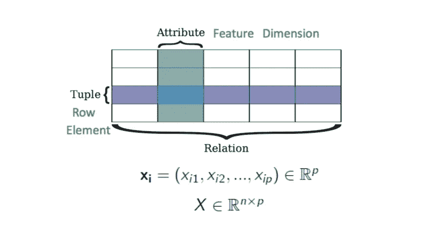
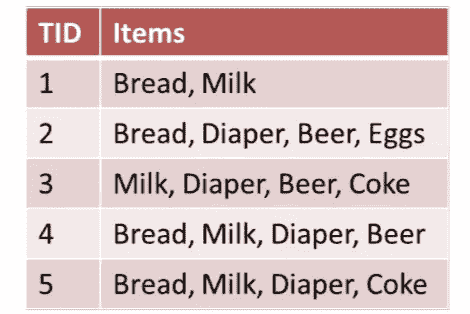
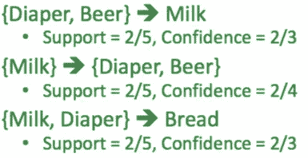

# 关联规则挖掘

> 原文：<https://towardsdatascience.com/association-rule-mining-be4122fc1793?source=collection_archive---------6----------------------->

## 数据

我们将要处理的数据如下所示:

## 关联规则挖掘的目的是什么？

关联规则挖掘是发现数据模式的方法之一。它发现:

*   一起出现的特征(尺寸)
*   “相关”的特征(尺寸)

一个特性的值告诉我们另一个特性的值是什么？比如买纸尿裤的人，很可能会买婴儿爽身粉。或者我们可以这样重新表述:如果(人们购买尿布)，那么(他们购买婴儿爽身粉)。请注意 if，then 规则。这并不一定意味着如果人们购买婴儿爽身粉，他们就会购买尿布。一般来说，我们可以说，如果条件 A 倾向于 B，它不一定意味着 B 倾向于 A。注意方向性！

## 何时使用关联规则

我们可以在任何数据集中使用关联规则，其中特征只取两个值，即 0/1。下面列出了一些例子:

*   **购物篮分析**是关联规则的一个流行应用。
*   访问网页 X 的人很可能会访问网页 Y
*   年龄在[30，40] &收入[> 10 万美元]的人很可能拥有自己的房子

## 衡量规则的有效性

衡量规则有效性的标准如下:

*   支持
*   信心
*   电梯
*   其他:亲和力、影响力

我们将使用一个示例数据集更详细地讨论支持度和置信度。

上述数据集也可以这样表示:

支持意味着有多少历史数据支持你的规则，而信心意味着我们对这个规则有多有信心。

支持度可以计算为包含 A 和 B 的行的分数或 A 和 B 的联合概率。

在包含 A 的行中，置信度是包含 B 的行的分数或给定 A 时 B 的条件概率。

**举起**就是比信心就是比支持。如果升程是< 1，那么 A 和 B 负相关，否则正相关，如果升程等于 1，则不相关。