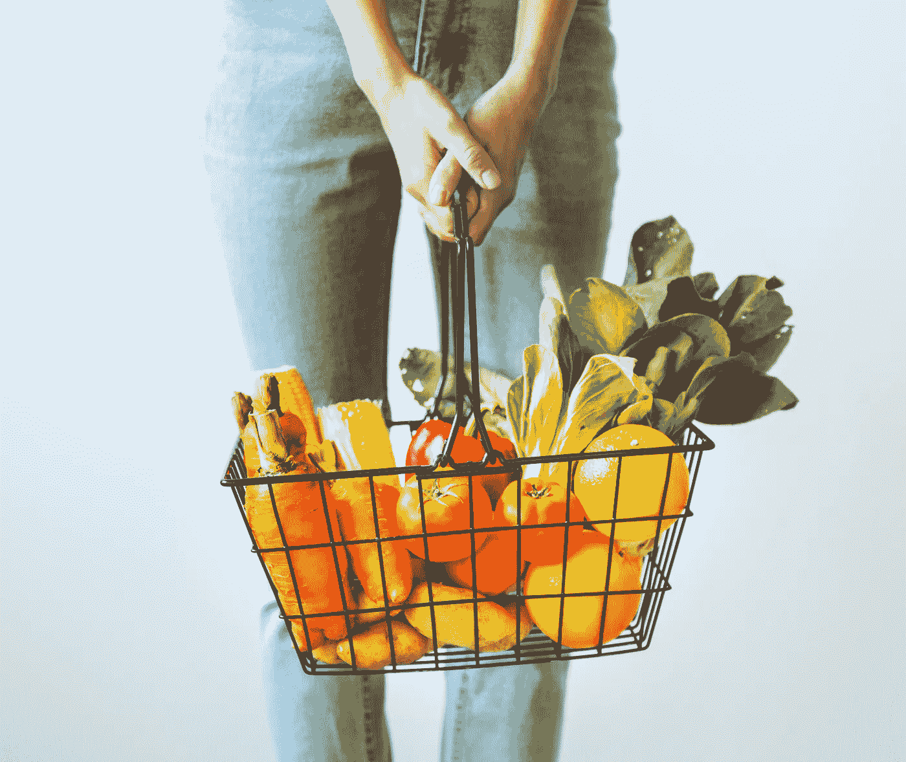
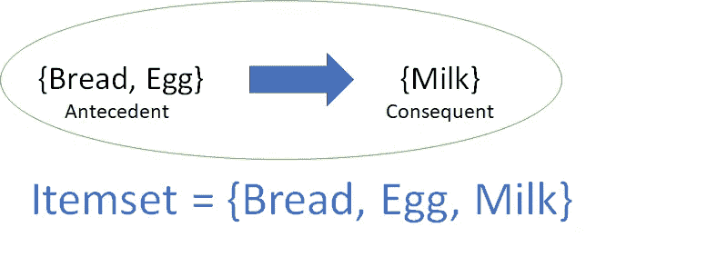
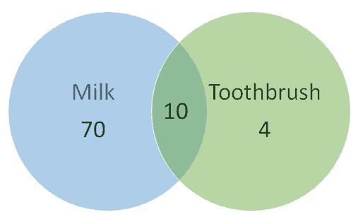
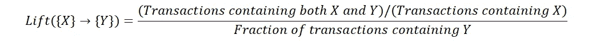

# 关联规则完全指南(1/2)

> 原文：<https://towardsdatascience.com/association-rules-2-aa9a77241654?source=collection_archive---------0----------------------->

## 帮助您更快、更智能购物的算法

回顾在统计训练营中向我介绍的众多概念，有很多东西要写和分享。我选择从关联规则开始，有两个原因。首先，这是我最喜欢学习的概念之一，其次，网上资源有限，很难掌握。

在博客的第一部分，我将介绍一些关键的术语和指标，旨在让读者了解规则中“关联”的含义，以及量化这种关联强度的一些方法。[第 2 部分](/complete-guide-to-association-rules-2-2-c92072b56c84)将集中讨论使用*先验算法*从成千上万的项目列表中挖掘这些规则。

关联规则是用于购物篮分析的机器学习中非常重要的概念之一。在商店里，所有的蔬菜都放在同一个过道里，所有的乳制品放在一起，化妆品形成了另一组这样的组。像这样投入时间和资源在有意的产品投放上，不仅减少了顾客的购物时间，还提醒了顾客他可能有兴趣购买的相关商品，从而帮助商店在这个过程中进行交叉销售。关联规则有助于发现大型数据库中项目之间的所有此类关系。需要注意的一点是-

> 规则并不提取个人的偏好，而是发现每一个不同交易的元素集之间的关系。这就是它们与协同过滤的不同之处。

为了详细说明这一点，规则并不将用户的不同交易随着时间的推移联系起来以识别关系。具有唯一交易 id(来自所有用户)的项目列表作为一个组进行研究。*这有助于将产品放置在过道上。*另一方面，协同过滤将对应于一个用户 ID 的所有交易捆绑在一起，以识别用户偏好之间的相似性。*这有助于在电商网站上推荐商品，在 spotify 上推荐歌曲等。*

现在让我们看看关联规则到底是什么样子的。它由一个前因和一个后果组成，两者都是项目列表。请注意，这里的含义是共现，而不是因果关系。对于给定的规则， ***项集*** 是前件和后件中所有项的列表。

有各种各样的标准可以帮助我们理解这两者之间的联系强度。让我们一一道来。

## **1。支持**

这个度量给出了一个概念，即一个*项集*在所有事务中出现的频率。考虑*项集 1*= {面包}和*项集 2*= {洗发水}。包含面包的交易会远远多于包含洗发水的交易。所以正如你所猜测的，*项目集 1* 通常会比*项目集 2* 有更高的支持度。现在考虑*items et 1*= {面包，黄油}和*items et 2*= {面包，洗发水}。许多交易都会有面包和黄油，但是面包和洗发水呢？没有那么多。所以在这种情况下，*项集 1* 一般会比*项集 2* 有更高的支持度。从数学上讲，支持度是项目集所在的事务总数的分数。

支持值有助于我们确定值得考虑的规则，以便进一步分析。例如，可能只想考虑在总共 10，000 个事务中至少出现 50 次的项目集，即 support = 0.005。如果一个*项目集*恰好具有非常低的支持度，我们没有足够的关于其项目之间关系的信息，因此不能从这样的规则中得出结论。

## 2.**信心**

这个度量定义了在购物车已经有先行词的情况下，在购物车上出现结果的可能性。这就要回答这个问题了——在所有包含比如说{嘎吱船长}的交易中，有多少交易也包含{牛奶}呢？我们可以用常识说{嘎吱船长}→{牛奶}应该是一个高置信度规则。从技术上来说，置信度是给定前因后件发生的条件概率。

在继续之前，让我们再考虑几个例子。你认为{黄油}→{面包}的信心是什么？也就是说，有黄油的交易中有多少比例也有面包？非常高，即接近 1 的值？没错。{酸奶}→{牛奶}呢？又高了。{牙刷}→{牛奶}？不太确定？此规则的可信度也很高，因为{Milk}是如此频繁的项目集，并且会出现在每一个其他事务中。

> 对于这样一个频繁发生的结果，你的前因是什么并不重要。具有非常频繁的结果的关联规则的置信度总是很高。

我将在这里介绍一些数字来进一步阐明这一点。

Total transactions = 100\. 10 of them have both milk and toothbrush, 70 have milk but no toothbrush and 4 have toothbrush but no milk.

考虑左图中的数字。{牙刷}→{牛奶}的置信度将是 10/(10+4) = 0.7

看起来可信度很高。但是我们凭直觉知道，这两个产品之间的关联很弱，而且这个高置信度值有误导性。*升降机*的引入就是为了克服这一挑战。

> 仅仅考虑信心的价值会限制我们做出任何商业推断的能力。

## **3** 。**抬起**

在计算{Y}给定{X}出现的条件概率时，*的提升控制支持结果的*(频率)。*升力*是一个非常字面意义上的术语。可以把它看作是{X}让{Y}加入购物车，从而提升了我们的信心。换句话说，*提升*是在知道{X}存在的情况下，购物车上有{Y}的概率相对于购物车上有{Y}但不知道{X}存在的概率的上升。数学上，

在{X}实际上导致购物车上的{Y}的情况下，lift 值将大于 1。让我们用一个例子来理解这一点，这个例子是{牙刷}→{牛奶}法则的延续。

知道牙刷存在的情况下推车上有牛奶的概率(即*置信度* ) : 10/(10+4) = 0.7

现在，为了客观地看待这个数字，考虑一下在没有任何牙刷知识的情况下，推车上有牛奶的概率:80/100 = 0.8

这些数字表明，推车上有牙刷实际上将推车上有牛奶的概率从 0.8 降低到 0.7！这将是一个 0.7/0.8 = 0.87 的升力。这才更像真实的画面。lift 值小于 1 表明，尽管规则显示出高置信度值，但在推车上放置牙刷不会增加推车上出现牛奶的机会。大于 1 的升力值证明了{Y}和{X}之间的高关联性。lift 的价值越高，如果客户已经购买了{X}，则优先购买{Y}的可能性就越大。 *Lift* 是帮助商店经理决定产品在过道上摆放的方法。

# **关联规则挖掘**

既然我们已经了解了如何量化项目集内产品关联的重要性，下一步就是从整个项目列表中生成规则，并确定最重要的规则。这并不像听起来那么简单。超市里会有成千上万种不同的产品。经过一些简单的计算，可以看出，仅仅 10 个产品就会产生 57000 条规则！！而且这个数字随着物品数量的增加呈指数增长。为这些中的每一个寻找升力值将在计算上变得非常非常昂贵。如何处理这个问题？如何想出一套最重要的关联规则来考虑？ *Apriori 算法*来帮我们解决这个问题。

在[第二部分](/complete-guide-to-association-rules-2-2-c92072b56c84)中阅读更多关于 Apriori 算法的内容，并找到所有未解问题的答案。

请在评论中告诉我你对这个博客的想法/问题。