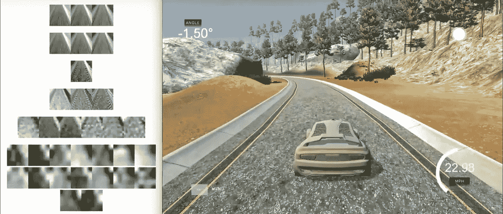

# 尝试实时可视化卷积神经网络

> 原文：<https://towardsdatascience.com/attempting-to-visualize-a-convolutional-neural-network-in-realtime-1edd1f3d6c13?source=collection_archive---------2----------------------->

## 在复制自动驾驶汽车的端到端深度学习方法时，我对网络所看到的东西缺乏可见性感到沮丧。我开发了一个工具来解决这个问题。

模拟器和运行神经网络的 python 脚本通过 websocket 连接进行通信。我决定编写一个小的浏览器应用程序，它也可以通过另一个 websocket 连接到 python 脚本，并收集一些我可以可视化的附加数据。

以下是我能想到的:

右边是我们正在运行的 Udacity 模拟器。左边是我的小 React 应用程序，它将我的神经网络中卷积层的所有输出可视化。

正如你所看到的，它在控制汽车的同时实时运行。这是一次很好的练习，但我怀疑这样做是否有用。目前还不清楚网络是如何基于这些做出决策的。

您可以在此处找到代码:

 [## 行为克隆-P3

### 行为克隆-P3 -行为克隆项目启动文件(P3)

github.com](https://github.com/paramaggarwal/CarND-Behavioral-Cloning-P3) 

这篇文章是一项正在进行的工作，其总体目标是获得对神经网络更好的可视性。请在评论中告诉我你的想法，告诉我我还能为这个目标做些什么！