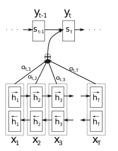
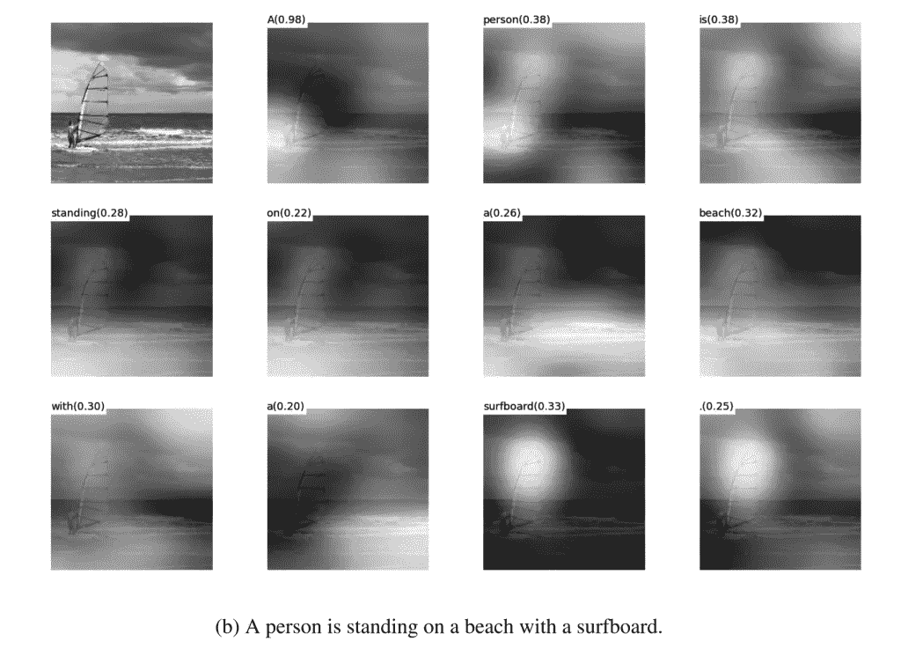

# 自然语言处理中的注意模型快速介绍

> 原文：<https://towardsdatascience.com/attention-models-in-nlp-a-quick-introduction-2593c1fe35eb?source=collection_archive---------2----------------------->

鸣谢:以下是 wildml 文章的节略版:[http://www . wild ml . com/2016/01/attention-and-memory-in-deep-learning-and-NLP/](http://www.wildml.com/2016/01/attention-and-memory-in-deep-learning-and-nlp/)

典型的 seq2seq 模型通常是我的博客中解释的形式:[https://medium . com/forward-data-science/sequence-to-sequence-model-introduction-and-concepts-44d 9 b41 CD 42d](https://medium.com/towards-data-science/sequence-to-sequence-model-introduction-and-concepts-44d9b41cd42d)

当假设语言到语言的翻译时，例子:解码器应该仅基于来自编码器的最后隐藏状态来生成翻译。这个向量必须编码我们需要知道的关于源句子的一切。它必须完全抓住它的意义。用更专业的术语来说，这个向量是一个句子*嵌入*。事实上，如果你使用主成分分析或 t-SNE 对低维空间中不同句子的嵌入进行降维，你可以看到语义相似的短语最终彼此接近。这真是太神奇了。

然而，假设我们可以将一个潜在的很长的句子的所有信息编码到一个向量中，然后让解码器仅基于此产生一个好的翻译，这似乎有点不合理。假设你的源句子有 50 个单词长。英语翻译的第一个单词可能与源句子的第一个单词高度相关。但这意味着解码器必须考虑 50 步前的信息，并且这些信息需要以某种方式编码到矢量中。众所周知，递归神经网络在处理这种长程相关性方面存在问题。理论上，像 [LSTMs](http://www.wildml.com/2015/10/recurrent-neural-network-tutorial-part-4-implementing-a-grulstm-rnn-with-python-and-theano/) 这样的架构应该能够处理这个问题，但是在实践中，长程依赖仍然是个问题。例如，研究人员发现，反转源序列(将其反馈到编码器)会产生明显更好的结果，因为它缩短了从解码器到编码器相关部分的路径。类似地，[给一个输入序列输入两次](http://arxiv.org/abs/1410.4615)似乎也有助于网络更好地记忆东西。它使事情在实践中更好地工作，但它不是一个原则性的解决方案。大多数翻译基准都是在法语和德语之类的语言上完成的，这些语言与英语非常相似(甚至汉语的词序也与英语非常相似)。但是在有些语言中(比如日语),一个句子的最后一个单词很可能是英语翻译中的第一个单词。在这种情况下，颠倒输入会使事情变得更糟。那么，有什么选择呢？注意力机制。

有了注意机制，我们不再试图将完整的源句子编码成固定长度的向量。相反，我们允许解码器在输出生成的每一步“关注”源句子的不同部分。重要的是，我们让模型**学习**根据输入的句子和它到目前为止产生的结果注意什么。因此，在排列得相当好的语言中(比如英语和德语)，解码器可能会选择按顺序处理事情。当产生第一个英语单词时注意第一个单词，等等。这就是在[神经机器翻译中通过联合学习对齐和翻译](http://arxiv.org/abs/1409.0473)所做的，如下所示:

这里，y 是解码器产生的翻译单词，x 是我们的源句子单词。上图使用了双向循环网络，但这并不重要。重要的是，每个解码器输出字 yt 现在取决于所有输入状态的**加权组合，而不仅仅是最后一个状态。a 是定义每个输入状态在每个输出中所占比重的权重。所以，如果 a32 是一个很大的数字，这将意味着解码器在产生目标句子的第三个单词时，非常注意源句子的第二个状态。a 通常归一化为 1(因此它们是输入状态的分布)。注意力的一个很大的优势是它给了我们解释和想象模型正在做什么的能力。例如，当一个句子被翻译时，通过可视化注意力权重矩阵 a，我们可以理解模型是如何翻译的:**

这里我们看到，当从法语翻译成英语时，网络顺序地关注每个输入状态，但有时在产生输出时，它一次关注两个单词，例如在将“la Syrie”翻译成“Syria”时。

## 注意力的成本

如果我们仔细观察注意力的等式，我们会发现注意力是有代价的。我们需要为输入和输出单词的每个组合计算一个注意值。如果你有一个 50 个单词的输入序列，并生成一个 50 个单词的输出序列，那将是 2500 个注意值。这还不算太糟糕，但是如果你进行字符级的计算，并且处理由数百个标记组成的序列，上述的注意力机制可能会变得非常昂贵。这似乎是一种浪费，根本不是人类正在做的事情。事实上，它更类似于内存访问，而不是注意力，在我看来，这有点用词不当(下文将详细介绍)。尽管如此，这并没有阻止注意力机制变得非常流行，并在许多任务中表现出色。

注意力的另一种方法是使用强化学习来预测关注的大致位置。这听起来更像人类的注意力，这就是视觉注意力的[循环模型所做的。](http://arxiv.org/abs/1406.6247)

## 机器翻译之外的关注

上面的注意机制可以应用于任何循环模型。

在[展示、参与和讲述](http://arxiv.org/abs/1502.03044)中，作者将注意力机制应用于生成图像描述的问题。他们使用卷积神经网络来“编码”图像，并使用具有注意力机制的递归神经网络来生成描述。通过可视化注意力权重(就像翻译示例中一样)，我们解释了在生成单词时模型在看什么:

