# 基于 web 的 ML 的音频功能

> 原文：<https://towardsdatascience.com/audio-features-for-web-based-ml-555776733bae?source=collection_archive---------4----------------------->

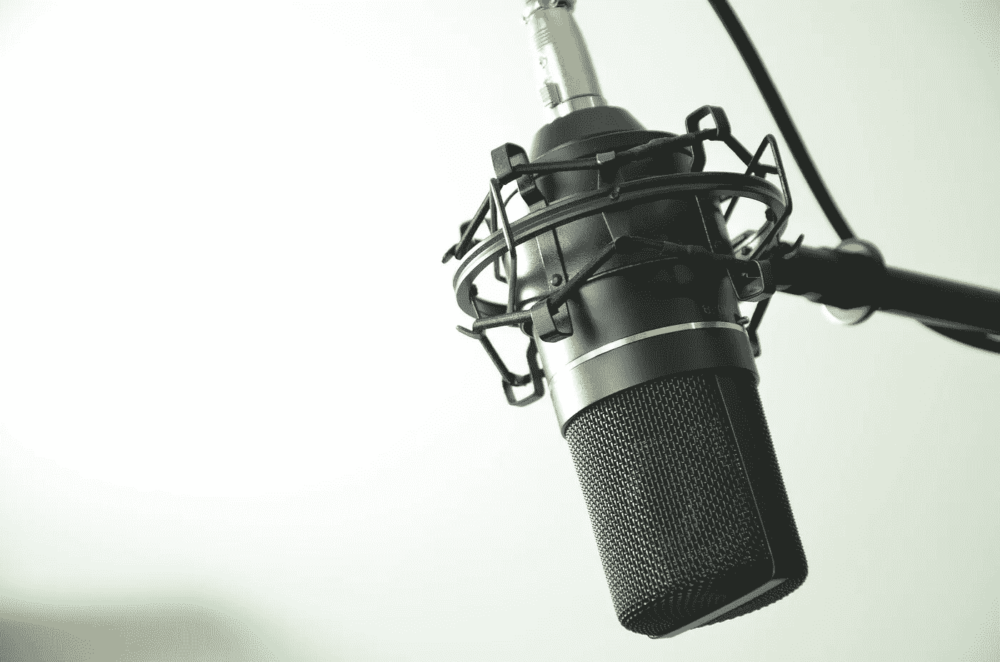

深度学习的学生面临的第一个问题是对 [MNIST 数据集](https://www.tensorflow.org/get_started/mnist/beginners)中的手写数字进行分类。这是最近[在](https://deeplearnjs.org/demos/model-builder/) [deeplearn.js](https://deeplearnjs.org/) 的帮助下移植到网络上的。网页版相对于相对干巴巴的 TensorFlow 教程有着鲜明的教育优势。你可以立即对模型有一种感觉，并开始对什么可行什么不可行建立直觉。让我们保留这种交互性，但将域改为音频。这篇文章为听觉上的 MNIST 做了准备。我们将把重点放在识别语音命令上，而不是识别手写数字。我们将这样转换声音:

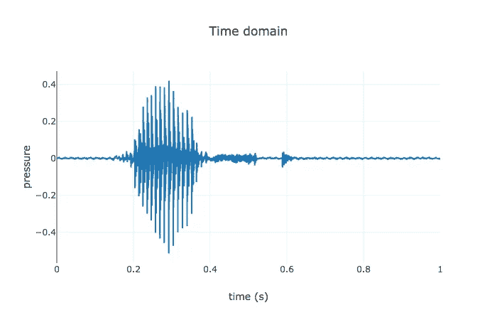

转换成这样的图像，称为 log-mel 光谱图，在下一篇文章中，将这些图像输入到同样类型的模型中，这些模型可以很好地进行手写识别:

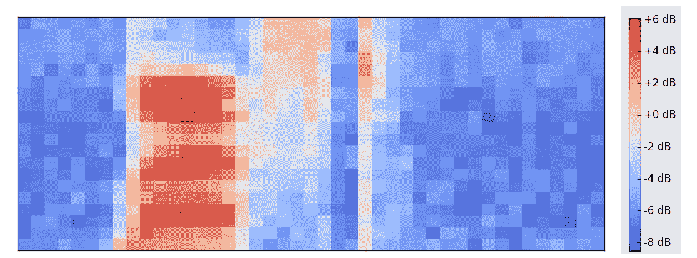

我在这里讨论的音频特征提取技术足够通用，适用于所有类型的音频，而不仅仅是人类语音。这篇文章的其余部分解释了如何做到这一点。如果你不在乎，只想[看代码](https://github.com/google/web-audio-recognition/tree/master/audio-features)，或者[玩一些现场演示](https://google.github.io/web-audio-recognition/audio-features/)，请便！

# 为什么？

神经网络正在复兴，这是有充分理由的。从识别人脸和图像到下围棋，计算机正在许多具有挑战性的任务上击败人类。神经网络的基本原理相对简单，但细节可能会变得相当复杂。幸运的是，非人工智能专家可以感觉到可以做些什么，因为许多[输出](http://www.cs.ubc.ca/~van/papers/2017-TOG-deepLoco/)非常[吸引](https://www.youtube.com/watch?v=5h4R959O0cY)。不幸的是，这些演示本质上大多是可视化的，要么是计算机视觉的例子，要么是生成图像或视频作为其主要输出。这些例子很少是交互式的。

# 预处理音频听起来很难，我们必须这样做吗？

原始音频是一种压力波，每秒采样数万次，并存储为一组数字。这是相当多的数据，但有神经网络可以直接摄取它。Wavenet 使用原始音频序列进行[语音到文本](https://github.com/buriburisuri/speech-to-text-wavenet)和[文本到语音](https://deepmind.com/blog/wavenet-generative-model-raw-audio/)，而没有任何明确的特征提取。不幸的是它很慢:在一个 2s 的例子上运行语音识别在我的笔记本上花了 30s。在网络浏览器中实时进行这项工作还不太成熟。

卷积神经网络(CNN)是最近计算机视觉领域有如此多有趣工作的一个重要原因。这些网络被设计用于处理代表 2D 图像的矩阵，因此一个自然的想法是获取我们的原始音频并从中生成图像。在[语音识别论文](https://static.googleusercontent.com/media/research.google.com/en//pubs/archive/43960.pdf)中，从音频生成这些图像有时被称为前端。为了强调这一点，这里有一个图表解释了为什么我们需要做这一步:

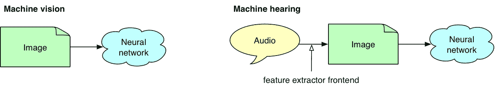

从音频生成图像的标准方式是逐块查看音频，并在频域中进行分析，然后应用各种技术将数据转化为非常适合机器学习的形式。这是声音和语音处理中的常见技术，在 [Python](https://github.com/librosa/librosa) 中有很好的实现。TensorFlow 甚至有一个用于从音频中提取频谱图的[自定义操作](https://github.com/tensorflow/tensorflow/blob/master/tensorflow/examples/wav_to_spectrogram/wav_to_spectrogram.cc)。

在网络上，这些工具是缺乏的。Web Audio API 使用`AnalyserNode`几乎可以做到这一点，正如我在过去的中展示的[，但是在数据处理的上下文中有一个重要的限制:`AnalyserNode` (nee `RealtimeAnalyser`)是](https://borismus.github.io/spectrogram/)[仅用于实时](https://stackoverflow.com/questions/45697898/web-audio-api-getfloatfrequencydata-function-setting-float32array-argument-data)分析。您可以设置一个`OfflineAudioContext`并通过分析器运行您的音频，但您会得到不可靠的结果。

另一种方法是不使用网络音频 API，有许多[JavaScript 库](https://github.com/corbanbrook/dsp.js/)可能会有所帮助。由于不完整或被放弃的原因，它们都不太合适。但是这里有一个从原始音频中提取 Mel 特征的图解。

# 音频特征提取

我找到了一个[音频特征提取教程](http://practicalcryptography.com/miscellaneous/machine-learning/guide-mel-frequency-cepstral-coefficients-mfccs/)，在 TypeScript 中实现这个特征提取器时我紧紧跟随。接下来的内容可能是该教程的有用补充。

让我们从一个音频例子开始(一个男人说“左”这个词):

这是作为时间函数压力的原始波形图:

我们可以对整个信号进行 FFT，但它会随着时间发生很大变化。在我们上面的例子中,“左”发音只需要 200 毫秒，大部分信号是无声的。相反，我们将原始音频信号分解成重叠的缓冲区，间隔一个跳跃长度。让我们的缓冲区重叠可以确保我们不会错过在缓冲区边界发生的任何有趣的细节。选择正确的缓冲区和跳数长度是一门艺术:

*   选择太小的缓冲区，你最终会得到一个过于详细的图像，并使你的神经网络训练在一些不相关的细节上冒险，只见树木不见森林。
*   选择太大的缓冲区，你最终得到的图像会太粗糙而没有用。

在下图中，您可以看到五个完全缓冲区相互重叠 50%。仅出于说明目的，缓冲和跳跃持续时间很长(分别为 400 毫秒和 200 毫秒)。在实践中，我们倾向于使用更短的缓冲区(例如 20-40 ms)，甚至更短的跳跃长度来捕捉音频信号的微小变化。

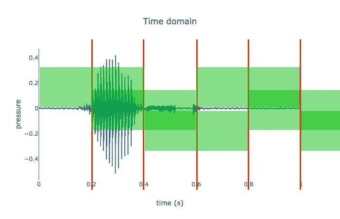

然后，我们在频域中考虑每个缓冲器。我们可以使用快速傅立叶变换(FFT)算法来实现这一点。这种算法给出了复数值，我们可以从中提取幅度或能量。例如，这里是其中一个缓冲区的 FFT 能量，大约是上图中的第二个，说话者开始说“left”的“le”音节:

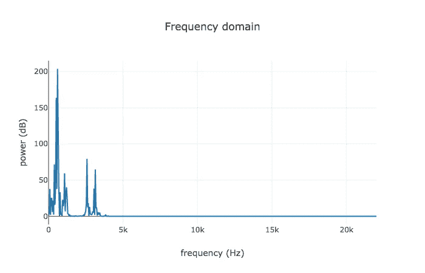

现在，假设我们对上一步中生成的每个缓冲区都这样做，取每个 FFT 阵列，而不是将能量显示为频率的函数，垂直堆叠阵列，使 y 轴代表频率，颜色代表能量。我们得到了一个光谱图:

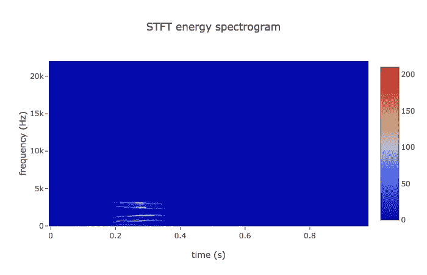

我们可以把这个图像输入我们的神经网络，但是你会同意它看起来很稀疏。我们浪费了太多的空间，而且没有太多的信号让神经网络进行训练。

让我们跳回 FFT 图，将图像放大到我们感兴趣的区域。这个图中的频率集中在 5 KHz 以下，因为扬声器没有产生特别高的频率声音。人类的听觉倾向于对数，所以我们可以在对数图上看到相同的范围:

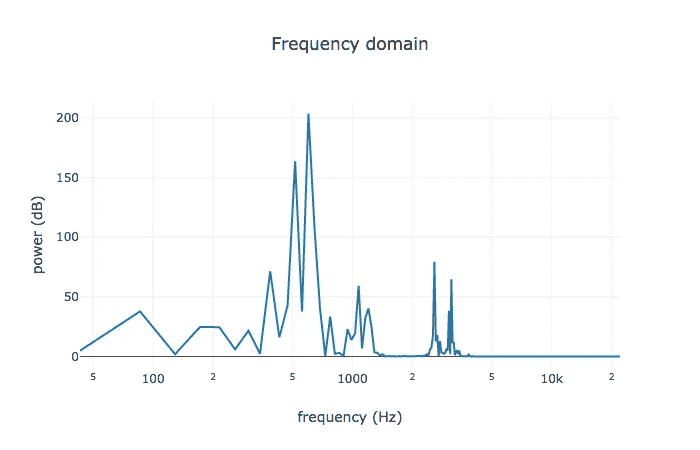

让我们像上一步一样生成新的频谱图，但不是使用能量的线性图，而是使用 FFT 能量的对数图:

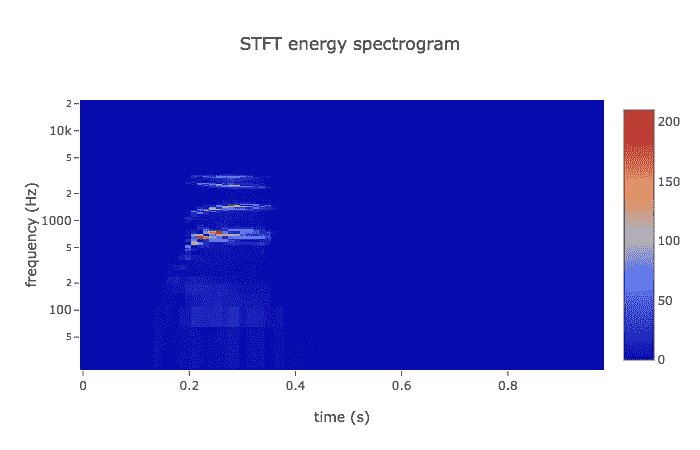

看起来好一点，但还有改进的空间。与高频相比，人类在识别低频音调的微小变化方面要好得多。Mel 标度将纯音的音高与其实际测量的频率相关联。为了从频率到 Mel，我们创建了一个三角形滤波器组:

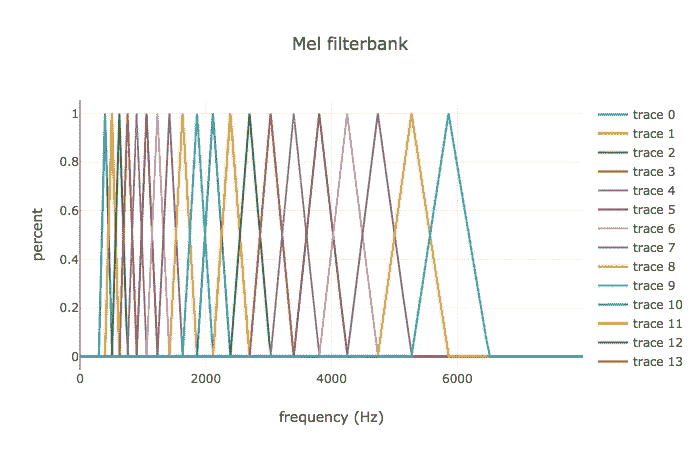

上面的每个彩色三角形都是一个窗口，我们可以用它来表示声音的频率。将每个窗口应用于我们之前生成的 FFT 能量，将得到 Mel 频谱，在这种情况下是 20 个值的数组:

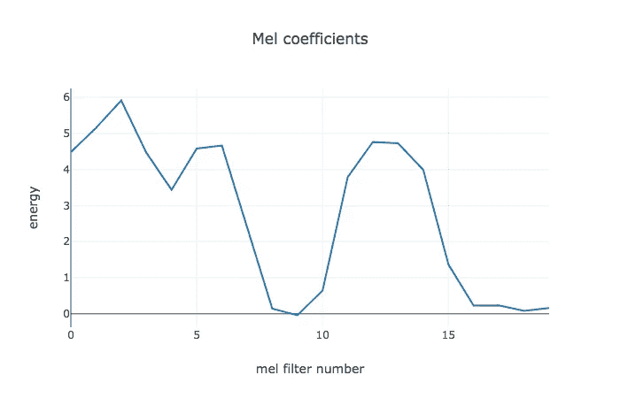

将它绘制成光谱图，我们得到了我们的特征，log-mel 光谱图:

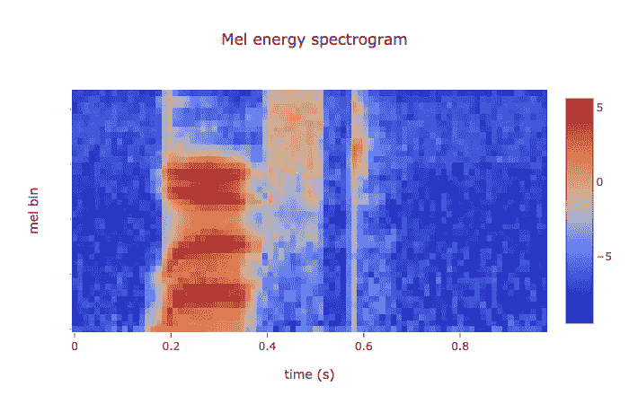

上面的 1s 图像是使用用 TypeScript 编写的音频特征提取软件生成的，我已经公开发布了该软件。这里有一个[演示](https://google.github.io/web-audio-recognition/audio-features/)，可以让你在自己的音频上运行特征提取器，还有[github 上的代码](https://github.com/google/web-audio-recognition/tree/master/audio-features)。

# 处理实时音频输入

默认情况下，特征提取器前端采用固定的音频缓冲区作为输入。但是要制作一个交互式音频演示，我们需要处理连续的音频数据流。因此，当新的音频进来时，我们需要生成新的图像。幸运的是，我们不需要每次都重新计算整个 log-mel 谱图，只需要重新计算图像的新部分。然后，我们可以在右侧添加新的声谱图部分，并删除旧的部分，从而产生一部从右向左播放的电影。`[StreamingFeatureExtractor](https://github.com/google/web-audio-recognition/blob/master/audio-features/src/StreamingFeatureExtractor.ts)`类实现了这个重要的优化。

但是有一个警告:它目前依赖于`ScriptProcessorNode`，这是众所周知的丢弃样本。我试图通过使用大的输入缓冲区来尽可能地减轻这一点，但真正的解决方案将是在可用时使用 [AudioWorklets](https://drafts.css-houdini.org/worklets/#worklet-section) 。

# 包扎

实现说明:这里是 JS FFT 库的[比较，表明 Emscripten 编译的 KissFFT 是最快的(但仍然比原生的慢 2-5 倍)，也是我使用的。](https://thebreakfastpost.com/2015/10/18/ffts-in-javascript/)

这里有一个健全性检查，将我的基于网络的特征提取器的输出与其他库的输出进行比较，最著名的是 [librosa](https://github.com/librosa/librosa) 和 [AudioSet](https://github.com/tensorflow/models/blob/master/research/audioset/mel_features.py) :

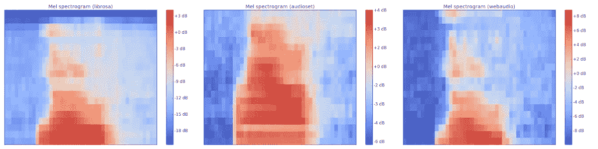

这三个实现产生的图像是相似的，这是一个很好的完整性检查，但是它们并不完全相同。我还没有找到时间，但如果有一个一致的跨平台音频特征提取器，那么用 Python/C++训练的模型可以直接在 web 上运行，反之亦然，这将是非常值得的。

我还应该提到，虽然 log-mel 特性通常被严肃的音频研究人员使用，但这是一个活跃的研究领域。另一种称为[每通道能量归一化(PCEN)](https://arxiv.org/pdf/1607.05666.pdf) 的音频特征提取技术似乎至少在某些情况下表现更好，比如处理远场音频。我还没有时间深入研究细节，但是理解它并将其移植到 web 上似乎也是一项有价值的任务。

主要感谢迪克·里昂指出了我的特征提取代码中的一些错误。如果你准备好深入研究声音理解，请阅读他的[“人类和机器听觉”](https://www.amazon.com/Human-Machine-Hearing-Extracting-Meaning/dp/1107007534)。

好了，概括一下，我们已经从流式音频中生成了 log-mel 频谱图图像，可以输入到神经网络中。哦对了，真正的机器学习部分？这是下一个帖子——敬请关注！

*原载于*[*smus.com*](http://smus.com/web-audio-ml-features/)*。*