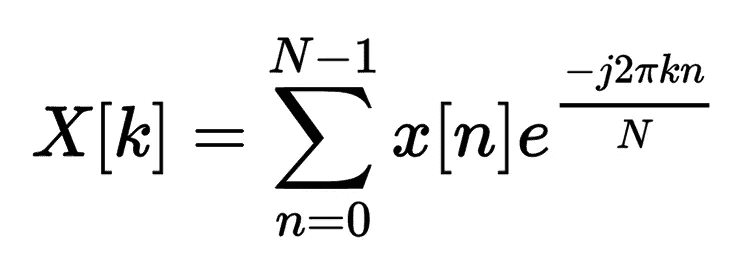
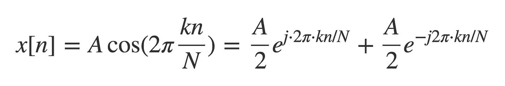

# TensorFlow 中的音频处理

> 原文：<https://towardsdatascience.com/audio-processing-in-tensorflow-208f1a4103aa?source=collection_archive---------0----------------------->


# 短时傅立叶变换的一种实现

## **我发现 TensorFlow 中的音频处理很难，下面是我的修复方法**

有无数种方法可以执行音频处理。在 TensorFlow 中用人工神经网络运行带有音频输入的实验的通常流程是首先预处理音频，然后将其馈送到神经网络。

当一个人想要在计算图的中间执行音频处理时，会发生什么呢？
TensorFlow 附带了[快速傅立叶变换](https://www.tensorflow.org/api_docs/python/tf/fft)的实现，但这还不够。

在这篇文章中，我将解释我们如何实现它，并提供代码，以便短时傅立叶变换可以在计算图中的任何地方使用。

## 代码

所有代码都可以在我的**GitHub**:[tensor flow](https://github.com/dariocazzani/TensorFlow-audio-processing)中音频处理。请随意在那里添加您的贡献。

## 音频预处理:常用方法

当开发一个使用深度神经网络的语音识别引擎时，我们需要将音频输入到我们的神经网络，但是…预处理这个输入的正确方法是什么？

有两种常见的方式来表示声音:

*   *时域:*每个样本代表气压的变化。
*   *频域*:在每个时间戳，我们指示每个频率的振幅。

尽管深度神经网络非常擅长自动学习特征，但依靠携带我们试图解决的任务所需信息的已知特征总是一个好主意。

对于大多数应用，包括语音识别引擎，我们感兴趣的特征被编码在声音的频域表示中。

## 频谱图和短时傅立叶变换

[频谱图](https://en.wikipedia.org/wiki/Spectrogram)显示了信号的频率成分如何随时间变化，并且可以从时域信号中计算出来。
用来做这件事的操作或变换被称为[短时傅立叶变换](https://en.wikipedia.org/wiki/Short-time_Fourier_transform)。

我可以让神经网络知道如何学习这个操作，但事实证明学习 1 个隐藏层是非常复杂的。(参考[通用逼近定理](https://en.wikipedia.org/wiki/Universal_approximation_theorem))

我可以添加更多的层，但是我想保持神经网络的复杂性尽可能小，并且只在最需要的地方学习特征。

我已经使用了开发自动语音识别引擎的例子，但是使用声谱图作为深度神经网络的输入对于涉及非语音音频的类似任务也是常见的，例如降噪、音乐流派分类、鲸叫声检测等。

我想提到的一个特别的项目是来自[谷歌大脑团队](https://research.google.com/teams/brain/)的 [Magenta](https://magenta.tensorflow.org/welcome-to-magenta) ，他的目标是为音乐和艺术世代推进机器智能的艺术状态。

## **为什么是 TensorFlow？**

在实现人工神经网络时，我主要使用 TensorFlow，因为我还没有在 TF 中找到短时傅立叶变换的实现，所以我决定实现我们自己的。
【编辑:2018 年 6 月 4 日】—从 TensorFlow 1.3 开始，他们增加了一些有用的 [DSP 功能](https://www.tensorflow.org/api_docs/python/tf/contrib/signal)。

深度学习实践者可能想要在计算图中包括短时傅立叶变换(我朋友的 STFT)也可能有多种原因，而不仅仅是作为单独的预处理步骤。

请记住，我并没有把重点放在提高效率上。在用于生产之前，它应该(也将会)得到改进。

## **你需要知道的事情**

为了理解 STFT 是如何计算的，您需要理解如何计算离散傅里叶变换。

## **离散傅立叶变换— DFT**

对于那些不熟悉这些概念的人来说，这一部分可能显得很专业，但是我认为为了对代码有一个完整的理解，通过一些数学是很重要的。

**理论
当函数和它的傅立叶变换都被离散化的对应物代替时，它被称为离散傅立叶变换(DFT)。**

给定一个矢量 ***x*** 的 *n* 输入幅值如:

```
{x[0], x[1], x[2], x[3], …, x[N-1]}
```

离散傅立叶变换产生一组 *n* 个频率幅度。

DFT 由下式定义:



DFT equation

*   k 用于表示频域序数
*   n 用于表示时域序数
*   n 是要变换的序列的长度。

**快速傅立叶变换** [快速傅立叶变换](https://en.wikipedia.org/wiki/Fast_Fourier_transform)是 DFT 方程的有效实现。信号的大小必须限制为 2 的幂。

这解释了为什么 N(输入到 DFT 函数的信号大小)必须是 2 的幂，以及为什么它必须以零填充。

在 python 中可以很简单地检测出 x 是否是 2 的幂:

**我们只需要它的一半** 实数正弦波可以用[欧拉恒等式](https://en.wikipedia.org/wiki/Euler%27s_formula)表示为复数正弦波的和



因为 DFT 是线性函数，所以正弦波之和的 DFT 是每个正弦波的 DFT 之和。对于频谱情况，有两个 DFT，一个针对正频率，一个针对负频率，它们是对称的。
这种对称性出现在可以被视为正弦波的无限(或有限)和的真实信号中。

**开窗** 在时域截断信号会导致频域出现纹波。
如果您认为截断信号就像应用了一个矩形窗口，这是可以理解的。在时域中应用窗口会导致频域中的卷积。
当我们将两个频域表示卷积在一起时，会产生纹波。

如果你有兴趣的话，可以找到更多关于 [spectral_leakage](https://mil.ufl.edu/nechyba/www/__eel3135.s2003/lectures/lecture19/spectral_leakage.pdf) 的信息。

下面是一个在 Python 中实现窗口的示例:

**零相位填充**

为了使用 FFT，输入信号的长度必须是 2 的幂。如果输入信号的长度不合适，可以在信号本身的开头和结尾附加零。
因为零样本最初位于输入信号的中心，所以我从中间分割填充信号，并交换这两部分的顺序。

下一个代码片段展示了如何在 TensorFlow 中对一批输入执行此操作:

**FFT、幅度和相位** 现在，您已经拥有了计算频谱图幅度(分贝)和信号相位所需的一切:

## **短时傅立叶变换**

现在，您已经知道如何计算 DFT 来评估信号的频率成分。
当信号的频率成分随时间变化时，STFT 用于分析信号的频率成分。
你可以这样做:

1.  获取信号片段。
2.  将这些信号从剩余的信号中分离出来，并将 DFT 应用于每个片段。
3.  沿着每个线段滑动此窗口。

DFT 系数是时间和频率的函数。

完整的代码分为两部分: *helpers.py* 和 *stft.py* 。

## 结论

在 TensorFlow 中执行 STFT 的可能性允许机器学习实践者在计算图中的任何地方执行信号从时域到频域的变换。新工具总是带来新的想法，我们希望这篇文章将成为开发新的深度学习解决方案的新想法的来源。