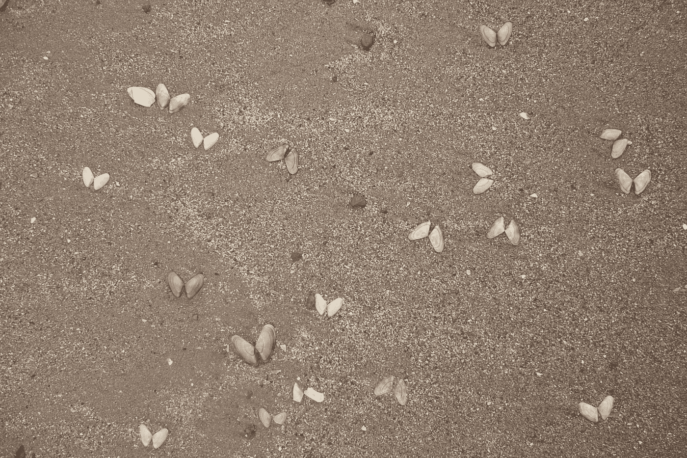

# 八月版:当艺术遇上数据科学

> 原文：<https://towardsdatascience.com/august-edition-when-art-meets-data-science-bbf4c8cf8f?source=collection_archive---------8----------------------->

## 8 篇必读文章。

## [使用 Keras 和直方图均衡化进行深度学习的图像增强](https://medium.com/towards-data-science/image-augmentation-for-deep-learning-using-keras-and-histogram-equalization-9329f6ae5085)

由[瑞安 Allred](https://medium.com/u/7d8ea5e73263?source=post_page-----bbf4c8cf8f--------------------------------) — 12 分钟阅读。

深度神经网络，特别是[卷积神经网络(CNN)](https://en.wikipedia.org/wiki/Convolutional_neural_network)，特别擅长图像分类任务。最先进的 CNN 甚至被证明在图像识别方面超过了人类的表现。

## [甘:与甘一起创作艺术](https://medium.com/towards-data-science/gangogh-creating-art-with-gans-8d087d8f74a1)

肯尼·琼斯 — 13 分钟阅读。

这里介绍的工作是 Kenny Jones 和 Derrick Bonafilia(都是威廉姆斯学院 2017 级)在 Andrea Danyluk 教授的指导下进行的长达一个学期的独立研究的结果。与本项目相关的代码可在[https://github.com/rkjones4/GANGogh](https://github.com/rkjones4/GANGogh)找到。

## [深度神经网络可以作曲吗？](https://medium.com/towards-data-science/can-a-deep-neural-network-compose-music-f89b6ba4978d)

Justin Svegliato — 9 分钟阅读。

当我去年九月开始读研时，我想尽快投入到深度学习的热潮中。当我在纽约作为一名软件开发人员工作时，我不断听到关于深度学习的令人惊讶的事情: [DeepFace](http://www.cv-foundation.org/openaccess/content_cvpr_2014/papers/Taigman_DeepFace_Closing_the_2014_CVPR_paper.pdf) 可以像你我一样识别人脸， [AlphaGo](https://storage.googleapis.com/deepmind-media/alphago/AlphaGoNaturePaper.pdf) 在一场最初对人工智能来说似乎难以捉摸的游戏中摧毁了玩家， [GANs](http://papers.nips.cc/paper/5423-generative-adversarial-nets.pdf) 刚刚开始获得动力。

## [用机器学习预测逻辑的歌词](https://medium.com/towards-data-science/predicting-logics-lyrics-with-machine-learning-9e42aff63730)

由[汉斯·卡明](https://medium.com/u/6ab05a8a2a7c?source=post_page-----bbf4c8cf8f--------------------------------) — 9 分钟阅读。

**从中学开始，当我第一次听到他的歌曲“[我所做的一切](https://www.youtube.com/watch?v=eIGh4Nc1fAM)”时，逻辑**就对我的生活产生了显著的影响。这首歌所属的混音带 *Young Sinatra* ，单枪匹马地让我成为了各种形式的嘻哈音乐的粉丝，向我介绍了我以前从未想过要听的新旧风格。

## [人工智能基因组黑客马拉松上的黑客数据艺术](https://medium.com/towards-data-science/hacking-data-art-at-an-ai-genomic-hackathon-62e16efb49ce)

克里斯汀·亨利(Kristin Henry)—7 分钟阅读。

不久前，我注意到一个有趣的黑客马拉松即将到来。人工智能基因组黑客马拉松聚焦于一种罕见的疾病( [NF2](https://nfcenter.wustl.edu/what-is-nf/neurofibromatosis-type-2/) )。是的，我曾向自己保证不再参加任何黑客马拉松，但这太难以抗拒了。

## [神经网络和 3D 程序内容生成的未来](https://medium.com/towards-data-science/neural-networks-and-the-future-of-3d-procedural-content-generation-a2132487d44a)

由山姆·施奈德手持 — 8 分钟阅读。

作为全球制作机构 [MediaMonks](https://www.mediamonks.com/) 的一名创意技术专家，人们总是问我关于人工智能、人工智能、神经网络等方面的问题。它们是什么？他们能做什么？我们如何使用它们？这篇文章是我将写的探索人工智能、创造力和 3D 内容相遇的空间系列的第一篇。

## [黄画的蒙特利尔:神经风格网络](https://medium.com/towards-data-science/montreal-painted-by-huang-gongwang-neural-style-networks-ec1697b2ac54)

由 Gabriel Tseng — 6 分钟读取。

最近，CNN([卷积神经网络](https://www.wikiwand.com/en/Convolutional_neural_network))的一个非常酷的应用是设计神经网络；这些包括分离一个图像的风格，另一个图像的内容，并把它们结合起来。

## [Pytorch 实现实时风格传输的感知损失](https://medium.com/towards-data-science/pytorch-implementation-of-perceptual-losses-for-real-time-style-transfer-8d608e2e9902)

由[李诗仙](https://medium.com/u/a50580c33120?source=post_page-----bbf4c8cf8f--------------------------------) — 6 分钟阅读。

在这篇文章中，我将简要回顾我在 [Pytorch](http://pytorch.org/) 中编写和训练实时风格转换模型的经历。这项工作在很大程度上基于 [Abhishek Kadian 的实现，](https://github.com/abhiskk/fast-neural-style)它工作得非常好。我做了一些修改，既是为了好玩，也是为了更熟悉 Pytorch。

我们也感谢最近加入我们的所有伟大的新作家[加勒特·金斯曼](https://medium.com/u/73daa5556b4e?source=post_page-----bbf4c8cf8f--------------------------------)、[马尼什·巴尔](https://medium.com/u/b9403a459b9d?source=post_page-----bbf4c8cf8f--------------------------------)、[维哈尔·鞍马](https://medium.com/u/4ce24554e1d2?source=post_page-----bbf4c8cf8f--------------------------------)、[约瑟夫·t·哈塞尔曼](https://medium.com/u/1e1935a8d59f?source=post_page-----bbf4c8cf8f--------------------------------)、[叶戈尔·德芝](https://medium.com/u/f0c2ea82ce84?source=post_page-----bbf4c8cf8f--------------------------------)、[苏永胜](https://medium.com/u/b07b7f1fcc6d?source=post_page-----bbf4c8cf8f--------------------------------)、[西亚瓦什·法赫米](https://medium.com/u/6af9fdbf19ab?source=post_page-----bbf4c8cf8f--------------------------------)、[韦达·孔杜鲁](https://medium.com/u/209851a30a96?source=post_page-----bbf4c8cf8f--------------------------------)、[萨姆·斯奈德举办的](https://medium.com/u/edd59890e9c9?source=post_page-----bbf4c8cf8f--------------------------------)、  [穆拉特·武鲁库](https://medium.com/u/81cc048b8814?source=post_page-----bbf4c8cf8f--------------------------------)、[塞斯·魏德曼](https://medium.com/u/3e4c62db5817?source=post_page-----bbf4c8cf8f--------------------------------)、[马鲁蒂·tech labs](https://medium.com/u/a1db29d4fcb?source=post_page-----bbf4c8cf8f--------------------------------)、[阿明·奥利娅](https://medium.com/u/afce08dc84e6?source=post_page-----bbf4c8cf8f--------------------------------)、[沃尔夫·加贝](https://medium.com/u/66bab1f6efa2?source=post_page-----bbf4c8cf8f--------------------------------)、[基里尔·丹尼柳克](https://medium.com/u/157a4724b329?source=post_page-----bbf4c8cf8f--------------------------------)、[诺亚·莫罗泽](https://medium.com/u/187b19d04a29?source=post_page-----bbf4c8cf8f--------------------------------)、[詹姆斯·登斯莫尔](https://medium.com/u/6d06cd5d5310?source=post_page-----bbf4c8cf8f--------------------------------)、[马頔·舒尔加](https://medium.com/u/4a9eb88ab35?source=post_page-----bbf4c8cf8f--------------------------------)、[德万什·拉拉](https://medium.com/u/f9e8f036df32?source=post_page-----bbf4c8cf8f--------------------------------)、