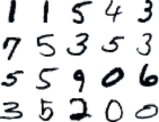

# Auto-Keras，或者说如何用 4 行代码创建深度学习模型

> 原文：<https://towardsdatascience.com/auto-keras-or-how-you-can-create-a-deep-learning-model-in-4-lines-of-code-b2ba448ccf5e?source=collection_archive---------3----------------------->

## 自动化机器学习是这个城市的新生事物，它会一直存在下去。它帮助我们创造出越来越好的模型，这些模型简单易用，API 也很棒。在这里，我会跟你谈谈 Auto-Keras，新的包 AutoML 与 Keras。


在开始之前，Matthew Mayo 引用了一句关于 AutoML 不是什么的名言:

> AutoML 不是自动化数据科学。虽然毫无疑问存在重叠，但机器学习只是数据科学工具包中的许多工具之一，它的使用实际上并不影响所有数据科学任务。例如，如果预测将是给定数据科学任务的一部分，机器学习将是一个有用的组件；然而，机器学习可能根本不会在描述性分析任务中发挥作用。

那么，什么是自动机器学习呢？简而言之，这是一种自动化(【https://www.automl.org/automl/】)任务的方式:

*   预处理和清理数据。
*   选择并构建适当的特征。
*   选择适当的模型族。
*   优化模型超参数。
*   后处理机器学习模型。
*   批判性地分析获得的结果。

现在我们清楚了什么是 AutoML，什么是 Keras？


Keras 是一个高级神经网络 API，用 Python 编写，能够在 [TensorFlow](https://github.com/tensorflow/tensorflow) 、 [CNTK](https://github.com/Microsoft/cntk) 或 [Theano](https://github.com/Theano/Theano) 之上运行。它的开发重点是支持快速实验。能够以尽可能少的延迟从想法到结果是做好研究的关键。

这是由 Franç ois Chollet 创建的，是让深度学习对大众来说变得容易的第一步。

TensorFlow 有一个并不难的 Python API，但 Keras 让很多人很容易进入深度学习。需要注意的是，Keras 现已正式成为 Tensorflow 的一部分:

[](https://www.tensorflow.org/api_docs/python/tf/contrib/keras) [## 模块:tf.contrib.keras | TensorFlow

### 编辑描述

www.tensorflow.org](https://www.tensorflow.org/api_docs/python/tf/contrib/keras) 

太好了。现在我们知道了什么是 Keras 和 AutoML，让我们把它们结合起来。Auto-Keras 是用于自动机器学习的开源软件库。Auto-Keras 提供了自动搜索深度学习模型的架构和超参数的功能。

**安装**

```
pip install autokeras
```

**用途**

关于用法，我将使用他们网站上的一个例子。但是首先让我们比较一下如何用不同的工具来做同样的事情。我将使用著名但有时令人讨厌的 MNIST 数据集。

MNIST 是一个简单的计算机视觉数据集。它由手写数字图像组成，如下所示:



它还包括每个图像的标签，告诉我们它是哪个数字。

## MNIST 在 TensorFlow 上使用热切执行:

资源:

[](https://github.com/tensorflow/models/blob/master/official/mnist/mnist_eager.py) [## 张量流/模型

### 模型-使用 TensorFlow 构建的模型和示例

github.com](https://github.com/tensorflow/models/blob/master/official/mnist/mnist_eager.py) [](https://www.tensorflow.org/guide/eager) [## 急切执行| TensorFlow

### 虽然急切执行使开发和调试更具交互性，但 TensorFlow 图形执行在以下方面具有优势

www.tensorflow.org](https://www.tensorflow.org/guide/eager) 

不太容易，但在示例中解释得很好。TensorFlow 并不是深度学习最简单的工具，而是一个快速可靠的工具。通过急切执行，代码可读性更好。

## MNIST 与 PyTorch:

资源:

[](https://github.com/pytorch/examples/blob/master/mnist/main.py) [## py torch/示例

### 围绕 pytorch 在视觉、文本、强化学习等方面的一组例子。

github.com](https://github.com/pytorch/examples/blob/master/mnist/main.py) 

## MNIST 与 Keras:

资源:

[](https://github.com/keras-team/keras/blob/master/examples/mnist_cnn.py) [## keras-team/keras

### keras -人类的深度学习

github.com](https://github.com/keras-team/keras/blob/master/examples/mnist_cnn.py) 

您可以看到，到目前为止，Keras 是运行这个示例的最简单的包。这是一个很棒的包，具有令人敬畏的功能，从零到模型只需几分钟。

但是现在，蛋糕上的樱桃。

## 配有 Auto-Keras 的 MNIST:

是的，就这些。很简单，对吧？您只需要一个图像分类器，然后拟合数据并评估它。你在那里也有一个 *final_fit* ，它在找到最佳架构后正在进行最后的训练。

现在你已经有了图像分类器，BayesianSearcher，一个图形模块，一个预处理器，一个图层转换器，一个网络转换器，一个分类器生成器和一些实用程序。这是一个不断发展的包，请看看创作者的免责声明:

> 请注意，这是 Auto-Keras 的预发布版本，在正式发布之前仍在进行最终测试。本网站、其软件和网站上的所有内容都是在“按原样”和“按可用”的基础上提供的。Auto-Keras 对网站、其软件或任何内容的适用性或可用性不作任何明示或暗示的保证。Auto-Keras 对任何一方因使用库或内容而遭受的任何损失概不负责，无论此类损失是直接的、间接的、特殊的还是后果性的。对库的任何使用均由用户自担风险，用户将独自对任何计算机系统的损坏或由此类活动导致的数据丢失负责。如果您在网站上遇到任何错误、故障、功能缺失或其他问题，请立即通知我们，以便我们进行相应的纠正。非常感谢你在这方面的帮助。

无论哪种方式都是一个非常有用的令人惊叹的包，将来也会如此。有关 AutoML 和软件包的更多信息，请参见:

 [## AutoML

### BOHB 结合了贝叶斯优化和超波段的优点，以达到两全其美…

www.automl.org](https://www.automl.org/) [](https://www.kdnuggets.com/2017/01/current-state-automated-machine-learning.html) [## 自动机器学习的现状

### 在过去的一年中，自动机器学习(AutoML)已经成为一个非常有趣的话题。最近的一个 KDnuggets…

www.kdnuggets.com](https://www.kdnuggets.com/2017/01/current-state-automated-machine-learning.html) [](https://www.kdnuggets.com/2018/01/managing-machine-learning-workflows-scikit-learn-pipelines-part-4.html) [## 用 AutoML 生成带有 TPOT 的机器学习流水线

### 到目前为止，在这一系列的文章中，我们有:这篇文章将采用不同的方法来构建管道。当然可以…

www.kdnuggets.com](https://www.kdnuggets.com/2018/01/managing-machine-learning-workflows-scikit-learn-pipelines-part-4.html) 

哦！如果你想要一个甚至更简单的方法来做 AutoML 和深度学习，而根本不用编码，请查看 [Deep Cognition](https://medium.com/u/561cb78751ed?source=post_page-----b2ba448ccf5e--------------------------------) 和我在上面的帖子:

[](https://becominghuman.ai/deep-learning-made-easy-with-deep-cognition-403fbe445351) [## 深度认知让深度学习变得简单

### 在过去的一个月里，我有幸见到了 DeepCognition.ai 的创始人

becominghuman.ai](https://becominghuman.ai/deep-learning-made-easy-with-deep-cognition-403fbe445351) [](/a-video-walkthrough-of-deep-cognition-fd0ca59d2f76) [## 深度认知的视频漫游

### 大家好！在本文中，我将与您分享几个视频，带您浏览深度认知的平台…

towardsdatascience.com](/a-video-walkthrough-of-deep-cognition-fd0ca59d2f76) [](/deep-learning-with-a-little-help-from-my-friends-596ee10fd934) [## 在朋友的帮助下进行深度学习

### 当你开始一个新的领域时，最好是从好的公司、朋友或好的社区开始，他们可以…

towardsdatascience.com](/deep-learning-with-a-little-help-from-my-friends-596ee10fd934)