# 自回归生成模型(PixelRNN，PixelCNN++)

> 原文：<https://towardsdatascience.com/auto-regressive-generative-models-pixelrnn-pixelcnn-32d192911173?source=collection_archive---------2----------------------->

作者:[哈什夏尔马，](https://medium.com/u/d55b19771e38?source=post_page-----32d192911173--------------------------------)T2

生成模型是无监督学习的子集，其中给定一些训练数据，我们从相同的分布中生成新的样本/数据。有两种方法来模拟这种分布，其中最有效和最流行的是自回归模型、自动编码器和 GANs。

生成对手网络(GANs)和自回归模型之间的基本区别在于，GANs 学习隐式数据分布，而后者学习由模型结构强加的先验支配的显式分布。发行版可以是任何东西，例如类别标签、汽车或猫的图像。更简单地说，先验意味着一个量的概率分布。

自回归模型优于 GANs 的一些优点是:

1.**提供了一种计算可能性的方法**:这些模型具有返回显式概率密度的优势(与 GANs 不同)，使得它可以直接应用于压缩、概率规划和探索等领域

2.**训练比 GAN 更稳定**:训练 GAN 需要找到纳什均衡。由于目前没有这样做的算法，与 PixelRNN 或 PixelCNN 相比，训练 GAN 是不稳定的。

3.**对离散和连续数据都有效**:对于 GAN 来说生成离散数据很难，比如文本。

众所周知，GANs 能产生更高质量的图像，训练速度也更快。人们正在努力将这两种类型的优势整合到一个单一的模型中，但这仍然是一个开放的研究领域。在这篇博客中，我们将只关注自回归部分，其他的留待以后讨论。

无监督学习中最重要和众所周知的问题之一是对自然图像的分布建模，这也是我们选择写这篇博客的原因。

为了解决这个问题，我们需要一个易于处理和扩展的模型。PixelRNN、PixelCNN 是满足这两个条件的自回归模型的一部分。

这些类型的模型优选地用于图像补全。同样的原因是因为它在这类问题上比其他生成模型表现得更好。

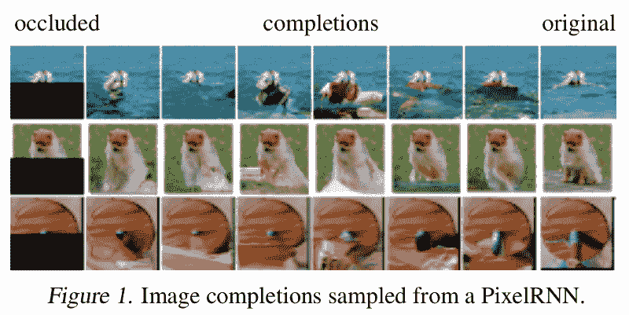

# 像素 RNN

对这种网络建模的有效方法是使用概率密度模型(如高斯或正态分布)来量化图像的像素，作为条件分布的产物。这种方法将建模问题转化为序列问题，其中下一个像素值由所有先前生成的像素值确定。

为了处理像素值和分布之间的非线性和长期依赖关系，我们需要一个像递归神经网络(RNN)这样的表达序列模型。rnn 已经被证明在处理序列问题上非常有效。

**条件独立性**

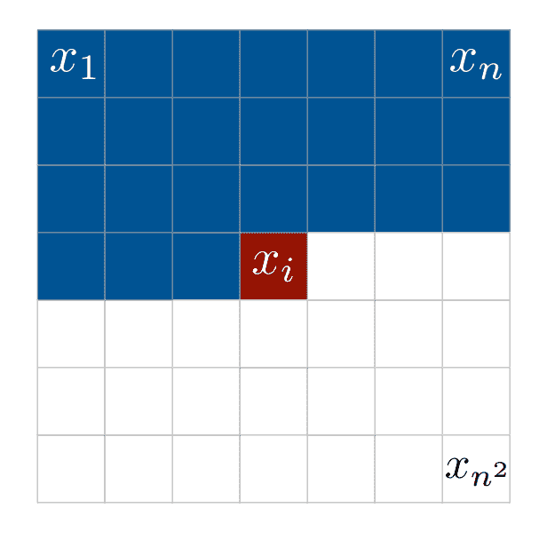

FIGURE 2 : Pixels of an nxn image

网络在每行中一次一个像素地扫描一行图像。随后，它预测可能的像素值的条件分布。图像像素的分布被写成条件分布的乘积，并且这些值在图像的所有像素之间共享。

这里的目的是给(n×n)图像的每个像素分配一个概率 p(x)。这可以通过将像素 xi 的概率写成:

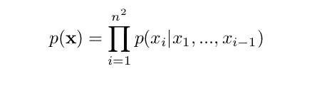

这是给定所有先前生成的像素的概率的第 I 个像素的概率。逐行逐像素地进行生成。此外，每个像素 xi 由所有三个颜色通道红色、绿色和蓝色(RGB)共同确定。第 I 个像素的条件概率变成:

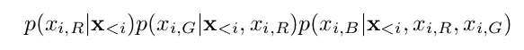

因此，每种颜色都取决于其他颜色以及先前生成的像素。

由于我们现在可以知道我们的像素值的条件概率，为了获得适当的像素值，我们使用 256 路 softmax 层。该层的输出可以取 0-255 之间的任何值，即我们的像素值可以在 0-255 之间变化。

**模型建筑:**

有四种不同的架构可供使用，即:

行 LSTM、对角线 BiLSTM、全卷积网络和多尺度网络。

该网络由多达 12 层的二维 LSTMs 组成。使用的两种类型的 LSTM 层是，

1.  **行 LSTM** :第一层是使用 a 类掩码的 7x7 卷积，接着是使用 B 类掩码的 3x1 卷积的输入到状态层，以及未被掩码的 3x1 状态到状态卷积层。然后，特征映射通过由 ReLU 和 b 型掩码组成的几个 1x1 卷积层，该架构的最后一层是 256 路 softmax 层。
2.  对角线 BiLSTM :其架构与 Row LSTM 的唯一区别在于状态输入层和状态层。它有一个到具有掩码类型 B 的状态层的 1x1 卷积输入和一个到没有掩码的状态层的 1x2 卷积输入。

**排 LSTM**

隐藏状态(I，j) =隐藏状态(i-1，j-1)+隐藏状态(i-1，j+1)+隐藏状态(i-1，j)+ p(i，j)

这从上到下逐行处理图像，同时计算整行的特征。它捕捉像素上方的一个相当三角形的区域。然而，它不能捕获整个可用区域。

FIGURE 3 : input-to-state and state-to-state mapping for Row LSTM

**对角线长度**

pixel(i，j) = pixel(i，j-1) + pixel(i-1，j)。

这一层的感受野包括整个可用区域。处理过程沿对角线进行。它从顶角开始，在向两个方向移动的同时到达对面的角。

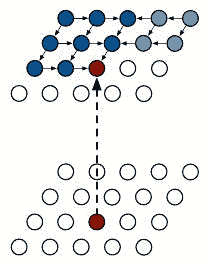

FIGURE 4 : input-to-state and state-to-state mapping for Diagonal BiLSTM

在这些网络中还使用剩余连接(或跳过连接)来提高收敛速度，并通过网络更直接地传播信号。

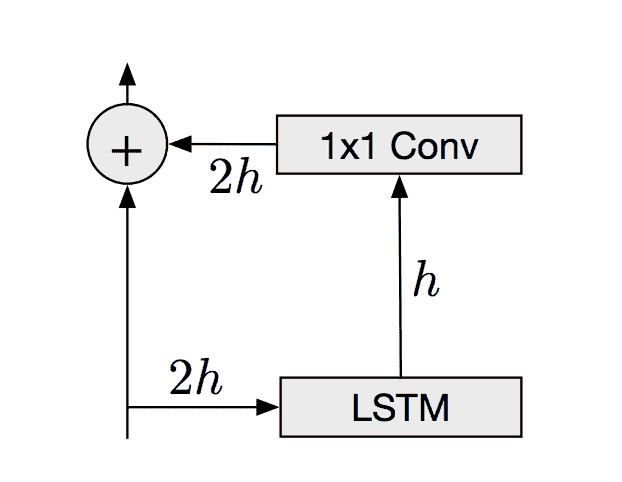

FIGURE 5 : Residual block for PixelRNNs. ‘h’ refers to the number of parameters.

**蒙面卷积:**

每层中每个输入位置的特征被分成三个部分，每个部分对应一种颜色(RGB)。为了计算 G 通道的值，我们需要 R 通道的值以及所有先前像素的值。类似地，B 通道需要 R 和 G 通道的信息。为了限制网络遵守这些约束，我们对卷积应用掩码。

我们使用两种类型的面具:

1.  **类型 A** :此遮罩仅应用于第一个卷积层，并限制连接到当前像素中已经预测的那些颜色。
2.  类型 B :该蒙版应用于其他图层，并允许连接到当前像素中的预测颜色。

掩码是网络的重要组成部分，它维护网络中的信道数量。

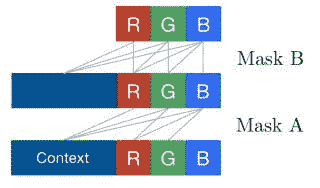

FIGURE 6 : Connectivity inside a masked convolution

**损失函数和评估指标**

这里，负对数似然(NLL)用作损失和评估度量，因为网络从值 0-255 预测(分类)像素值。

# 像素 CNN

PixelRNN 的主要缺点是训练非常慢，因为每个状态都需要顺序计算。这可以通过使用卷积层和增加感受野来克服。PixelCNN 使用标准卷积层来捕捉有界感受野，并同时计算所有像素位置的特征。它使用多个卷积层来保持空间分辨率。但是，没有使用池层。在卷积中采用掩码来限制模型违反条件依赖。

第一个图层是使用遮罩 A 的 7x7 卷积，其余图层使用 3x3 卷积和遮罩 b。然后，要素地图经过由 ReLU 激活和 1x1 卷积组成的两个图层。该架构的最后一层是 256 路 softmax 层。

与 PixelRNN 相比，PixelCNN 大大减少了训练时间。然而，图像生成仍然是顺序的，因为每个像素需要作为输入返回给网络以计算下一个像素。PixelCNN 的主要缺点是它的性能比 PixelRNN 差。另一个缺点是在感受野中存在盲点。CNN 对感受野的捕捉以三角形方式进行。它导致几个像素被排除在感受野之外，如下图所示。由于卷积网络捕捉有界感受域(不同于 BiLSTM)并一次计算所有像素的特征，这些像素不依赖于所有先前的像素，这是不希望的。卷积层不能完全处理感受野，从而导致像素值的轻微误算。遗漏的像素构成了盲点。

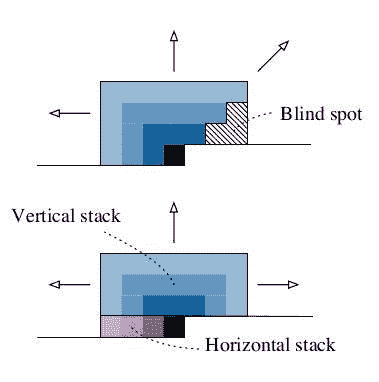

FIGURE 7 : Blind spot in a PixelCNN and its solution in Gated PixelCNN

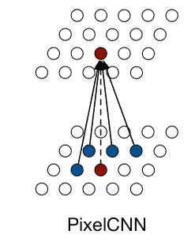

FIGURE 8 : input-to-state and state-to-state mapping for PixelCNN

# 门控像素 CNN

它改进了 PixelCNN 的架构，同时匹配 PixelRNN 的对数似然性。

PixelRNN 优于 PixelCNN 的基本原因是它使用了 LSTM 层。LSTMs 的感受野包含网络中的所有相邻像素，同时它在 PixelCNN 中随着深度而增长。该方法中引入的主要改进或变化是使用以下激活代替 ReLU:

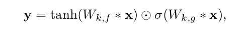

σ is the sigmoid non-linearity, k is the number of the layer, ⊙ is the element-wise product and ∗ is the convolution operator.

该模型的另一个主要改进是使用 CNN 通过使用堆栈来完全利用可用的感受野。PixelCNN 中的感受野是有限的，这导致从条件分布的计算中遗漏了几个像素，从而产生了 CNN 不能处理的盲点。该模型使用两层堆栈来处理以消除上述问题:

1.  **水平堆栈**:以当前行为条件，将前一层的输出和垂直堆栈的输出作为输入。
2.  **垂直堆栈**:以当前像素以上的所有行为条件。它没有任何掩蔽。它的输出被送入水平堆栈，感受野以矩形方式增长。

结果表明，门控 PixelCNN (3.03 位/dim)比 PixelCNN (3.14 位/dim)高出 0.11 位/dim，其性能与 PixelRNN (3.00 位/dim)相当，而花费的训练时间不到一半。

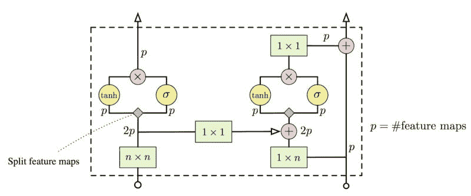

FIGURE 9 : A single layer in Gated PixelCNN architecture

# 像素 CNN ++

OpenAI 的这个模型做了一些修改，以提高 PixelCNN 的性能，同时保持其计算效率。值得注意的修改包括:

1.  **离散逻辑混合似然**:soft max 层，用于计算像素的条件分布，尽管效率在内存方面非常昂贵。此外，它使梯度稀疏在训练初期。为了应对这一点，我们假设一个潜在的颜色强度类似于在变化自动编码器中使用的，具有连续分布。它被舍入到最接近的 8 位表示，以给出像素值。强度的分布是逻辑的，因此可以容易地确定像素值。这种方法是内存有效的，输出是较低的维度，提供了更密集的梯度，从而解决了这两个问题。
2.  **对整个像素进行调节** : PixelCNN 根据颜色(RGB)将模型分解为 3 个子像素，但这会使模型变得复杂。像素的颜色通道之间的依赖性相对简单，并且不需要深度模型来训练。因此，最好对整个像素而不是单独的颜色进行调节，然后在预测像素的所有 3 个通道上输出联合分布。
3.  **下采样** : PixelCNN 无法计算长程相关性。至于为什么比不上 PixelRNN 的性能，这也是 PixelCNN 的缺点之一。为了克服这一点，我们通过使用步长为 2 的卷积对层进行缩减采样。下采样减少了输入大小，从而提高了感受野的相对大小，这导致了一些信息损失，但可以通过添加额外的捷径连接来补偿。
4.  **快捷连接**:模拟 U-net 的编解码结构。层 2 和 3 被下采样，然后层 5 和 6 被上采样。存在从编码器到解码器的剩余连接，以提供本地化信息。
5.  **Dropout** :由于 PixelCNN 和 PixelCNN++的模型都非常强大，如果不进行正则化，它们很可能会溢出数据。因此，我们在第一次卷积后对剩余路径应用下降。

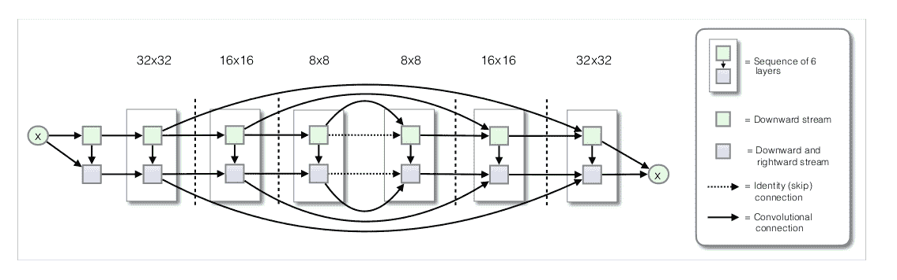

FIGURE 10 : Convolutional architecture with residual connections

PixelCNN++的性能远远超过 PixelRNN 和 PixelCNN。当在 CIFAR-10 上训练时，最佳测试对数似然是 2.92 比特/像素，相比之下，PixelRNN 是 3.0 比特/像素，门控 PixelCNN 是 3.03 比特/像素。此外，如果没有使用任何一个修改，性能下降，模型学习缓慢或者在某些情况下不能完全学习。关于这些实验的更多细节在论文中给出。

**结论**

实验表明，PixelCNN++可以用作变分自动编码器(VAE)中的解码器，这在正在进行的研究中具有应用，如可以在诸如 PixelGAN 的几篇研究论文中看到的。PixelCNN 迫使编码器学习更高级别的特征，因为网络本身可以处理较低维度的特征。将 VAEs、GANs 和自回归模型一起使用是一个活跃的研究领域。这些模型以及强化技术可以改进最先进的技术，并引领无监督/半监督学习领域的研究，以匹配监督学习中正在进行的研究水平。

**参考文献**

1.  [https://allenlu 2007 . WordPress . com/2017/08/19/pixel rnn-vs-gan-for-probabilical-generative-model/](https://allenlu2007.wordpress.com/2017/08/19/pixelrnn-vs-gan-for-probabilistic-generative-model/)
2.  【http://sergeiturukin.com/2017/02/22/pixelcnn.html 
3.  像素递归神经网络(范德奥尔德等人)2016([https://arxiv.org/pdf/1601.06759.pdf](https://arxiv.org/pdf/1601.06759.pdf))
4.  使用 PixelCNN 解码器的条件图像生成(范德奥尔德等人)2016([https://arxiv.org/pdf/1606.05328.pdf](https://arxiv.org/pdf/1606.05328.pdf))
5.  PixelCNN++用离散逻辑混合似然和其他修改改进 PixelCNN。(萨利曼斯等人)2017。([https://arxiv.org/pdf/1701.05517.pdf](https://arxiv.org/pdf/1701.05517.pdf))
6.  [https://towards data science . com/summary-of-pixel rnn-by-Google-deep mind-7-min-read-938d 9871 D6 d 9](/summary-of-pixelrnn-by-google-deepmind-7-min-read-938d9871d6d9)
7.  [https://www . common lounge . com/discussion/99 e 291 af 08 e 2427 b 9d 961d 41 bb 12 c 83 b](https://www.commonlounge.com/discussion/99e291af08e2427b9d961d41bb12c83b)
8.  极大极小博弈理论([https://en.wikipedia.org/wiki/Minimax](https://en.wikipedia.org/wiki/Minimax))

**代码**

1.  pixel cnn++:[https://github.com/openai/pixel-cnn](https://github.com/openai/pixel-cnn)(tensor flow)
2.  https://github.com/carpedm20/pixel-rnn-tensorflow(张量流)