# 自动标记堆栈溢出问题

> 原文：<https://towardsdatascience.com/auto-tagging-stack-overflow-questions-5426af692904?source=collection_archive---------3----------------------->


Photo Credit: Pexels

自然语言处理最有趣的应用之一是自动推断和标记问题的主题。在这篇文章中，我们将从堆栈溢出问题和答案的探索性分析开始，然后我们将构建一个简单的模型来预测堆栈溢出问题的标签。我们将使用 Scikit-Learn 解决这个文本分类问题。让我们开始吧。

# 数据

对于这个项目，我们将使用 10%关于编程主题的堆栈溢出问答中的[文本，它可以在](https://www.kaggle.com/stackoverflow/stacksample/data) [Kaggle](https://www.kaggle.com/stackoverflow/stacksample/data) 上免费获得。

# 探索性数据分析

因为 ggplot 是我们最喜欢的数据可视化工具之一。因此，我们将在 r 中进行 EDA。

装载必要的包装

```
library(readr)
library(dplyr)
library(ggplot2)
library(lubridate)
library(tidytext)
library(tidyverse)
library(broom)
library(purrr)
library(scales)
theme_set(theme_bw())
```

问题数据和标签数据是分开存储的，所以我们将分别读取它们。

```
questions <- read_csv("Questions.csv")
question_tags <- read_csv("Tags.csv")
```

**标签数据**

那么，最受欢迎的标签有哪些呢？

```
question_tags %>%
  count(Tag, sort = TRUE)
```

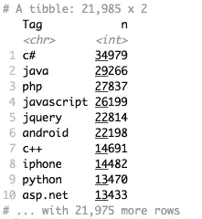

Figure 1

**问题数据**

每周问的问题数量:

```
questions <- questions[ -c(8:29)]
questions %>%
  count(Week = round_date(CreationDate, "week")) %>%
  ggplot(aes(Week, n)) +
  geom_line() + 
  ggtitle('The Number of Questions Asked Per Week')
```

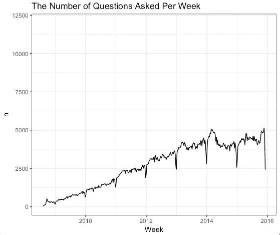

Figure 2

比较特定标签随时间的增长或收缩:

```
tags <- c("c#", "javascript", "python", "r", "php")q_per_year <- questions %>%
  count(Year = year(CreationDate)) %>%
  rename(YearTotal = n)tags_per_year <- question_tags %>%
  filter(Tag %in% tags) %>%
  inner_join(questions) %>%
  count(Year = year(CreationDate), Tag) %>%
  inner_join(q_per_year)ggplot(tags_per_year, aes(Year, n / YearTotal, color = Tag)) +
  geom_line() +
  scale_y_continuous(labels = scales::percent_format()) +
  ylab("% of Stack Overflow questions with this tag") +
  ggtitle('Growth or Shrinking of Particular Tags Overtime')
```

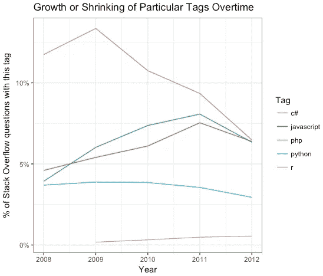

Figure 3

标题中最常见的单词是什么？

```
title_word_counts <- title_words %>%
  anti_join(stop_words, c(Word = "word")) %>%
  count(Word, sort = TRUE)title_word_counts %>%
  head(20) %>%
  mutate(Word = reorder(Word, n)) %>%
  ggplot(aes(Word, n)) +
  geom_col(fill = "cyan4", alpha = 0.8, width = 0.6) +
  ylab("Number of appearances in question titles") +
  ggtitle('The most common words in the question titles') +
  coord_flip()
```

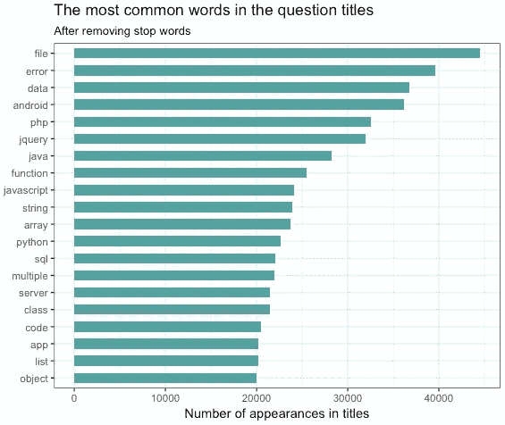

Figure 4

**在标签类别中查找 TF-IDF**

我们预计标签类别在标题内容方面会有所不同，因此它们之间的词频也会有所不同。我们将使用 tf-idf 来查找与特定标签最相关的标题词。

```
common_tags <- question_tags %>%
    group_by(Tag) %>%
    mutate(TagTotal = n()) %>%
    ungroup() %>%
    filter(TagTotal >= 100)tag_word_tfidf <- common_tags %>%
    inner_join(title_words, by = "Id") %>%
    count(Tag, Word, TagTotal, sort = TRUE) %>%
    ungroup() %>%
    bind_tf_idf(Word, Tag, n)tag_word_tfidf %>%
    filter(TagTotal > 1000) %>%
    arrange(desc(tf_idf)) %>%
    head(10)
```

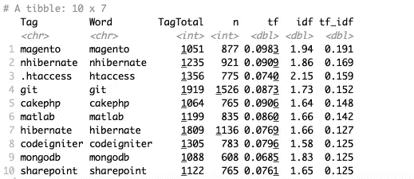

Figure 5

我们将检查所有标签类别的顶级 tf-idf，以提取特定于这些标签的单词。

```
tag_word_tfidf %>%
  filter(Tag %in% c("c#", "python", "java", "php", "javascript", "android")) %>%
  group_by(Tag) %>%
  top_n(12, tf_idf) %>%
  ungroup() %>%
  mutate(Word = reorder(Word, tf_idf)) %>%
  ggplot(aes(Word, tf_idf, fill = Tag)) +
  geom_col(show.legend = FALSE, width = 0.6) +
  facet_wrap(~ Tag, scales = "free") +
  ylab("tf-idf") +
  coord_flip() +
  ggtitle('The 12 terms with the highest tf-idf within each of the top tag categories')
```

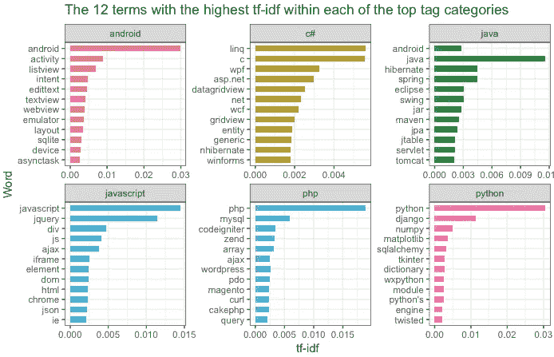

Figure 6

**随时间变化**

随着时间的推移，哪些单词和术语变得越来越频繁或越来越不频繁？这些可以给我们一种变化的软件生态系统的感觉，并让我们预测哪些词将继续增长的相关性。为了达到这个目的，我们需要得到每个单词的斜率。

```
questions$month<-month(questions$CreationDate)
questions$year <- year(questions$CreationDate)titles_per_month <- questions %>%
  group_by(month) %>%
  summarize(month_total = n())title_words <- questions %>%
  arrange(desc(Score)) %>%
  distinct(Title, .keep_all = TRUE) %>%
  unnest_tokens(word, Title, drop = FALSE) %>%
  distinct(Id, word, .keep_all = TRUE) %>%
  anti_join(stop_words, by = "word") %>%
  filter(str_detect(word, "[^\\d]")) %>%
  group_by(word) %>%
  mutate(word_total = n()) %>%
  ungroup()word_month_counts <- title_words %>%
  filter(word_total >= 1000) %>%
  count(word, month, year) %>%
  complete(word, month, year, fill = list(n = 0)) %>%
  inner_join(titles_per_month, by = "month") %>%
  mutate(percent = n / month_total)mod <- ~ glm(cbind(n, month_total - n) ~ year, ., family = "binomial")slopes <- word_month_counts %>%
  nest(-word) %>%
  mutate(model = map(data, mod)) %>%
  unnest(map(model, tidy)) %>%
  filter(term == "year") %>%
  arrange(desc(estimate))slopes
```

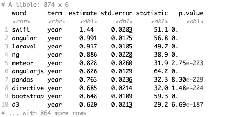

Figure 7

然后标出增长最快的 16 个单词:

```
slopes %>%
  head(16) %>%
  inner_join(word_month_counts, by = "word") %>%
  mutate(word = reorder(word, -estimate)) %>%
  ggplot(aes(year, n / month_total, color = word)) +
  geom_point(show.legend = FALSE) +
  geom_smooth(show.legend = FALSE) +
  scale_y_continuous(labels = percent_format()) +
  facet_wrap(~ word, scales = "free_y") +
  expand_limits(y = 0) +
  labs(x = "Year",
       y = "Percentage of titles containing this term",
       title = "16 fastest growing words in Stack Overflow question titles")
```

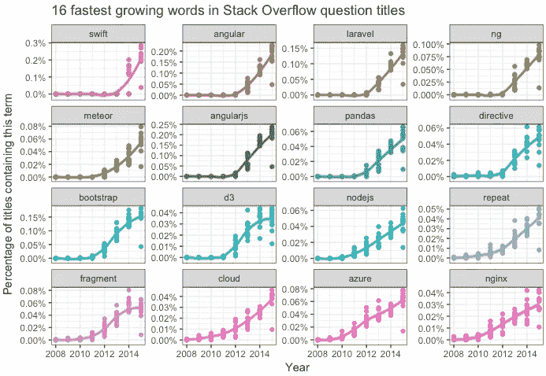

Figure 8

前 16 个收缩最快的单词:

```
slopes %>%
  tail(16) %>%
  inner_join(word_month_counts, by = "word") %>%
  mutate(word = reorder(word, -estimate)) %>%
  ggplot(aes(year, n / month_total, color = word)) +
  geom_point(show.legend = FALSE) +
  geom_smooth(show.legend = FALSE) +
  scale_y_continuous(labels = percent_format()) +
  facet_wrap(~ word, scales = "free_y") +
  expand_limits(y = 0) +
  labs(x = "Year",
       y = "Percentage of titles containing this term",
       title = "16 fastest shrinking words in Stack Overflow question titles")
```

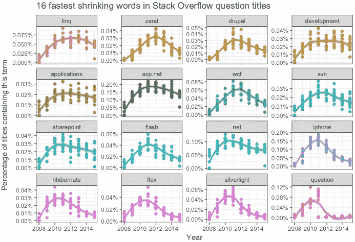

Figure 9

**N 元语法分析**

n 元模型不仅用于开发一元模型，还用于开发二元模型和三元模型。二元模型是一个 n 元模型，表示 *n* =2。以下是问题标题中最常见的二元结构。

```
title_bigrams <- questions %>%
  unnest_tokens(bigram, Title, token = "ngrams", n = 2)title_bigrams %>%
  count(bigram, sort = TRUE)
```

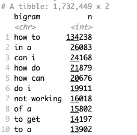

Figure 10

我相信你会觉得它们毫无意义。让我们找到最常见的有意义的二元模型。

```
bigrams_separated <- title_bigrams %>%
  separate(bigram, c("word1", "word2"), sep = " ")bigrams_filtered <- bigrams_separated %>%
  filter(!word1 %in% stop_words$word) %>%
  filter(!word2 %in% stop_words$word)bigram_counts <- bigrams_filtered %>% 
  count(word1, word2, sort = TRUE)bigrams_united <- bigrams_filtered %>%
  unite(bigram, word1, word2, sep = " ")bigrams_united %>%
  count(bigram, sort = TRUE)
```

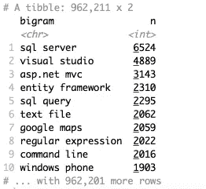

Figure 11

和最常见的三元模型:

```
questions %>%
  unnest_tokens(trigram, Title, token = "ngrams", n = 3) %>%
  separate(trigram, c("word1", "word2", "word3"), sep = " ") %>%
  filter(!word1 %in% stop_words$word,
         !word2 %in% stop_words$word,
         !word3 %in% stop_words$word) %>%
  count(word1, word2, word3, sort = TRUE)
```

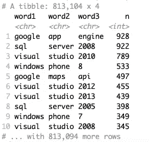

Figure 12

那很有趣！

现在，我们将开发一个预测模型来自动标记堆栈溢出问题。我们将用 Python 来实现。

```
write.csv(total, file = "/Users/sli/Documents/total.csv", row.names = FALSE)
```

以下是问题和标记组合表的前五行:

```
import pandas as pd
total = pd.read_csv('total.csv', encoding='latin-1')total.head()
```

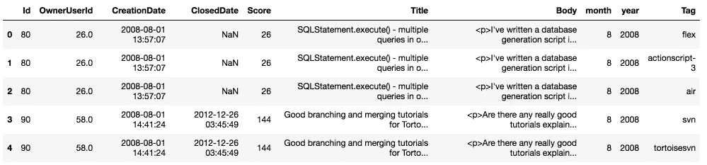

Figure 13

以下是第一个问题的全文:

```
total['Body'][0]
```

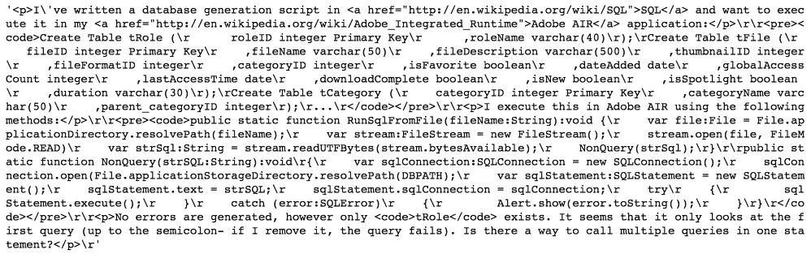

Figure 14

# **文本预处理**

原始的文本数据是杂乱的，需要清理以便进行进一步的分析。我们从数据中排除 HTML 标签、链接和代码片段。

```
from collections import Counter
import numpy as np 
import string
import redef clean_text(text):
    global EMPTY
    EMPTY = ''

    if not isinstance(text, str): 
        return text
    text = re.sub('<pre><code>.*?</code></pre>', EMPTY, text)def replace_link(match):
        return EMPTY if re.match('[a-z]+://', match.group(1)) else match.group(1)

    text = re.sub('<a[^>]+>(.*)</a>', replace_link, text)
    return re.sub('<[^>]+>', EMPTY, text)
```

然后，我们为“Body”列中已清理的文本创建一个新的“Text”列。

```
total['Text'] = total['Body'].apply(clean_text).str.lower()
total.Text = total.Text.apply(lambda x: x.replace('"','').replace("\n","").replace("\t",""))
```

我们的数据中有超过 20，000 个独特的标签。

```
total['Tag'].nunique()
```

21981

为了简化问题，我们将只处理前 10 个最常用的标签，如下所示:

```
def plot_tags(tagCount):

    x,y = zip(*tagCount) colormap = plt.cm.gist_ncar #nipy_spectral, Set1,Paired  
    colors = [colormap(i) for i in np.linspace(0, 0.8,50)] area = [i/4000 for i in list(y)]   # 0 to 15 point radiuses
    plt.figure(figsize=(10,6))
    plt.ylabel("Number of question associations")
    for i in range(len(y)):
      plt.plot(i,y[i],marker='o',linestyle='',ms=area[i],label=x[i])    plt.legend(numpoints=1)
    plt.show()import collections
import matplotlib.pyplot as plt
tagCount =  collections.Counter(list(total['Tag'])).most_common(10)
print(tagCount)
plot_tags(tagCount)
```

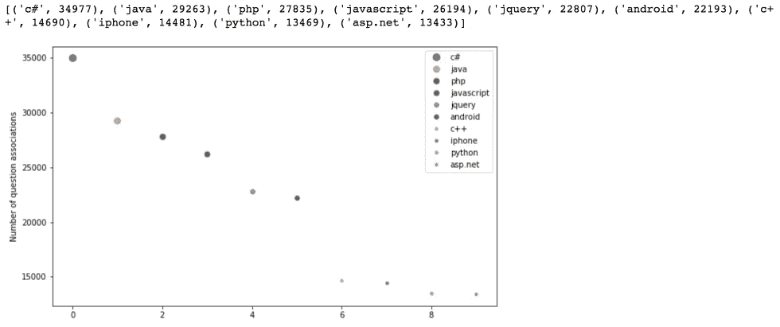

Figure 15

```
total = total[(total.Tag == 'c#') | (total.Tag == 'java') | (total.Tag == 'php') | (total.Tag =='javascript') | (total.Tag =='jquery') | (total.Tag == 'android') | (total.Tag == 'c++') | (total.Tag == 'iphone') | (total.Tag == 'python') | (total.Tag == 'asp.net')]
```

# 文本文档的分类

我们将 scikit-learn 的单词包方法按标签对文本进行分类。所以，我们只对两列感兴趣——“文本”和“标签”。

```
from sklearn.model_selection import train_test_split
X_train, X_test, y_train, y_test = train_test_split(total['Text'], total['Tag'], random_state=42, test_size=0.2, shuffle=True)
```

我们将尝试各种分类器，这些分类器可以有效地处理已经转换为稀疏矩阵的文本数据。

条形图显示每个分类器的准确性、训练时间(标准化)和测试时间(标准化)。

```
from __future__ import print_functionfrom time import time
import matplotlib.pyplot as pltfrom sklearn.feature_extraction.text import TfidfVectorizer
from sklearn.feature_extraction.text import HashingVectorizer
from sklearn.feature_selection import SelectFromModel
from sklearn.feature_selection import SelectKBest, chi2
from sklearn.linear_model import RidgeClassifier
from sklearn.pipeline import Pipeline
from sklearn.svm import LinearSVC
from sklearn.linear_model import SGDClassifier
from sklearn.linear_model import Perceptron
from sklearn.linear_model import PassiveAggressiveClassifier
from sklearn.naive_bayes import BernoulliNB, MultinomialNB
from sklearn.neighbors import NearestCentroid
from sklearn.utils.extmath import density
from sklearn import metricstarget_names=total['Tag'].unique()
def benchmark(clf):
    print('_' * 80)
    print("Training: ")
    print(clf)
    t0 = time()
    clf.fit(X_train_1, y_train)
    train_time = time() - t0
    print("train time: %0.3fs" % train_time)t0 = time()
    pred = clf.predict(X_test_1)
    test_time = time() - t0
    print("test time:  %0.3fs" % test_time)score = metrics.accuracy_score(y_test, pred)
    print("accuracy:   %0.3f" % score)if hasattr(clf, 'coef_'):
        print("dimensionality: %d" % clf.coef_.shape[1])
        print("density: %f" % density(clf.coef_))if opts.print_top10 and feature_names is not None:
            print("top 10 keywords per class:")
            for i, label in enumerate(target_names):
                top10 = np.argsort(clf.coef_[i])[-10:]
                print(trim("%s: %s" % (label, " ".join(feature_names[top10]))))
        print()if opts.print_report:
        print("classification report:")
        print(metrics.classification_report(y_test, pred,
                                            target_names=target_names))if opts.print_cm:
        print("confusion matrix:")
        print(metrics.confusion_matrix(y_test, pred))print()
    clf_descr = str(clf).split('(')[0]
    return clf_descr, score, train_time, test_timeresults = []
for clf, name in (
        (RidgeClassifier(tol=1e-2, solver="lsqr"), "Ridge Classifier"),
        (Perceptron(n_iter=50), "Perceptron"),
        (PassiveAggressiveClassifier(n_iter=50), "Passive-Aggressive")):
    print('=' * 80)
    print(name)
    results.append(benchmark(clf))

print('=' * 80)
print("Elastic-Net penalty")
results.append(benchmark(SGDClassifier(alpha=.0001, n_iter=50,
                                       penalty="elasticnet")))
print('=' * 80)
print("NearestCentroid (aka Rocchio classifier)")
results.append(benchmark(NearestCentroid()))print('=' * 80)
print("Naive Bayes")
results.append(benchmark(MultinomialNB(alpha=.01)))
results.append(benchmark(BernoulliNB(alpha=.01)))print('=' * 80)
print("LinearSVC with L1-based feature selection")
results.append(benchmark(Pipeline([
  ('feature_selection', SelectFromModel(LinearSVC(penalty="l1", dual=False,
                                                  tol=1e-3))),
  ('classification', LinearSVC(penalty="l2"))])))indices = np.arange(len(results))results = [[x[i] for x in results] for i in range(4)]clf_names, score, training_time, test_time = results
training_time = np.array(training_time) / np.max(training_time)
test_time = np.array(test_time) / np.max(test_time)plt.figure(figsize=(12, 8))
plt.title("Score")
plt.barh(indices, score, .2, label="score", color='navy')
plt.barh(indices + .3, training_time, .2, label="training time",
         color='c')
plt.barh(indices + .6, test_time, .2, label="test time", color='darkorange')
plt.yticks(())
plt.legend(loc='best')
plt.subplots_adjust(left=.25)
plt.subplots_adjust(top=.95)
plt.subplots_adjust(bottom=.05)for i, c in zip(indices, clf_names):
    plt.text(-.3, i, c)plt.show()
```

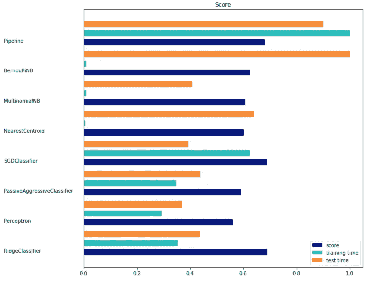

Figure 16

使用岭回归的分类器取得了迄今为止最好的结果。因此，我们打印出每个标签的精度和召回率。

```
model = RidgeClassifier(tol=1e-2, solver="lsqr")
model.fit(X_train_1, y_train)
predicted = model.predict(X_test_1)
from sklearn.metrics import classification_reportprint(classification_report(y_test, predicted, target_names=target_names))
```

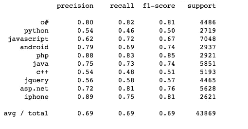

Figure 17

我们也许可以通过参数调整来获得更好的结果，但是我把它留给你去做。

源代码可以在 [Github](https://github.com/susanli2016/Machine-Learning-with-Python/blob/master/stack_over_flow_auto_tagging.ipynb) 找到。我期待听到任何反馈或问题。

参考资料:

[Scikit-Learn](http://scikit-learn.org/stable/auto_examples/text/document_classification_20newsgroups.html)

[文字挖掘用 R](https://www.tidytextmining.com/)