# 自动转录:Python 中的 Google 语音 API 时间偏移

> 原文：<https://towardsdatascience.com/auto-transcribe-google-speech-api-time-offsets-in-python-7c24c4db3720?source=collection_archive---------2----------------------->

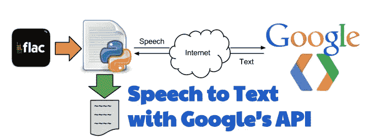

转录音频文件或语音对世界各地的许多公司来说至关重要，正如我们所知，由人类转录的*听的古老技术可能会导致致命的错误，并吃掉你的大量资源(人类)。它需要煞费苦心地注意转录每一个被记录的单词，有时，你必须处理多个音频文件。*

***【多么无聊】*** *，*正是 [*Shikamaru*](http://naruto.wikia.com/wiki/Shikamaru_Nara) 如果被赋予转录的工作，他会说的话，这里是谷歌语音 API 及其最新添加的地方，*时间偏移(时间戳)*来拯救我们*Shikamaru。*


**什么是 Google Speech API？**

*   应用强大的神经网络模型将语音转换为文本
*   识别超过 110 种语言和变体
*   实时文本结果
*   成功的噪音处理
*   支持能够发送*剩余*或 *gRPC* 请求的设备
*   API 包括在识别的音频中说出的每个单词的开始和结束的 ***时间偏移值(时间戳)***

## **设置 Google 云和 Python3 环境的步骤**

**在 Google Cloud** 中注册一个免费层帐户需要一个 API 密钥，您可以申请一个免费层计划(365
天)。

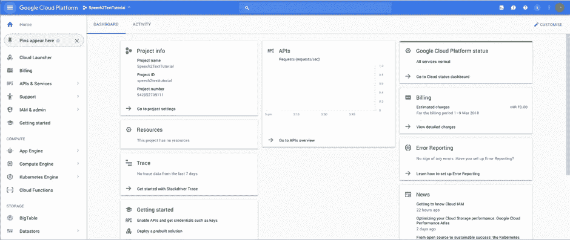

Google Cloud Platform Dashboard

**在 Google Cloud 中生成 API 密钥** 按照以下步骤生成 API 密钥:

*   登录 [***谷歌云控制台***](https://console.cloud.google.com/)
*   转到***API 和服务***
*   点击**凭证*凭证*凭证**
*   点击 ***创建凭证***
*   选择 ***服务账号键***

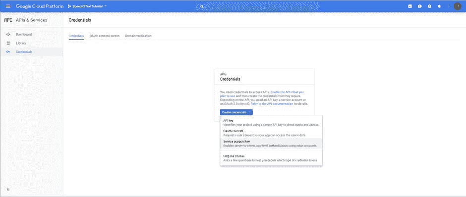

*   在*服务账号*中选择 ***新建服务账号***
*   输入 ***服务帐户名***
*   选择**角色**作为*项目>所有者*
*   保持 ***JSON*** 选项选中
*   点击 ***创建***

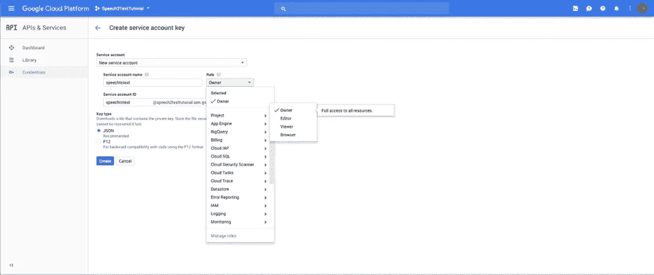

*   保存生成的 API 密钥文件
*   将文件重命名为`api-key.json`
*   `api-key.json`将被下载到您的电脑上


JSON file saved to computer

**安装所需的 Python 模块**

*   安装 ***谷歌语音*** 包
    `pip3 install -U google-cloud-speech`
*   安装 ***Google API*** 包
    `pip3 install -U google-api-python-client`

## **转换音频**

Google Speech API 支持许多不同的编码。下表列出了支持的音频编解码器:

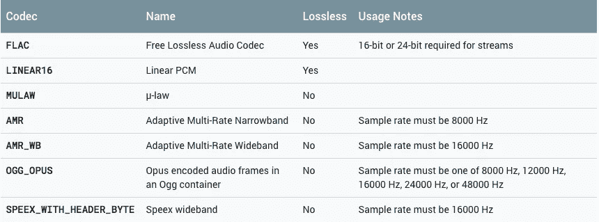

Google Audio Codecs Table

所有编码仅支持 1 声道(单声道)音频，音频应使用无损编码(FLAC 或 LINEAR16)传输。audacity
对我来说工作得很好，通过简单的用户界面，在 FLAC 中很容易将你的音频文件转换成单声道。

点击 [*立体声到单声道使用 Audacity*](https://www.youtube.com/watch?v=jL5Xx06NwyI) ，学习如何转换音频文件。

点击 [*音频编码*](https://cloud.google.com/speech/reference/rest/v1/RecognitionConfig) 了解更多信息。

## **Python 的代码**

在这个 Python 脚本中，我们将使用 Google Speech API 的最新添加功能，
[*时间偏移*](https://cloud.google.com/speech/docs/basics#time-offsets) ，并在识别的音频中包含每个语音开始
和结束的时间偏移值(时间戳)。

时间偏移值代表从音频的
开始所经过的时间，增量为 100ms。

点击 [*用 Python*](https://github.com/sohamsil/python-docs-samples/blob/master/speech/cloud-client/transcribe_time_offsets_with_language_change.py) 中的时间偏移量转录完整代码。

让我们从导入必要的库开始，创建`credentials`来从我们之前保存的`api-key.json`中获取
语音 API 凭证。

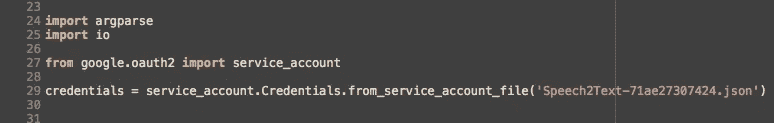

**从本地存储器转录音频文件**

这里，我们将定义`transcribe_file_with_word_time_offsets().`,它将音频和音频语言作为参数传递，并打印已识别的
单词及其时间偏移值(时间戳)。

导入必要的`google.cloud`库，并使用方法`SpeechClient()`使用
Google Cloud 验证凭证。

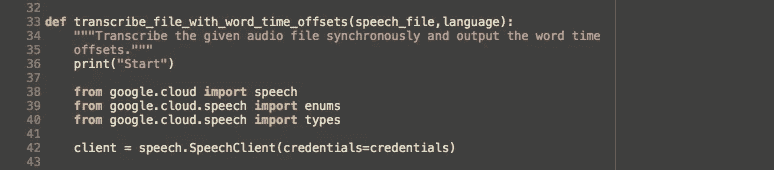

接下来，我们读取音频文件，并将其通过`RecognitionAudio()` 方法，按照`RecognitionConfig()`方法中指定的编码将音频数据存储到“audio”中。

将`TRUE`分配给参数`enable_word_time_offsets`使得`RecognitionConfig()`方法能够记录每个单词的时间偏移值(时间戳)。

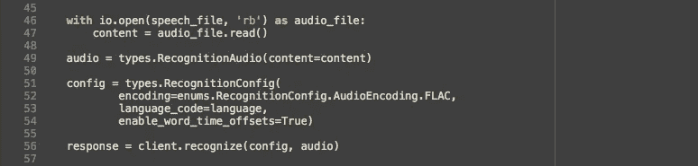

`response`包含`speech.recognize()`、
返回给客户端的消息，如果成功。结果存储为零或顺序消息，如下图
所示。

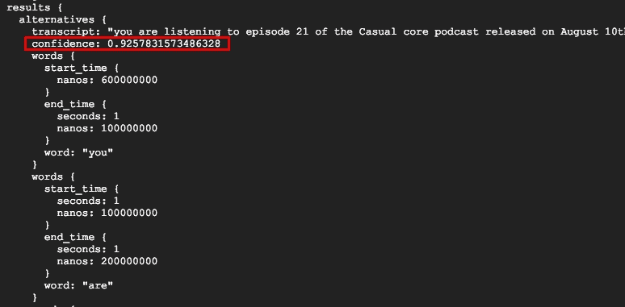

```
 Note: **confidence** in the output shows the accuracy of speech
 recognition. The value is from 0.0 to 1.0, for low to high
 confidence, respectively.
```

`confidence:0.93`的值表明谷歌语音 API 在识别单词方面做了
非常好的工作。现在我们遍历`results`并打印单词及其时间偏移值(时间戳)。

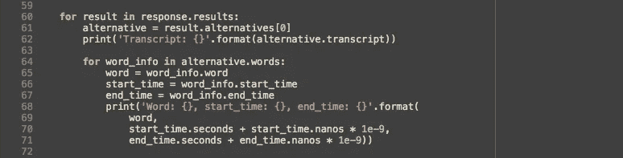

**从谷歌云存储中转录音频文件**

这一段代码唯一的区别是，我们必须将音频文件的
Google Cloud URL 传递给`gsc_uri`，
方法`transcribe_file_with_word_time_offsets()`的第一个参数，其余的工作方式相同。

这些字连同它们的时间偏移值(时间戳)被打印出来作为
输出。

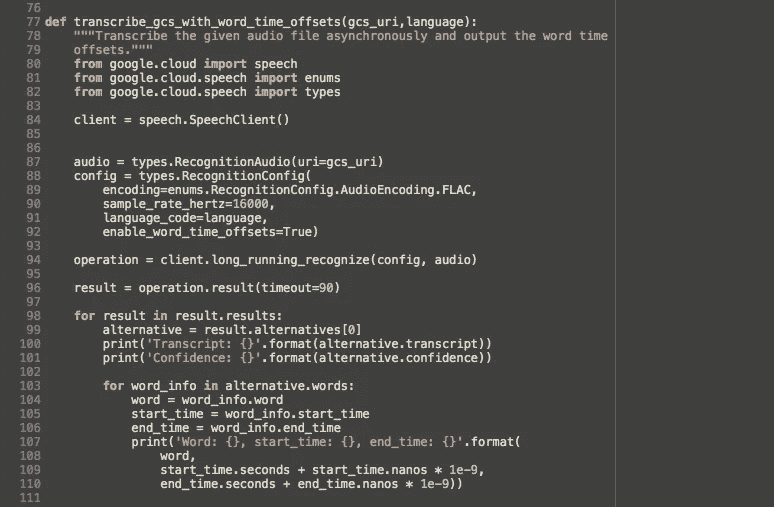

**调用 __main__ function** `argparse`库的时间被用来解析执行期间
命令行中传递的参数。

我们正在运行一个`if else`循环，为本地和云端存储的音频文件调用适当的方法。

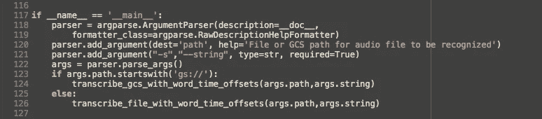

## **在*端子*中调用**

通过键入`–s “en-US”` 提及语言类型和执行文件的文件路径。
`python3 transcribe_time_offsets_with_language_change.py -s “en-US”
Sample.flac`

对于谷歌云类型`\gs://cloud-samples-tests/speech/Sample.flac`为路径，
为`python3 transcribe_time_offsets_with_language_change.py -s “en-US”
\gs://cloud-samples-tests/speech/Sample.flac``

## 云外壳中的调用

点击 [*Google 云壳*](https://cloud.google.com/shell/docs/quickstart) 学习云壳中的基本操作。

在云壳中全局安装`virtualenv`，
，`pip install –upgrade vitrualenv`

安装`virtualenv`后，使用`— python`标志告诉`virtualenv`使用哪个
Python 版本:
`virtualenv –python python3 env`

接下来，我们需要激活`virtuale`。它告诉 shell 为 Python 使用 virtualenv 的
路径，
`source env/bin/activate`

Cloud shell 现在已经准备好使用终端调用中提到的命令
来执行我们的 Python 程序。

## **输出**

恭喜你！这是你的转录数据以及每个单词的时间偏移值(时间戳)。

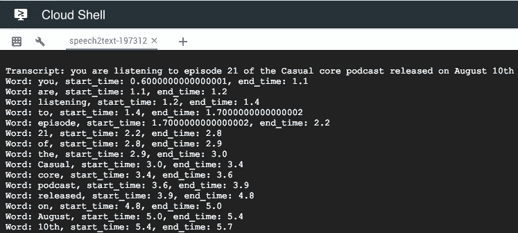

我们可以通过改变
文件配置中的参数来改进这些模型。语音识别可以通过改变
配置的参数来改善。

点击[云语音 API](https://cloud.google.com/speech/docs/basics#time-offsets) 了解更多关于同步、异步和
流识别，以及如何改进或改变模型。