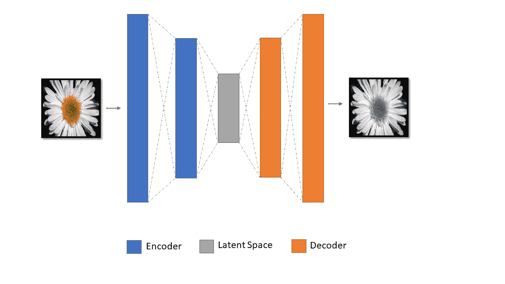
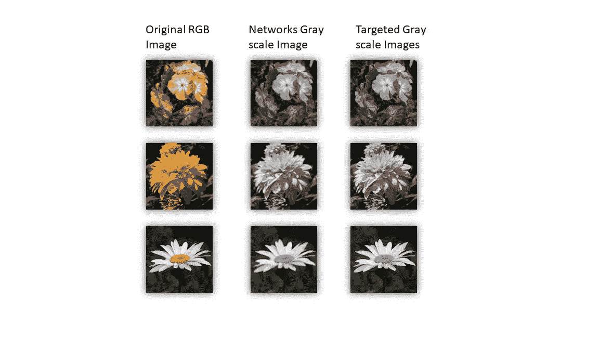

# 用于将 RBG 图像转换成灰度图像的自动编码器。

> 原文：<https://towardsdatascience.com/autoencoder-for-converting-an-rbg-image-to-a-gray-scale-image-3c19a11031c9?source=collection_archive---------7----------------------->

H ello 世界！这不仅仅是另一个使用 MNIST 数据集重建数字的自动编码器教程。正如标题所示，这个自动编码器学习将 RGB 图像转换为灰度的功能，但你们中的许多人会想知道为什么我们需要基于深度学习的方法来解决这个问题，我可以只采用加权方法或亮度方法来将 RGB 图像转换为灰度图像。**没错，解决这个问题的 DIP(数字图像处理)方法会比使用深网更有效，**但是这个问题陈述只是为了学习的目的。所以，我们从主菜开始吧。

***先决条件:应具备卷积神经网络、损失函数、反向传播的知识，熟悉 TensorFlow 和 Python。***

***问题陈述:*** *让自动编码器学习将 RGB 图像转换为灰度图像的函数。*

# 介绍

自动编码器是一个深度神经网络，它试图学习函数***【x】*≈*x***，或者换句话说，它学习将其输入复制到其输出。这些自动编码器以这样的方式设计，它们不会学习完美地复制输入到输出，而是受到限制，它们学习复制大约**(这就是我写 *f(x)* ≈ *x* 而不是 *f(x) = x* )** 的原因，并且只复制类似于训练数据的输入。通过这种方式，模型学习区分特征的优先级，并学习训练数据的有用属性。

网络由两部分组成，编码器函数 ***h = f(x)*** 和解码器函数 ***r = g(h)*** 负责输入图像的编码和重构。

## 编码器

编码器将输入压缩成其潜在空间表示。编码器功能可以用 ***h = f(x)来表示。***

## 解码器

解码器从潜在空间表示中重构图像，并且它可以表示为 ***r = f(x)。***

***什么是潜在空间？*** *是你的特色所在的空间。*

有不同类型的自动编码器，如欠完整自动编码器、稀疏自动编码器、去噪自动编码器、变分自动编码器等。但是我们将关注并使用欠完整自动编码器来解决手头的问题。

# 欠完整自动编码器

在上面的段落中，我已经提到，我们以这样的方式设计自动编码器，它们通过在网络的架构(设计)中施加限制来学习从数据(数据分布)中优先化特征/属性。一种方法是通过约束潜在空间维度或者具有比输入数据***【x】***更小的维度。这有助于自动编码器从训练数据中学习显著特征。因此，潜在空间维数小于输入的自动编码器称为欠完备自动编码器。下面给出了图示。

The architecture of an autoencoder.

自动编码器通过最小化损失函数 ***L(x，g(f(x)))*** 来学习，其中 L 是损失函数，其因与 ***x*** 不同而惩罚***(f(x))***。 ***g(f(x))*** 是自动编码器的编码和解码过程(也就是自动编码器的输出)。在我们的例子中，损失函数是均方误差，并且 ***x*** 是 RGB 图像。 ***g(f(x))*** 是重建的灰度图像。损失函数惩罚了自动编码器，因为它不能重建图像的灰度版本。好了，理论到此为止，让我们开始编码吧！！

# 为训练和测试准备数据集

我已经从 TensorFlow 花卉数据集(由 3670 幅花卉图像组成)和 Olga Belitskaya 内核*“花卉图像数据集”*(来自 Kaggle *)的测试数据中获取了自动编码器的训练数据。你可以从我在本教程底部标题*“资源”*下提供的链接下载数据。下载训练数据集后，您将看到一个文件夹*“flower _ photos”*，其中包含子文件夹*“雏菊、蒲公英、玫瑰、向日葵和郁金香”*，测试数据集文件夹名称为*“flower _ images”*，其中包含花卉图像。*

## 一、准备培训资料

为了帮助准备数据集，我使用了 OpenCV 和 glob 库。OpenCV 是一个计算机视觉库，它具有计算机视觉算法的预建功能，而 glob 是一个 Unix 风格的路径名模式扩展，简单地说，根据您设置的规则，它将返回特定文件夹的内容。

1.  **第 1- 3 行:**导入必要的包。
2.  **第 5 行:**计数变量稍后将用于命名目的
3.  **第 7–11 行:**这些变量保存了相应类型的花卉照片的路径。

您可以看到“*flower _ photos”*子文件夹中的图像名称不正确，对于不同类型的花，它们有不同的文件夹，因此，我们为所有的花创建了一个统一的文件夹，并将文件重命名为以下格式“ *color_ < >”。jpg"* ,因为稍后以编程方式读取会更容易。

4.**第 13 行:**路径名列表，稍后循环将在该列表中迭代。

5.**第 17 行:**从类型为“*的给定路径中读取所有文件的名称。jpg"* 。

6.**第 21–30 行:**使用 OpenCV 中的“*cv2 . CVT color(…)”*函数将图像转换为灰度。最后，RGB 和灰度图像被重命名并写入各自的新文件夹中。

## **二。准备测试数据**

**第 1–2 行:**导入必要的库。

**第 4 行:**读取*【flower _ images】*文件夹中*类型的所有文件名。png”。*

**第 5 行:**稍后使用 count 变量进行命名。

**第 7–11 行:**使用 cv2.imread(filename，0)读取图像并转换为灰度图像，函数中的零表示该函数将自己读取并转换为灰度图像，而不是像前面的代码片段那样编写单独的代码行来转换为灰度图像。

训练和测试数据已经准备好了，让我们进入下一步，构建自动编码器。

# 构建自动编码器

## I .导入库和数据集。

第一个代码片段帮助我们准备用于训练自动编码器的数据集。文件夹*【彩色图像】*和*【灰度图像】中的图像总数为 3670 张。*变量 *"dataset_source"* 中的第一幅图像与 *"dataset_target"* 中的灰度图像相同，索引相同。

我们希望训练数据的维数为[3670，128，128，3]，这是输入图像(彩色图像)，目标图像维数(灰度图像)为[3670，128，128，1]。因此，**第 9–16 行**首先用于读取彩色图像，然后追加到 Python 列表中，最后使用 *"np.asarray()"* 转换成 numpy 数组。

同样，对于灰度图像，**第 18–24 行**遵循与第 9–16 行相同的程序，但从中获得的尺寸是[3670，128，128]而不是[3670，128，128，1]。因此，必须向数据集目标添加一个额外的维度，

*"np.newaxis"* 对象为 *"dataset_target"* 增加了一个额外的维度，从而获得目标图像所需的维度[3670，128，128，1]。具有前面提到的维度很重要，因为张量流占位符将具有相同的维度。现在训练数据已经准备好并存储在变量*“数据集 _ 目标”*和*“数据集 _ 源”*中。让我们继续制作我们的自动编码器。

## 二。自动编码器架构

***为什么要卷积自动编码器(CAE)？***

我们将使用卷积自动编码器(CAE)而不是传统的自动编码器，因为传统的自动编码器(TAE)没有考虑到一个信号可能是其他信号的组合。另一方面，卷积自动编码器使用卷积算子来利用这种观察。他们学会提取有用的信号，然后试图重建输入。卷积自动编码器学习最小化重构误差的最佳滤波器，而不是手动设计卷积滤波器

**第 5–6 行:**图像上的卷积运算会产生一个激活图，该激活图包裹着一个非线性激活函数，以提高网络的泛化能力。这样，训练程序可以学习图像中的非线性模式。在这之后，我们在激活图上运行汇集操作以提取主导特征并降低激活图的维度以进行高效计算。(这样我们在合并操作后获得了我们的潜在空间)

**第 11–12 行:**对于上采样，使用最近邻插值，通过检查最近邻像素值对图像进行上采样。在下一步中，对上采样图像执行卷积运算，以使网络学习用于重构图像的最佳滤波器。我们还可以使用*" TF . nn . transpose _ conv2d()"*函数进行上采样，从而将学习最佳滤波器的任务留给模型。

## 三。损失函数

通常，为了训练自动编码器，输入图像和目标图像*(自动编码器必须学习重建的内容)*是相同的**，但是对于我们的任务，输入图像是 RGB 格式，目标图像是灰度格式。**这会强制自动编码器学习将 RGB 图像转换为灰度图像的功能。

**第 1–2 行:**回想一下，之前我们将数据集准备到与" *tf.placheholder()"* 函数非常相似的维度。*“无”*表示批量大小将在运行时确定。

**第 4 行:**RGB 图像作为输入数据被发送到之前定义的函数*“def auto encoder()”*，该函数返回存储在*“AE _ outputs”*变量中的灰度图像。

**第 7 行:**获得目标图像(所需灰度)与网络生成的灰度图像之间的差异，并将其存储在 loss 变量中。

**第 8 行:**我们使用 Adam optimizer 为网络找到正确的权重集，从而最大限度地减少损失。

**第 10 行:**初始化全局变量。

## 四。训练网络

*注意:根据需要在变量“saving_path”中改变路径*

**第 1–2 行:**常量，如批量大小和时期大小(数据集必须在自动编码器上完全运行的次数，此处为 50 次。).

**第 8–9 行:**使用变量*“batch _ img”*(输入图像)和“*batch _ out”*(目标图像)给出网络的输入数据。

**第 11 行:**网络将立即将32 幅图像(批次)作为输入，因此需要计算 1 个时期的批次总数，以运行第 18 行的循环内部。

**第 13–15 行:**创建一个会话对象并运行我们之前定义的初始化变量。

**第 20 行:**“sess . run()”用我们给定的输入数据和目标数据运行计算图(autoencoder)。

**第 19–20 行:**每批 32 张新图像被发送到网络中。

根据您的笔记本电脑配置，培训可能需要一些时间，但在网络运行 50 个时期后，这将生成输入数据的高质量灰度图像。

# 根据测试数据测试网络。

在训练时，我们保存了模型，现在我们恢复它用于测试目的。灰度转换后的图像存储在*“gen _ gray _ images”*目录下。

## *样本输出*

Sample Images obtained.

我们可以看到网络生成的灰度图像(网格中心的图像)和目标灰度图像之间存在一些差异。主要的区别是使用 DIP 方法从网络重建的灰度图像获得的灰度图像中存在的锐度。那么，我们要不要建立一个网络来使图像更清晰呢？……..开个玩笑！我让你们来决定。 :D

我希望通过这篇教程，你对自动编码器及其广泛的应用有所了解。我在参考资料部分提供了我的 GitHub 链接，如果你对这个代码有问题，请提出问题。谢谢大家！

# 资源

***链接 GitHub 代码:***【https://github.com/akshath123/RGB_to_GRAYSCALE_Autoencoder-】T4

***训练数据链接:***[http://download . tensor flow . org/example _ images/flower _ photos . tgz](http://download.tensorflow.org/example_images/flower_photos.tgz)

***测试数据链接:***[https://www . ka ggle . com/olgabelitskaya/the-dataset-of-flower-images/data](https://www.kaggle.com/olgabelitskaya/the-dataset-of-flower-images/data)