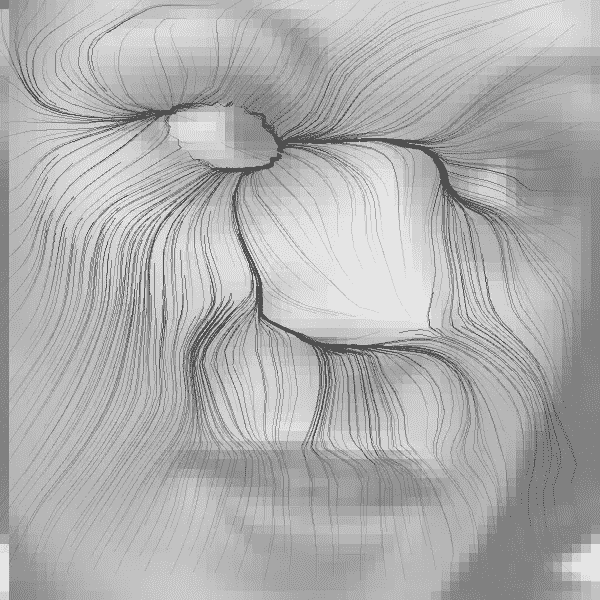
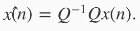
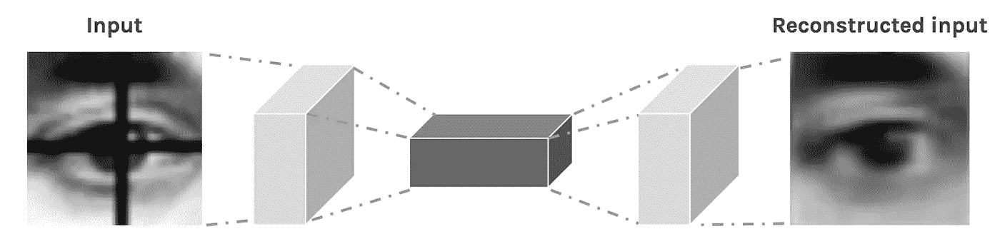
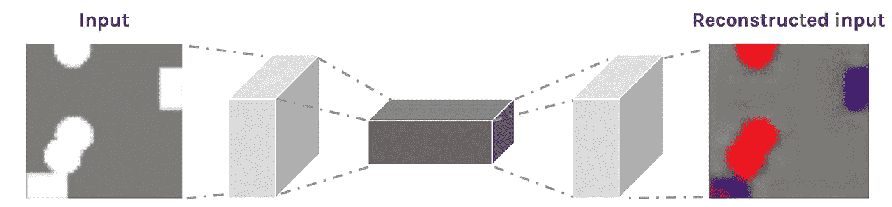
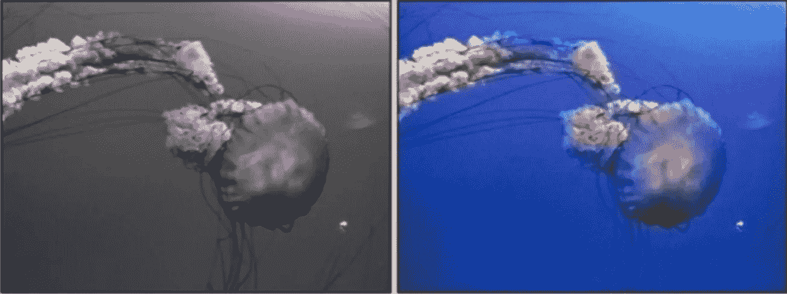

# 自动编码器在深度神经网络中至关重要

> 原文：<https://towardsdatascience.com/autoencoders-are-essential-in-deep-neural-nets-f0365b2d1d7c?source=collection_archive---------0----------------------->

一个 **自动编码器**是一个神经网络(NN)，也是一个**无监督学习**(特征学习)算法。

*   通过将目标值设置为与输入相同，应用**反向传播**。
*   它试图从 ***x*** 预测 ***x*** ，而不需要**标签。**

Output = f . f ‘ . Input

*   它试图学习一个“**恒等式**”函数的近似值。
*   但是我们在网络上放置**约束**就像**在隐藏层中少了** *个单元。*
*   它代表来自**压缩、噪声或损坏数据的原始输入。**
*   它由**编码器&解码器之间的窄隐层**组成。

Network level representation

*   **中间层** ( **中间层** [ *瓶颈*或**潜在空间表示**)是输入数据的**压缩表示**。
*   自动编码器与工程压缩的区别在于，

— —在自动编码器压缩和解压缩功能中**从数据**本身学习，而不像 **jpg** 和 **zip** 。

*   **编码器**和**解码器**为**前馈 NN。**
*   通过**最小化**输入和输出之间的*差异来训练网络。*
*   如果输入是**完全随机**(从 **IID** &中选择**独立于其他特征**，那么*压缩任务*将会是**困难**。
*   如果输入特征与**相关**，那么网络将**发现那些**。
*   它的学习风格像 PCA，所以和 PCA(主成分分析)关系密切。
*   我们可以从**本征矢表象**的*相似度*中观察到。
*   **PCA** & **自动编码器的区别**类似

> —自动编码器比 PCA 灵活得多。
> 
> — NN 激活函数在编码中引入了“**非线性**”，但 PCA **仅引入了**线性变换。
> 
> —我们可以堆叠自动编码器，形成一个**深度自动编码器网络。**

*   自动编码器的重要性，

> —它找到输入数据的低维表示**。**
> 
> —在我们的模型中，一些输入特征可能是**冗余** / **相关** →浪费处理时间& " **过拟合**(参数太多)。

*   如果**隐藏单元**的数量**大**，我们可以对隐藏层施加**稀疏度**约束。网络仍然能够**发现**特征。
*   网络的**神经元**可以是**激活**(作为**触发**)或者神经元可以是**非激活**。
*   **稀疏度参数**通常是*接近*到**零** = 0.05 的小值。
*   网络将**额外惩罚项**引入我们的**优化**目标。
*   在正则化中使用 KL(Kullback-Leibler)散度，并且考虑**伯努利随机变量**与来自 **2** 分布的**均值**。
*   训练应该在“**白化的**”**自然图像上进行。**
*   **白化**是一个**预处理步骤**，去除输入中的*冗余。*
*   NN 的训练策略**在这里也**管用，

> 1.反向传播
> 
> 2.规范化
> 
> 3.拒绝传统社会的人
> 
> 4.RBM 预培训

# 其他类型的自动编码器

## 1)卷积自动编码器(CAE)

*   这用“**卷积层**”替换了“**全连接层**”。
*   **宽薄隐层** — — —转换成—>—**窄厚隐层。**
*   这有助于*提取视觉特征。*
*   重建质量:-

> -经常模糊不清
> 
> -质量较低
> 
> -丢失了一些信息

*   CAE 的使用:-

1。 **超基础图像重建**

—学习**从图片中去除噪声**/**重建**缺失的部分。

—输入(噪声版本)；所以输出(干净版)。

—网络会填充图像中的间隙。

Removes the dark cross-bar in the image

2。 **超基础图像彩色化**

— CAE 将一幅图像中的**圆**和**正方形**映射到同一幅图像，但分别使用红色和蓝色(着色)。

—紫色有时是因为颜色的**混合**而形成的，网络在圆形或方形之间徘徊。

Coloring

3。 **高级应用**

—完全图像彩色化

—潜在空间聚类

—生成更高分辨率的图像

> 在图像输入的情况下，

— —自动编码器使用 **Conv 图层**

*   编码器=典型的 conv **金字塔**
*   最大轮询层跟随以减少维度
*   解码器= **反进化**过程

— —反进化过程，

> -从之前学习的内容中添加新数据
> 
> ——容易出现**视觉** **假象**。
> 
> -使用“最近邻”或“双线性插值(上采样)”调整大小，这是比**标准去卷积层更好的选择。**

Pushes more pixels to the image

Fully Image Colorization

## **2)变分自动编码器(VAE)**

*   这结合了**贝叶斯推理。**
*   **压缩的**表示是一个**概率分布。**

## 3)稀疏自动编码器

*   这用于**特征提取。**
*   这比输入有更多的隐藏单元。
*   这允许输入数据的稀疏表示。

## **4)堆叠自动编码器**

*   如果使用了一个以上的隐藏层，那么我们寻找这个自动编码器。
*   每个连续层都

> -最佳加权
> 
> -非线性
> 
> -训练数据的低维投影

## **4)深度自动编码器**

*   这有 2 个对称的“T32”深度信念网络“T33”，通常有 4 或 5 个“T34”浅层。
*   它的层是**受限玻尔兹曼机(RBM)。**
*   用途，

1。 **图片搜索**

— —一张图片可以压缩成 30 个左右的向量(就像谷歌图片搜索一样)。

2。 **数据压缩**

— —深度自动编码器对“**语义哈希”很有用。**

3。 **主题建模&信息检索**

# **参考文献:-**

1.  [http://ufldl . Stanford . edu/tutorial/unsupervised/auto encoders/](http://ufldl.stanford.edu/tutorial/unsupervised/Autoencoders/)
2.  [https://hacker noon . com/auto encoders-deep-learning-bits-1-11731 e 200694](https://hackernoon.com/autoencoders-deep-learning-bits-1-11731e200694)
3.  [https://deeplearning4j.org/deepautoencoder](https://deeplearning4j.org/deepautoencoder)
4.  [https://lazyprogrammer.me/a-tutorial-on-autoencoders/](https://lazyprogrammer.me/a-tutorial-on-autoencoders/)