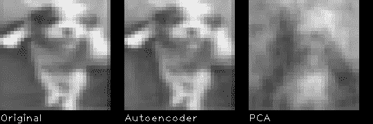
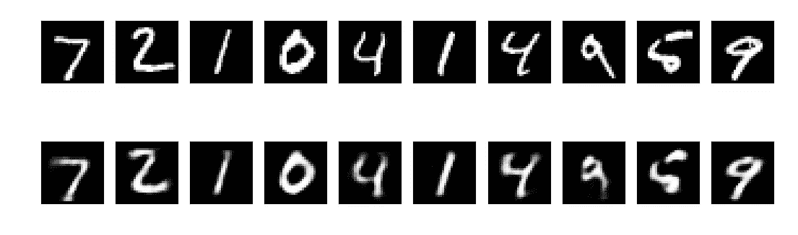
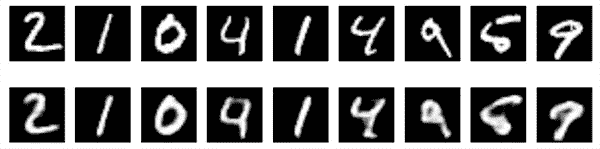
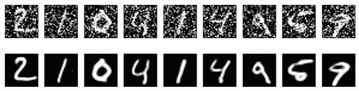

# 自动编码器——深度学习的比特和字节

> 原文：<https://towardsdatascience.com/autoencoders-bits-and-bytes-of-deep-learning-eaba376f23ad?source=collection_archive---------4----------------------->

百度研究院(Baidu Research)首席科学家吴恩达表示，可以将深度学习的作用理解为“A 到 B 的映射”。“您可以输入音频片段并输出文字记录。那就是语音识别。”他坚持认为，只要你有数据来训练软件，可能性是无限的。"你可以输入电子邮件，输出可能是:这是不是垃圾邮件？"他说，输入贷款申请，输出可能是客户偿还贷款的可能性。输入车队的使用模式，输出可以建议下一步把车送到哪里。

与其通过复杂的定义使事实变得复杂，不如将深度学习视为子集的子集。人工智能包含了广泛的技术和技巧，使计算机系统能够以至少表面上类似于思维的方式来解决问题。在这个范围内，有一整套神秘但重要的数学技术，驱动着通过经验学习的动机。这个子集被称为机器学习。最后，在机器学习中有一个更小的子类，称为深度学习(也称为深度结构化学习或分层学习)，这是人工神经网络(ann)在包含不止一个隐藏层的学习任务中的应用。

## 什么是自动编码器？

尽管它最初听起来有点神秘，但自动编码器是一个相当基本的机器学习模型。自动编码器(AE) 是一类输入与输出相同的神经网络。他们的工作原理是将输入压缩成一个潜在空间表示，然后从这个表示中重建输出。

Autoencoder architecture

更详细地说，自动编码是一种数据压缩算法，其中压缩和解压缩功能，

1.  **数据特定:**自动编码器只能压缩类似于它们被训练过的数据。一个经过人脸训练的自动编码器在处理现代建筑的图像时不会表现得很好。这弥补了自动编码器和 MP3 压缩算法之间的差异，MP3 压缩算法只对一般声音进行假设，而不对特定类型的声音进行假设。
2.  **有损:**这意味着与原始输入相比，解压缩后的输出质量会下降。就像你在 JPEG 或 MP3 中看到的一样。
3.  **从示例中自动学习:**如果您有适当的训练数据，很容易训练算法的特定实例，这些实例将对特定类型的输入执行良好。它不需要任何新的工程技术。

此外，在几乎所有使用术语“自动编码器”的上下文中，压缩和解压缩功能都是用神经网络实现的。

## 为什么选择自动编码器？

尽管事实上不久前自动编码器的实际应用相当罕见，但今天，**数据去噪**和**数据可视化降维**被认为是自动编码器的两个主要有趣的实际应用。通过适当的维度和稀疏性约束，自动编码器可以学习比 PCA 或其他基本技术更有趣的数据投影。

Performance comparison of Autoencoders and PCA

## 卷积自动编码器

在自动编码器的传统架构中，没有考虑到信号可以被视为其他信号的总和这一事实。另一方面，卷积自动编码器(CAE)使用卷积运算符来适应这种观察。卷积运算符允许对输入信号进行滤波，以便提取其内容的某一部分。他们学习将输入编码成一组简单的信号，然后尝试从这些信号中重建输入。

*A convolution between a 4x4x1 input and a 3x3x1 convolutional filter.
The result is a 2x2x1 activation map. (*[*Source*](https://github.com/vdumoulin/conv_arithmetic)*)*

参考[这个](https://hackernoon.com/autoencoders-deep-learning-bits-1-11731e200694)关于卷积自动编码器的使用案例，有很好的例子解释。在这篇文章的后面，我们将看到 CAE 的一个实际例子。

## 构建自动编码器

我们将从我们能构建的最简单的自动编码器开始。在后一部分，我们将在真实的例子中研究自动编码器的更复杂的用例。

以下是使用 [keras](https://keras.io/) 作为平台的简单自动编码器的代码。keras 提供的 MNIST 数字用于示例中。

有了这个代码片段，我们将得到以下输出。

在上图中，顶行是原始数字，底行是重建的数字。正如您所看到的，在这个基本示例中，我们丢失了一些重要的细节。

由于我们的输入是图像，使用卷积神经网络作为编码器和解码器是有意义的。在实际设置中，应用于图像的自动编码器总是卷积自动编码器，因为它们的性能要好得多。

使用卷积自动编码器，我们将获得以下输入和重构输出。

## 自动编码器的实际应用:图像去噪

在本节中，我们将研究自动编码器在现实世界中的使用，用于图像去噪。我们将训练卷积自动编码器将有噪声的数字图像映射到干净的数字图像。

我们将通过应用高斯噪声矩阵来生成合成噪声数字，并在 0 和 1 之间裁剪图像。

当 autoencoder 被训练后，我们可以用它来去除添加到我们从未见过的图像中的噪声！这是输入和重建输出的样子。

## 结论

自动编码器是一种人工神经网络，用于高效编码的无监督学习。在现代，自动编码器已经成为一个新兴的研究领域，在许多方面，如在异常检测。在这篇文章中，我们期望提供一个关于自动编码器是什么、为什么和如何的基本理解。

参考

1.  [https://hacker noon . com/auto encoders-deep-learning-bits-1-11731 e 200694](https://hackernoon.com/autoencoders-deep-learning-bits-1-11731e200694)
2.  【https://blog.keras.io/building-autoencoders-in-keras.html 号
3.  【https://www.technologyreview.com/s/513696/deep-learning/ 