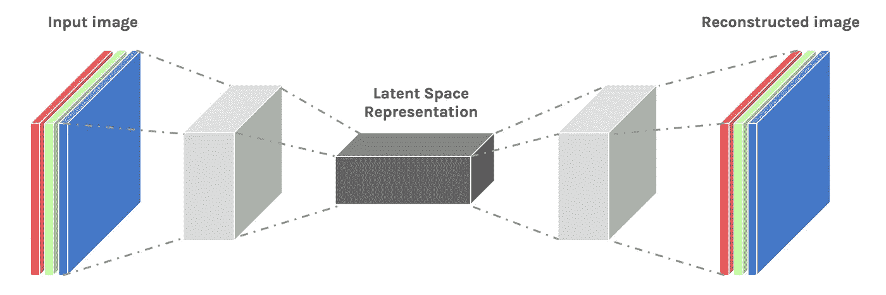

# 自动编码器-TF 中的介绍和实现。

> 原文：<https://towardsdatascience.com/autoencoders-introduction-and-implementation-3f40483b0a85?source=collection_archive---------2----------------------->

# 简介和概念:

*自动编码器(AE)* 是一个神经网络家族，其输入**与输出**相同(它们实现一个身份函数)。他们的工作原理是将输入压缩成一个*潜在空间表示*，然后从这个表示中重建输出。



自动编码器真正流行的用途是将它们应用于图像。**的诀窍**是用*卷积*层代替*全连接*层。这些图层与合并图层一起，将输入从宽**宽**和薄**宽**(假设 100 x 100 像素，3 个通道— RGB)转换为窄宽**宽**。这有助于网络从图像中提取**视觉特征**，从而获得更加准确的潜在空间表示。重建过程使用*上采样*和卷积。

由此产生的网络被称为*卷积自动编码器* ( *CAE* )。

## CAEs 的使用

## 示例:超基本图像重建

卷积自动编码器可以用于重建。例如，他们可以学习从图片中去除噪声，或者重建丢失的部分。

为此，我们不使用相同的图像作为输入和输出，而是使用**噪声版本作为输入**和**干净版本作为输出**。通过这个过程，网络学会填补图像中的空白。

让我们看看 CAE 能做什么来替换眼睛图像的一部分。*假设有一个十字准线，我们想移除它*。我们可以手动创建数据集，这非常方便。


现在我们的自动编码器已经训练好了，我们可以用它来移除我们从未见过的眼睛图片上的十字准线！

# TF 中的实现:

让我们来看一个在 tensorflow 中使用 MNIST 数据集的示例实现。

笔记本:[https://github . com/mchablani/deep-learning/blob/master/auto encoder/convolatile _ auto encoder . ipynb](https://github.com/mchablani/deep-learning/blob/master/autoencoder/Convolutional_Autoencoder.ipynb)

## 网络体系结构

网络的编码器部分将是典型的卷积金字塔。每个卷积层后面都有一个最大池层，以减少各层的维数。解码器需要从窄的表示转换成宽的重建图像。

通常，你会看到**转置卷积**层用于增加层的宽度和高度。它们的工作原理与卷积层几乎完全相同，但方向相反。输入层中的步幅导致转置卷积层中的步幅更大。例如，如果您有一个 3x3 内核，输入层中的一个 3x3 补丁将减少到卷积层中的一个单元。相比之下，输入层中的一个单元将在转置卷积层中扩展为 3×3 路径。TensorFlow API 为我们提供了一种创建层的简单方法。

> 然而，转置卷积层会导致最终图像中出现伪影，例如棋盘图案。这是由于内核重叠造成的，可以通过将步幅和内核大小设置为相等来避免这种重叠。在[这篇摘自 Augustus Odena，*等人*的文章](http://distill.pub/2016/deconv-checkerboard/)中，作者展示了通过使用最近邻或双线性插值(上采样)后接卷积层来调整层的大小，可以避免这些棋盘状伪像。在 TensorFlow 中，这很容易用`[tf.image.resize_images](https://www.tensorflow.org/versions/r1.1/api_docs/python/tf/image/resize_images)`完成，然后是卷积。Odena 等人声称最近邻插值最适合上采样

自动编码器仅通过在有噪声的图像上训练网络，就可以非常成功地用于图像去噪。我们可以通过向训练图像添加高斯噪声，然后将值剪切到 0 和 1 之间，来自己创建有噪声的图像。我们将使用噪声图像作为输入，原始的、干净的图像作为目标。

> 注意，我们使用 sigmoid _ cross _ entropy _ with _ logit 来表示损失。根据 TF 文档:它测量离散分类任务中的概率误差，其中每个类都是独立的，并且不互相排斥。例如，可以执行多标签分类，其中一幅图片可以同时包含一头大象和一只狗。

模型定义:

```
learning_rate = 0.001
inputs_ = tf.placeholder(tf.float32, (None, 28, 28, 1), name='inputs')
targets_ = tf.placeholder(tf.float32, (None, 28, 28, 1), name='targets')### Encoder
conv1 = tf.layers.conv2d(inputs=inputs_, filters=32, kernel_size=(3,3), padding='same', activation=tf.nn.relu)
# Now 28x28x32
maxpool1 = tf.layers.max_pooling2d(conv1, pool_size=(2,2), strides=(2,2), padding='same')
# Now 14x14x32
conv2 = tf.layers.conv2d(inputs=maxpool1, filters=32, kernel_size=(3,3), padding='same', activation=tf.nn.relu)
# Now 14x14x32
maxpool2 = tf.layers.max_pooling2d(conv2, pool_size=(2,2), strides=(2,2), padding='same')
# Now 7x7x32
conv3 = tf.layers.conv2d(inputs=maxpool2, filters=16, kernel_size=(3,3), padding='same', activation=tf.nn.relu)
# Now 7x7x16
encoded = tf.layers.max_pooling2d(conv3, pool_size=(2,2), strides=(2,2), padding='same')
# Now 4x4x16### Decoder
upsample1 = tf.image.resize_images(encoded, size=(7,7), method=tf.image.ResizeMethod.NEAREST_NEIGHBOR)
# Now 7x7x16
conv4 = tf.layers.conv2d(inputs=upsample1, filters=16, kernel_size=(3,3), padding='same', activation=tf.nn.relu)
# Now 7x7x16
upsample2 = tf.image.resize_images(conv4, size=(14,14), method=tf.image.ResizeMethod.NEAREST_NEIGHBOR)
# Now 14x14x16
conv5 = tf.layers.conv2d(inputs=upsample2, filters=32, kernel_size=(3,3), padding='same', activation=tf.nn.relu)
# Now 14x14x32
upsample3 = tf.image.resize_images(conv5, size=(28,28), method=tf.image.ResizeMethod.NEAREST_NEIGHBOR)
# Now 28x28x32
conv6 = tf.layers.conv2d(inputs=upsample3, filters=32, kernel_size=(3,3), padding='same', activation=tf.nn.relu)
# Now 28x28x32logits = tf.layers.conv2d(inputs=conv6, filters=1, kernel_size=(3,3), padding='same', activation=None)
#Now 28x28x1# Pass logits through sigmoid to get reconstructed image
decoded = tf.nn.sigmoid(logits)# Pass logits through sigmoid and calculate the cross-entropy loss
loss = tf.nn.sigmoid_cross_entropy_with_logits(labels=targets_, logits=logits)# Get cost and define the optimizer
cost = tf.reduce_mean(loss)
opt = tf.train.AdamOptimizer(learning_rate).minimize(cost)
```

培训:

```
sess = tf.Session()
epochs = 100
batch_size = 200
# Set's how much noise we're adding to the MNIST images
noise_factor = 0.5
sess.run(tf.global_variables_initializer())
for e in range(epochs):
    for ii in range(mnist.train.num_examples//batch_size):
        batch = mnist.train.next_batch(batch_size)
        # Get images from the batch
        imgs = batch[0].reshape((-1, 28, 28, 1))

        # Add random noise to the input images
        noisy_imgs = imgs + noise_factor * np.random.randn(*imgs.shape)
        # Clip the images to be between 0 and 1
        noisy_imgs = np.clip(noisy_imgs, 0., 1.)

        # Noisy images as inputs, original images as targets
        batch_cost, _ = sess.run([cost, opt], feed_dict={inputs_: noisy_imgs,
                                                         targets_: imgs})print("Epoch: {}/{}...".format(e+1, epochs),
              "Training loss: {:.4f}".format(batch_cost))
```

学分:[https://hacker noon . com/auto encoders-deep-learning-bits-1-11731 e 200694](https://hackernoon.com/autoencoders-deep-learning-bits-1-11731e200694)