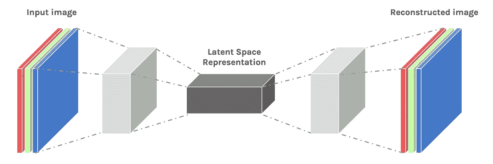
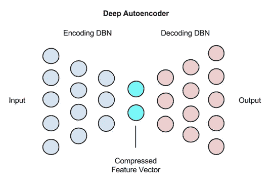

# 自动编码器变得简单

> 原文：<https://towardsdatascience.com/autoencoders-made-simple-6f59e2ab37ef?source=collection_archive---------1----------------------->

## 什么是自动编码器？

自动编码器是一种用于[无监督学习](https://en.wikipedia.org/wiki/Unsupervised_learning)的生成模型。自动编码器学习图像的一些潜在表示，并使用它来重建图像。这种“潜在表征”是什么？这是图像隐藏特征的另一个花哨术语。自动编码器通过用不同图像训练的迭代过程，试图学习给定图像的特征，并从这些学习到的特征中重建期望的图像。

乍一看，自动编码器可能看起来像任何其他神经网络，但不像其他网络，它在中心有一个瓶颈。这个瓶颈用来学习图像的特征。自动编码器完成两项任务，它对图像进行编码，然后解码。

## 编码图像:

拍摄输入图像，通过一系列卷积，图像的大小被压缩成一个小矢量。这个压缩的矢量表示图像的特征，从该特征可以重建另一个图像

## 解码图像:

从压缩矢量，我们应用了一系列的反卷积层，放大图像的大小，并将其恢复到原来的大小。

## 自动编码器的用途是什么？

自动编码器可以用来消除噪声，执行图像着色和各种其他目的。有噪声的图像可以作为自动编码器的输入，去噪声的图像可以作为输出。自动编码器将通过学习图像的潜在特征来尝试对图像去噪声，并使用该特征来重建没有噪声的图像。重建误差可以作为输出图像和地面真实图像的像素值之间的距离的度量来计算。

## 缺点:

在重建图像时，自动编码器与生成式对抗网络相比效率并不高。随着图像复杂性的增加，自动编码器很难跟上，图像开始变得模糊。

## 代码:

下面的 python 代码代表了一个基本的自动编码器，它从 mnist 数字数据中学习特征，并重新构造它们。

## 依赖关系:

*   张量流
*   克拉斯
*   Numpy

## 结论:

尽管自动编码器可能很难跟上 GANs，但它们在某些任务中效率很高，比如异常检测和其他任务。这仍然是神经网络的一个新兴领域。