# Python 中的自动化要素工程

> 原文：<https://towardsdatascience.com/automated-feature-engineering-in-python-99baf11cc219?source=collection_archive---------1----------------------->


## 如何自动创建机器学习特征

机器学习正越来越多地从手工设计的模型转向使用 [H20](http://docs.h2o.ai/h2o/latest-stable/h2o-docs/automl.html) 、 [TPOT](https://epistasislab.github.io/tpot/) 和 [auto-sklearn](https://automl.github.io/auto-sklearn/stable/) 等工具的自动优化流水线。这些库，以及[随机搜索](http://www.jmlr.org/papers/volume13/bergstra12a/bergstra12a.pdf)等方法，旨在通过在很少或没有人工干预的情况下为数据集找到最佳模型，来简化模型选择和机器学习的调整部分。然而，特征工程，机器学习管道中更有价值的方面，仍然几乎完全是人类的劳动。

[特征工程](https://en.wikipedia.org/wiki/Feature_engineering)，也称为特征创建，是从现有数据构建新特征来训练机器学习模型的过程。这一步可能比实际使用的模型更重要，因为机器学习算法只从我们给它的数据中学习，创建与任务相关的特征绝对至关重要(参见优秀论文[“关于机器学习要知道的一些有用的事情”](https://homes.cs.washington.edu/~pedrod/papers/cacm12.pdf))。

通常，特征工程是一个耗时的手工过程，依赖于领域知识、直觉和数据操作。这个过程可能非常乏味，最终的特征将受到人的主观性和时间的限制。自动化特征工程旨在通过从数据集中自动创建许多候选特征来帮助数据科学家，可以从这些候选特征中选择最佳特征并用于训练。

在本文中，我们将通过一个使用自动化特征工程和[特征工具 Python 库](https://docs.featuretools.com/#)的例子。我们将使用一个示例数据集来展示基础知识(请继续关注未来使用真实数据的帖子)。本文的完整代码在 GitHub 上可以找到。

# 特征工程基础

[功能工程](https://www.datacamp.com/community/tutorials/feature-engineering-kaggle)是指从现有数据中构建额外的功能，这些数据通常分布在多个相关的表格中。特征工程要求从数据中提取相关信息，并将其放入单个表中，然后该表可用于训练机器学习模型。

构建要素的过程非常耗时，因为每个新要素通常需要几个步骤来构建，尤其是在使用多个表中的信息时。我们可以将特征创建的操作分为两类:**转换**和**聚合**。让我们来看几个例子，看看这些概念是如何运用的。

一个**转换**通过从一个或多个现有列中创建新的特性来作用于单个表(从 Python 的角度来看，表就是一个熊猫`DataFrame`)。例如，如果我们有下面的客户表

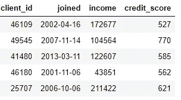

我们可以通过找到`joined`列的月份或获取`income`列的自然日志来创建特征。这两个都是转换，因为它们只使用一个表中的信息。


另一方面，**聚合**是跨表执行的，使用一对多关系对观察值进行分组，然后计算统计数据。例如，如果我们有另一个关于客户贷款信息的表，其中每个客户可能有多笔贷款，我们可以计算每个客户贷款的平均值、最大值和最小值等统计数据。

这个过程包括按客户机对 loans 表进行分组，计算聚合，然后将结果数据合并到客户机数据中。下面是我们如何使用熊猫的语言在 Python 中做到这一点。

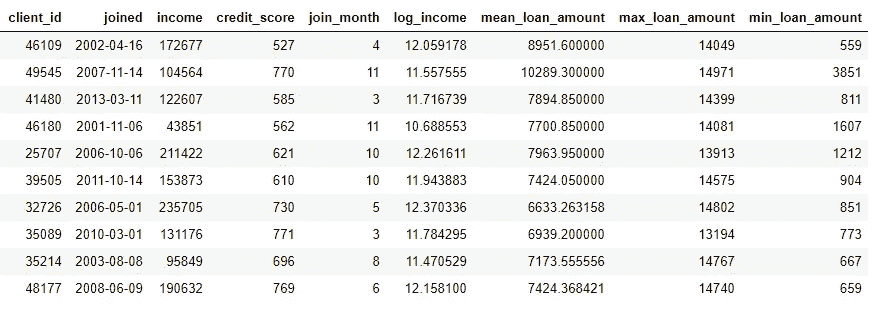

这些操作本身并不难，但是如果我们有几百个变量分布在几十个表中，这个过程手工做是不可行的。理想情况下，我们希望有一个解决方案，能够自动执行跨多个表的转换和聚合，并将结果数据合并到单个表中。尽管熊猫是一个很好的资源，但是我们想要手工处理的数据却很有限！(关于手动特征工程的更多信息，请查阅优秀的 [Python 数据科学手册](https://jakevdp.github.io/PythonDataScienceHandbook/05.04-feature-engineering.html))。

# 功能工具

幸运的是，featuretools 正是我们正在寻找的解决方案。这个开源 Python 库将从一组相关表中自动创建许多要素。Featuretools 基于一种被称为“[深度特征合成](http://featurelabs1.wpengine.com/wp-content/uploads/2017/12/DSAA_DSM_2015-1.pdf)的方法，这听起来比实际上更有气势(这个名字来自于堆叠多个特征，而不是因为它使用了深度学习！).

深度特征合成将多个转换和聚合操作(在 featuretools 的 vocab 中称为[特征基元](https://docs.featuretools.com/automated_feature_engineering/primitives.html))堆叠在一起，从分布在多个表中的数据创建特征。像机器学习中的大多数想法一样，这是一种建立在简单概念基础上的复杂方法。通过一次学习一个构建模块，我们可以很好地理解这个强大的方法。

首先，让我们看看我们的示例数据。我们已经看到了上面的一些数据集，完整的表集合如下:

*   `clients`:信用社客户基本信息。每个客户端在该数据帧中只有一行


*   `loans`:对客户的贷款。每个贷款在此数据框架中只有自己的行，但客户可能有多个贷款。

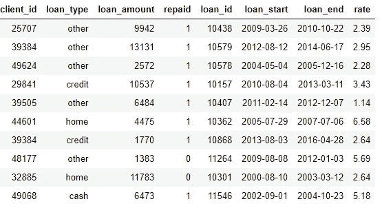

*   `payments`:贷款付款。每笔付款只有一行，但每笔贷款将有多次付款。


如果我们有一个机器学习任务，例如预测客户是否会偿还未来的贷款，我们会希望将客户的所有信息合并到一个表中。这些表是相关的(通过`client_id`和`loan_id`变量),我们可以使用一系列的转换和聚合来手工完成这个过程。然而，我们很快就会看到，我们可以使用 featuretools 来自动化这个过程。

## 实体和实体集

featuretools 的前两个概念是**实体**和**实体集**。一个实体仅仅是一张桌子(或者一个`DataFrame`，如果你认为是熊猫的话)。一个 [EntitySet](https://docs.featuretools.com/loading_data/using_entitysets.html) 是表和它们之间关系的集合。可以把 entityset 想象成另一个 Python 数据结构，有自己的方法和属性。

我们可以使用以下方法在 featuretools 中创建一个空的 entityset:

```
import featuretools as ft# Create new entityset
es = ft.EntitySet(id = 'clients')
```

现在我们必须添加实体。每个实体必须有一个索引，它是一个包含所有唯一元素的列。也就是说，索引中的每个值在表中只能出现一次。`clients`数据帧中的索引是`client_id`，因为每个客户端在该数据帧中只有一行。我们使用以下语法将具有现有索引的实体添加到 entityset 中:

`loans`数据帧也有一个惟一的索引`loan_id` ，将它添加到 entityset 的语法与`clients`相同。然而，对于`payments`数据帧，没有唯一的索引。当我们将这个实体添加到 entityset 时，我们需要传入参数`make_index = True`并指定索引的名称。此外，尽管 featuretools 会自动推断实体中每一列的数据类型，但我们可以通过将列类型的字典传递给参数`variable_types`来覆盖这一点。

对于该数据帧，尽管`missed`是一个整数，但它不是一个[数值变量](https://socratic.org/questions/what-is-a-numerical-variable-and-what-is-a-categorical-variable)，因为它只能取 2 个离散值，所以我们告诉 featuretools 将它视为一个分类变量。将数据帧添加到 entityset 后，我们检查其中的任何一个:

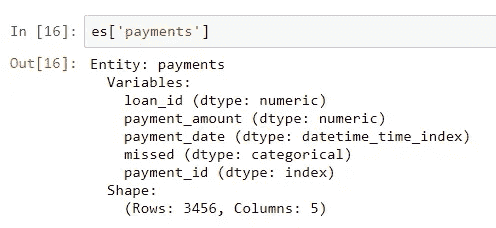

通过我们指定的修改，已经正确地推断出了列类型。接下来，我们需要指定 entityset 中的表是如何关联的。

## 表关系

考虑两个表之间的关系的最好方法是用父子关系的类比。这是一个一对多的关系:每个父母可以有多个孩子。在表的领域中，父表中每个父表都有一行，但是子表中可能有多行对应于同一父表的多个子表。

例如，在我们的数据集中，`clients`数据帧是`loans`数据帧的父数据帧。每个客户端在`clients`中只有一行，但在`loans`中可能有多行。同样，`loans`是`payments`的父代，因为每笔贷款都有多次支付。父母通过一个共享变量链接到他们的孩子。当我们执行聚合时，我们按照父变量对子表进行分组，并计算每个父变量的子表的统计数据。

为了在 featuretools 中形式化一个关系，我们只需要指定将两个表链接在一起的变量。`clients`和`loans`工作台通过`client_id`变量连接，`loans`和`payments`通过`loan_id`连接。创建关系并将其添加到 entityset 的语法如下所示:

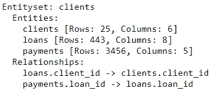

entityset 现在包含三个实体(表)以及将这些实体链接在一起的关系。在添加实体和形式化关系之后，我们的 entityset 就完成了，我们可以开始创建特性了。

## 特征基元

在我们能够深入进行特征合成之前，我们需要理解[特征原语](https://docs.featuretools.com/automated_feature_engineering/primitives.html)。我们已经知道这些是什么，但是我们只是用不同的名字来称呼它们！这些只是我们用来形成新特征的基本操作:

*   聚合:在父子(一对多)关系中完成的操作，按父项分组并计算子项的统计数据。一个例子是通过`client_id`对`loan`表进行分组，并找到每个客户的最大贷款金额。
*   转换:对单个表到一个或多个列的操作。例如，取一个表中两列的差值或一列的绝对值。

在 featuretools 中，使用这些图元单独或堆叠多个图元来创建新特征。下面是 featuretools 中一些特征原语的列表(我们也可以[定义自定义原语](https://docs.featuretools.com/guides/advanced_custom_primitives.html)):

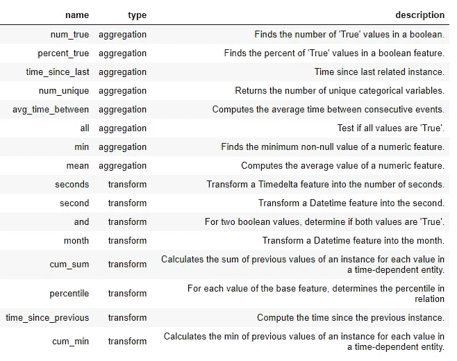

Feature Primitives

这些图元可以单独使用，也可以组合使用来创建特征。为了用指定的图元制作特征，我们使用`ft.dfs`函数(代表深度特征合成)。我们传入`entityset`、`target_entity`，这是我们想要添加特性的表、选择的`trans_primitives`(转换)和`agg_primitives`(聚合):

结果是每个客户端的新特性的数据框架(因为我们让客户端成为了`target_entity`)。例如，我们有每个客户加入的月份，这是一个转换功能原语:

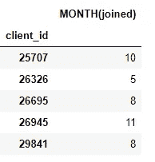

我们还有许多聚合原语，例如每个客户的平均支付金额:

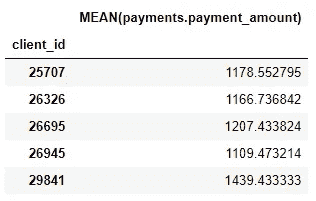

尽管我们只指定了几个特征基元，featuretools 通过组合和堆叠这些基元创建了许多新的特征。

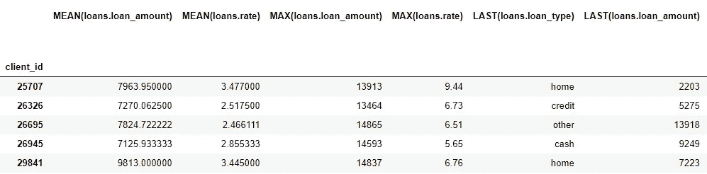

完整的数据框架有 793 列新功能！

## 深度特征合成

我们现在已经具备了理解深度特征合成(dfs)的所有要素。事实上，我们已经在前面的函数调用中执行了 dfs！深度特征是由多个图元堆叠而成的简单特征，而 dfs 是制造这些特征的过程的名称。深度特征的深度是制造该特征所需的基元数。

例如，`MEAN(payments.payment_amount)` 列是深度为 1 的深度特征，因为它是使用单个聚合创建的。深度为 2 的特征是`LAST(loans(MEAN(payments.payment_amount))` 这是通过堆叠两个聚合实现的:最后一个(最近的)在平均值之上。这表示每个客户最近贷款的平均支付规模。

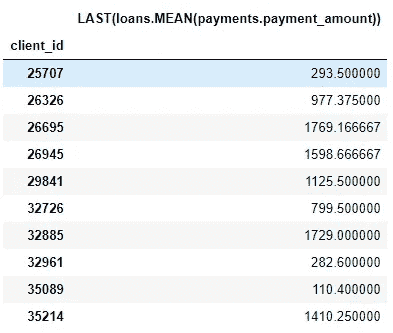

我们可以将特性堆叠到任何我们想要的深度，但是实际上，我从来没有超过 2 的深度。在这一点上，这些特征很难解释，但我鼓励任何感兴趣的人尝试[“深入”](http://knowyourmeme.com/memes/we-need-to-go-deeper)。

我们不必手动指定特征原语，而是可以让 featuretools 自动为我们选择特征。为此，我们使用相同的`ft.dfs`函数调用，但不传递任何功能原语:

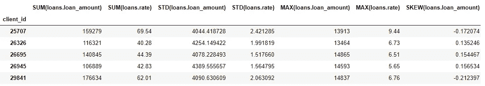

Featuretools 已经建立了许多新功能供我们使用。虽然这一过程确实会自动创建新功能，但它不会取代数据科学家，因为我们仍然需要弄清楚如何处理所有这些功能。例如，如果我们的目标是预测客户是否会偿还贷款，我们可以寻找与特定结果最相关的特征。此外，如果我们有领域知识，我们可以使用它来选择特定的特征基元或[种子与候选特征的深度特征合成](https://docs.featuretools.com/guides/tuning_dfs.html)。

## 后续步骤

自动化特征工程解决了一个问题，但也产生了另一个问题:太多的特征。虽然在拟合模型之前很难说这些特征中的哪一个是重要的，但很可能不是所有的特征都与我们想要训练模型的任务相关。此外，[拥有太多的特性](https://pdfs.semanticscholar.org/a83b/ddb34618cc68f1014ca12eef7f537825d104.pdf)会导致模型性能不佳，因为不太有用的特性淹没了那些更重要的特性。

太多特征的问题被称为[维数灾难](https://en.wikipedia.org/wiki/Curse_of_dimensionality#Machine_learning)。随着特征数量的增加(数据维度的增长)，模型学习特征和目标之间的映射变得越来越困难。事实上，模型运行良好所需的数据量[与特性数量](https://stats.stackexchange.com/a/65380/157316)成指数关系。

通过[特征缩减(也称为特征选择)](https://machinelearningmastery.com/an-introduction-to-feature-selection/)来对抗维数灾难:去除不相关特征的过程。这可以采取多种形式:主成分分析(PCA)、选择最佳、使用来自模型的特征重要性或者使用深度神经网络的自动编码。然而，[特性缩减](https://en.wikipedia.org/wiki/Feature_selection)是另一篇文章的不同主题。现在，我们知道我们可以使用 featuretools 从许多表格中以最小的努力创建大量的特征！

# 结论

像机器学习中的许多主题一样，使用 featuretools 的自动化特征工程是一个建立在简单思想基础上的复杂概念。使用实体集、实体和关系的概念，featuretools 可以执行深度特征合成以创建新特征。深度特征合成反过来堆叠特征基元— **聚合、**跨表之间的一对多关系起作用，以及**转换、**应用于单个表中的一个或多个列的函数—以从多个表构建新特征。

在以后的文章中，我将展示如何在一个现实世界的问题上使用这种技术，这个问题就是目前在 Kaggle 上举办的[家庭信用违约风险竞赛](https://www.kaggle.com/c/home-credit-default-risk)。敬请关注那篇文章，同时，请阅读[这篇介绍，开始](/machine-learning-kaggle-competition-part-one-getting-started-32fb9ff47426)竞争！我希望您现在可以使用自动化特征工程作为数据科学管道中的辅助工具。我们的模型的好坏取决于我们提供给它们的数据，自动化特征工程有助于提高特征创建过程的效率。

有关 featuretools 的更多信息，包括高级用法，请查看[在线文档](https://docs.featuretools.com/)。要了解 featuretools 在实践中是如何使用的，请阅读 Feature Labs 的[工作，这是开源库背后的公司。](https://www.featurelabs.com/)

一如既往，我欢迎反馈和建设性的批评，可以通过 Twitter [@koehrsen_will](http://twitter.com/koehrsen_will) 联系。