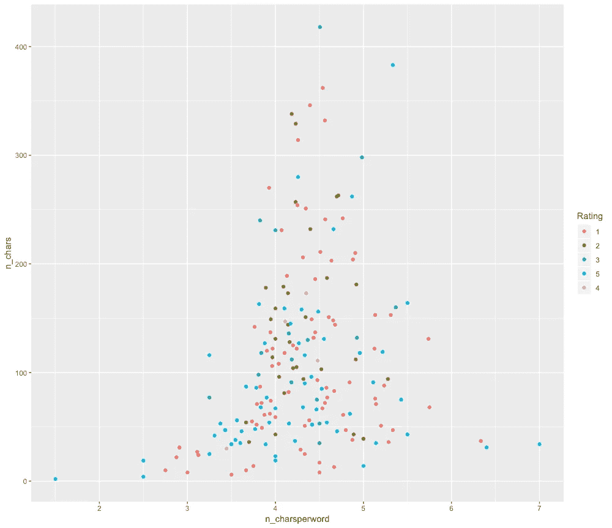

# 使用文本特征为文本数据自动生成特征

> 原文：<https://towardsdatascience.com/automated-features-generation-for-text-data-using-textfeatures-c814f2b46eb1?source=collection_archive---------10----------------------->


Image Courtesy: [https://pixabay.com/en/knowledge-book-library-glasses-1052010/](https://pixabay.com/en/knowledge-book-library-glasses-1052010/)

许多 Kaggle 竞赛的获胜者和数据科学家都强调一件事，那就是“特征工程”，它能让你在竞赛中名列前茅。不管你的模型有多复杂，好的特征总是会比其他的更好地帮助你的机器学习模型建立过程。

# 什么是特征工程？

功能只不过是列/维度，而功能工程是基于领域知识或统计原则创建新功能或预测器的过程。特征工程一直伴随着机器学习，但最新的是自动化特征工程，最近研究人员开始使用机器学习本身来创建有助于模型准确性的新特征。虽然大多数自动化工程解决的是数字数据，但文本数据由于其固有的非结构化性质，在这场竞争中总是被排除在外。我可以说，没有了。

# textfeatures — R 包

密苏里大学的助理教授 Michael Kearney 在 R 社区以现代 twitter 包 [rtweet](https://github.com/mkearney/rtweet) 而闻名，他提出了一个新的 R 包，名为`textfeatures`，它基本上可以为你提供的任何文本数据生成一系列特性。在你梦想基于深度学习的自动化文本特征工程包之前，这不是。这使用非常简单的文本分析原理，并生成诸如大写字母的数量、标点符号的数量之类的特征——简单明了的东西，没有什么特别的，但非常有用。

# 装置

`textfeatures`可以直接从[起重机](https://cran.r-project.org/web/packages/textfeatures/index.html)上安装，开发版本可以从 [github](https://github.com/mkearney/textfeatures) 上获得。

```
install.packages("textfeatures")
```

# 用例

在本帖中，我们将使用`textfeatures`包为来自英国的 Fifa 官方世界杯 ios 应用评论生成功能。我们将 R 包`itunesr`来提取评论和`tidyverse`进行数据操作和绘图。

# 加载所需的包:

让我们加载所有需要的包。

```
#install.packages("itunesr")
#install.packages("textfeatures")
#install.packages("tidyverse")library(itunesr)
library(textfeatures)
library(tidyverse)
```

# 提取最近的评论:

```
#Get UK Reviews of Fifa official world cup ios app
#https://itunes.apple.com/us/app/2018-fifa-world-cup-russia/id756904853?mt=8reviews1 <- getReviews(756904853,"GB",1)
reviews2 <- getReviews(756904853,"GB",2)
reviews3 <- getReviews(756904853,"GB",3)
reviews4 <- getReviews(756904853,"GB",4)#Combining all the reviews into one dataframe
reviews <- rbind(reviews1,
                 reviews2,
                 reviews3,
                 reviews4)
```

# 神奇开始了:

既然我们已经得到了评论，让我们让 textfeatures 发挥它的魔力吧。我们将使用函数`textfeatures()`来完成这项工作。

```
#Combining all the reviews into one dataframe
reviews <- rbind(reviews1,
                 reviews2,
                 reviews3,
                 reviews4)# generate text features
feat <- textfeatures(reviews$Review)# check what all features generated 
glimpse(feat)
Observations: 200
Variables: 17
$ n_chars         149, 13, 263, 189, 49, 338, 210, 186, 76, 14, 142, 114, 242, ...
$ n_commas        1, 0, 0, 0, 0, 1, 2, 1, 1, 0, 1, 1, 0, 3, 0, 0, 1, 0, 3, 1, 0...
$ n_digits        0, 0, 6, 3, 0, 4, 1, 0, 0, 0, 0, 0, 0, 3, 0, 0, 0, 3, 0, 0, 0...
$ n_exclaims      0, 0, 2, 2, 0, 0, 0, 1, 0, 0, 0, 0, 0, 0, 0, 0, 0, 1, 3, 0, 0...
$ n_extraspaces   1, 0, 0, 0, 0, 3, 0, 0, 1, 0, 0, 0, 1, 0, 0, 0, 0, 0, 0, 4, 0...
$ n_hashtags      0, 0, 0, 0, 0, 0, 0, 0, 0, 0, 0, 0, 0, 0, 0, 0, 0, 0, 0, 0, 0...
$ n_lowers        140, 11, 225, 170, 46, 323, 195, 178, 70, 12, 129, 106, 233, ...
$ n_lowersp       0.9400000, 0.8571429, 0.8560606, 0.9000000, 0.9400000, 0.9557...
$ n_mentions      0, 0, 0, 0, 0, 0, 0, 0, 0, 0, 0, 0, 0, 0, 0, 0, 0, 0, 0, 0, 0...
$ n_periods       2, 0, 5, 1, 0, 0, 3, 1, 2, 0, 2, 1, 1, 2, 0, 0, 4, 2, 0, 4, 0...
$ n_urls          0, 0, 0, 0, 0, 0, 0, 0, 0, 0, 0, 0, 0, 0, 0, 0, 0, 0, 0, 0, 0...
$ n_words         37, 2, 55, 45, 12, 80, 42, 41, 14, 3, 37, 28, 50, 16, 15, 8, ...
$ n_caps          4, 1, 12, 8, 2, 7, 3, 4, 2, 2, 6, 4, 6, 2, 3, 1, 6, 4, 29, 9,...
$ n_nonasciis     0, 0, 0, 0, 0, 0, 6, 0, 0, 0, 0, 0, 0, 0, 0, 0, 0, 0, 0, 0, 0...
$ n_puncts        2, 1, 7, 0, 1, 3, 4, 1, 1, 0, 4, 2, 2, 0, 1, 0, 1, 1, 0, 7, 2...
$ n_capsp         0.03333333, 0.14285714, 0.04924242, 0.04736842, 0.06000000, 0...
$ n_charsperword  3.947368, 4.666667, 4.714286, 4.130435, 3.846154, 4.185185, 4...
```

从上面可以看到，textfeatures 已经创建了 17 个新功能。请注意，这些功能对于任何文本数据都是一样的。

# 可视化结果:

对于这篇文章，我们不会建立一个机器学习模型，但这些特征可以很好地用于建立一个分类模型，如情感分类或类别分类。

但是现在，我们只是用一些特征来想象结果。

我们可以根据评论评分，查看字符数和每个单词的字符数之间是否有任何关系。一个假设可能是，给予好评的人不会写得太长或其他。我们不打算在这里验证它，只是用散点图可视化。

```
# merging features with original reviews
reviews_all % 
  ggplot(aes(n_charsperword, n_chars, colour = Rating)) + geom_point()
```

给出了这个图:



让我们用不同的情节从不同的角度来看同一个假设，但是要用一些单词而不是一些字符来比较。

```
reviews_all %>% 
  ggplot(aes(n_charsperword, n_words)) + geom_point() +
  facet_wrap(~Rating) +
  stat_smooth()
```

给出了这个图:


因此，您可以使用`textfeatures`自动生成新的特征，并更好地理解您的文本数据。希望这篇文章能帮助你开始使用这个漂亮的软件包，如果你想了解更多关于文本分析的知识，请查看由朱莉娅·西尔格撰写的[这篇教程。这里使用的完整代码可以在](https://www.datacamp.com/courses/sentiment-analysis-in-r-the-tidy-way?tap_a=5644-dce66f&tap_s=210728-e54afe)[我的 github](https://github.com/amrrs/blogpost_codes/blob/master/textfeatures_demo.R) 上获得。

*本帖最初发表于* [*DS+*](https://datascienceplus.com/automated-text-feature-engineering-using-textfeatures-in-r/)