# Python 中的自动机器学习超参数调整

> 原文：<https://towardsdatascience.com/automated-machine-learning-hyperparameter-tuning-in-python-dfda59b72f8a?source=collection_archive---------0----------------------->


## Python 中使用贝叶斯优化进行自动超参数调优的完整演练

调整机器学习超参数是一项繁琐而又至关重要的任务，因为算法的[性能可能高度依赖于](http://ceur-ws.org/Vol-1998/paper_09.pdf)超参数的选择。手动调整会占用机器学习管道中重要步骤的时间，如[特征工程](https://www.featurelabs.com/blog/secret-to-data-science-success/)和[解释结果](https://www.oreilly.com/learning/introduction-to-local-interpretable-model-agnostic-explanations-lime)。网格和[随机搜索](http://www.jmlr.org/papers/volume13/bergstra12a/bergstra12a.pdf)不需要手动操作，但是需要很长的运行时间，因为它们浪费时间评估搜索空间中没有希望的区域。越来越多的超参数调整是通过自动化方法完成的，这些方法旨在使用**信息搜索**在更短的时间内找到最佳超参数，除了初始设置之外，无需任何人工操作。

[贝叶斯优化](https://en.wikipedia.org/wiki/Bayesian_optimization)，一种基于模型的寻找函数最小值的方法，最近已经应用[到机器学习超参数调整](https://papers.nips.cc/paper/4522-practical-bayesian-optimization-of-machine-learning-algorithms.pdf)，结果[表明这种方法可以在测试集上实现更好的性能，同时比随机搜索需要更少的迭代。此外，现在有许多 Python 库使得实现贝叶斯超参数调整对于任何机器学习模型都很简单。](http://proceedings.mlr.press/v28/bergstra13.pdf)

在本文中，我们将使用 [Hyperopt 库](https://hyperopt.github.io/hyperopt/)完成一个梯度增强机器的贝叶斯超参数调整的完整示例。在之前的一篇文章中，我概述了这个方法背后的概念，所以这里我们将坚持实现。像大多数机器学习主题一样，没有必要理解所有的细节，但知道基本思想可以帮助你更有效地使用技术！

本文的所有代码都可以从 GitHub 上的 [Jupyter 笔记本中获得。](https://github.com/WillKoehrsen/hyperparameter-optimization/blob/master/Bayesian%20Hyperparameter%20Optimization%20of%20Gradient%20Boosting%20Machine.ipynb)

## 目录

*   [贝叶斯优化方法](https://medium.com/p/dfda59b72f8a#8811)
*   [优化问题的四个部分](https://medium.com/p/dfda59b72f8a#4d6d)
*   [目标函数](https://medium.com/p/dfda59b72f8a#05d4)
*   [领域空间](https://medium.com/p/dfda59b72f8a#951b)
*   [优化算法](https://medium.com/p/dfda59b72f8a#8fcc)
*   [结果历史](https://medium.com/p/dfda59b72f8a#6a85)
*   [优化](https://medium.com/p/dfda59b72f8a#7aac)
*   [结果](https://medium.com/p/dfda59b72f8a#80b4)
*   [可视化搜索结果](https://medium.com/p/dfda59b72f8a#9169)
*   [搜索的进化](https://medium.com/p/dfda59b72f8a#1cbc)
*   [继续搜索](https://medium.com/p/dfda59b72f8a#ba35)
*   [结论](https://medium.com/p/dfda59b72f8a#f323)

## 贝叶斯优化方法

作为一个简短的引子，[贝叶斯优化](https://sigopt.com/static/pdf/SigOpt_Bayesian_Optimization_Primer.pdf)通过基于目标的过去评估结果建立代理函数(概率模型)来找到使目标函数最小化的值。与目标相比，代理的优化成本更低，因此要评估的下一个输入值是通过对代理应用一个标准来选择的(通常是[预期改进](https://www.cse.wustl.edu/~garnett/cse515t/spring_2015/files/lecture_notes/12.pdf))。贝叶斯方法不同于随机或网格搜索，因为它们*使用过去的评估结果选择下一个值来评估*。其概念是:**通过基于过去表现良好的输入值选择下一个输入值，限制目标函数的昂贵评估。**

在超参数优化的情况下，目标函数是使用一组超参数的机器学习模型的验证误差。目标是找到在*验证集*上产生最低误差的超参数，希望这些结果可以推广到测试集。评估目标函数是昂贵的，因为它需要用一组特定的超参数来训练机器学习模型。理想情况下，我们希望有一种方法能够*探索搜索空间，同时限制对差的超参数选择的评估*。[贝叶斯超参数调整](https://www.iro.umontreal.ca/~bengioy/cifar/NCAP2014-summerschool/slides/Ryan_adams_140814_bayesopt_ncap.pdf)使用持续更新的概率模型，通过从过去的结果进行推理来“集中”于有希望的超参数。

**Python 选项**

Python 中有几个贝叶斯优化库，它们在目标函数的代理算法上有所不同。在本文中，我们将使用 Hyperopt，它使用了 [Tree Parzen Estimator (TPE)](https://papers.nips.cc/paper/4443-algorithms-for-hyper-parameter-optimization.pdf) 其他 Python 库包括 [Spearmint](https://github.com/HIPS/Spearmint) (高斯过程代理)和 [SMAC](https://automl.github.io/SMAC3/stable/) (随机森林回归)。在这个领域有很多有趣的工作在进行，所以如果你对一个库不满意，可以看看其他的库！一个问题的一般结构(我们将在这里遍历)在两个库之间转换，只有语法上的微小差异。关于 Hyperopt 的基本介绍，请参见本文。

## 最优化问题的四个部分

贝叶斯优化问题有四个部分:

1.  **目标函数:**我们想要最小化什么，在这种情况下，机器学习模型关于超参数的验证误差
2.  **域空间:**超参数值搜索结束
3.  **优化算法:**构建替代模型和选择下一个超参数值进行评估的方法
4.  **结果历史:**存储由超参数和验证损失组成的目标函数的评估结果

有了这四个部分，我们可以优化(找到最小值)任何返回一个实值的函数。这是一个[强大的抽象，除了调优机器学习超参数之外，它还让我们解决了许多问题](https://www.cs.ox.ac.uk/people/nando.defreitas/publications/BayesOptLoop.pdf)。

**数据集**

对于本例，我们将使用[房车保险数据集](https://www.kaggle.com/uciml/caravan-insurance-challenge)，其目标是预测客户是否会购买保险。这是一个有 5800 个训练观测值和 4000 个测试点的监督分类问题。我们将使用曲线 (ROC AUC)下的[接收器操作特征面积来评估性能，因为这是一个不平衡的分类问题。(ROC AUC 越高越好，1 分表示模型完美)。数据集如下所示:](https://en.wikipedia.org/wiki/Receiver_operating_characteristic)

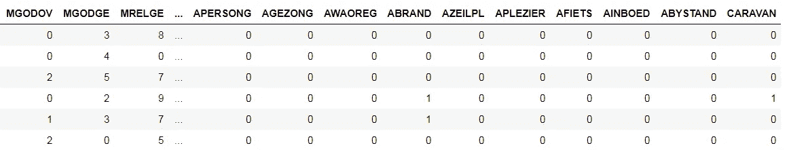

Dataset (CARAVAN) is the label

因为远视需要一个最小化的值，我们将从目标函数返回 1-ROC AUC，从而提高 ROC AUC。

**梯度推进模型**

关于[梯度提升机器](https://en.wikipedia.org/wiki/Gradient_boosting) (GBM)的详细知识对于本文来说不是必需的，这里是我们需要理解的基础知识:GBM 是一种基于使用弱学习器(几乎总是决策树)的集成提升方法，这些弱学习器被顺序训练以形成强模型。在 GBM 中有许多超参数控制整个集合和个体决策树。选择树的数量(称为估计量)的最有效的方法之一是我们将使用的[提前停止](https://en.wikipedia.org/wiki/Early_stopping)。 [LightGBM](http://lightgbm.readthedocs.io/en/latest/Python-API.html) 在 Python 中提供了一个快速简单的 GBM 实现。

关于 GBM 的更多细节，这里有一篇[高级文章](https://medium.com/mlreview/gradient-boosting-from-scratch-1e317ae4587d)和一篇[技术论文](https://brage.bibsys.no/xmlui/bitstream/handle/11250/2433761/16128_FULLTEXT.pdf)。

有了必要的背景知识之后，让我们来看一下为超参数调整编写贝叶斯优化问题的四个部分。

## 目标函数

目标函数是我们试图最小化的。它接受一组值——在本例中是 GBM 的超参数——并输出一个真实值以最小化交叉验证损失。Hyperopt 将目标函数视为一个[黑盒](https://en.wikipedia.org/wiki/Black_box)，因为它只考虑什么进什么出。该算法不需要知道目标函数的内部，就可以找到使损失最小的输入值！在很高的层次上(用伪代码)，我们的目标函数应该是:

```
def objective(hyperparameters):
    """Returns validation score from hyperparameters"""

    model = Classifier(hyperparameters)
    validation_loss = cross_validation(model, training_data)        return validation_loss
```

我们需要小心不要使用*测试*组的损失，因为当我们评估最终模型时，我们只能使用测试组**一次**。相反，我们在验证集上评估超参数。此外，我们使用 [KFold 交叉验证](https://machinelearningmastery.com/k-fold-cross-validation/)，而不是将训练数据分离到不同的验证集中，这除了保留有价值的训练数据之外，还会给我们测试集上的误差估计带来更少的偏差。

超参数调整的目标函数的基本结构在各个模型中是相同的:该函数接受超参数并使用这些超参数返回交叉验证误差。虽然这个例子是特定于 GBM 的，但是该结构可以应用于其他方法。

使用提前停止的 10 倍交叉验证的梯度增强机器的完整目标函数如下所示。

主线是`cv_results = lgb.cv(...)`。为了实现带有提前停止的交叉验证，我们使用 LightGBM 函数`cv`，它接受超参数、一个训练集、用于交叉验证的折叠数和几个其他参数。我们将估计器的数量(`num_boost_round`)设置为 10000，但是实际上不会达到这个数量，因为当 100 个估计器的验证分数没有提高时，我们使用`early_stopping_rounds`来停止训练。早期停止是选择估计量数量的有效方法，而不是将其设置为另一个需要调整的超参数！

一旦交叉验证完成，我们得到最好的分数(ROC AUC)，然后，因为我们想要一个值最小化，我们取 1-最好的分数。然后这个值作为返回字典中的`loss`键返回。

这个目标函数实际上比它需要的要复杂一点，因为我们返回一个值的字典。对于 Hyperopt 中的目标函数，我们可以返回一个值，即 loss，或者返回一个至少有关键字`"loss"`和`"status"`的字典。返回超参数将让我们检查每组超参数导致的损失。

## 领域空间

域空间表示我们想要为每个超参数评估的值的范围。每次搜索迭代，贝叶斯优化算法将从域空间中为每个超参数选择一个值。当我们进行随机或网格搜索时，域空间是一个网格。在贝叶斯优化中，想法是相同的，除了这个空间对于每个超参数具有*概率分布*而不是离散值。

指定领域是贝叶斯优化问题中最棘手的部分。如果我们有机器学习方法的经验，我们可以通过在我们认为最佳值的地方放置更大的概率来使用它来通知我们对超参数分布的选择。然而，最佳模型设置将因数据集而异，并且对于高维度问题(许多超参数),可能很难弄清楚超参数之间的相互作用。在我们不确定最佳值的情况下，我们可以使用宽分布，让贝叶斯算法为我们进行推理。

首先，我们应该查看 GBM 中的所有超参数:

```
import lgb# Default gradient boosting machine classifier
model = lgb.LGBMClassifier()
model**LGBMClassifier(boosting_type='gbdt', n_estimators=100,
               class_weight=None, colsample_bytree=1.0,
               learning_rate=0.1, max_depth=-1,                      
               min_child_samples=20,
               min_child_weight=0.001, min_split_gain=0.0, 
               n_jobs=-1, num_leaves=31, objective=None, 
               random_state=None, reg_alpha=0.0, reg_lambda=0.0, 
               silent=True, subsample=1.0, 
               subsample_for_bin=200000, subsample_freq=1)**
```

我不确定世界上是否有人知道所有这些是如何相互作用的！其中一些我们不必调优(比如`objective`和`random_state`)，我们将使用提前停止来找到最好的`n_estimators`。但是，我们还有 10 个超参数需要优化！当第一次调优一个模型时，我通常会创建一个以默认值为中心的宽域空间，然后在后续的搜索中对其进行优化。

例如，让我们在 Hyperopt 中定义一个简单的域，GBM 中每棵树的叶子数量的离散均匀分布:

```
from hyperopt import hp# Discrete uniform distribution
num_leaves = {'num_leaves': hp.quniform('num_leaves', 30, 150, 1)}
```

这是一个*离散均匀*分布，因为叶子的数量必须是一个整数(离散的)，并且域中的每个值都是同等可能的(均匀的)。

分布的另一种选择是对数均匀分布，它在对数尺度上均匀分布数值。我们将对学习率使用统一的对数(从 0.005 到 0.2)，因为它在几个数量级之间变化:

```
# Learning rate log uniform distribution
learning_rate = {'learning_rate': hp.loguniform('learning_rate',
                                                 np.log(0.005),
                                                 np.log(0.2)}
```

因为这是对数均匀分布，所以这些值在指数(低)和指数(高)之间绘制。下方左侧的图显示离散均匀分布，右侧的图显示对数均匀分布。这些是[内核密度估计图](/histograms-and-density-plots-in-python-f6bda88f5ac0)，所以 y 轴是密度而不是计数！

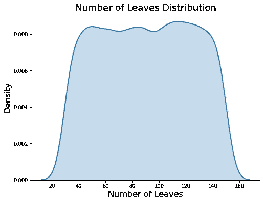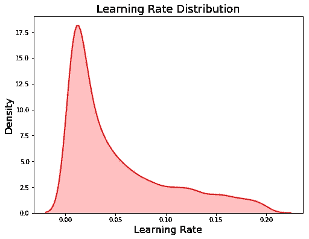

Domain for num_leaves (left) and learning_rate (right)

现在，让我们定义整个域:

这里我们使用了许多不同的域分布类型:

*   `choice`:分类变量
*   `quniform`:离散均匀(间隔均匀的整数)
*   `uniform`:连续均匀(浮动间隔均匀)
*   `loguniform`:连续的均匀圆木(在圆木刻度上均匀分布的浮子)

(文档中[还列出了其他发行版。)](https://github.com/hyperopt/hyperopt/wiki/FMin)

当我们定义升压类型时，需要注意一个要点:

这里我们使用了一个*条件*域，这意味着一个超参数的值依赖于另一个超参数的值。对于增强类型`"goss"`，gbm 不能使用子采样([仅选择训练观察的](https://astro.temple.edu/~msobel/courses_files/StochasticBoosting(gradient).pdf) `[subsample](https://astro.temple.edu/~msobel/courses_files/StochasticBoosting(gradient).pdf)` [部分用于每次迭代](https://astro.temple.edu/~msobel/courses_files/StochasticBoosting(gradient).pdf))。因此，如果增强类型为`"goss"` ，则`subsample`比率设置为 1.0(无二次采样)，否则为 0.5–1.0。这是使用嵌套域实现的。

当我们使用具有完全独立参数的不同机器学习模型时，条件嵌套会很有用。条件允许我们根据 a `choice`的值使用不同的超参数集。

既然我们的领域已经定义好了，我们可以从中抽取一个例子来看看一个典型的样本是什么样子的。当我们采样时，因为`subsample`最初是嵌套的，我们需要将它赋给一个顶级键。这是使用 Python 字典`get`方法完成的，默认值为 1.0。

```
**{'boosting_type': 'gbdt',
 'class_weight': 'balanced',
 'colsample_bytree': 0.8111305579351727,
 'learning_rate': 0.16186471096789776,
 'min_child_samples': 470.0,
 'num_leaves': 88.0,
 'reg_alpha': 0.6338327001528129,
 'reg_lambda': 0.8554826167886239,
 'subsample_for_bin': 280000.0,
 'subsample': 0.6318665053932255}**
```

(这种嵌套键的重新分配是必要的，因为梯度推进机器不能处理嵌套的超参数字典)。

## 最优化算法

尽管这是贝叶斯优化在概念上最困难的部分，但在 Hyperopt 中创建优化算法只需一行代码。要使用[树 Parzen 估计器](https://papers.nips.cc/paper/4443-algorithms-for-hyper-parameter-optimization.pdf)，代码为:

```
from hyperopt import tpe# Algorithm
tpe_algorithm = tpe.suggest
```

这就是全部了！Hyperopt 只有 TPE 选项和随机搜索，尽管 [GitHub 页面说其他方法可能会出现](https://github.com/hyperopt/hyperopt/wiki/FMin)。在优化过程中，TPE 算法根据过去的结果构建概率模型，并通过最大化期望的改善来决定下一组超参数以在目标函数中进行评估。

## 结果历史

跟踪结果并不是绝对必要的，因为 Hyperopt 会在算法内部跟踪结果。然而，如果我们想知道幕后发生了什么，我们可以使用一个`Trials`对象，它将存储基本的训练信息以及从目标函数返回的字典(包括`loss`和`params`)。制作一个试验对象只需一行代码:

```
from hyperopt import Trials# Trials object to track progress
bayes_trials = Trials()
```

另一个允许我们监控长时间训练过程的选项是在每次搜索迭代中向 csv 文件中写入一行。这也将所有的结果保存到磁盘上，以防灾难性的事情发生，我们丢失了试验对象(根据经验)。我们可以使用`csv`库来做到这一点。在培训之前，我们打开一个新的 csv 文件，并写入标题:

然后在目标函数中，我们可以在每次迭代中添加要写入 csv 的行(完整的目标函数在[笔记本](https://github.com/WillKoehrsen/hyperparameter-optimization/blob/master/Bayesian%20Hyperparameter%20Optimization%20of%20Gradient%20Boosting%20Machine.ipynb)中):

写入 csv 意味着我们可以在训练时通过打开文件来检查进度(尽管**不在 Excel** 中，因为这会导致 Python 中的错误。使用 bash 中的`tail out_file.csv`查看文件的最后几行)。

## 最佳化

一旦我们有了这四个部分，就用`fmin`进行优化:

每次迭代，该算法从基于先前结果构建的替代函数中选择新的超参数值，并在目标函数中评估这些值。对于目标函数的`MAX_EVALS`评估，这是持续的，代理函数随着每个新的结果不断更新。

# 结果

从`fmin`返回的`best`对象包含在目标函数上产生最低损失的超参数:

```
**{'boosting_type': 'gbdt',
   'class_weight': 'balanced',
   'colsample_bytree': 0.7125187075392453,
   'learning_rate': 0.022592570862044956,
   'min_child_samples': 250,
   'num_leaves': 49,
   'reg_alpha': 0.2035211643104735,
   'reg_lambda': 0.6455131715928091,
   'subsample': 0.983566228071919,
   'subsample_for_bin': 200000}**
```

一旦我们有了这些超参数，我们就可以使用它们在完整的训练数据上训练一个模型，然后在测试数据上进行评估(记住，我们只能使用测试集一次，当我们评估最终模型时)。对于估计数，我们可以使用在提前停止的交叉验证中返回最低损失的估计数。最终结果如下:

```
**The best model scores 0.72506 AUC ROC on the test set.
The best cross validation score was 0.77101 AUC ROC.
This was achieved after 413 search iterations.**
```

作为参考，随机搜索的 500 次迭代返回了一个在测试集上得到 **0.7232 ROC AUC** 和在交叉验证中得到 **0.76850** 的模型。没有优化的默认模型在测试集上的得分**为 0.7143 ROC AUC** 。

当我们查看结果时，需要记住一些重要的注意事项:

1.  最佳超参数是那些在*交叉验证*中表现最好的超参数，而不一定是那些在*测试数据*中表现最好的超参数。当我们使用交叉验证时，我们希望这些结果可以推广到测试数据中。
2.  即使使用 10 重交叉验证，超参数调整**也会使**过度适应训练数据。来自交叉验证的最好分数明显高于测试数据上的分数。
3.  随机搜索可能仅仅凭借运气返回更好的超参数(重新运行笔记本可能会改变结果)。贝叶斯优化*不能保证*找到更好的超参数，并且可能陷入目标函数的局部最小值。

[贝叶斯优化](http://www.cs.toronto.edu/~rgrosse/courses/csc321_2017/slides/lec21.pdf)有效，但不会解决我们所有的调优问题。随着搜索的进行，算法从[探索(尝试新的超参数值)切换到利用](http://www.cs.cmu.edu/~rsalakhu/10703/Lecture_Exploration.pdf)(使用导致最低目标函数损失的超参数值)。如果算法找到目标函数的局部最小值，它可以集中在局部最小值周围的超参数值上，而不是尝试位于域空间中远处的不同值。随机搜索没有这个问题，因为它不集中于任何值！

另一个要点是，超参数优化的好处将因数据集而异。这是一个相对较小的数据集(约 6000 个训练观察值)，调整超参数的回报很小(获取更多数据会更好地利用时间！).记住所有这些警告，在这种情况下，使用贝叶斯优化，我们可以得到:

*   测试集上更好的性能
*   调整超参数的迭代次数更少

贝叶斯方法可以(尽管不总是)产生比随机搜索更好的调优结果。在接下来的几节中，我们将研究贝叶斯超参数搜索的发展，并与随机搜索进行比较，以了解贝叶斯优化是如何工作的。

# 可视化搜索结果

绘制结果图是理解超参数搜索过程中发生的事情的直观方式。此外，比较贝叶斯优化和随机搜索是有帮助的，这样我们可以看到这两种方法有什么不同。要了解情节是如何制作的，随机搜索是如何实现的，请参见[笔记本](https://github.com/WillKoehrsen/hyperparameter-optimization/blob/master/Bayesian%20Hyperparameter%20Optimization%20of%20Gradient%20Boosting%20Machine.ipynb)，但这里我们将浏览结果。(注意，精确的结果会随着迭代而变化，所以如果您运行笔记本，如果您得到不同的图像，请不要感到惊讶。所有这些图都是用 500 次迭代绘制的)。

首先，我们可以制作随机搜索和贝叶斯优化中采样的`learning_rate`的核密度估计图。作为参考，我们还可以显示抽样分布。垂直虚线显示了学习率的最佳值(根据交叉验证)。

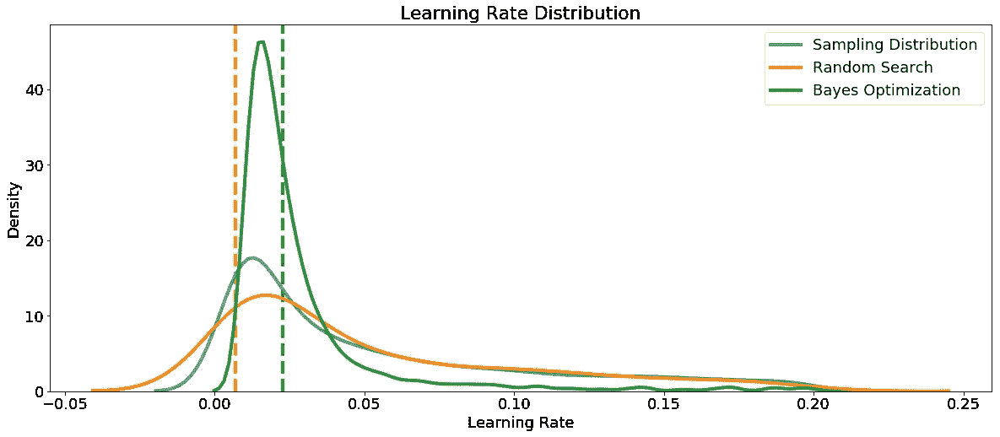

我们将学习率定义为 0.005 到 0.2 之间的对数正态，贝叶斯优化结果看起来类似于采样分布。这告诉我们，我们定义的分布看起来适合这个任务，尽管最优值比我们放置最大概率的地方高一点。这可以用于通知域进行进一步的搜索。

另一个超参数是 boosting 类型，在随机搜索和贝叶斯优化过程中评估每种类型的条形图，如下所示。由于随机搜索不关注过去的结果，我们希望每种提升类型被使用的次数大致相同。

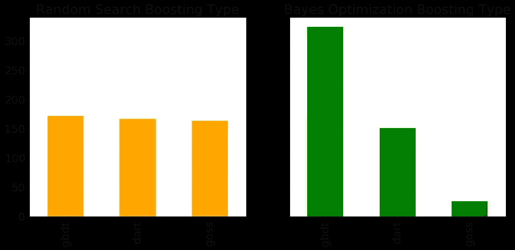

根据贝叶斯算法，`gdbt`助推式比`dart`或`goss`更有希望。同样，这可以帮助通知进一步的搜索，无论是贝叶斯方法或网格搜索。如果我们想进行更明智的网格搜索，我们可以使用这些结果来定义一个更小的网格，集中在超参数的最有希望的值周围。

既然我们已经有了它们，让我们看看来自参考分布、随机搜索和贝叶斯优化的所有数值超参数。垂直线再次指示每次搜索的超参数的最佳值:

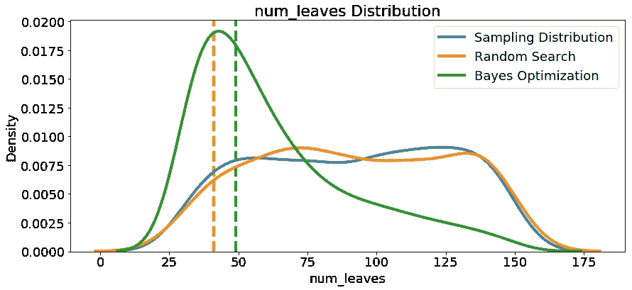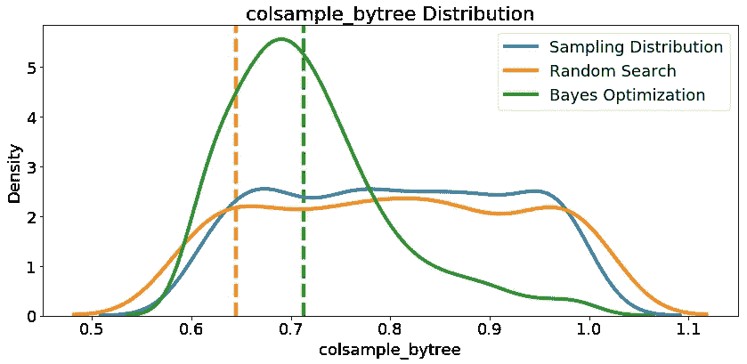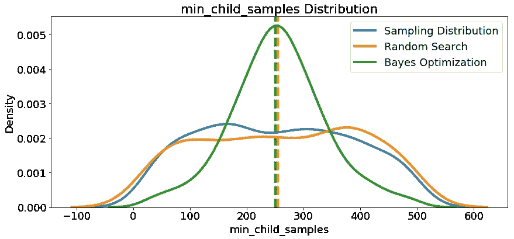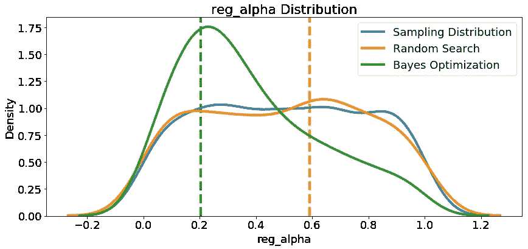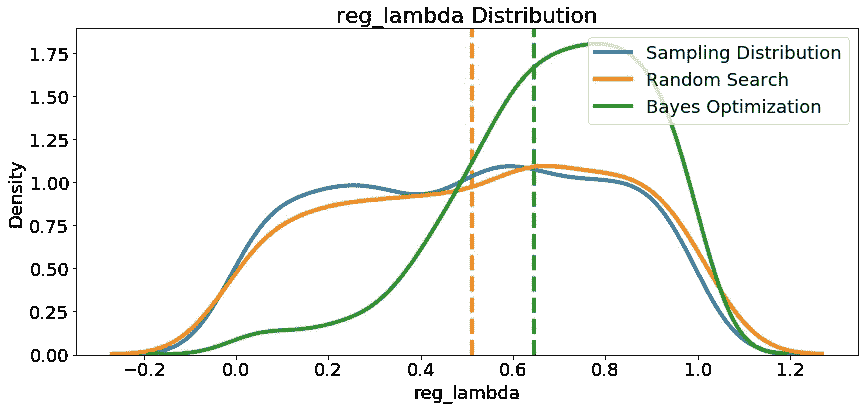

在大多数情况下(除了`subsample_for_bin`)，贝叶斯优化搜索倾向于集中(放置更多概率)在交叉验证中产生最低损失的超参数值附近。这说明了使用贝叶斯方法进行超参数调优的基本思想:**花更多的时间评估有希望的超参数值。**

这里也有一些有趣的结果，可能会在将来定义搜索领域空间时对我们有所帮助。仅举一个例子，看起来`reg_alpha`和`reg_lambda`应该互补:如果一个高(接近 1.0)，另一个应该更低。不能保证这将适用于所有问题，但通过研究结果，我们可以获得可能应用于未来机器学习问题的见解！

## 搜索的演变

随着优化的进行，我们希望 Bayes 方法关注超参数中更有前途的值:那些在交叉验证中产生最低误差的值。我们可以绘制超参数值与迭代的关系图，看看是否有明显的趋势。

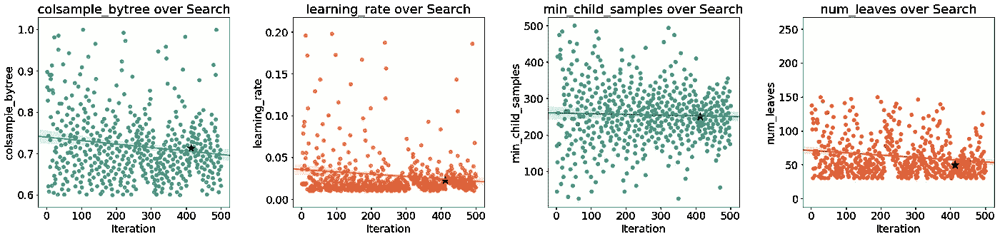

黑色星号表示最佳值。随着时间的推移，`colsample_bytree`和`learning_rate`会减少，这可以指导我们未来的搜索。

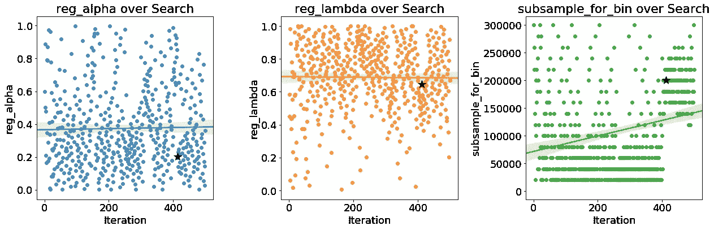

最后，如果贝叶斯优化有效，我们预计平均验证分数会随着时间的推移而增加(反之，损失会减少):

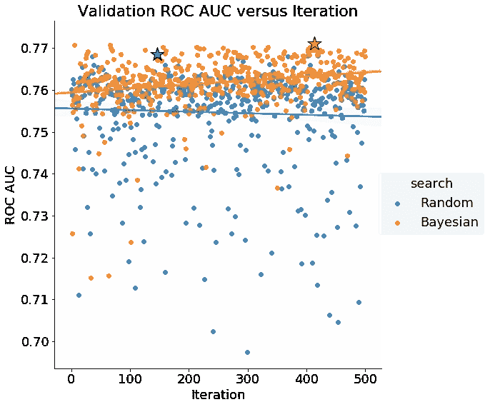

贝叶斯超参数优化的验证分数随着时间的推移而增加，表明该方法正在尝试“更好”的超参数值(应该注意的是，这些只是根据验证分数而变得更好)。随机搜索没有显示出迭代的改进。

## 继续搜索

如果我们对模型的性能不满意，我们可以使用 Hyperopt 从我们停止的地方继续搜索。我们只需要[传入同一个 trials 对象，算法将继续搜索](https://github.com/hyperopt/hyperopt/issues/267)。

随着算法的发展，它会进行更多的开发——挑选过去表现良好的值——而较少的探索——挑选新值。因此，与其从搜索停止的地方继续，不如开始一个完全不同的搜索。如果第一次搜索的最佳超参数真的是“最优”的，我们会期望后续的搜索集中在相同的值上。考虑到问题的高维度，以及超参数之间的复杂相互作用，另一次搜索不太可能产生一组相似的超参数。

经过另外 500 次迭代训练，最终模型在测试集上的得分**为 0.72736 ROC AUC** 。(我们真的不应该在测试集上评估第一个模型，而是只依赖验证分数。理想情况下，测试集应该只使用*一次*，以便在新数据上部署时获得算法性能的度量。同样，由于数据集的规模较小，这个问题可能会对进一步的超参数优化产生递减的回报，并且最终会出现验证误差的平台期(由于未测量的隐藏变量和噪声数据，数据集上任何模型的性能都存在固有的限制，称为[贝叶斯误差](https://en.wikipedia.org/wiki/Bayes_error_rate))。

# 结论

机器学习模型的自动超参数调整可以使用贝叶斯优化来完成。与随机搜索相比，[贝叶斯优化](https://www.cs.ox.ac.uk/people/nando.defreitas/publications/BayesOptLoop.pdf)以一种明智的方法选择下一个超参数，以花更多的时间评估有希望的值。与随机或网格搜索相比，最终结果可以是对目标函数更少的评估和对测试集更好的泛化性能。

在本文中，我们使用 Hyperopt 一步一步地介绍了 Python 中的贝叶斯超参数优化。我们能够改进梯度增强机器的测试集性能，使其超出基线和随机搜索，尽管我们需要小心避免过度拟合训练数据。此外，通过检查结果图，我们看到了随机搜索与贝叶斯优化的不同之处，结果图显示贝叶斯方法对超参数值赋予了更大的概率，从而导致了更低的交叉验证损失。

使用优化问题的四个部分，我们可以使用 Hyperopt 来解决各种各样的问题。贝叶斯优化的基本部分也适用于 Python 中实现不同算法的[个库。从手动切换到随机或网格搜索是一小步，但要让你的机器学习更上一层楼，需要某种自动化形式的](http://ml4aad.org/automl/)[超参数调整](https://en.wikipedia.org/wiki/Hyperparameter_optimization)。贝叶斯优化是一种既易于在 Python 中使用，又能返回比随机搜索更好的结果的方法。希望你现在有信心开始使用这个强大的方法来解决你自己的机器学习问题！

一如既往，我欢迎反馈和建设性的批评。可以通过 Twitter [@koehrsen_will](http://twitter.com/@koehrsen_will) 找到我。