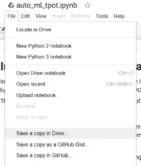
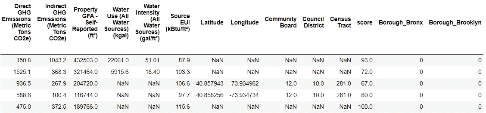
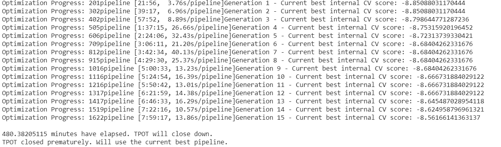

# Python 中云上的自动机器学习

> 原文：<https://towardsdatascience.com/automated-machine-learning-on-the-cloud-in-python-47cf568859f?source=collection_archive---------2----------------------->


## 数据科学的未来介绍

数据科学领域最近出现了两个明显的趋势:

1.  数据分析和模型训练是使用云资源完成的
2.  机器学习管道是通过算法开发和优化的

本文将简要介绍这些主题，并展示如何实现它们，使用 Google Colaboratory 在 Python 中的云上进行自动机器学习。

# 使用 Google Colab 的云计算

最初，所有的计算都是在一台大型主机上完成的。你通过[终端登录，并连接到一台中央机器](http://www.mainframes360.com/2009/06/what-is-mainframe-computer.html)，在那里用户同时共享一台大型计算机。然后，随着 T4 微处理器和个人电脑革命的到来，每个人都有了自己的电脑。笔记本电脑和台式机可以很好地完成日常任务，但随着最近数据集规模和运行机器学习模型所需的计算能力的增加，利用云资源对数据科学来说是必要的。

云计算一般指[“通过互联网交付计算服务”](https://azure.microsoft.com/en-us/overview/what-is-cloud-computing/)。这涵盖了广泛的服务，从数据库到服务器到软件，但在本文中，我们将以 Jupyter 笔记本的形式在云上运行一个简单的数据科学工作负载。我们将使用相对较新的[谷歌联合实验室](https://colab.research.google.com/notebooks/welcome.ipynb#recent=true)服务:运行在谷歌服务器上的 Python 在线 Jupyter 笔记本，可以从任何有互联网连接的地方访问，免费使用，像任何谷歌文档一样可以共享。

Google Colab 让云计算的使用变得轻而易举。过去，我花了几十个小时来配置 Amazon EC2 实例，这样我就可以在云上运行 Jupyter 笔记本，并且必须按小时付费！幸运的是，去年，谷歌宣布你现在可以在他们的 Colab 服务器上运行 Jupyter 笔记本长达 12 小时，一次完全免费。(如果这还不够，谷歌最近开始让用户在笔记本上添加英伟达特斯拉 K80 GPU )。最棒的是，这些笔记本电脑预装了大多数数据科学软件包，并且可以轻松添加更多软件包，因此您不必担心在自己的机器上进行设置的技术细节。

要使用 Colab，你只需要一个互联网连接和一个谷歌账户。如果你只是想要一个介绍，前往[colab.research.google.com](https://colab.research.google.com/)并创建一个新的笔记本，或者探索谷歌开发的教程(称为`Hello, Colaboratory`)。要阅读这篇文章，请点击这里的获取笔记本[。登录您的 Google 帐户，在 Colaboratory 中打开笔记本，单击文件>在驱动器中保存一份副本，然后您将拥有自己的版本进行编辑和运行。](https://colab.research.google.com/drive/1CIVn-GoOyY3H2_Bv8z09mkNRokQ9jlJ-)


First open the notebook in Colaboratory



Second, save a copy in your drive to edit

随着在线资源的丰富，数据科学变得越来越容易获得，而 Colab 项目大大降低了云计算的壁垒。对于那些以前在 [Jupyter Notebooks](http://jupyter.org/) 中做过工作的人来说，这是一个完全自然的过渡，对于那些没有做过的人来说，这是一个开始使用这种常用数据科学工具的绝佳机会！

# 使用 TPOT 的自动机器学习

[自动化机器学习](https://www.kdnuggets.com/2017/01/current-state-automated-machine-learning.html)(缩写为 auto-ml)旨在通过算法设计和优化针对特定问题的机器学习管道。在这种情况下，机器学习管道包括:

1.  特征预处理:插补、缩放和构建新特征
2.  特征选择:降维
3.  模型选择:评估许多机器学习模型
4.  超参数调整:寻找最佳模型设置

这些步骤几乎有无数种组合方式，每个问题的最佳解决方案都会发生变化！设计机器学习管道可能是一个耗时且令人沮丧的过程，最终，你永远不会知道你开发的解决方案是否接近最优。 [Auto-ml 可以帮助](http://www.randalolson.com/2016/05/08/tpot-a-python-tool-for-automating-data-science/)评估数以千计的可能管道，尝试为特定问题找到最佳(或接近最佳)的解决方案。

重要的是要记住，机器学习只是数据科学过程的一部分，自动化机器学习并不意味着取代数据科学家。相反，auto-ml 旨在解放数据科学家，使她能够从事过程中更有价值的方面，例如收集数据或解释模型。

有很多 auto-ml 工具——[H20](http://docs.h2o.ai/h2o/latest-stable/h2o-docs/welcome.html)、 [auto-sklearn](https://automl.github.io/auto-sklearn/stable/) 、[Google Cloud AutoML](https://cloud.google.com/automl/)——我们将重点介绍[TPOT](https://epistasislab.github.io/tpot/):Randy Olson 开发的基于树的管道优化工具。 [TPOT(你的“数据科学助理](http://www.randalolson.com/2016/05/08/tpot-a-python-tool-for-automating-data-science/)”)使用遗传编程来寻找最佳的机器学习管道。

## 插曲:遗传编程

要使用 TPOT，其实并不需要知道[遗传编程](http://geneticprogramming.com/tutorial/)的细节，所以可以跳过这一节。对于那些好奇的人来说，在高层次上，[用于机器学习的遗传编程](http://geneticprogramming.com/)工作如下:

1.  从随机生成的机器学习管道的初始群体开始，比如说 100 个，每个管道都由用于特征预处理、模型选择和超参数调整的功能组成。
2.  训练这些管道中的每一个(称为个体),并使用交叉验证对性能指标进行评估。交叉验证表现代表了个体的“适合度”。群体的每次训练称为一代。
3.  经过一轮训练——第一代——通过繁殖、变异和交叉产生第二代 100 个个体。复制意味着在管道中保持相同的步骤，以与适应度分数成比例的概率进行选择。突变是指个体从一代到下一代在内的随机变化**。交叉是从一代到下一代的**个体之间的随机变化**。这三种策略合在一起将产生 100 个新的管道，每个都略有不同，但根据适应度函数最有效的步骤更有可能被保留。**
4.  重复这个过程适当的世代数，每次通过繁殖、突变和交叉产生新的个体。
5.  优化结束时，选择性能最佳的单个管道。

(关于基因编程的更多细节，请看这篇[的短文](/introduction-to-genetic-algorithms-including-example-code-e396e98d8bf3)。)

遗传编程对于构建机器学习模型的主要好处是探索。由于有限的知识和想象力，即使没有时间限制的人也不能尝试预处理、模型和超参数的所有组合。遗传编程没有显示出对任何特定的机器学习步骤序列的初始偏好，并且随着每一代，新的流水线被评估。此外，适应度函数意味着搜索空间中最有希望的区域比性能较差的区域被更彻底地探索。

# 把它放在一起:云上的自动机器学习

有了背景，我们现在可以在 Google Colab 笔记本中使用 TPOT 来自动设计机器学习管道。(跟着笔记本一起[这里](https://colab.research.google.com/drive/1CIVn-GoOyY3H2_Bv8z09mkNRokQ9jlJ-))。

我们的任务是一个监督回归问题:给定[纽约市能源数据](http://www.nyc.gov/html/gbee/html/plan/ll84_scores.shtml)，我们想要预测一栋建筑的能源之星得分。在之前的一系列文章中([第一部分](/a-complete-machine-learning-walk-through-in-python-part-one-c62152f39420)、[第二部分](/a-complete-machine-learning-project-walk-through-in-python-part-two-300f1f8147e2)、[第三部分](/a-complete-machine-learning-walk-through-in-python-part-three-388834e8804b)、[GitHub 上的代码](https://github.com/WillKoehrsen/machine-learning-project-walkthrough))，我们为这个问题构建了一个完整的机器学习解决方案。使用手动特征工程、降维、模型选择和超参数调整，我们设计了一个梯度推进回归器模型，在测试集上实现了 9.06 分的平均绝对误差(从 1 到 100 分)。

该数据包含几十个连续的数字变量(如能源使用和建筑面积)和两个一次性编码的分类变量(区和建筑类型),共有 82 个要素。



Raw data features

`score`是回归的目标。所有缺失的值都被编码为`np.nan`，并且没有对数据进行任何特征预处理。

首先，我们需要确保 TPOT 安装在 Google Colab 环境中。大多数数据科学包已经安装，但是我们可以使用系统命令(前面有一个！在 Jupyter):

```
!pip install TPOT
```

在读入数据后，我们通常会填充缺失值(插补)并将特征标准化为一个范围(缩放)。然而，除了特征工程、模型选择和超参数调整，TPOT 将自动估算缺失值并进行特征缩放！因此，我们的下一步是创建 TPOT 优化器:

TPOT 优化器的默认[参数将评估 100 组管道，每组 100 代，总共 10，000 条管道。使用 10 重交叉验证，这代表 100，000 次训练运行！即使我们使用谷歌的资源，我们也没有无限的时间进行培训。为了避免在 Colab 服务器上耗尽时间(我们最多获得 12 小时的连续运行时间)，我们将评估时间设置为最多 8 小时(480 分钟)。](https://epistasislab.github.io/tpot/api/) [TPOT 被设计为运行几天](https://epistasislab.github.io/tpot/using/)，但是我们仍然可以从几个小时的优化中获得好的结果。

我们在对优化器的调用中设置了以下参数:

*   `scoring = neg_mean_absolute error`:我们的回归性能指标
*   `max_time_minutes = 480`:评估时间限制为 8 小时
*   `n_jobs = -1`:使用机器上所有可用的内核
*   `verbosity = 2`:训练时显示有限的信息
*   `cv = 5`:使用五重交叉验证(默认为 10)

还有其他参数控制着遗传编程方法的细节，但是在大多数情况下，将它们保留为缺省值就可以了。(如果您想使用参数，请查看文档。)

TPOT 优化器的语法被设计成与 Scikit-Learn 模型的语法相同，因此我们可以使用`.fit`方法训练优化器。

```
# Fit the tpot optimizer on the training data
tpot.fit(training_features, training_targets)
```

在培训过程中，我们会显示一些信息:



由于时间限制，我们的模型只能通过 15 代。对于 100 个群体，这仍然代表了被评估的 1500 个不同的单独管道，比我们手动尝试的要多得多！

一旦模型训练完毕，我们就可以使用`tpot.fitted_pipeline_`看到最佳的管道。我们还可以将模型保存到 Python 脚本中:

```
# Export the pipeline as a python script file
tpot.export('tpot_exported_pipeline.py')
```

由于我们是在 Google Colab 笔记本中，要从服务器将管道连接到本地机器，我们必须使用 Google Colab 库:

```
# Import file management
from google.colab import file# Download the pipeline for local use
files.download('tpot_exported_pipeline.py')
```

然后我们可以打开文件(此处可用[和](https://github.com/WillKoehrsen/machine-learning-project-walkthrough/blob/master/auto_ml/tpot_exported_pipeline.py))并查看完成的管道:

我们看到优化器为我们估算了缺失的值，并构建了一个完整的模型管道！最后一个估计器是一个[堆叠模型](http://blog.kaggle.com/2016/12/27/a-kagglers-guide-to-model-stacking-in-practice/)，这意味着它使用两个机器学习算法(`[LassoLarsCV](http://scikit-learn.org/stable/modules/generated/sklearn.linear_model.LassoLarsCV.html)`和`[GradientBoostingRegressor](http://scikit-learn.org/stable/modules/generated/sklearn.ensemble.GradientBoostingRegressor.html)`)，其中第二个是根据第一个的预测进行训练的(如果你再次运行笔记本，你可能会得到一个不同的模型，因为优化过程是随机的)。这是一个复杂的方法，我自己可能无法开发！

现在，关键时刻到了:测试设备的性能。为了找到平均绝对误差，我们可以使用`.score`方法:

```
# Evaluate the final model
print(tpot.score(testing_features, testing_targets))**8.642**
```

在我们手动开发解决方案的系列文章中，经过数小时的开发，我们构建了一个[梯度推进回归器模型](http://blog.kaggle.com/2017/01/23/a-kaggle-master-explains-gradient-boosting/)，其平均绝对误差为 9.06。随着开发时间的大幅减少，自动机器学习在性能上有了显著的提高。

从这里开始，我们可以使用优化的管道并尝试进一步完善解决方案，或者我们可以继续进行数据科学管道的其他重要阶段。如果我们使用这个作为我们的最终模型，我们可以尝试并解释这个模型(比如通过使用[LIME:Local Interpretable Model-Agnostic explaining](https://arxiv.org/abs/1602.04938))或者写一个文档化的报告。

# **结论**

在这篇文章中，我们简要介绍了云和自动化机器学习的能力。只需一个谷歌账户和互联网连接，我们就可以使用谷歌实验室来开发、运行和共享机器学习或数据科学工作负载。使用 TPOT，我们可以通过特征预处理、模型选择和超参数调整来自动开发优化的机器学习管道。此外，我们看到 auto-ml 不会取代数据科学家，但它将允许她在工作流程中更高价值的部分花费更多的时间。

虽然作为早期采用者并不总是有回报，但在这种情况下，TPOT 足够成熟，易于使用，相对来说没有问题，但也足够新，学习它会让你走在曲线的前面。考虑到这一点，找到一个机器学习问题(也许通过 [Kaggle](https://www.kaggle.com/) )并尝试解决它！在 Google Colab 的笔记本上运行自动机器学习感觉就像是未来，进入门槛如此之低，这是开始的最佳时机！

一如既往，我欢迎反馈和讨论，可以通过 Twitter [@koehrsen_will](https://twitter.com/koehrsen_will) 联系。