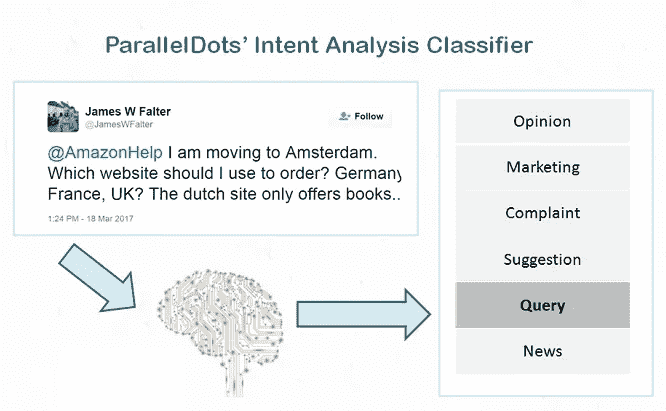
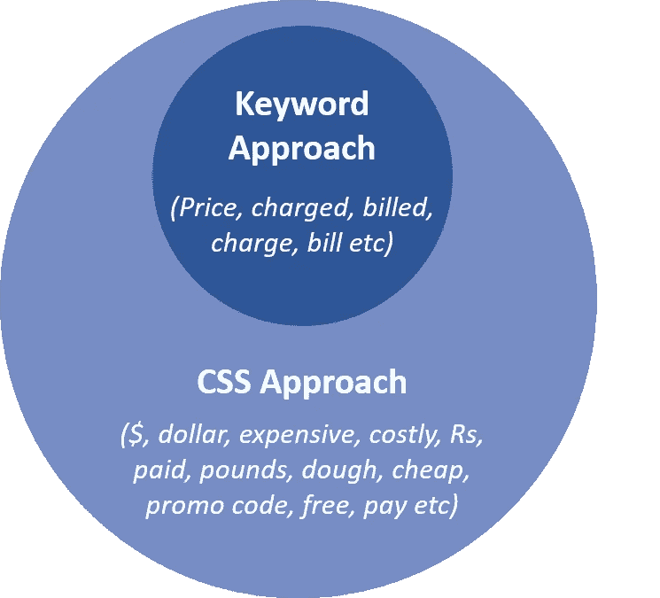
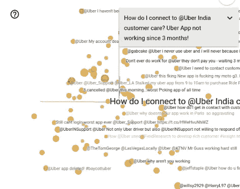
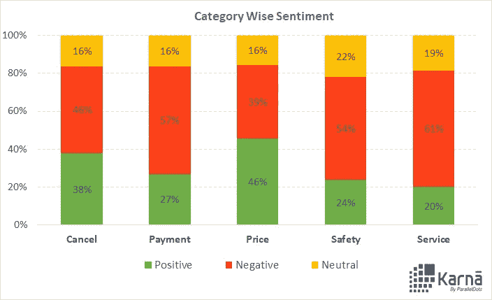
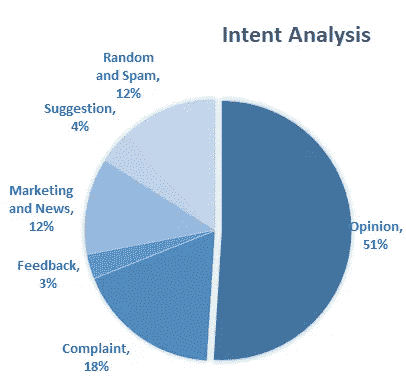
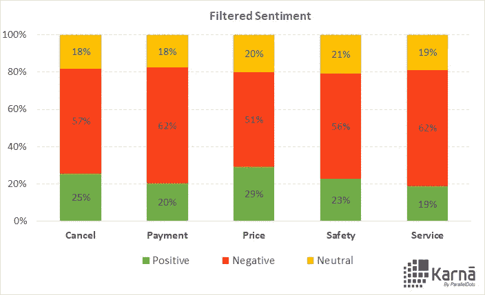
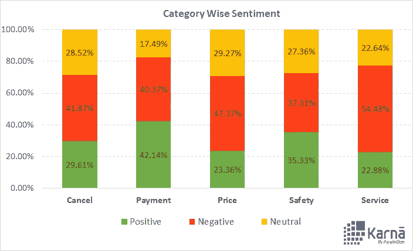
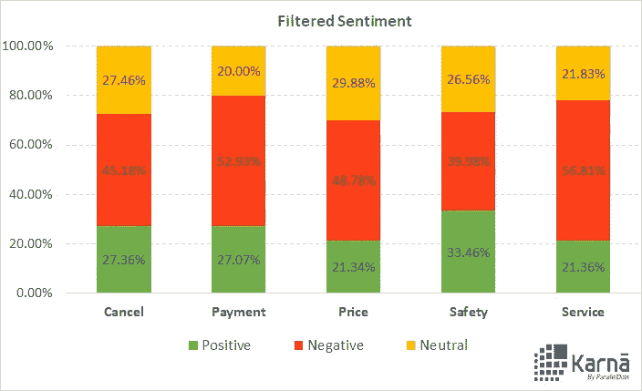

# 使用上下文语义搜索的自动化调查处理

> 原文：<https://towardsdatascience.com/automated-survey-processing-using-contextual-semantic-search-2dfe68338ab5?source=collection_archive---------12----------------------->

随着深度学习的最新进展，算法分析文本的能力有了很大提高。现在，分析数字和社交媒体不仅限于基本的情感分析和基于计数的指标。创造性地使用先进的人工智能技术可以成为进行深入研究的有效工具。我们认为，根据以下线索对客户关于某个品牌的对话进行分类非常重要:

1.  顾客关心的品牌产品和服务的关键方面。
2.  用户对这些方面的潜在意图和反应。

这些基本概念结合使用时，会成为一个非常重要的工具，用于以人类水平的准确性分析数百万次品牌对话。在这篇文章中，我们以优步为例，展示这是如何运作的。请继续阅读！

# 文本分类器——基本构件

**1。情绪分析**

[情感分析](https://www.paralleldots.com/sentiment-analysis)是最常见的文本分类工具，它分析收到的消息，并判断潜在的情感是积极的、消极的还是中性的。你可以输入一个你选择的句子，并通过这里的[演示来判断潜在的情绪。](https://www.paralleldots.com/sentiment-analysis)

# 情感分析

[情感分析](https://www.paralleldots.com/emotion-detection)可以从任何文本数据中准确地检测出情感。人们在社交媒体、博客和论坛上表达他们的观点、反馈和评论。营销人员和客户支持人员可以利用情绪检测的能力来读取和分析文本数据附带的情绪。我们的情绪分析分类器是在我们专有的数据集上训练的，它可以告诉我们信息背后的潜在情绪是:快乐、悲伤、愤怒、恐惧、兴奋、有趣还是讽刺。

**意图分析**

[意图分析](https://www.paralleldots.com/intent-analysis)通过分析信息背后的用户意图，并识别它是否与意见、新闻、营销、投诉、建议、赞赏或疑问相关，来加强游戏。

Analyzing intent of textual data

**上下文语义搜索(CSS)**

现在，事情变得非常有趣了。为了获得可行的见解，了解用户讨论的是品牌的哪个方面是很重要的。例如，Amazon 想要分离与延迟交付、账单问题、促销相关查询、产品评论等相关的消息。但是怎样才能做到呢？

我们引入了一种智能的智能搜索算法，称为**上下文语义搜索(又名 CSS)** 。CSS 的工作方式是，它将数千条消息和一个概念(如**价格**)作为输入，并过滤所有与给定概念紧密匹配的消息。下图展示了 CSS 如何代表了对业界使用的现有方法的重大改进。

过滤所有与**价格**相关的消息的传统方法是对**价格**和其他密切相关的词进行关键字搜索，如(定价、收费、$、已付)。然而，这种方法不是很有效，因为几乎不可能想到所有相关的关键字及其代表特定概念的变体。另一方面，CSS 只是将概念的名称( **Price** )作为输入，并过滤所有上下文相似的内容，即使没有提到概念关键字的明显变体。

对于好奇的人，我们想让他们看一下这是如何工作的。人工智能技术用于将每个单词转换为超空间中的特定点，这些点之间的距离用于识别上下文与我们正在探索的概念相似的消息。下面可以看到引擎盖下的可视化效果:

Visualizing contextually related Tweets

现在来看看 CSS 的作用以及它是如何处理下面的文本数据的:

该算法将消息分类为与称为 P **rice** 的概念上下文相关，即使消息中没有提到单词 **Price** 。

# 优步:深潜分析

我们分析了数字媒体上关于几个产品主题的在线对话:**取消、支付、价格、安全和服务。**

为了广泛覆盖数据来源，我们从优步官方脸书页面上的最新评论、提到优步的推文以及优步的最新新闻文章中获取数据。以下是所有渠道的数据点分布:

1.  脸书:**34173**评论
2.  推特:21603 条推特
3.  新闻:**第 4245 篇**

分析用户对话的情感可以让你对整体品牌认知有所了解。但是，为了更深入地挖掘，借助上下文语义搜索进一步对数据进行分类是很重要的。

我们在同一个数据集上运行了上下文语义搜索算法，将上述类别纳入一个帐户(**取消、支付、价格、安全和服务**)。

## 脸谱网

**情绪分析**

Breakdown of Sentiment for Categories

值得注意的是，除了一个类别，所有类别的评论都有负面情绪。与**价格**相关的正面评论数量已经超过负面评论。为了更深入地挖掘，我们分析了这些评论的意图。脸书作为一个社交平台，评论是拥挤的*随机内容、新闻分享、营销和推广内容以及垃圾邮件/垃圾/无关内容*。看看脸书评论上的意图分析:

Intent analysis of Facebook comments

因此，我们删除了所有这些不相关的意图类别，并重现了结果:

Filtered Sentiment Analysis

对每个类别的看法都有明显的变化。尤其是在**价格**相关评论中，正面评论的数量从 46%下降到了 29%。

## 推特

**情感分析**

对抓取的推文也做了类似的分析。在最初的分析中，与支付和安全相关的推文让人喜忧参半。

Category wise sentiment analysis

为了了解真实的用户意见、投诉和建议，我们必须再次过滤不相关的推文(垃圾邮件、垃圾信息、营销、新闻和随机消息):

Filtered sentiment

与付款相关的推文数量明显减少。此外，针对类别**安全**(以及相关关键词)的正面推文数量大幅下降。)

像优步这样的品牌可以依靠这种洞察力，并针对最关键的话题采取行动。例如，**服务**相关推文的正面推文比例最低，负面推文比例最高。因此，优步可以分析这些推文，并根据它们采取行动，以提高服务质量。

## 新闻ˌ消息

Sentiment Analysis for News Headlines

可以理解的是，安全一直是新闻中谈论最多的话题。有趣的是，新闻情绪总体上是积极的，在每个类别中也是如此。

我们也根据新闻的受欢迎程度进行分类。流行度得分归因于文章在不同社交媒体渠道上的分享计数。以下是热门新闻文章列表:

1.  [优步首席执行官遭批评后将离开特朗普顾问委员会](https://www.nytimes.com/2017/02/02/technology/uber-ceo-travis-kalanick-trump-advisory-council.html?_r=0)
2.  [#DeleteUber:用户对特朗普穆斯林禁令废 app 感到愤怒](http://www.aljazeera.com/news/2017/01/deleteuber-users-angry-trump-muslim-ban-scrap-app-170129082003307.html)
3.  优步员工也讨厌他们自己的企业文化
4.  每次我们获得优步奖，我们都在传播它的社会毒素
5.  [司机在抗议和罢工期间前往 JFK 机场后，愤怒的消费者删除了优步的应用程序](http://www.businessinsider.in/Furious-customers-are-deleting-the-Uber-app-after-drivers-went-to-JFK-airport-during-a-protest-and-strike/articleshow/56859124.cms)

# 结论

随着技术的进步，从社交媒体数据中获得有意义见解的时代已经到来。优步的案例研究让你一瞥上下文语义搜索的威力。您的组织是时候超越总体情绪和基于计数的指标了。公司最近一直在利用数据的力量，但要获得最深层的信息，你必须利用人工智能、深度学习和智能分类器(如上下文语义搜索)的力量。

您还可以使用我们的 Excel 插件来分析调查，而无需编写任何代码。你可以从[这里](https://www.paralleldots.com/excel-plugin)下载插件。

我们希望你喜欢这篇文章。请[注册](http://user.apis.paralleldots.com/signing-up?utm_source=blog&utm_medium=chat&utm_campaign=paralleldots_blog)一个免费的 ParallelDots 账户，开始你的 AI 之旅。你也可以在这里查看 PrallelDots AI API[的演示。](https://www.paralleldots.com/ai-apis)

此处阅读原文[。](https://blog.paralleldots.com/product/contextual-semantic-search-concept-analysis-applications/)