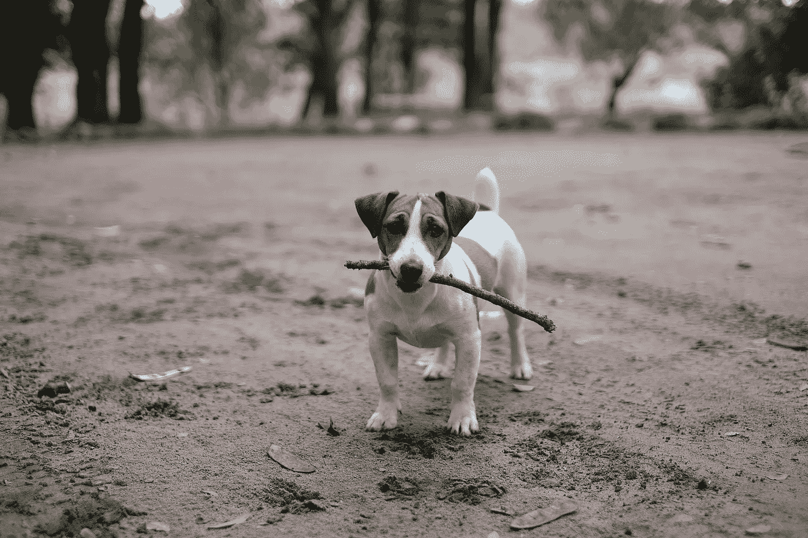

# 自动数据收集

> 原文：<https://towardsdatascience.com/automatic-data-collection-to-improve-image-classifiers-232c2f0b2070?source=collection_archive---------13----------------------->



Fetch some Data

提高图像识别模型性能的最佳方法之一是添加更多数据进行训练！向当前数据集即时添加更多数据的一些最流行的方法是尝试翻转图像，向图像添加一些噪点，或者添加颜色扭曲。一个有才华的机器学习工程师也可能尝试使用 GANs 向训练集添加数据。

然而，这只能到此为止，最终这些策略将会停滞不前，尤其是如果你只有 200 张图片的话。提高模型性能的最常见方法之一，尤其是在部署之后，是设置一个**自动数据管道**。

下面是本文中介绍的自动数据收集策略:

```
Classify new instance
If model_Output == .995 || model_Output == .005
  save new instance to train data and label accordingly
```

我们最终可以加速这一过程，使模型在遇到新实例时显著增加数据集的大小。

然而，另一件需要担心的事情是最终的数据集大小。如果每次有人使用你的应用程序时你都保存 100 张新图片，你可能会得到一个巨大的数据集。根据您的数据存储环境和成本，这可能会有问题。出于这个原因，最好也将您的自动数据管道参数化，使其在收集到某个变量 X GBs 时停止。

此外，一旦有了更大的数据集，您可能会发现需要向模型中添加图层来学习更复杂的分类函数。

当然，这种策略可以扩展到图像识别领域之外的模型，但是，例如，如果您正在处理 csv 数据的记录，您可能不必考虑最大数据存储。

感谢阅读！希望这有助于您思考您的数据收集自动化过程。这真的会节省你很多时间，从长远来看会有巨大的回报！

# [CShorten](https://medium.com/@connorshorten300)

Connor Shorten 是佛罗里达大西洋大学计算机科学专业的学生。对数据科学、深度学习和软件工程感兴趣。主要用 Python，JavaScript，C++编码。请关注更多关于这些主题的文章。