# 使用深度学习和贝叶斯推理的自动特征工程

> 原文：<https://towardsdatascience.com/automatic-feature-engineering-using-deep-learning-and-bayesian-inference-application-to-computer-7b2bb8dc7351?source=collection_archive---------4----------------------->

## 计算机视觉和综合金融交易数据的应用

我们将探索深度学习和贝叶斯推理在自动特征工程中的应用，特别是自动编码器。这个想法是从潜在的有噪声的原始数据中自动学习一组特征，这些数据在监督学习任务中是有用的，例如在计算机视觉和保险中。以这种方式，我们通过自动学习一组特征，即表示学习，避免了手工制作的特征工程的手动过程，这可以帮助解决某些任务，例如图像识别和保险损失风险预测。

# 计算机视觉

为此，我们将使用 MNIST 数据集，其中原始数据是每个图像的像素强度的二维张量。图像是我们的分析单位:我们将预测每个图像的每个类别的概率。这是一个多类分类任务，我们将使用准确度分数来评估模型在测试折叠中的性能。

2 dimensional tensor of pixel intensities per image.

计算机视觉任务的手工特征工程的一些例子可能使用 Gabor 滤波器。

# 保险

我们将使用合成数据集，其中原始数据是每个保单期组合的历史保单级别信息的二维张量:每个单位将是一个 4x 3 维张量，即 4 个历史时间段和 3 种交易类型。保单-期间组合是我们的分析单位:我们将预测未来期间 5 的损失概率—将此视为保单的潜在续保，我们需要预测它是否会为我们带来损失，从而影响我们是否决定续保和/或调整续保保费以考虑额外风险。这是一个二元类分类任务，我们将使用 AUROC 分数来评估模型性能。

2 dimensional tensor of transaction values per policy-period combination.

保险任务的手工特征工程的一些例子可能使用列或行平均值。

合成保险金融交易数据集是用 r 编写的，其余的工作都是用 Python 完成的。

请注意计算机视觉任务的原始数据和保险任务的原始数据之间的相似之处。我们在这里的主要目标是通过深度学习和贝叶斯推理，使用自动特征工程来学习这种原始数据的良好表示。

# Scikit-learn、Keras 和 TensorFlow

我们将使用 Python 机器学习库 scikit-learn 进行数据转换和分类任务。请注意，我们将自动编码器编码为 scikit-learn 转换器，以便 scikit-learn 管道可以随时使用它们。深度学习者将使用 Keras 和 TensorFlow 后端进行编码。我们还在 MacBook Pro 上使用了外部 GPU，即 GTX 1070。

# MNIST:没有自动编码器

我们在不使用自动编码器的情况下运行 MNIST 数据集。MNIST 图像的每个图像的像素强度的 2 维张量是 28 乘 28 的维度。我们将它们重塑为每个图像 784 维的 1 维张量。因此，对于每幅图像的监督学习任务，我们有 784 个特征。

# 结果

> 没有自动编码器的 MNIST 分类任务的准确度分数: **92.000000%** 。

# MNIST:认证机构

我们使用主成分分析过滤器，挑选出能够解释 99%变异的成分数量。

# 结果

> 使用主成分分析的 MNIST 分类任务的正确率得分: **91.430000%** 。

# MNIST:普通自动编码器

自动编码器是一种无监督学习技术，其目标是学习一组可用于重构输入数据的特征。

我们的输入数据是 *X* 。编码器功能 *E* 将其映射到一组 *K* 特征。解码器功能 *D* 使用一组 *K* 特征来重构输入数据。

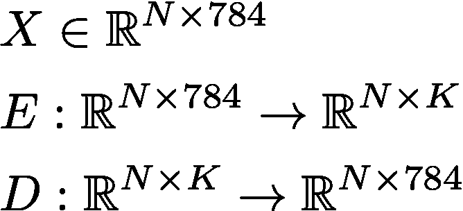

让我们将重建的数据表示如下。

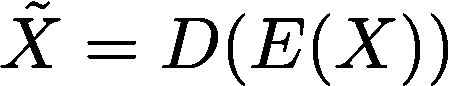

目标是学习编码和解码功能，使输入数据和重构数据之间的差异最小化。这个任务的目标函数的一个例子可以是均方误差(MSE)。

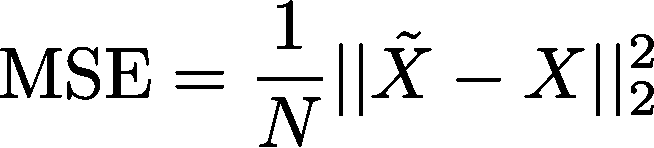

我们通过使用定义编码和解码函数的参数最小化 MSE 来学习编码和解码函数:使用链式法则(即反向传播)来计算 MSE 相对于参数的梯度，并将其用于通过诸如随机梯度下降(SGD)的优化算法来更新参数。

假设我们有一个单层自动编码器，它使用指数线性单元(ELU)激活函数、批量归一化、丢失和自适应矩(Adam)优化算法。 *B* 是批量， *K* 是特性数。

*   **指数线性单元:**激活函数处处平滑，避免了输入为负时输出呈现负值的消失梯度问题。

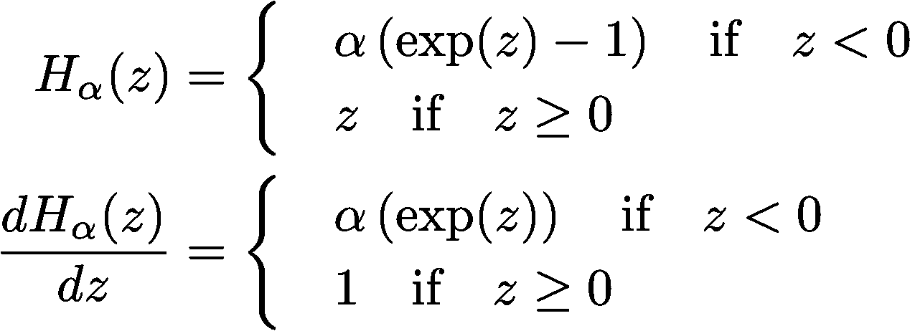

*   **批量标准化:**这个想法是把输入转换成一个隐藏层的激活函数。我们首先在每个特征的基础上使用均值和方差参数进行标准化或规范化，然后在转换数据的每个特征的基础上学习一组缩放和移动参数。下面的等式简洁地描述了这一层。

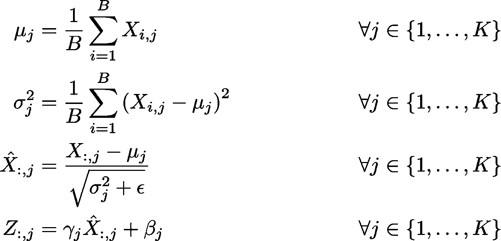

*   **丢弃:**这种正则化技术简单地以一定的概率(比如 50%)丢弃来自输入和隐藏单元的输出。
*   **Adam 优化算法:**这种自适应算法结合了 Momentum 和 RMSProp 优化算法的思想。目标是对过去的梯度有一些记忆，这可以指导将来的参数更新。下面的算法方程简明地描述了这种方法。

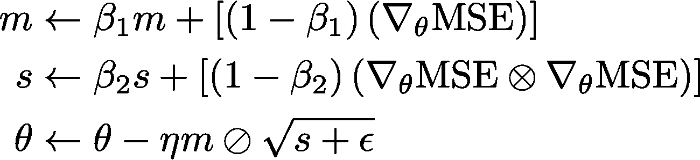

# 结果

> 使用自动编码器的 MNIST 分类任务的准确度分数: **96.940000%** 。

# MNIST:去噪自动编码器

这里的想法是向数据添加一些噪声，并尝试学习一组稳健的特征，这些特征可以从有噪声的数据中重建无噪声的数据。MSE 目标函数如下。

# 结果

> 使用去噪自动编码器的 MNIST 分类任务的准确度分数: **96.930000%** 。

# MNIST:一维卷积自动编码器

到目前为止，我们使用的是扁平化或整形的原始数据。每个图像的像素强度的这种 1 维张量可能没有考虑 2 维张量可能包含的有用的空间特征。为了克服这个问题，我们引入卷积滤波器的概念，首先考虑它们的一维版本，然后考虑它们的二维版本。

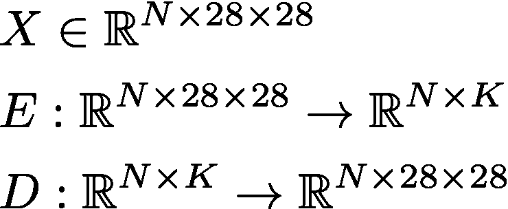

卷积滤波器背后的思想与手工特征工程密切相关:人们可以将手工特征简单地视为预定义卷积滤波器的结果，即没有基于手边的原始数据学习的卷积滤波器。

假设我们有每个分析单位的原始交易数据，即抵押贷款，这可能有助于我们将一个单位分类为违约或未违约。我们将保持这个例子简单，只允许交易值为$100 或$0。每单位的原始数据跨越 5 个时间段，而默认标签用于下一个时间段，即时间段 6。以下是一个特定单位的原始数据示例:

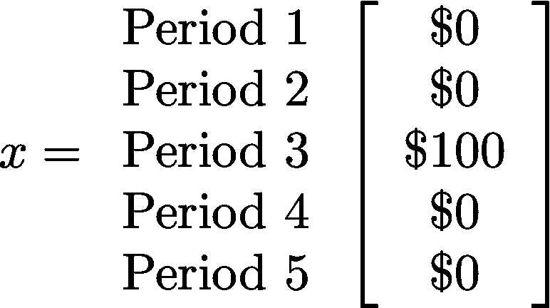

进一步假设，如果平均交易价值为 20 美元，那么我们将在第 6 期看到该特定抵押贷款单位的违约。除此之外，我们不会看到第 6 期出现违约。平均交易价值是手工制作的特征的一个例子:预先定义的手工制作的特征，没有以任何方式学习。它是通过信贷风险领域的知识得出的。将其表示为 *H(x)* 。

学习这种特征的想法是一维卷积滤波器的一个例子。如下所示:

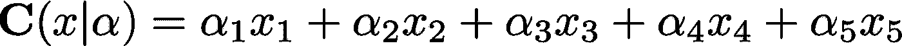

假设 *H(x)* 是该监督学习任务的原始数据的正确表示，则通过用于上述定义的卷积滤波器的监督学习，或者可能是无监督学习，然后被转移到监督学习任务，即转移学习，学习的最佳参数集是[0.2，0.2，0.2，0.2，0.2]:

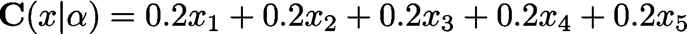

这是一个简单的例子，但是这清楚地说明了使用深度学习进行自动特征工程或表示学习背后的原理。以无监督的方式学习这种表示的主要好处之一是，相同的表示可以用于多个监督学习任务:迁移学习。这是从原始数据中学习表示的一种原则性方式。

总结一下，对于我们的简单示例，一维卷积滤波器定义为:

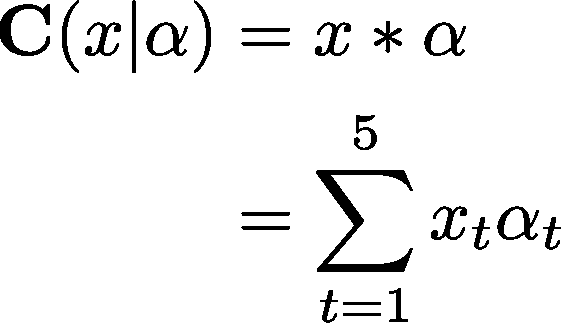

*   *x* 为输入。
*   𝛼是内核。
*   输出 *x* * 𝛼被称为特征图，而*是卷积算子或滤波器。这是普通神经网络和卷积神经网络之间的主要区别:我们用卷积算子代替矩阵乘法算子。
*   根据手头的任务，我们可以有不同类型的卷积滤波器。
*   内核大小可以改变。在我们的例子中，内核大小是 5。
*   步幅大小可以改变。在我们的示例中，我们没有步长大小，但是假设步长大小为 1，内核大小为 2，即𝛼 = [𝛼 ，𝛼 ]，那么我们将在输入开始时应用内核𝛼，即[ *x* ， *x* ] * [𝛼 ，𝛼 ]，并将内核移动到输入的下一个区域，即[ **x*]*【𝛼*、𝛼 ]等等，直到我们得到由 4 个实数值组成的特征图。 这被称为有效卷积，而填充卷积，也就是说用零值填充卷积，将给出与输入大小相同的特征映射，即，在我们的例子中是 5 个实值。**
*   *我们可以将激活函数应用于特征地图，例如前面提到的 ELU。*
*   *最后，我们可以通过在特征图的定义部分取最大值或平均值来总结特征图中包含的信息。例如，如果在使用有效卷积后，我们得到大小为 4 的特征图，然后应用大小为 4 的最大汇集操作，那么我们将取该特征图的最大值。结果是另一个特征图。*

*这自动化了特征工程，但是引入了架构工程，其中由各种卷积滤波器、激活函数、批量标准化层、丢弃层和汇集操作符组成的不同架构可以在流水线中堆叠在一起，以便学习原始数据的良好表示。人们通常创建这样的体系结构的集合。*

*卷积自动编码器的目标是使用卷积滤波器、激活函数、批量标准化层、丢弃层和汇集运算符来创建一个编码器函数，它将学习我们原始数据的良好表示。解码器还将使用与编码器类似的一组层来重建原始数据，但有一个例外:它将使用上采样运算符，而不是使用池运算符。上采样操作符背后的基本思想是将一个元素重复一定的次数，比如大小为 4:可以将其视为池操作符的逆操作符。池操作符本质上是一个下采样操作符，而上采样操作符在某种意义上只是它的逆操作。*

# *结果*

> *使用一维卷积自动编码器的 MNIST 分类任务的准确度分数: **97.570000%** 。*

# *MNIST:序列到序列自动编码器*

*鉴于我们的抵押贷款违约例子，一个潜在的更有用的深度学习架构可能是递归神经网络(RNN)，特别是他们的最先进的变体长期短期记忆(LSTM)网络。目标是明确考虑原始数据的顺序性质。*

**

*RNN 中的梯度取决于为模型定义的参数矩阵。简单地说，这些参数矩阵可能会被多次相乘，从而导致学习的两个主要问题:爆炸和消失梯度。如果参数矩阵的谱半径，即矩阵特征值的最大绝对值，大于 1，那么梯度可能变得足够大，即值爆炸，使得学习发散，并且类似地，如果谱半径小于 1，那么梯度可能变小，即值消失，使得参数的下一个最佳转变不能被可靠地计算。梯度的适当计算对于估计定义机器学习方法的最佳参数集是重要的，并且 LSTM 网络在普通 RNN 中克服了这些问题。我们现在将 LSTM 网络定义为 1 个时间步长，即 1 个存储单元。*

*我们计算输入门的值，在时间段 *t* 的存储单元状态的值，其中 *f(x)* 是某个激活函数，以及遗忘门的值:*

*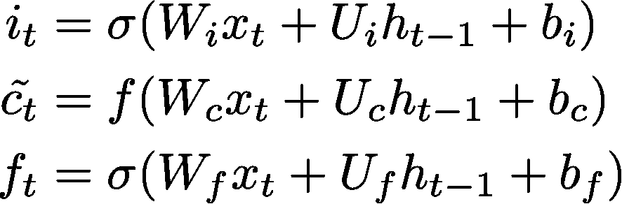*

*遗忘门控制 LSTM 记忆的量，即在时间段 *t-1* 的存储单元状态的值，其中⨂是哈达玛乘积:*

*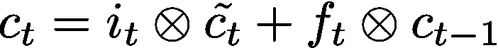*

*利用存储单元的更新状态，我们计算输出门的值，并最终计算输出值本身:*

*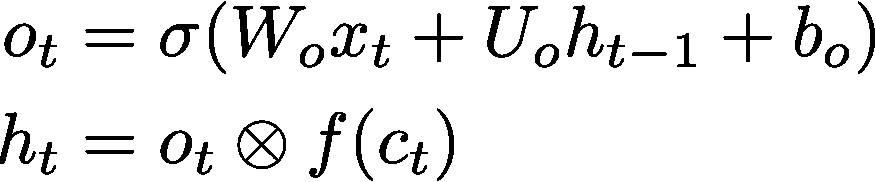*

*我们可以有各种各样的 LSTM 架构，例如卷积 LSTM，注意，我们用卷积运算符*替换输入门、存储单元状态的初始估计、遗忘门和输出门中的矩阵乘法运算符:*

*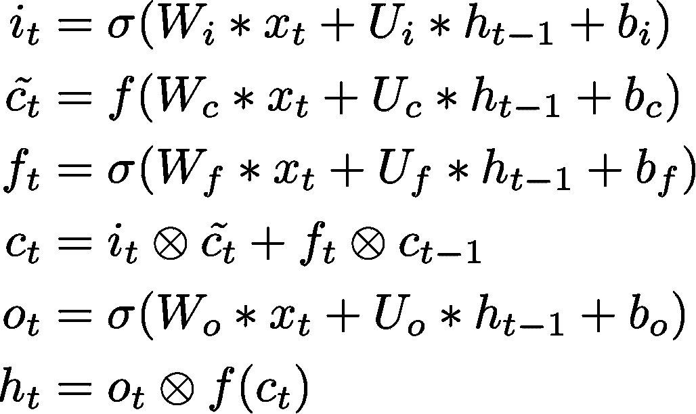*

*另一个流行的变体是窥视孔 LSTM，其中允许门窥视存储单元的状态:*

*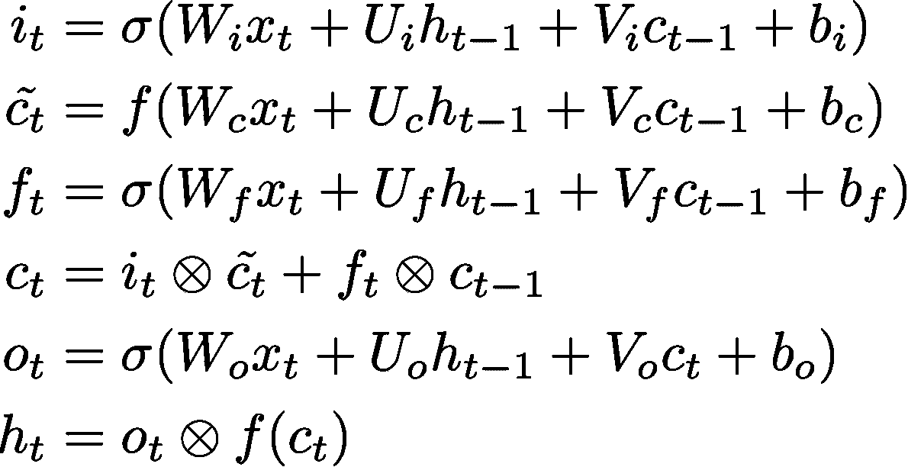*

*序列到序列自动编码器的目标是使用 LSTM 作为编码器来创建原始数据的表示。这种表示将是从原始数据向量序列中学习的向量序列。表示的最后一个向量是我们的编码表示，也称为上下文向量。该上下文向量被重复与序列长度一样多的次数，使得它可以被用作解码器的输入，该解码器又是另一个 LSTM。解码器 LSTM 将使用该上下文向量来重建原始数据向量序列。如果上下文向量在重建任务中有用，那么它可以进一步用于其他任务，如预测违约风险，如我们的示例中所给出的。*

# *结果*

> *使用序列对序列自动编码器的 MNIST 分类任务的准确度分数: **97.600000%** 。*

# *MNIST:可变自动编码器*

*我们现在通过使用变分推理来训练自动编码器，从而将贝叶斯推理与深度学习相结合。这使我们转向了生成模型，它可以在半监督学习中有进一步的用例。使用贝叶斯推理进行训练的另一个好处是，我们可以对更高能力的深度学习者更加鲁棒。*

**

*   *假设 *X* 是我们的原始数据，而 *Z* 是我们学习过的表示。*
*   *我们对学习到的表征有一个先验的信念:*

*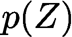*

*   *我们学习到的表征的后验分布是:*

*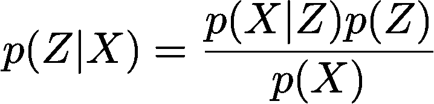*

*   *边际可能性 *p(X)* 通常是难以处理的，导致后验分布 *p(Z|X)* 难以处理:*

*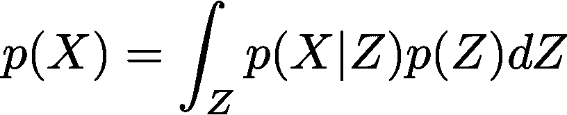*

*   *因此，我们需要一个近似的后验分布，通过变分推理，可以处理棘手的问题。这另外还提供了处理大规模数据集的好处，因为通常马尔可夫链蒙特卡罗(MCMC)方法不太适合大规模数据集。人们也可以考虑拉普拉斯近似来近似后验分布，但是我们将坚持变分推理，因为与拉普拉斯近似相比，它允许更丰富的近似集。拉普拉斯近似简单地等同于找到增强似然优化的最大后验(MAP)估计，在 MAP 估计处取 Hessian 逆的负值以估计方差-协方差矩阵，并且最后使用具有多变量高斯分布或一些其他适当的多变量分布的方差-协方差矩阵。*
*   *假设我们的近似后验分布，也是我们的概率编码器，给出如下:*

*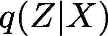*

*   *我们的概率解码器由下式给出:*

*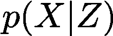*

*   *给定以上关于编码器和解码器的设置，现在让我们写下优化问题:*

*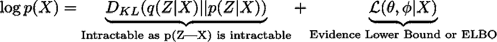*

*   *请注意，KL 背离是非负的，因此这使得 ELBO 成为边际可能性的下限:*

*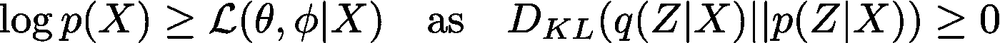*

*   *因此，我们可以改变优化问题，只关注 ELBO:*

*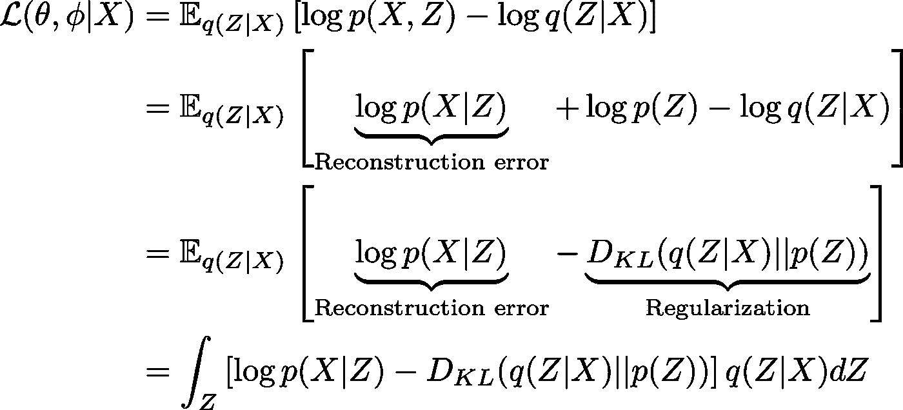*

*   *上述积分问题可以通过蒙特卡罗积分来解决，因为正则化项不是难以处理的。假设概率编码器是具有对角方差-协方差矩阵的多元高斯，我们使用重新参数化技巧从该分布中采样，比如说 *M* 次，以便计算 ELBO 优化问题中的期望项。这种特殊情况下的重新参数化技巧相当于从标准高斯分布中采样 *M* 次，将样本乘以𝞼并将 **μ** 加到样本上。*
*   ***μ** 是我们用于原始数据重建的学习表示。如果学习到的表征是有用的，那么它也可以用于其他任务。*
*   *这是一种将贝叶斯推理与深度学习相结合的强大方式。以这种方式使用的变分推理可以应用于各种深度学习架构，并且与生成对抗网络(GAN)有进一步的联系。我们在另一篇论文中探讨了对抗性学习在表征学习中的应用。*

# *结果*

> *使用可变自动编码器的 MNIST 分类任务的准确度分数: **96.520000%** 。*

# *MNIST:二维卷积自动编码器*

*对于 2 维卷积滤波器，其思想与 1 维卷积滤波器相似。我们将坚持我们前面提到的银行例子来说明这一点。*

*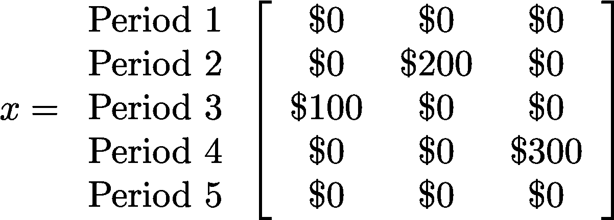*

*在原始交易数据的二维张量中，现在我们有 5 个历史时间段，即行，和 3 个不同的交易类型，即列。我们将使用大小为 2 乘 3 的核从原始数据中提取有用的特征。选择这样一个内核意味着我们有兴趣找到一个跨越所有 3 种事务类型和 2 个历史时间段的特性图。我们将使用步长 1 和有效的卷积来提取原始数据的不同片上的特征。下面将说明这一点。*

*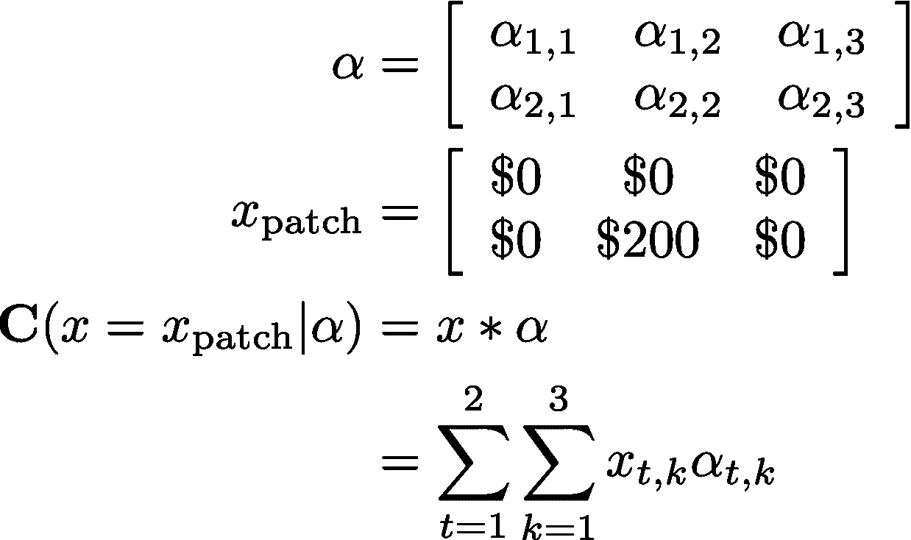*

*这些原理和思想适用于 2 维卷积滤波器，因为它们适用于 1 维卷积滤波器，这里我们不再重复。*

**

# *结果*

> *使用二维卷积自动编码器的 MNIST 分类任务的准确度分数: **98.860000%** 。*

# *保险:没有自动编码器*

*我们现在开始运行保险模型，没有任何手工制作或基于深度学习的特征工程:只有原始数据。*

# *结果*

> *没有自动编码器的保险分类任务的 AUROC 分数: **92.206261%** 。*

# *保险:PCA*

*我们现在继续运行保险模型，没有任何手工或基于深度学习的特征工程，但是使用 PCA 过滤器来挑选解释 99%变化的组件数量。*

# *结果*

> *使用 PCA 的保险分类任务的 AUROC 分数: **91.128859%** 。*

# *保险:手工制作的功能*

*在这种情况下，我们创建了一些手工制作的特征，我们认为这些特征为保险模型的原始数据提供了有用的表示。*

# *结果*

> *具有手工特征的保险分类任务的 AUROC 分数: **93.610635%** 。*

# *保险:手工制作的功能和 PCA*

*我们使用前面提到的手工制作的特征和 PCA 过滤器，该过滤器挑选解释 99%的变化的组件的数量。*

# *结果*

> *具有手工特征和 PCA 的保险分类任务的 AUROC 分数: **93.160377%** 。*

# *保险:普通自动编码器*

*在这种情况下，我们使用普通的自动编码器来学习原始数据的良好表示，以便我们可以根据 AUROC 获得监督学习任务的提升。*

*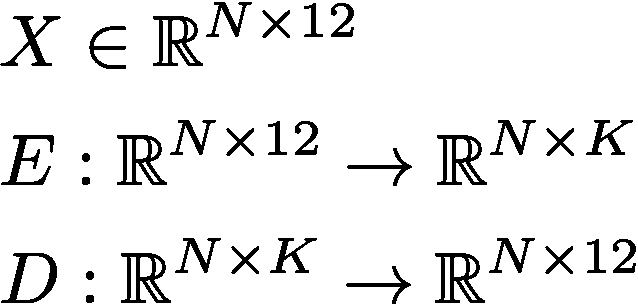*

# *结果*

> *使用自动编码器的保险分类任务的 AUROC 分数: **93.932247%** 。*

# *保险:去噪自动编码器*

*在这种情况下，我们使用去噪自动编码器来学习原始数据的良好表示，从而我们可以根据 AUROC 获得监督学习任务的提升。*

**

# *结果*

> *使用去噪自动编码器的保险分类任务的 AUROC 分数: **93.712479%** 。*

# *保险:序列到序列自动编码器*

*在这种情况下，我们使用序列对自动编码器进行排序，考虑原始交易数据的时间序列性质，即序列性质，以学习原始数据的良好表示，从而我们可以获得监督学习任务在 AUROC 方面的提升。*

*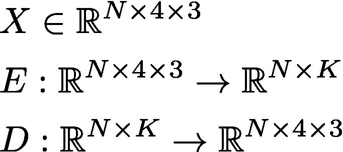*

# *结果*

> *使用序列对序列自动编码器的保险分类任务的 AUROC 分数: **91.418310%** 。*

# *保险:一维卷积自动编码器*

*在这种情况下，我们使用 1 维卷积自动编码器来学习原始数据的良好表示，以便我们可以获得 AUROC 方面的提升，用于监督学习任务。*

**

# *结果*

> *使用一维卷积自动编码器的保险分类任务的 AUROC 分数: **91.509434%** 。*

# *保险:二维卷积自动编码器*

*在这种情况下，我们使用二维卷积自动编码器来学习原始数据的良好表示，以便我们可以获得 AUROC 方面的提升，用于监督学习任务。*

**

# *结果*

> *使用二维卷积自动编码器的保险分类任务的 AUROC 分数: **92.645798%** 。*

# *保险:可变自动编码器*

*在这种情况下，我们使用变分自动编码器来学习原始数据的良好表示，以便我们可以根据 AUROC 获得监督学习任务的提升。*

**

# *结果*

> *使用可变自动编码器的保险分类任务的 AUROC 分数: **90.871569%** 。*

# *MNIST 结果:准确性得分*

*正如所料，这里达到的最好成绩是由一个二维卷积自动编码器。*

*没有自动编码器: **92.000000%** 。*

*主成分分析: **91.430000%** 。*

*自动编码器: **96.940000%** 。*

*去噪自动编码器: **96.930000%** 。*

*1 维卷积自动编码器: **97.570000%** 。*

*序列间自动编码器: **97.600000%** 。*

*变分自动编码器: **96.520000%** 。*

*2 维卷积自动编码器: ***98.860000%*** 。*

# *保险结果:AUROC 分数*

*在这项任务上取得的最好成绩是由一个普通的自动编码器。这突出了通过深度学习实现特征工程的自动化:我相信伊恩·古德费勒说过，学习的表示比手工制作的表示更好。*

*请注意，序列到序列和卷积自动编码器在这项任务中表现不佳，仅仅是因为我生成合成事务数据的方式:如果数据来自更适合序列到序列或卷积自动编码器的过程，这些架构很可能会表现得更好。*

*不带自动编码器: **92.206261%** 。*

*主成分分析: **91.128859%** 。*

*手工特色: **93.610635%** 。*

*手工特征和主成分分析: **93.160377%** 。*

*自动编码器: ***93.932247%*** 。*

*去噪自动编码器: **93.712479%** 。*

*序列到序列自动编码器: **91.418310%** 。*

*1 维卷积自动编码器: **91.509434%** 。*

*2 维卷积自动编码器: **92.645798%** 。*

*变分自动编码器: **90.871569%** 。*

# *GitHub 上的代码*

*我为本文写的代码可以在我的 GitHub 上找到:https://github.com/hamaadshah/autoencoders_keras*

# *结论*

*我们已经展示了如何使用深度学习和贝叶斯推理来学习原始数据的良好表示，即，每个分析单位的 1 或 2 维张量，其然后可能被用于计算机视觉和保险领域中的监督学习任务。这使我们从手工制作的特征工程转向自动特征工程，即表示学习。这确实引入了架构工程，然而，也可以通过使用遗传算法或强化学习来实现自动化——这可能是另一篇论文的主题。*

*最后，我想强调的是，用于解决计算机视觉任务的代码也用于解决保险任务。在这两项任务中，通过深度学习的自动特征工程具有最佳性能，尽管事实上我们并没有明确地寻找艺术架构的最佳状态。这为我们提供了一种端到端自动化机器学习任务的强大方法。*

# *参考*

1.  *古德费勒，我，本吉奥，y 和库维尔(2016)。深度学习(麻省理工出版社)。*
2.  *Geron，A. (2017)。使用 Scikit-Learn & tensor flow(O ' Reilly)进行机器学习实践。*
3.  *金玛博士和韦林博士(2014 年)。自动编码变分贝叶斯([https://arxiv.org/abs/1312.6114](https://arxiv.org/abs/1312.6114))。*
4.  *Hosseini，s .，Lee，S. H .和 Cho，N. I. (2018 年)。为增强卷积神经网络的性能输入手工制作的特征(【https://arxiv.org/abs/1801.07848】T2)。*
5.  *【http://scikit-learn.org/stable/# *
6.  *[https://towards data science . com/learning-rate-schedules-and-adaptive-learning-rate-methods-for-deep-learning-2c8f 433990 D1](/learning-rate-schedules-and-adaptive-learning-rate-methods-for-deep-learning-2c8f433990d1)*
7.  *[https://stack overflow . com/questions/42177658/how-to-switch-back end-with-keras-from-tensor flow-to-the ano](https://stackoverflow.com/questions/42177658/how-to-switch-backend-with-keras-from-tensorflow-to-theano)*
8.  *[https://blog.keras.io/building-autoencoders-in-keras.html](https://blog.keras.io/building-autoencoders-in-keras.html)*
9.  *[https://keras.io](https://keras.io)*
10.  *[https://www . cs . Cornell . edu/courses/cs 1114/2013 sp/sections/S06 _ convolution . pdf](https://www.cs.cornell.edu/courses/cs1114/2013sp/sections/S06_convolution.pdf)*
11.  *[http://deeplearning.net/tutorial/lstm.html](http://deeplearning.net/tutorial/lstm.html)*