# 使用生成对抗网络的自动特征工程

> 原文：<https://towardsdatascience.com/automatic-feature-engineering-using-generative-adversarial-networks-8e24b3c16bf3?source=collection_archive---------4----------------------->

## 计算机视觉和综合金融交易数据的应用

深度学习的目的是使用一系列可微分函数(即几何变换)来学习高维度和噪声数据的表示，这或许可以用于监督学习任务以及其他任务。它在判别模型中取得了巨大的成功，而生成模型可能由于显式最大似然估计(MLE)的局限性而表现不佳。生成对抗网络(GAN)中提出的对抗学习旨在通过使用隐式最大似然法来克服这些问题。

我们将使用 MNIST 计算机视觉数据集和一个合成的金融交易数据集来完成这些使用 GANs 的实验的保险任务。与显式 MLE 相比，GANs 是一种非常不同的学习方法。我们的目的是展示 GAN 学习的表示可以用于监督学习任务，如图像识别和保险损失风险预测。以这种方式，我们通过自动学习一组特征，即表示学习，来避免手工特征工程的手动过程。

这篇文章可以看作是这篇文章的后续:[https://goo.gl/TjB2v3](https://goo.gl/TjB2v3)

# 生成对抗网络

GAN 有两个主要组件，生成器和鉴别器，它们相互竞争。这样，发生器学习如何从噪声中创建真实的合成样本，即潜在空间 *z* ，而鉴别器学习如何区分真实样本和合成样本。

由鉴别器学习的表示可以用于其他监督学习任务，即自动特征工程或表示学习。这也可以从迁移学习的角度来看。GAN 还可以用于半监督学习，我们将在另一篇论文中讨论这一点，我们将研究为此目的使用变分自动编码器、梯形网络和敌对自动编码器。

# 计算机视觉

为此，我们将使用 MNIST 数据集，其中原始数据是每个图像的像素强度的二维张量。图像是我们的分析单位:我们将预测每个图像的每个类别的概率。这是一个多类分类任务，我们将使用准确度分数来评估模型在测试折叠中的性能。

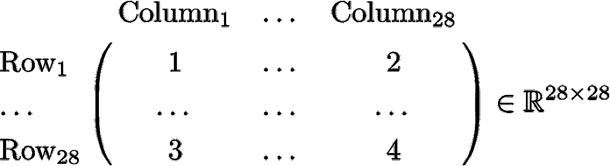

2 dimensional tensor of pixel intensities per image.

计算机视觉任务的手工特征工程的一些例子可能使用 Gabor 滤波器。

# 保险

我们将使用合成数据集，其中原始数据是每个保单期组合的历史保单级别信息的二维张量:每个单位将是一个 4x 3 维张量，即 4 个历史时间段和 3 种交易类型。保单-期间组合是我们的分析单位:我们将预测未来期间 5 的损失概率—将此视为保单的潜在续保，我们需要预测它是否会为我们带来损失，从而影响我们是否决定续保和/或调整续保保费以考虑额外风险。这是一个二元类分类任务，我们将使用 AUROC 分数来评估模型性能。

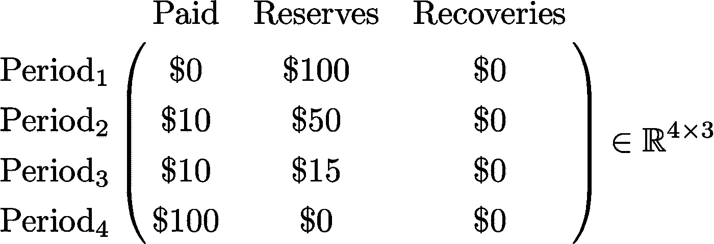

2 dimensional tensor of transaction values per policy-period combination.

保险任务的手工特征工程的一些例子可能使用列或行平均值。

合成保险金融交易数据集是用 r 编写的，其余的工作都是用 Python 完成的。

请注意计算机视觉任务的原始数据和保险任务的原始数据之间的相似之处。我们的主要目标是通过 GANs 使用自动特征工程来学习这种原始数据的良好表示。

# Scikit-learn、Keras 和 TensorFlow

我们将使用 Python 机器学习库 scikit-learn 进行数据转换和分类任务。我们将把 gan 编码为 scikit-learn 转换器，这样它们就可以很容易地被 scikit-learn 管道使用。gan 将使用 Keras 和 TensorFlow 后端进行编码。我们还在 MacBook Pro 上使用了外部 GPU，即 GTX 1070。

# 发电机

假设我们有一个关于潜在空间 *z* 在哪里的先验信念: *p(z)* 。给定一个来自这个潜在空间的抽取，生成器 *G* ，一个深度学习器，输出一个合成样本。

# 鉴别器

鉴别器 *D* 是另一个深度学习器，其目的是分类样本是真实的还是合成的，即样本是否来自真实数据分布，

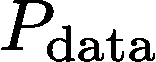

或合成数据分布。

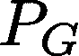

让我们将鉴别器 *D* 表示如下。

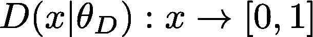

这里我们假设正例来自真实数据分布，而反例来自合成数据分布。

# 游戏:最优化

GAN 同时训练鉴别器以正确分类真实和合成示例，同时训练生成器以创建合成示例，使得鉴别器不正确地分类真实和合成示例。这个 2 人迷你最大游戏有以下目标函数。

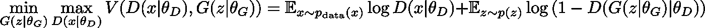

请注意，上面的表达式基本上是判别器的目标函数。

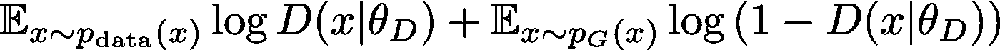

从游戏的设置中可以清楚地看到，我们试图为 *D* 获得一个解，使其最大化 *V(D，G)* ，同时我们试图为 *G* 获得一个解，使其最小化 *V(D，G)* 。

我们不会同时训练 D 和 T2 G。我们交替训练它们:先训练 *D* ，然后在冷冻 *D* 的同时训练 *G* 。我们重复这一固定数量的步骤。

如果从发生器 *G* 获取的合成样本是真实的，那么我们已经隐含地了解了合成数据分布。换句话说，合成数据分布可以被视为真实数据分布的良好估计。最佳解决方案如下。

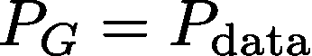

为了说明这一点，让我们找出给定生成器 *G* 和样本 *x* 的最佳鉴别器。

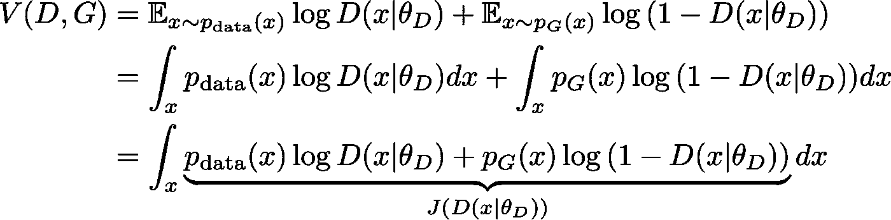

让我们仔细看看样本 *x* 的鉴别器目标函数。

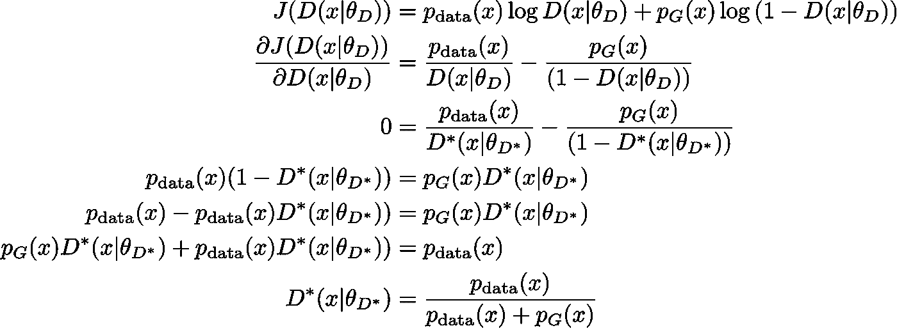

我们已经找到了给定一个生成器的最佳鉴别器。现在让我们关注生成器的目标函数，它本质上是最小化鉴别器的目标函数。

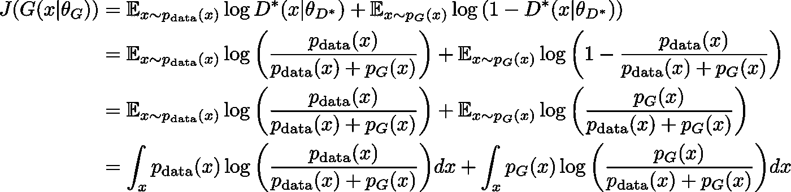

我们将注意到生成器的上述目标函数中的 kull back-lei bler(KL)发散。

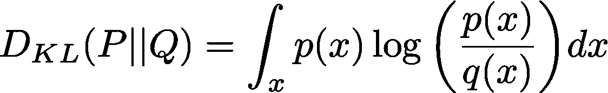

回想一下λ发散的定义。

如果λ取值为 0.5，这就称为詹森-香农(JS)散度。这种发散是对称的和非负的。

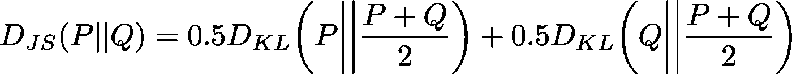

记住这一点，让我们再来看看生成器的目标函数。

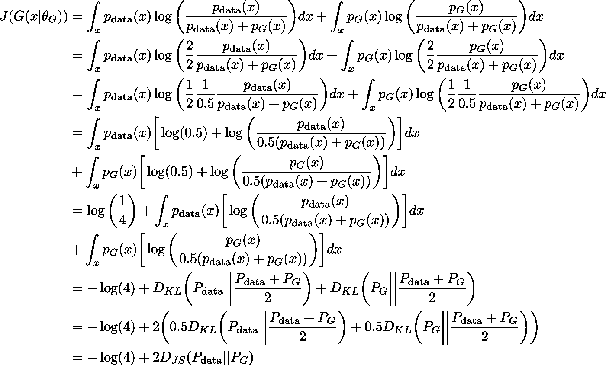

从上述生成器的目标函数中可以清楚地看到，获得的全局最小值是 *-* log *(4)* ，这在以下条件成立时发生。

当上述成立时，真实数据分布和合成数据分布之间的詹森-香农散度将为零。因此我们证明了最优解如下。

# 游戏:融合

假设允许鉴别器在给定发电机的情况下达到其最佳值，则

可以证明收敛到

考虑下面的目标函数，该函数之前已经被证明是关于

因为我们发现全局最小值 at -log(4)。

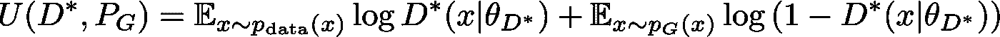

给定最佳鉴别器，生成器使用梯度下降向全局最小值移动。我们将证明给定一个最佳鉴别器，即，

使得以下各项的会聚

到

有保证。

注意，下面是凸函数集合的上确界，其中集合由鉴别器索引:

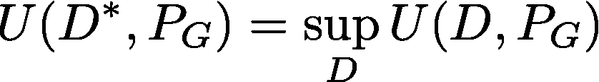

记住上确界是最小上界。

让我们回忆一下关于梯度和次梯度的一些定义。一个向量

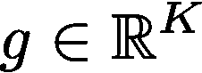

是函数的次梯度

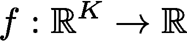

一点处

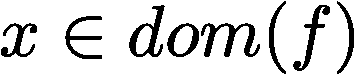

如果

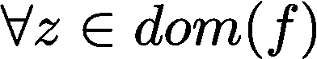

以下关系成立:

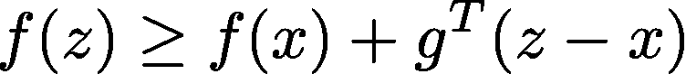

如果 *f* 是凸可微的，那么它在点 *x* 的梯度也是次梯度。最重要的是，即使 *f* 不可微，次梯度也可以存在。

一组凸函数的上确界的次梯度包括函数在达到上确界的点处的次梯度。如前所述，我们已经表明

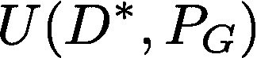

是凸的。

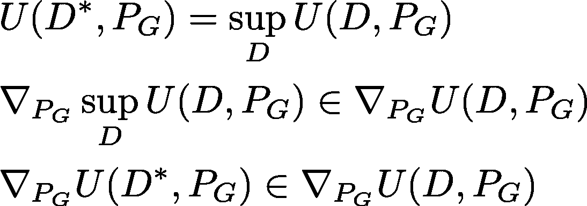

发生器的梯度

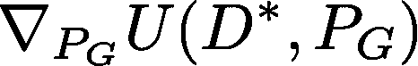

用于对生成器的目标函数进行增量改进

给定一个最优鉴别器 *D** 。因此，趋同

到

有保证。

# 结果

在这些实验中，我们展示了生成器为 MNIST 数据集和保险数据集创建真实合成示例的能力。我们使用二维潜在流形。

最后，我们表明，使用由鉴别器学习的表示，我们可以获得与使用用于 MNIST 数据集和保险数据集的其他表示学习方法相竞争的结果，例如本文中所示的各种各样的自动编码器:【https://goo.gl/TjB2v3】T2

# 生成新数据

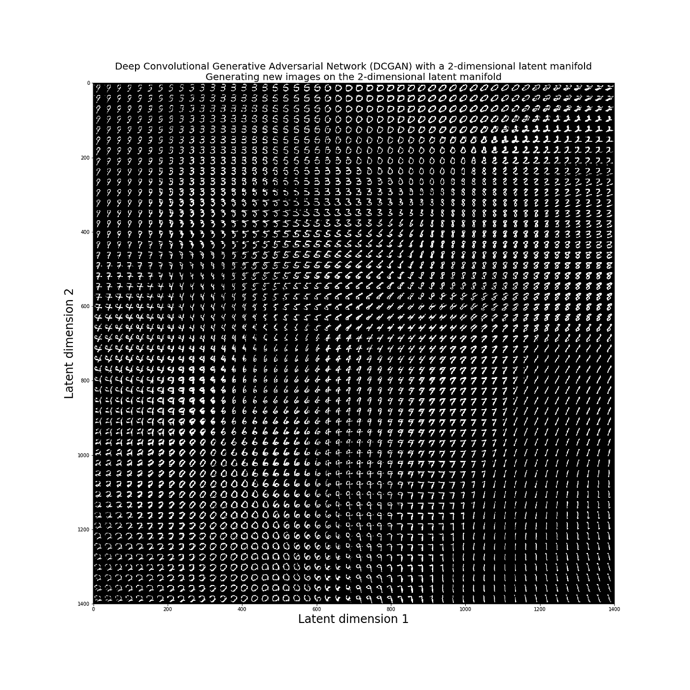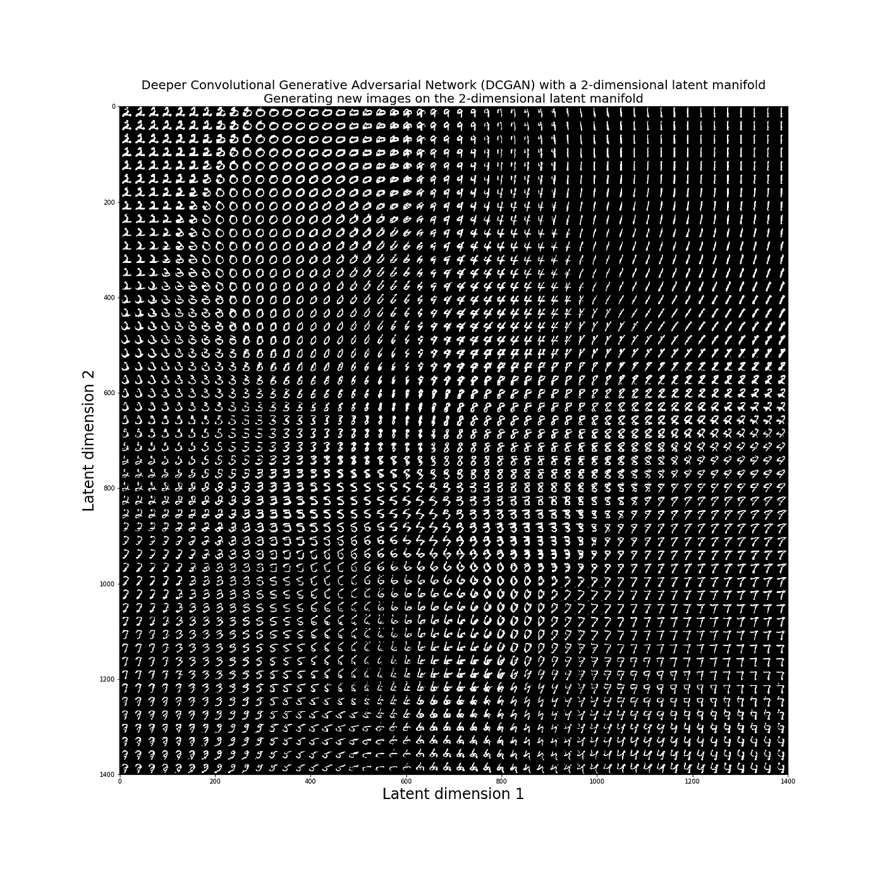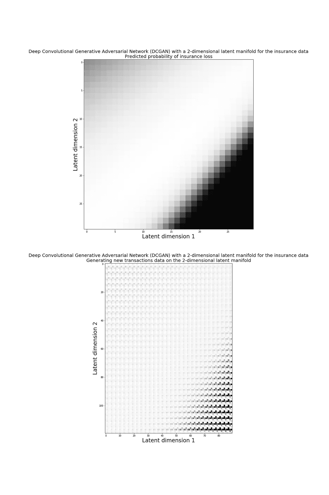

有了图像数据，我们或许可以定性地判断生成的数据是否有意义。对于金融交易数据，这是不可能的。然而，让我们来看一个生成的事务网格的例子。请注意，所有金融交易数据都已转换为介于 0 和 1 之间的值。

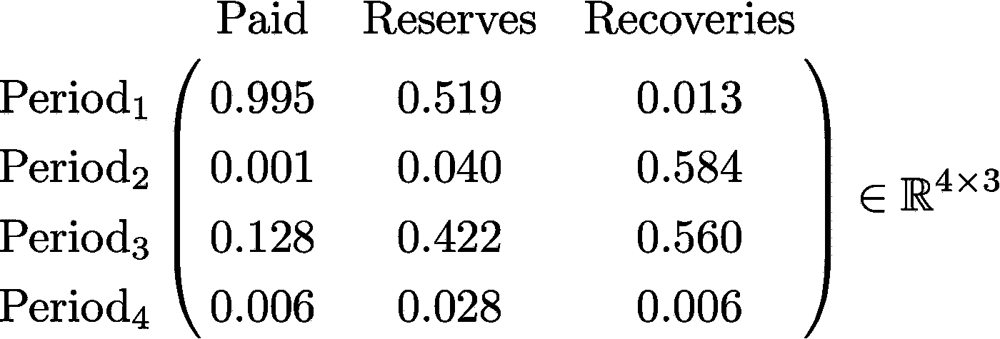

如果我们使用应用于图像数据的相同 matplotlib 代码来绘制上面生成的事务网格，我们将得到下面的图像。我们可以看到，对于一个事务，我们有可能的最大值，即 1，它被着色为黑色，而对于一个事务，我们有可能的最小值，即 0，它被着色为白色。介于两者之间的交易值带有一些灰色。

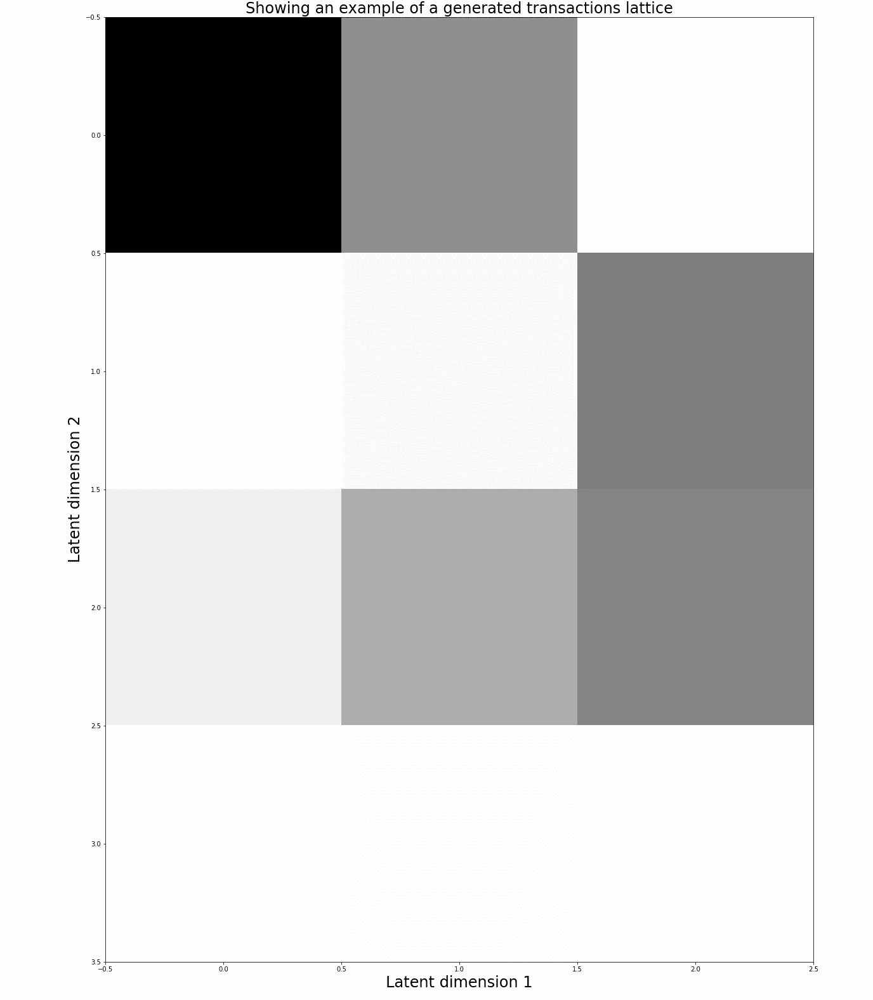

最后，让我们比较实际和生成的事务网格的分布，看看生成的值是否与实际值相似。这是一个简单的健全性检查，看起来分布是相当相似的。

另一种方法可能是检查由鉴别器学习的特征对于监督学习任务是否有用。在我们的保险数据示例中似乎就是这种情况，特别是如果我们在这里将它们的性能与自动编码器的性能进行比较:【https://goo.gl/TjB2v3

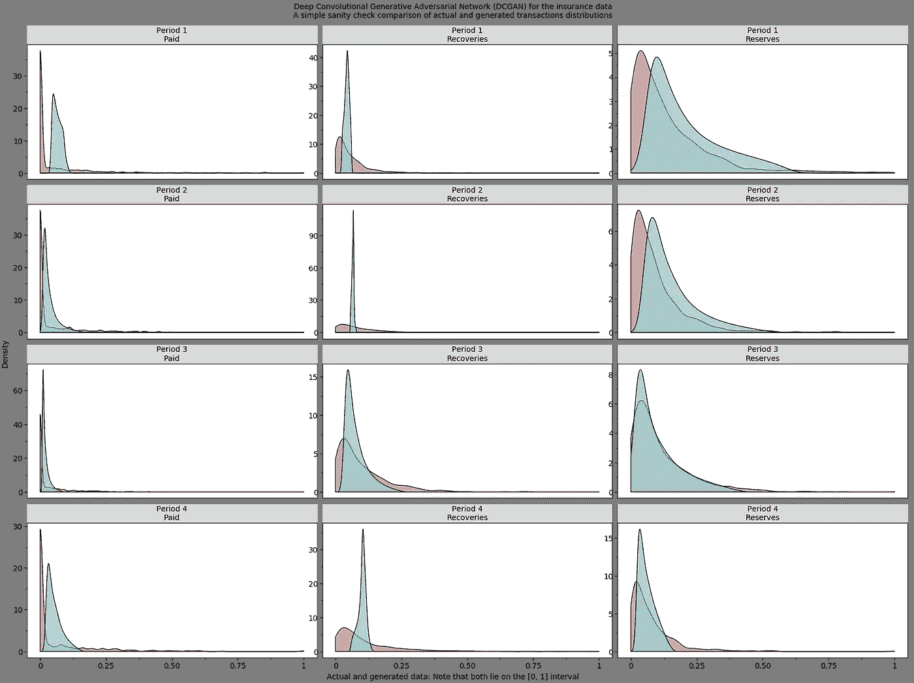

# 用于表征学习的 GAN

> 使用 DCGAN 的 MNIST 分类任务的准确度分数: **98.350000%** 。
> 
> 具有更深 CGAN 的 MNIST 分类任务的准确度分数: **99.090000%** 。
> 
> 使用 DCGAN 的保险分类任务的 AUROC 分数: **92.795883%** 。

将这些结果与使用自动编码器对相同的计算机视觉和保险任务进行表征学习进行比较:[https://goo.gl/TjB2v3](https://goo.gl/TjB2v3)

# GitHub 上的代码

我为本文写的代码可以在我的 GitHub 上找到:[https://github.com/hamaadshah/gan_keras](https://github.com/hamaadshah/gan_keras)

# 结论

我们已经展示了如何使用 GANs 来学习原始数据的良好表示，即，每个分析单位的二维张量，然后可以用于计算机视觉和保险领域中的监督学习任务。这使我们从手工制作的特征工程转向自动特征工程，即表示学习。GANs 也许也可以用于半监督学习，这将是另一篇论文的主题。

# 参考

1.  古德费勒，我，本吉奥，y 和库维尔(2016)。深度学习(麻省理工出版社)。
2.  Geron，A. (2017)。使用 Scikit-Learn & tensor flow(O ' Reilly)进行机器学习实践。
3.  拉德福德、卢克和钦塔拉(2015 年)。深度卷积生成对抗网络的无监督表示学习([https://arxiv.org/abs/1511.06434](https://arxiv.org/abs/1511.06434))。
4.  Goodfellow，I .、Pouget-Abadie，j .、Mirza，m .、Xu，b .、Warde-Farley，d .、Ozair，s .、a .、Bengio，Y. (2014 年)。生成敌对网络(【https://arxiv.org/abs/1406.2661】T2)。
5.  【http://scikit-learn.org/stable/# 
6.  [https://towards data science . com/learning-rate-schedules-and-adaptive-learning-rate-methods-for-deep-learning-2c8f 433990 D1](/learning-rate-schedules-and-adaptive-learning-rate-methods-for-deep-learning-2c8f433990d1)
7.  [https://stack overflow . com/questions/42177658/how-to-switch-back end-with-keras-from-tensor flow-to-the ano](https://stackoverflow.com/questions/42177658/how-to-switch-backend-with-keras-from-tensorflow-to-theano)
8.  [https://blog.keras.io/building-autoencoders-in-keras.html](https://blog.keras.io/building-autoencoders-in-keras.html)
9.  [https://keras.io](https://keras.io)
10.  [https://github . com/fchollet/keras/blob/master/examples/mnist _ acgan . py # L24](https://github.com/fchollet/keras/blob/master/examples/mnist_acgan.py#L24)
11.  [https://en.wikipedia.org/wiki/Kullback](https://en.wikipedia.org/wiki/Kullback)–莱布勒 _ 发散
12.  [https://goo.gl/TjB2v3](https://goo.gl/TjB2v3)
13.  [https://see . Stanford . edu/materials/lso coee 364 b/01-sub gradients _ notes . pdf](https://see.stanford.edu/materials/lsocoee364b/01-subgradients_notes.pdf)