# 自动图形处理器

> 原文：<https://towardsdatascience.com/automatic-gpus-46aa08f01886?source=collection_archive---------9----------------------->

## 使用 Tensorflow 中的 GPU 在 GCloud 上快速启动和运行的可再现 R / Python 方法


“A high view of a sea of clouds covering a mountain valley in the Dolomites” by [paul morris](https://unsplash.com/@oldskool2016?utm_source=medium&utm_medium=referral) on [Unsplash](https://unsplash.com?utm_source=medium&utm_medium=referral)

## 背景

最近在 *Coursera* 上完成了谷歌优秀的 [*数据工程认证专业*](https://www.coursera.org/specializations/gcp-data-machine-learning)(*我强烈推荐)，我认为在一个单一的 GCE 虚拟上获得自己的*谷歌计算引擎(" GCE "或*[*# g cloud*](https://twitter.com/hashtag/gcloud?lang=en)*)*实例既实用又有用——在 *Tensorflow 中使用 GPU，*使用 *R 和 Python* 像许多其他数据科学家一样，我经常使用两种语言，并且喜欢与谷歌计算平台(“GCP”)一起工作。希望您喜欢我方法的简单性，并从这次演练中获得一些收获！

## **带 R / Python 的 GPU 和 Tensorflow】**

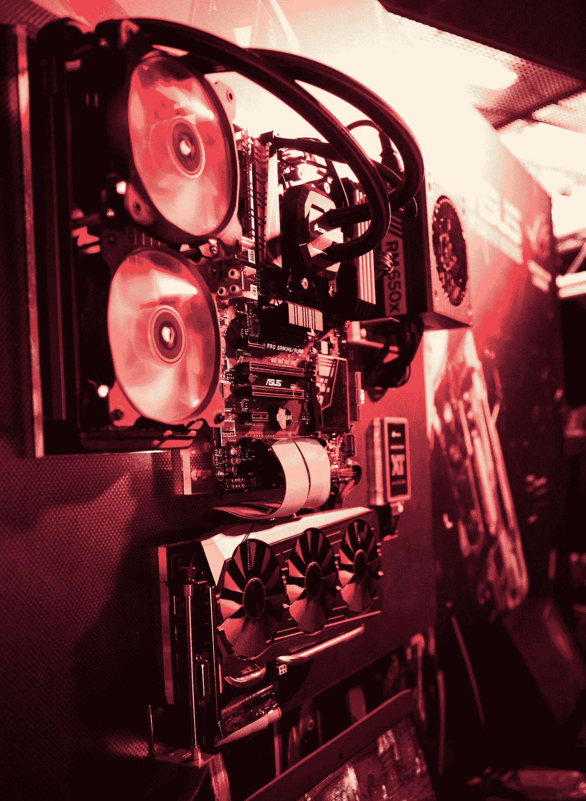

“A computer without the case showing the motherboard, cooling fans, graphics cards, and power supply mounted on a red-lit wall labeled ASUS in a gaming convention” by [Maxime Rossignol](https://unsplash.com/@maxoor?utm_source=medium&utm_medium=referral) on [Unsplash](https://unsplash.com?utm_source=medium&utm_medium=referral)

这些 *GCE 机器*是高度动态的，就像 *AWS 实例*一样，并且与*张量处理单元*(*“TPUs”*是最近在 GCP 测试版上可用的 ASIC 卡)和*图形处理单元(“GPU”*或用于“alt coin”挖掘、游戏和深度学习的“显卡”)一起工作。这篇文章将不包括自动 TPU 安装(也许这将是另一个有用的，当价格下降)。我们将运行一个简单的安装程序 *Tensorflow，*来检查 GPU 是否在工作，在运行一个 bash 脚本后，它首先完成所有繁重的工作。

最初，我尝试了许多与 GCloud 和 GPU 相关的不同演练，最终在 Medium 上找到了两个精彩的帖子，分别是这里的([Durgesh manke kar](https://medium.com/u/3630dfb701f5?source=post_page-----46aa08f01886--------------------------------))和这里的([Luuk Derksen](https://medium.com/u/c85c6404c0f9?source=post_page-----46aa08f01886--------------------------------))。我的自动化脚本的一部分是基于上面的两篇文章，还有这个[有用的要点](https://gist.github.com/mjdietzx/0ff77af5ae60622ce6ed8c4d9b419f45)(作者[迈克尔·迪茨](https://github.com/mjdietzx))以及无数其他来源。然而，其他帖子要么更适合 Jupyter 笔记本设置，要么在 CuDNN 驱动程序之前手动设置 NVIDIA Cuda，并且只测试 Python。坦率地说，考虑到最近的许多变化，我很难从其他演练中获得环境设置。

因此，我决定采取完全自动化的方法，不需要注册英伟达，登录，并下载特定操作系统的特定驱动程序。它假设用户可以用一个 bash 脚本再现下面的输出，给定一个 GCE 虚拟机的设置，该虚拟机具有任何当前可用的 g cloud GPU(NVIDIA:Tesla K80 或 P100)，在 Ubuntu 16.04 上至少 25Gb 的 HD，以及 2 个以上的内核，最少 7.5Gb 的 RAM，我们也将在下面逐步介绍。

## **预期方向**


Photo by [eberhard grossgasteiger](https://unsplash.com/@eberhardgross?utm_source=medium&utm_medium=referral) on [Unsplash](https://unsplash.com?utm_source=medium&utm_medium=referral)

如果使用共享 GPU 正确设置，下面的内容将有望允许多用户 Jupyter 笔记本配置，我希望继续关注另一个博客，该博客将使用 *RStudio 服务器(易于在 GCloud 中设置密码登录)*或 *JupyterLab(不那么容易)*。此外，它使用 Anaconda 安装两个 R / Python，在同一个 [*conda 环境*](https://conda.io/docs/user-guide/tasks/manage-environments.html) ，应该支持多用户共享 GPU。

## **我们来看一下设置**

我们将保持这一部分非常简单，没有太多的截屏(‘咳！嗯嗯……’)。谷歌赠送了为期 12 个月的 300 美元信用(T7)，让你开始在 GCP 工作。您将使用该配额为特定区域申请 GPU 配额，并在配额被允许后申请配额。

您首先需要创建一个项目；在这里，我从照片中突出显示的链接创建了`ML-Test`。使用`+`符号建立一个项目。您将在突出显示的左上方下拉列表中看到项目。

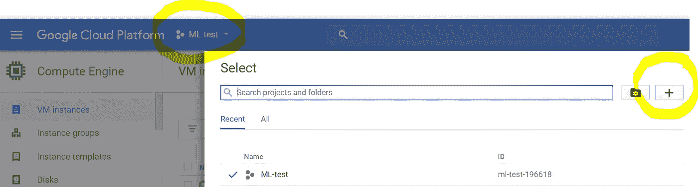

在您设置好项目之后，您会立即想要为 GPU 申请一个配额。事实上，谷歌很可能会要求你提供第二个参考项目，所以你只需建立另一个名为`Project-Placeholder`的项目，当谷歌发邮件给你时，你就可以用它来参考。

收到一封电子邮件大约需要 24 小时，您可以通过下拉左上方的“汉堡菜单”来参考`Project-Placeholder`的可用点数，以结算剩余的> >金额(对您来说大约是 300.00 美元)。顺便说一句，帮我设置的谷歌人员非常友好。礼貌地说，如果有人从谷歌上看到这个，我认为这一步可以自动化。

要访问配额页面，您需要首先进入`ML-Test`项目，然后下拉至 IAM > >配额，并编辑您的 GCE 以请求 GCE 的配额更新。

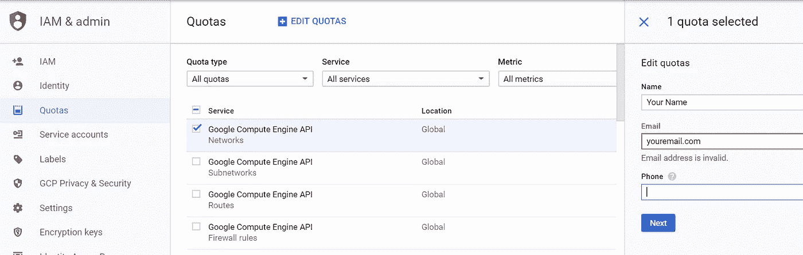

在您的用户信息(即，姓名、电子邮件和电话[确保使用您的帐户电子邮件[[我有过惨痛的教训]]])通过验证后，您将单击下一步(如上所示)。现在键入类似下面的内容。

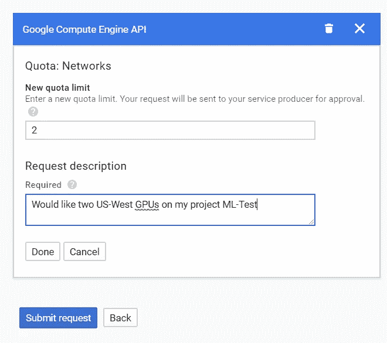

提交。然后等待。谷歌友好的员工会在 24-48 小时内给你发邮件，希望`ML-Test`能准备好使用 GPU！

**设置您的 GPU 实例**

如果您想在没有 GPU 的情况下快速入门，同时使用 Python 和 R 在 GCE 上使用 Anaconda，您可以查看我最近在 Pepperdine 的一次演讲中创建的这些[笔记。然而，如果您只对 GPU 感兴趣，并且您的配额得到批准，那么是时候启动 VM 了。](https://gist.github.com/ZeccaLehn/de42e70660e54f34628249fae7d26ce5#file-condarandpython-txt)

登录`ML-Test`后，点击汉堡栏计算> >计算引擎> >虚拟机实例。在那里，我们将单击“Create”。


现在创建实例…

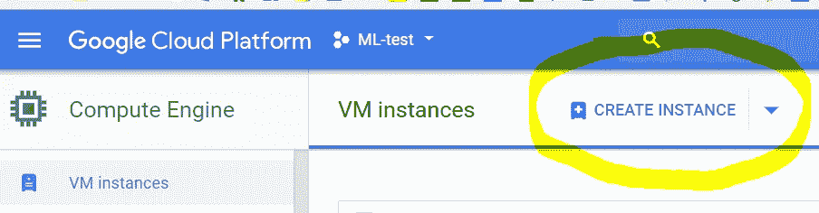

在转到磁盘空间和操作系统之前，您需要配置前几个步骤来满足我们的最低要求。您将把虚拟机命名为`gpu-vm`，并匹配下面突出显示的最小设置。请注意，您的配额可能包括`us-west1-b`，但也可能包括特定 GPU 类型的其他区域。如果您使用一个不支持您的配额的区域，机器将会出错—这让我暂停了一段时间。

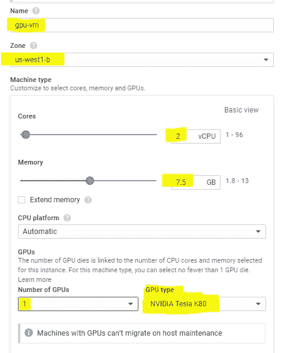

最后，在发布之前，为了进行复制，您需要通过点击“更改”来安装`Ubuntu16.04`和一个最低 25Gb 的硬盘(注意:您可以降低硬盘容量以避免存储费用，但发现这可能会改变 conda 环境中安装 R 时的环境最大存储容量)。

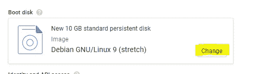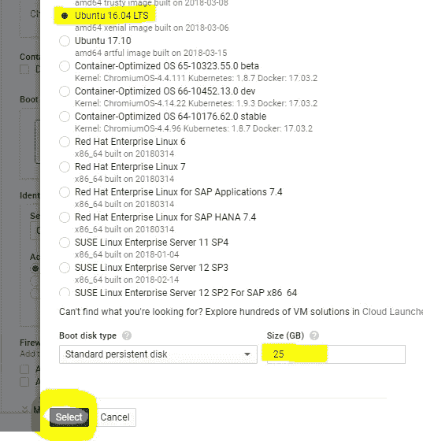

选择操作系统和存储设备后，您将使用`Create`按钮启动虚拟机。可选地，一旦您测试了这个模拟安装，您可能想要考虑这个虚拟机上的`Pre-Emptible`选项。这些可以节省高达 75%的每小时费用。然而，根据其他需求，它们可以在使用一个小时后关闭，我还没有在抢先模式下测试过这个安装。我认为在削减成本方面，这类似于 AWS 的保留实例机会。在创建菜单下的“管理、磁盘、网络、SSH 密钥”下，可以看到下面的可优先选项，红色，但是再次声明，现在让它保持“关闭”。

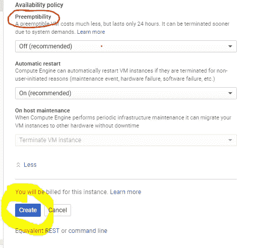

您的机器现在正在启动，一旦准备就绪(30 秒后)，您将看到带有绿色复选标记的`gpu-vm`。

> **注意:您现在正在接受计费，您将始终希望选中标记该机器，并在不使用时单击停止。当绿色的复选标记变成灰色的停止信号时，我通常只是确认机器已经关闭。**

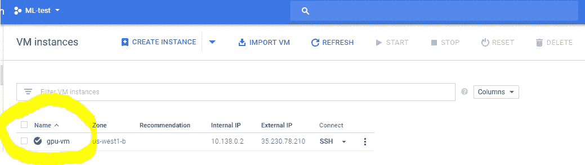

现在您将点击上面的 SSH 按钮。这将启动您到`gpu-vm`的 SSH 连接，并为您的虚拟机打开一个单独的选项卡。您还可以通过点击 SSH 按钮的左箭头来运行您的 SSH shell，并通过如下所示的`View Gcloud Command`进行访问。

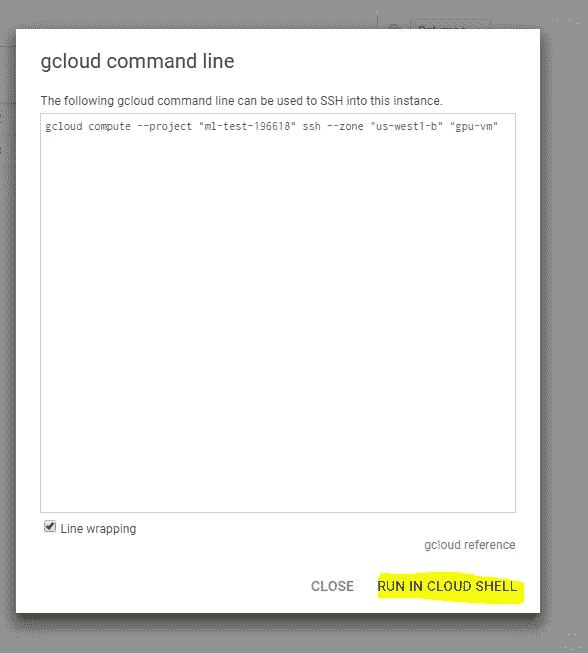

点击`RUN IN CLOUD SHELL`，一个内嵌的云 Shell 将插入上面的命令，点击回车键，你将通过 SSH 进入你的虚拟机。在 Windows 上，这通常更好，因为 SSH 按钮会弹出一个浮动外壳，而在 Mac 上，它会打开一个新标签。

> 注意:在屏幕右上方的“激活谷歌云外壳”按钮下有一个免费的云外壳可供使用。GCloud 的另一个优点是在其环境中完全 SSH 安全，这意味着没有本地防火墙和 Putty。

**让我们用自动脚本安装 GPU**

您应该会看到类似这样的内容，但是在 VM 名称之前有您自己的用户名。

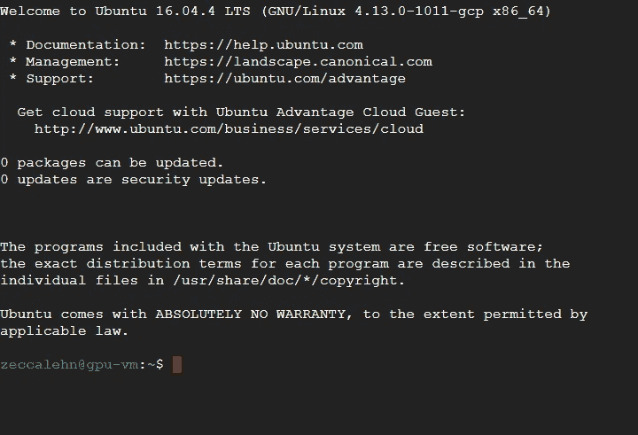

你已经准备好了，可以参加普通教育证书考试了。现在，您需要将下面的完整脚本复制到命令行中。它将执行，因为 NVIDIA 的 Cuda 还没有安装在 if 语句中。如果你对这里的任何一行有任何特殊的问题，不要犹豫，留下评论并提出来。我宁愿不去研究 Cuda——这么说吧，这使得这个过程更容易实现。该脚本已经过全面测试，可以保留路径、文件夹、删除下载的 zip 文件，并管理正确安装的环境，能够关闭该机器，并再次启动它，而不会破坏任何东西！

> 注意:这个 bash 脚本大约需要 10 分钟，并且一举安装 Cuda/cud nn/tensor flow-GPU/Python/R！

```
# Check for CUDA and try to install.
if ! dpkg-query -W cuda; then# Start Timer here
 START=$(date +%s) # Time script# Install Cuda from NVIDIA
 curl -O [http://developer.download.nvidia.com/compute/cuda/repos/ubuntu1604/x86_64/cuda-repo-ubuntu1604_8.0.61-1_amd64.deb](http://developer.download.nvidia.com/compute/cuda/repos/ubuntu1604/x86_64/cuda-repo-ubuntu1604_8.0.61-1_amd64.deb)
 # Login as root
 sudo dpkg -i ./cuda-repo-ubuntu1604_8.0.61-1_amd64.deb
 rm -r cuda-repo-ubuntu1604_8.0.61-1_amd64.deb
 sudo apt-get update
 sudo apt-get -y install cuda-8.0# Install cuDNN v6.0
 CUDNN_TAR_FILE="cudnn-8.0-linux-x64-v6.0.tgz"
 wget [http://developer.download.nvidia.com/compute/redist/cudnn/v6.0/${CUDNN_TAR_FILE](http://developer.download.nvidia.com/compute/redist/cudnn/v6.0/${CUDNN_TAR_FILE)}
 tar -xzvf ${CUDNN_TAR_FILE}
 rm -r cudnn-8.0-linux-x64-v6.0.tgz
 sudo cp -P cuda/include/cudnn.h /usr/local/cuda/include
 sudo cp -P cuda/lib64/libcudnn* /usr/local/cuda/lib64/
 sudo chmod a+r /usr/local/cuda/lib64/libcudnn*# Export Paths
 echo 'export CUDA_HOME=/usr/local/cuda' >> ~/.bashrc
 echo 'export PATH=$PATH:$CUDA_HOME/bin' >> ~/.bashrc
 echo 'export LD_LIBRARY_PATH=$CUDA_HOME/lib64' >> ~/.bashrc
 echo 'export PATH=$PATH:$HOME/anaconda3/bin' >> ~/.bashrc
 source ~/.bashrc# Install Anaconda
 mkdir Downloads
 cd Downloads
 wget "[https://repo.continuum.io/archive/Anaconda3-5.0.1-Linux-x86_64.sh](https://repo.continuum.io/archive/Anaconda3-5.0.1-Linux-x86_64.sh)" -O "Anaconda3-5.0.1-Linux-x86_64.sh"
 chmod +x Anaconda3-5.0.1-Linux-x86_64.sh
 sudo sh "Anaconda3-5.0.1-Linux-x86_64.sh" -b
 cd $HOME
 rm -r Downloads# Create conda environment to work with Python/R
 # conda search python # Current Python packages hosted by Anaconda
 # conda search r  # Current R packages hosted by Anaconda
 mkdir prog_env
 source activate prog_env
 sudo apt-get update
 conda install -c anaconda --prefix=$HOME/prog_env python=3.6 -y
 conda install -c anaconda tensorflow-gpu --prefix=$HOME/prog_env -y
 conda install -c anaconda --prefix=$HOME/prog_env r=3.4 -y
 source deactivate prog_env# Shows Cuda Info
 nvidia-smi# End of timer
 END=$(date +%s)
 DIFF=$(( $END - $START ))
 echo "It took $DIFF seconds"fi
```

等待…如果你看到这个，那么事情看起来很好！

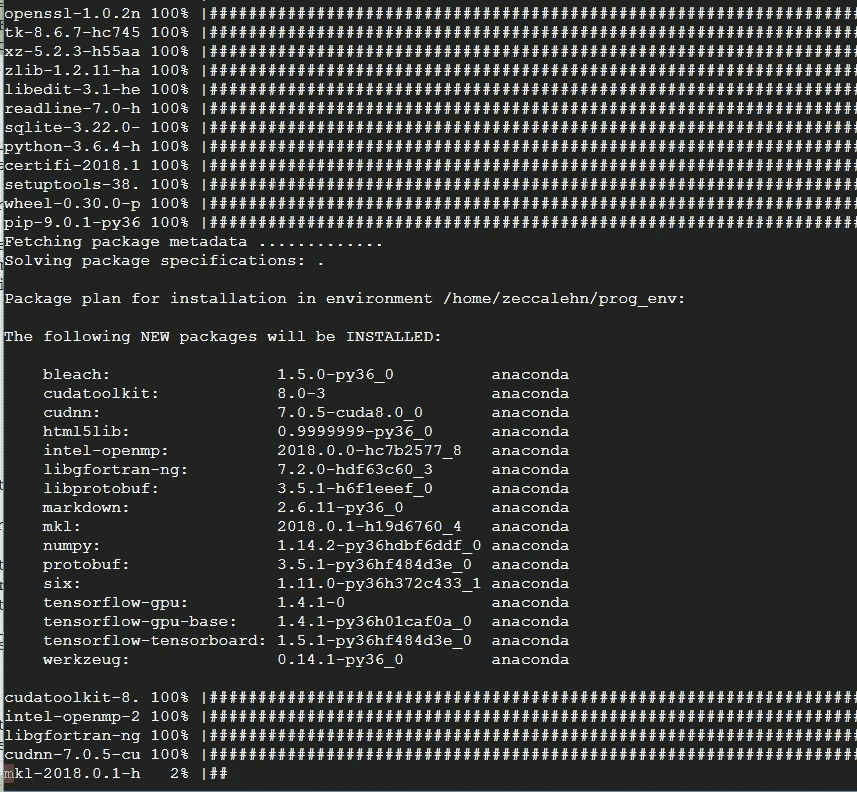

在我们运行一次之后，在我们停止虚拟机之后，就不需要再运行一次了。事实上，如果我们尝试的话，for 循环会阻止我们再次运行它，因为 CUDA 已经安装在进程中了。如果我们幸运的话，您将会看到 CUDA 和 GPU 被认可的初步迹象，以及完成的时间(如下所述)。

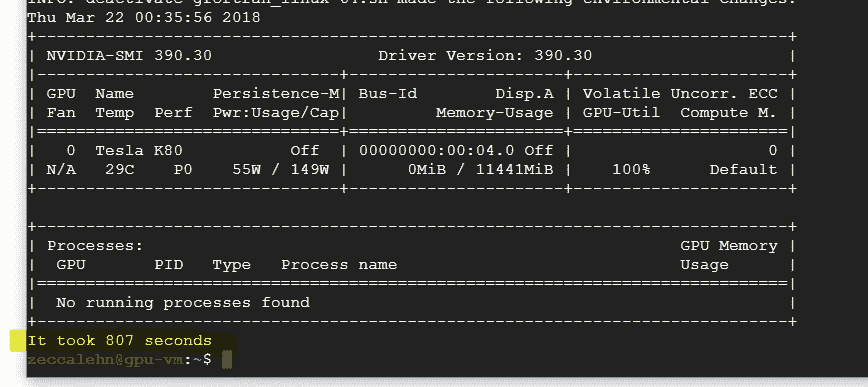

**现在让我们在 R 和 Python 上测试我们的 tensorflow-gpu 安装**

首先，我们想熟悉一下新创建的 conda 环境，它安装了`tensorflow-gpu` Python 模块，以及安装在主目录`prog_env`(“程序环境”)中的最新版本的 R 和 Python 语言。

为了在 R 和 Python 中测试 Tensorflow 上的 GPU，我们将运行下面的代码，应该会得到与下面用`#`标记注释掉的结果完全相同的结果。

关于在 conda 环境中使用 [Anaconda 的详细信息](https://conda.io/docs/_downloads/conda-cheatsheet.pdf)。

测试 Python:

```
## Source environment from home directory in linux
source activate prog_env## Now in program environment
(prog_env)$ python## Test GPU is working from Python
from tensorflow.python.client import device_lib
device_lib.list_local_devices() # Output should look like this
   # name: "/device:CPU:0"
   # device_type: "CPU"
   # memory_limit: 268435456 # name: "/device:GPU:0" (Note: Confirmed GPU!)
   # device_type: "GPU"
   # memory_limit: 11326131405

quit("yes") # CTRL(or CMD) + Z
```

测试 R:

```
## While in program environment
(prog_env)$ R## From R command line
install.packages("tensorflow") # Run first time only
library(tensorflow)
install_tensorflow(version = "gpu") # To use GPUs
use_condaenv("r-tensorflow") # For running from conda env
sess = tf$Session() # Creates Tensorflow session # Confirms TeslaK80 GPU being used
   # 2018-03-21 19:32:33.987396:
   # tensorflow/core/common_runtime/gpu/gpu_device.cc:1120] 
   # Creating TensorFlow device (/device:GPU:0) -> 
   # (device: 0, name: Tesla K80, pci bus id: 0000:00:04.0, 
   # compute capability: 3.7) (Note: Confirmed GPU!)

GPUtest <- tf$constant('GPU is running!')
sess$run(GPUtest)
   # "GPU is running!"

quit("yes") # CTRL(or CMD) + Z
```

**给所有 R 和 Python 爱好者的总结**


Photo by [photo-nic.co.uk nic](https://unsplash.com/@chiro?utm_source=medium&utm_medium=referral) on [Unsplash](https://unsplash.com?utm_source=medium&utm_medium=referral)

就这样，我们做到了！你现在已经有了一台完整的机器，你可以用 R 和 Python 来进行 GPU 深度学习。期待听到这篇文章是否有帮助，以及你可以如何扩展它。期待一个多用户环境，登录，链接到 GPU，使用 GCloud 按分钟付费的可抢占性。

> Note on *DataLab Notebooks*: With GCP’s newer product *DataLab*, a single user GCE, using a [custom *Jupyter Notebook* interface](https://github.com/googledatalab/datalab), setup with GPUs, is as easy to get up and running with a single line of code. Unfortunately, aside from only being single-user, it also does not ship with an R kernel for connecting to GPUs and Tensorflow through the Jupyter interface; it also requires all interaction be ran through the notebook and not the command line, given it’s Docker configuration. For an excellent walkthrough of setting up a GPU enabled DataLab GCE notebook quickly, [see this article](https://qiita.com/kazunori279/items/b17d16a2bfbec5e72984) posted [by Kaz Sato](https://github.com/kazunori279) (you can right click translate from Japanese to English in Chrome, if needed [for the most part 次に変更 ]).